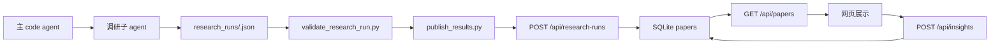

# Architecture

## 目标架构

edge_agent 分成三个清晰边界：

0. **Project Skill Boundary**
   - `.agents/skills/edge-agent-research-pipeline/SKILL.md` 是新 codeagent 的第一入口。
   - 它指向主流程、调研契约、校验发布命令和不可违反规则。

1. **Research Agent Boundary**
   - 主 code agent 负责调度。
   - 子 agent 负责搜索、阅读、审查论文。
   - 子 agent 输出 `research_runs/<run_id>.json`。

2. **Validation And Publish Boundary**
   - `agent/validate_research_run.py` 校验结构、时间窗口、论文来源、链接和字段完整性。
   - `agent/publish_results.py` 把通过校验的 run 批量 POST 到服务器。

3. **Server Display Boundary**
   - `app/server.py` 接收 `POST /api/research-runs`。
   - `app/storage.py` 负责 SQLite 存储和查询。
   - `app/page.py` 提供页面 shell。
   - 页面调用 `GET /api/papers` 刷新最新结果。
   - `POST /api/insights` 更新洞察人和 wiki 链接。

## 数据流

## 服务器 API

- `GET /`：展示页。
- `GET /api/papers`：返回论文列表，默认按 source_tier 优先级 + score 降序。
- `POST /api/research-runs`：接收主 agent 发布的批量调研结果。
- `POST /api/insights`：更新洞察人和 wiki 链接。

## 数据源规则

服务器不是搜索引擎，不抓取论文。所有搜索和审查都由 agent 完成。服务器只相信通过 `validate_research_run.py` 的结构化结果。

## 静态 fallback

`app/build.py` 仍可生成 `site/index.html`，但只作为没有服务器时的 fallback。它会按当前日期过去 7 天过滤 `content/papers/*.md`，不会展示旧样例。
