# AMD Advancing AI 2026 完整技术复盘

## 从 Helios 机架、Anthropic/OpenAI 合作，到 ROCm.ai、Gorgon Halo 与机器人大脑

> **面向读者**：熟悉 AI 加速器、服务器、数据中心网络、推理系统与本地 AI 的技术读者  
> **整理日期**：2026-07-24  
> **发布会视频**：[Advancing AI 2026 \| Build What's Next with @AMD](https://www.youtube.com/watch?v=crEztVjfAPM)（2:13:50）  
> **官方演讲稿**：[AMD 132 页 PDF](https://www.amd.com/content/dam/amd/en/documents/corporate/events/advancing-ai-2026-distribution-deck.pdf)  
> **活动页**：[AMD Advancing AI 2026](https://www.amd.com/en/corporate/events/advancing-ai.html)  
> **字幕说明**：截至整理时，YouTube 页面没有官方字幕或自动字幕轨。本文以完整音轨转写建立时间线，再用官方演讲稿、产品页、双方公告、标准规范及技术媒体报道校正。

---

## 先说结论

AMD 这场发布会并不是在讲一块“更快的 GPU”，而是在交付一套从 200 kW 以上液冷机架一直延伸到桌面小盒子和机器人的计算体系：

1. **数据中心核心是 Helios。**72 块 MI455X、6th Gen EPYC “Venice”、由 Pensando 承担前端与 scale-out、由 UALoE/ESUN + Broadcom 承担 scale-up 的三平面网络，以及 ROCm 被组织成一个系统。AMD 第一次不再把竞赛单位放在单卡或八卡服务器，而是把完整机架作为产品和性能边界。
2. **市场验证来自 Anthropic、OpenAI、Meta 和 Microsoft，而不是单纯的 Logo 墙。**Anthropic 宣布最高 2 GW 部署和最高 50 亿美元战略投资；OpenAI 与 Meta 各有 6 GW 的多代协议；Microsoft 将在 Azure 部署 Helios。要注意，这些都是多年建设计划，不等于已经安装同等容量。
3. **AMD 试图用“开放系统”对抗 NVIDIA 的垂直整合。**OCP Open Rack Wide、UALoE/ESUN、Ultra Ethernet、商用交换芯片和开放软件提供了供应商选择，但早期互操作、资格验证和责任边界也比单一厂商栈更复杂。
4. **ROCm.ai 的目标不只是给 ROCm 换界面，而是让 AI agent 参与安装、诊断、迁移和性能优化。**AMD Skills、ROCm CLI/Console 与 Hyperloom 共同缩短“硬件可用”到“工作负载跑快”的距离；它仍要面对 CUDA 的工具链、人才、运维与 day-0 生态优势。
5. **后半场把 AI 从 hyperscale 拉回企业、桌面和物理世界。**MI350P 解决“现有风冷 PCIe 服务器怎样装 AI”，Ryzen AI Halo/Gorgon Halo 解决本地 200B–300B 模型，Kria AI SOM 和机器人开发平台解决确定性控制、感知与推理共存。
6. **真正需要观察的是执行，而不是峰值表格。**Helios 的 HBM 容量和开放网络有实质差异化，但量产爬坡、持续负载下的有效性能、ROCm 运维成熟度、液冷站点改造和原生 UALink 生态仍需 2026H2–2027 的部署证明。

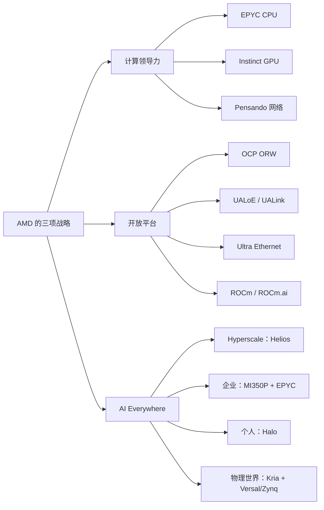
```mermaid
flowchart LR
    A["AMD 的三项战略"] --> B["计算领导力"]
    A --> C["开放平台"]
    A --> D["AI Everywhere"]
    B --> B1["EPYC CPU"]
    B --> B2["Instinct GPU"]
    B --> B3["Pensando 网络"]
    C --> C1["OCP ORW"]
    C --> C2["UALoE / UALink"]
    C --> C3["Ultra Ethernet"]
    C --> C4["ROCm / ROCm.ai"]
    D --> D1["Hyperscale：Helios"]
    D --> D2["企业：MI350P + EPYC"]
    D --> D3["个人：Halo"]
    D --> D4["物理世界：Kria + Versal/Zynq"]
```

### 本文的证据标记

- **现场宣布**：主旨演讲中明确说出，并能映射到官方演讲稿。
- **补充背景**：合作方公告、产品页或标准组织资料，用来解释现场没有展开的细节。
- **AMD 测算**：理论峰值、内部 benchmark、工程估算或预测；不写成第三方实测。
- **技术判断**：根据架构与外部资料作出的分析，会明确写出“意味着”“更可能”“尚待验证”。

---

## 发布会时间导航

|                                                              时间 | 主题                       |
| --------------------------------------------------------------: | ------------------------ |
|  [00:02:18](https://www.youtube.com/watch?v=crEztVjfAPM&t=138s) | Lisa Su 开场               |
|  [00:03:46](https://www.youtube.com/watch?v=crEztVjfAPM&t=226s) | token、训练/推理与市场规模         |
|  [00:11:43](https://www.youtube.com/watch?v=crEztVjfAPM&t=703s) | AMD 三项战略                 |
|  [00:15:06](https://www.youtube.com/watch?v=crEztVjfAPM&t=906s) | Helios 正式发布              |
| [00:21:32](https://www.youtube.com/watch?v=crEztVjfAPM&t=1292s) | Anthropic 合作             |
| [00:27:42](https://www.youtube.com/watch?v=crEztVjfAPM&t=1662s) | Helios 吞吐与 token 成本      |
| [00:30:49](https://www.youtube.com/watch?v=crEztVjfAPM&t=1849s) | OpenAI 基础设施合作            |
| [00:40:34](https://www.youtube.com/watch?v=crEztVjfAPM&t=2434s) | EPYC Venice              |
| [00:51:54](https://www.youtube.com/watch?v=crEztVjfAPM&t=3114s) | Meta 共同设计                |
| [01:00:27](https://www.youtube.com/watch?v=crEztVjfAPM&t=3627s) | 推理解耦：prefill 与 decode    |
| [01:01:57](https://www.youtube.com/watch?v=crEztVjfAPM&t=3717s) | Cerebras + Helios        |
| [01:06:41](https://www.youtube.com/watch?v=crEztVjfAPM&t=4001s) | ROCm 软件进展                |
| [01:11:10](https://www.youtube.com/watch?v=crEztVjfAPM&t=4270s) | ROCm.ai、Skills、Hyperloom |
| [01:18:43](https://www.youtube.com/watch?v=crEztVjfAPM&t=4723s) | OpenAI 软件团队              |
| [01:25:28](https://www.youtube.com/watch?v=crEztVjfAPM&t=5128s) | MI430X                   |
| [01:27:34](https://www.youtube.com/watch?v=crEztVjfAPM&t=5254s) | 企业 AI                    |
| [01:34:27](https://www.youtube.com/watch?v=crEztVjfAPM&t=5667s) | MI350P                   |
| [01:39:00](https://www.youtube.com/watch?v=crEztVjfAPM&t=5940s) | AT&T                     |
| [01:46:13](https://www.youtube.com/watch?v=crEztVjfAPM&t=6373s) | 个人 AI 与本地模型              |
| [01:52:30](https://www.youtube.com/watch?v=crEztVjfAPM&t=6750s) | Gorgon Halo              |
| [01:54:10](https://www.youtube.com/watch?v=crEztVjfAPM&t=6850s) | Cisco 设备内智能体栈            |
| [02:01:33](https://www.youtube.com/watch?v=crEztVjfAPM&t=7293s) | Physical AI              |
| [02:03:44](https://www.youtube.com/watch?v=crEztVjfAPM&t=7424s) | Kria AI SOM              |
| [02:05:02](https://www.youtube.com/watch?v=crEztVjfAPM&t=7502s) | 机器人开发平台                  |
| [02:07:10](https://www.youtube.com/watch?v=crEztVjfAPM&t=7630s) | 三条年度路线图与供货总结             |

---

# 一、需求曲线：为什么 AMD 把产品边界扩到整机架

## 00:02:18–00:11:43｜AI 计算需求的四个变化

Lisa Su 开场先给出了一组用来解释产品路线的需求假设。

### 1. 月度 token 消耗两年增长 158 倍

AMD 演讲稿把 2026 年月度 token 消耗画到 35 quadrillion（约 \(3.5\times10^{16}\)）以上，并称两年增加 **158×**。这里的重点不是某个月的绝对计量方法，而是 token 已从聊天产品的用量指标变成数据中心容量规划单位：上下文长度、reasoning steps、工具调用、并发和输出长度都会被放大到 GPU、CPU、HBM 与网络需求。

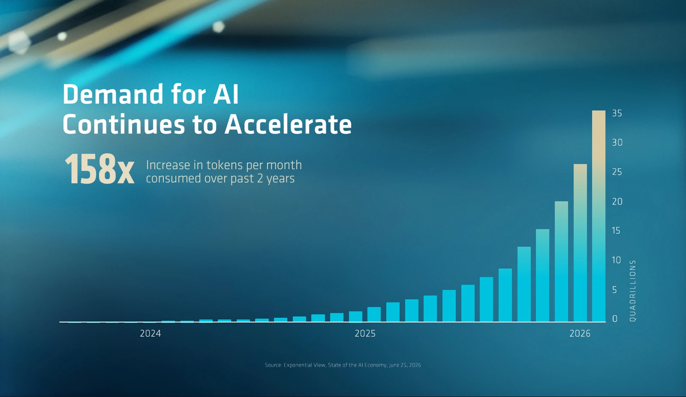

*图 1：AMD 官方演讲稿第 3 页。数据来源与预测口径见原 PDF 脚注。*

### 2. 训练仍以约 5×/年的速度扩张，但推理首次成为主要负载

AMD 认为，自 2020 年以来前沿训练所需计算量约每年提高 5 倍。与此同时，2026 年全球 AI 计算容量中约 **60% 用于推理、40% 用于训练**。这不是说训练不再重要，而是同一个已训练模型会被海量用户、agent 和业务流程反复调用，累计推理需求增长更快。

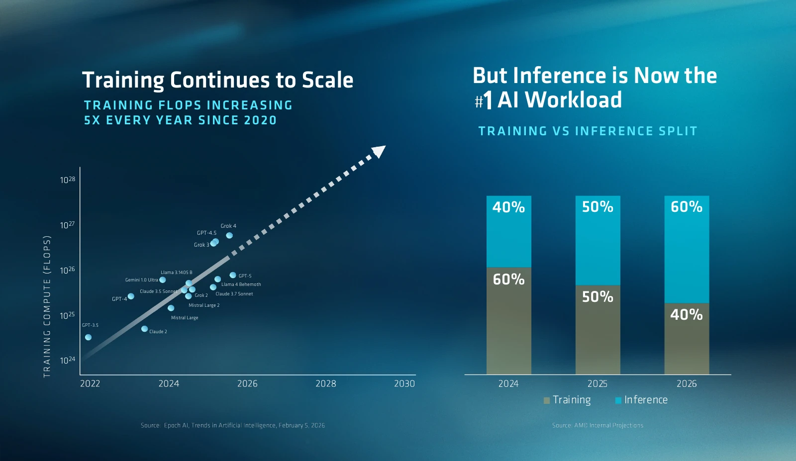

*图 2：AMD 官方演讲稿第 5 页；纵轴为对数尺度，图中的未来部分属于趋势外推。*

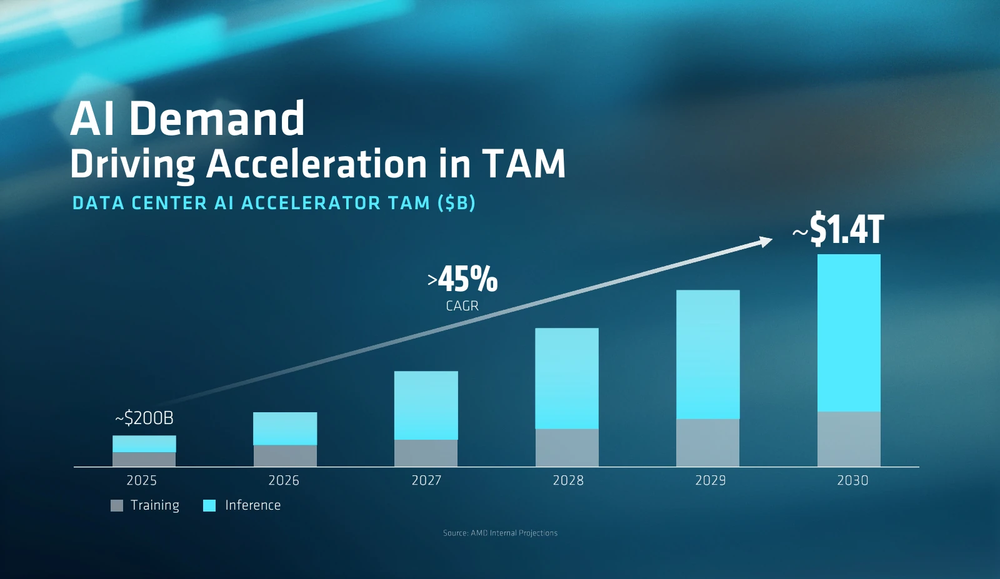

*图 3：AMD 官方演讲稿第 7 页。这是 AMD 对计算容量分配的估计，不是所有数据中心的统一统计。*

### 3. Agentic AI 同时拉动 GPU 与 CPU

普通问答往往只有一次生成，而 agent 会规划、推理、访问数据、调用工具、验证结果并持续迭代。GPU 承担模型计算，CPU 则要运行 tokenizer、检索、沙箱、数据库、网络栈、调度器与多 agent 编排。因此 AMD 把 AI 基础设施描述为三个并行增长面：

- GPU：训练、prefill、decode 和多模态模型；
- CPU：host、数据处理、存储、agentic orchestration 与通用服务；
- 网络：GPU 集合通信、KV cache/存储访问和跨服务交互。

### 4. AMD 把可服务市场上调到接近 2 万亿美元

AMD 的预测分成三层：

| 市场                |       2030 年规模 | AMD 演讲稿中的增长口径 | 阅读方式               |
| ----------------- | -------------: | ------------: | ------------------ |
| 数据中心 AI 加速器       | 约 **1.4 万亿美元** |    约 45% CAGR | 训练与推理；GPU 预计占多数    |
| 数据中心 CPU          | 约 **2200 亿美元** |   超过 50% CAGR | 通用、AI host、agentic |
| AMD 可覆盖的高性能与自适应计算 |   约 **2 万亿美元** |    约 40% CAGR | 数据中心 + 客户端 + 嵌入式   |

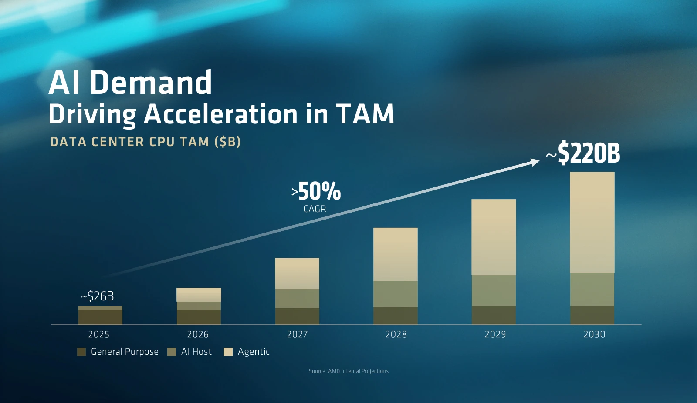

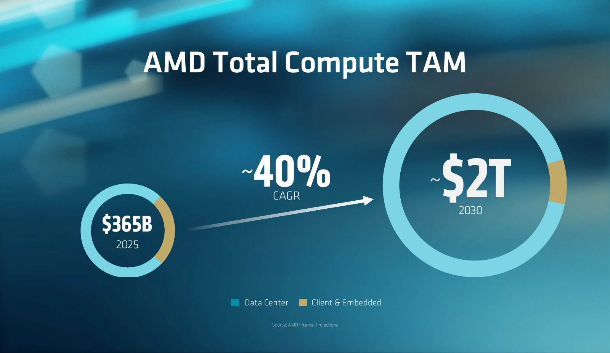

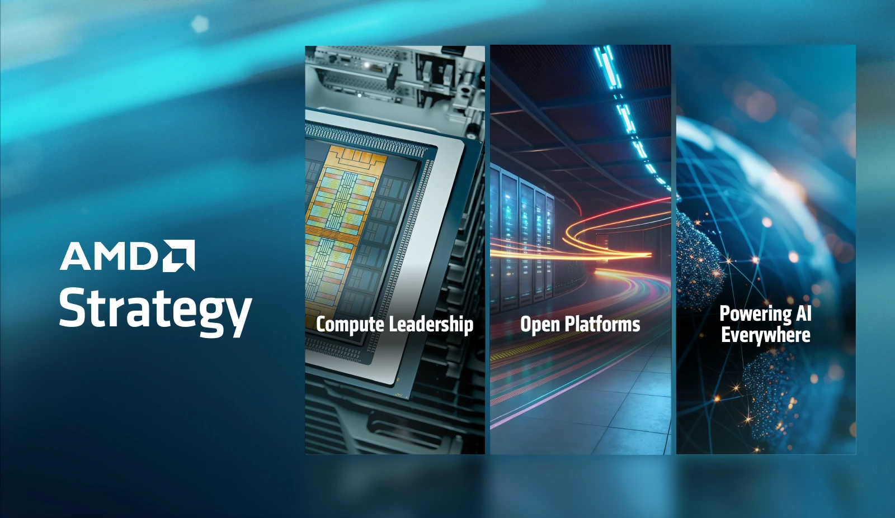

这些数字是公司战略规划和投资者叙事，受模型效率、芯片价格、电力、资本供给和使用率影响很大。它们能解释 AMD 为什么同时投资 CPU、GPU、网络、软件、客户端和嵌入式产品，但不应当作已经实现的收入。

## 00:11:43–00:15:06｜三项战略：Compute、Open、Everywhere

AMD 把后面两个小时的内容压缩成三项优先级：

1. **Compute leadership**：为不同工作负载提供 CPU、GPU、NPU、FPGA/自适应 SoC 和 DPU，而不是要求所有任务使用同一种芯片。
2. **Open platforms**：在硬件上推动 OCP、以太网、UALink 等标准，在软件上继续投入 ROCm 与上游框架。
3. **Powering AI everywhere**：覆盖 hyperscale、企业本地、PC 和物理世界。

Lisa 同时给出两项现场口径：超过 60% 的 Fortune 100 使用 EPYC；AMD 上一季度服务器 CPU **收入份额**达到创纪录的 46%。这里特意强调“收入份额”，不要把它误读为出货量份额。

---

# 二、Helios：AMD 第一次把 72 块 GPU 作为一个产品

## 00:15:06–00:20:51｜MI455X、Venice 与三层网络

Helios 是基于 OCP Open Rack Wide 的液冷机架级系统。它不是“把 9 台八卡服务器塞到一起”，而是从计算托盘、交换拓扑、母排、冷却、固件和软件开始共同设计，让 72 块 GPU 尽量表现为一个 scale-up 计算域。

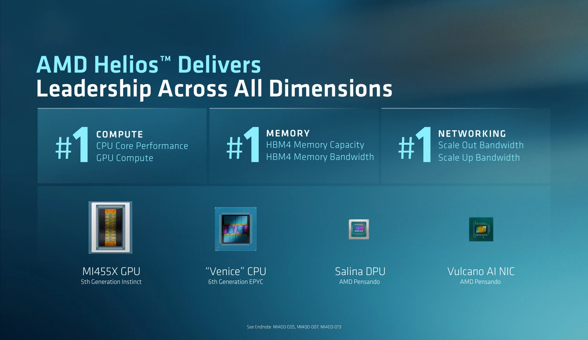

*图 4：AMD 官方演讲稿第 18 页。MI455X、Venice、Salina DPU 和 Vulcano AI NIC 分别承担加速、host/编排、前端与横向扩展。*

### MI455X：CDNA 5 + 432 GB HBM4

| 单卡规格 | AMD 公布值 | 技术含义 |
|---|---:|---|
| FP4 峰值 | 约 40 PFLOPS | 面向低精度推理；具体格式为 OCP MXFP4 等，不能只看“FP4”字样与其他格式直接等同 |
| FP8 峰值 | 约 20 PFLOPS | 训练与推理常用低精度路径 |
| HBM4 容量 | **432 GB** | 12 堆 HBM4，利于大模型权重、KV cache 和更少的分片 |
| HBM 带宽 | **23.3 TB/s** | decode 和 memory-bound 算子的重要上限 |
| 架构/工艺 | CDNA 5；2nm + 3nm | chiplet 与先进封装 |
| 晶体管 | 约 3200 亿 | 系统复杂度指标，不能直接转换为性能 |

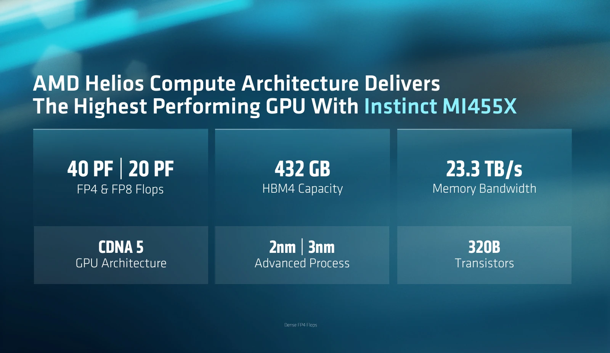

*图 5：AMD 官方演讲稿第 19 页。40/20 PFLOPS 为理论峰值，不是应用持续性能。*

Samsung 与 AMD 在 2026 年 3 月宣布围绕 MI455X 的 HBM4 和 Venice 的 DDR5 深化合作；公告称 Samsung 是 MI455X 的主要 HBM4 供应伙伴之一。这说明 432 GB/卡不仅是架构选择，也把 Helios 的量产紧密绑定到 12-stack HBM4、先进封装和内存供应链。[AMD/Samsung 联合公告](https://www.amd.com/en/newsroom/press-releases/2026-3-18-samsung-and-amd-expand-strategic-collaboratio.html)

### Helios 单机架聚合规格

| 维度                   |                             单机架 |
| -------------------- | ------------------------------: |
| GPU                  |                     72 × MI455X |
| CPU                  | 18 × 6th Gen EPYC；约 4600+ cores |
| CDNA 5 Compute Units |                         18,000+ |
| FP4 峰值               |                      2.9 EFLOPS |
| HBM4                 |                         约 31 TB |
| 聚合 HBM 带宽            |                      约 1.7 PB/s |
| scale-up 聚合带宽        |                        260 TB/s |
| scale-out 聚合带宽       |   约 43 TB/s（双向合计；单向约 21.6 TB/s） |
| 计算托盘                 |                  18 个，每托盘 4 GPU |
|                      |                                 |

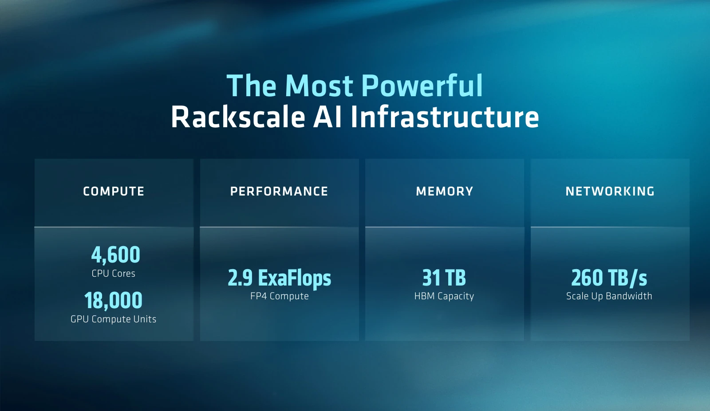

*图 6：AMD 官方演讲稿第 22 页。31 TB 来自 72 × 432 GB 的十进制近似。*

### 网络不是一个平面，而是三个平面

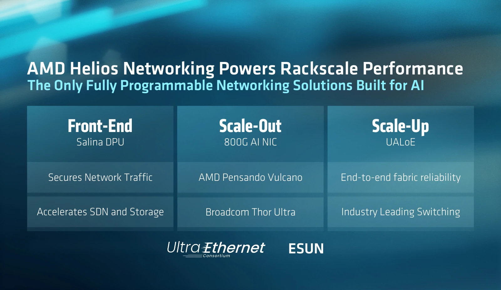

*图 7：AMD 官方演讲稿第 20 页。三个平面服务的流量类型和故障目标不同。*

| 网络层 | 组件/协议 | 任务 |
|---|---|---|
| Front-end | Pensando Salina DPU | 租户/服务网络、SDN、安全、存储与 host offload；AMD 还提出通过 DPU 管理 NVMe 扩展 KV cache 的路径 |
| Scale-up | UALoE + ESUN + Broadcom 交换芯片 | 在单机架 72 GPU 内提供低时延、高可靠的集合通信和内存式语义 |
| Scale-out / scale-across | Vulcano 800 AI NIC + Ultra Ethernet | 连接多个 Helios 机架、存储和其他计算系统；每 GPU 最多三条 800Gb/s 路径，即最高 2.4Tb/s |

AMD 的[网络技术博客](https://www.amd.com/en/blogs/2026/ai-networking-built-for-scale.html)称，UALoE 用单跳拓扑连接 72 块 MI455X，提供 260 TB/s 聚合 scale-up 带宽；Vulcano 面向开放以太网的跨机架扩展。需要避免两个常见误解：

- UALoE/ESUN 是首代 Helios 借助以太网交换基础设施实现 scale-up 的路径，**不等于原生 UALink 交换芯片已经大规模部署**。
- Ultra Ethernet 的 scale-out 与 UALink/UALoE 的 scale-up 解决不同距离、语义和拥塞问题，不能笼统写成“Helios 只用以太网”。

AMD 还公布了几项网络侧结果：Salina 在 AMD 测试中达到 117 MPPS，并与 NVIDIA BlueField-3 的 80 MPPS 公开数据比较；微软某 accelerated-connections 案例最多返还 22 个 CPU cores。Vulcano 的“最高 13% job completion 改善”来自 8000 GPU、MoE_4.5T 的硅前建模，“最高 33% 较低交换成本”来自 32000 GPU fabric 与第三方交换机价格假设。它们分别是非对称比较、特定客户案例和模型化结果，不能外推到所有集群。

### “开放”到底开放到哪一层

| 层级 | 开放策略 | 边界 |
|---|---|---|
| 机架 | OCP Open Rack Wide | 统一关键机械、母排与接口；并不规定每个托盘、冷却件和整架外形都可跨厂商即插即用 |
| scale-up | UALink 联盟规范；首代用 UALoE/ESUN | 标准已发布，端点、交换芯片、合规认证和多厂商互操作仍在形成 |
| scale-out | Ultra Ethernet Consortium | 开放拥塞控制、传输和 RDMA 方向；具体 NIC/交换机实现仍需验证 |
| 软件 | ROCm 与上游框架 | 开源代码并不会自动补齐算子覆盖、性能分析、集群遥测与运维人才 |

[OCP Open Rack Wide Base Specification 1.0.0](https://www.opencompute.org/documents/open-rack-wide-orw-base-specification-v1-0-0-final-pdf)只定义关键接口和公差，外框深度、高度、最大载荷和冷却实现仍可由系统厂商决定。[OCP ESUN 1.0](https://www.opencompute.org/blog/the-ocp-esun-10-specification-has-been-released)则通过 PFC/CBFC、链路级重传和紧凑头部来构建低损、低开销的 scale-up 交换网络。

截至发布会，UALink 200G 1.0 规定每 lane 200 Gb/s、最多 1024 个加速器的 scale-up 域；Ultra Ethernet 最初的 1.0 规范在 2025-06-11 发布，2026-07-16 已到 1.0.3。ESUN、UALink、UALoE 与 UEC 有相互借鉴的机制，但不是同一个协议的四种叫法。

与 NVIDIA 的区别也不宜写成“开放对封闭”的口号。NVIDIA 的 GPU、NVSwitch、ConnectX/BlueField、CUDA/NCCL 和遥测工具是厂商控制、许可制、高度垂直整合的体系，集成和故障责任更集中；AMD 的联盟标准与多供应商路线降低长期锁定，却增加早期固件、认证、版本兼容和责任边界复杂度。NVIDIA 也已通过 [NVLink Fusion](https://nvidianews.nvidia.com/news/nvidia-nvlink-fusion-semi-custom-ai-infrastructure-partner-ecosystem?mod=article_inline)向选定的 CPU/ASIC 合作伙伴开放接入，所以更准确的差别是**标准治理与整合模式**，不是第三方能否参与的二元判断。

### 供货状态：AMD 说“全面量产”，发货从 Q3 末开始

Lisa 在 [00:20:51](https://www.youtube.com/watch?v=crEztVjfAPM&t=1251s)宣布 Helios 已进入 full production，计划在 **Q3 末开始出货，Q4 加速爬坡**。Microsoft 的联合公告也写明 Helios 在 2026H2 向包括 Microsoft 在内的客户发货，并用于 Azure 的前沿模型推理、Azure AI 服务与客户应用。[AMD/Microsoft 公告](https://www.amd.com/en/newsroom/press-releases/2026-7-20-microsoft-to-deploy-next-gen-amd-instinct-and-amd-.html)

Helios 更准确的产品形态是 **AMD 提供给 OEM/ODM 实现的机架级 reference design/solution**，不是 AMD 只按一种配置直接零售的标准服务器。Bull、HPE、Lenovo、Supermicro 等可以基于该架构交付系统；Meta 的合同又明确采用定制 MI450 GPU，因此“使用 Helios 架构”不保证每个客户机架与标准 72×MI455X 参考配置完全相同。[AMD MI400/Helios FAQ](https://www.amd.com/en/products/accelerators/instinct/mi400.html)

从设施角度，它约为 1.2 m 宽、44OU，整架约 225–245 kW，使用 50V 直流母排和直接液冷；最终功率、尺寸和水路由 OEM 配置决定。对多数传统机房，约束会先出现在配电、CDU/水路、地板承重、搬运/服务通道和 245 kW 级故障域，而不是“有没有空闲 U 位”。[The Register 对 Helios 机架工程的整理](https://www.theregister.com/systems/2026/07/23/amd-attacks-the-rack-with-helios-systems-that-rival-nvidias/5277246)

这里仍要区分四个状态：

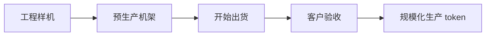
```mermaid
flowchart LR
    A["工程样机"] --> B["预生产机架"]
    B --> C["开始出货"]
    C --> D["客户验收"]
    D --> E["规模化生产 token"]
```

AMD 已明确宣布 C 的时间表，OpenAI 等伙伴展示了 B 阶段进展，但行业还缺少 E 阶段的公开、独立、同口径数据。2026 年 2 月曾有分析认为大批量爬坡可能落到 2027Q2，AMD 公开否认并坚持 2026H2；因此最稳妥的写法是“AMD 宣布进入量产并将在 Q3 末出货，规模爬坡仍待客户部署验证”。[Tom's Hardware 对时间表争议的报道](https://www.tomshardware.com/tech-industry/artificial-intelligence/amd-denies-report-of-mi455x-delays-as-nvidia-vr200-systems-are-rumored-to-arrive-early-company-says-helios-systems-on-target-for-2h-2026)

## 00:21:32–00:27:42｜Anthropic：2 GW 部署、Claude 共建 ROCm、最高 50 亿美元投资

这是发布会最容易被漏掉、也最有商业分量的一段。Anthropic 联合创始人兼 Chief Compute Officer Tom Brown 登台，双方宣布三层合作：

1. Anthropic 将在 Helios 上部署**最高 2 GW** 的 MI450 系列 GPU；
2. 首批 **1 GW** 计划于 **2027H1** 启动；
3. AMD 承诺向 Anthropic 进行**最高 50 亿美元的战略股权投资**。

部署采用的完整栈是 MI455X、EPYC Venice、Pensando 网络和 ROCm，而非单独采购 GPU。Anthropic 已在使用 MI355X；双方还将用 Claude 优化 Instinct 工作负载和加速 ROCm 开发，AMD 会在工程与产品团队中更广泛地采用 Claude。以上条款可在[AMD 与 Anthropic 的简体中文联合公告](https://www.amd.com/zh-cn/newsroom/press-releases/amd-anthropic-strategic-partnership.html)核对。

### 为什么这不只是“大客户买卡”

- **需求验证**：Anthropic 首次把 AMD 计算承诺提升到 gigawatt 量级。
- **软硬件共同设计**：Claude 的训练/推理模式会反馈到 GPU、机架和 ROCm 路线；Claude 又成为 AMD 自身软件工程工具。
- **资本绑定**：最高 50 亿美元投资把供应商关系扩展到股权层面。
- **时间错位**：Anthropic 首批 1 GW 是 2027H1，而 OpenAI/Meta 的首批计划从 2026H2 开始；这也侧面说明“2 GW”不是发布后立即上线。

文中所有“最高 2 GW”“最高 50 亿美元”都必须保留“最高”。联合公告给的是上限与计划，不是已完成的部署或投资到账额。

## 00:27:42–00:30:49｜Helios 的性能与成本主张

AMD 随后给出两组对比。

### 相比 MI355X：低交互到高交互场景最高 4×、15×、34×

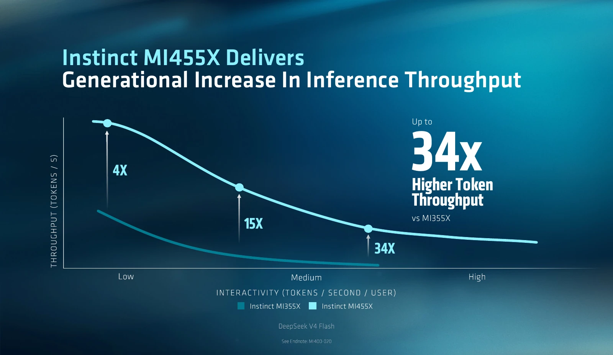

*图 8：AMD 官方演讲稿第 25 页。不同交互性区间的“最高”提升，不能视作所有模型的统一倍数。*

AMD 称，在其测试的推理交互性范围内，Helios/MI455X 相比 MI355X 可达到最高 34× token throughput，并把 token 成本最多降低 18×。这里至少混合了以下变量：

- CDNA 5 的计算和数据格式；
- 432 GB HBM4 容量与带宽；
- 72-GPU scale-up 域；
- 新一代 ROCm、框架与内核；
- 批量、并发、输入/输出长度和服务延迟目标。

所以“34×”是**整代系统在特定配置上的最高结果**，不是单卡、等功耗、等价格、任意模型下都能复现的纯硬件 IPC。

### 相比 Vera Rubin NVL72：AMD 测算 10%–15% 吞吐优势、最高 30% tokens/$

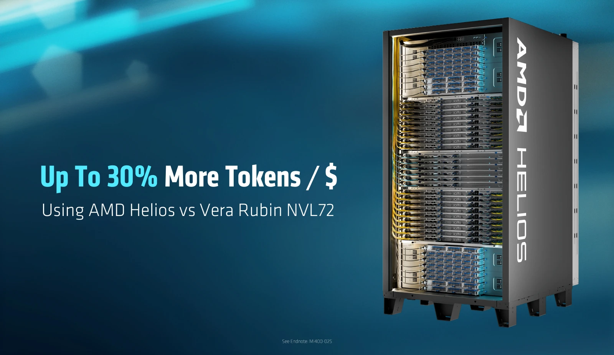

*图 9：AMD 官方演讲稿第 28 页。竞品系统尚未形成可公开复现的同版本大规模独立对测，因此属于 AMD 的工程估算/内部测试口径。*

AMD 还声称 MI455X 对比 Rubin 单 GPU 拥有约 15% 的 FP4/FP8 峰值优势、50% 更多 HBM 容量、50% 更多 scale-out 带宽和约 6% 更多 HBM 带宽；在一组模型上，Helios 平均高 10%–15% 吞吐，并带来最高 30% 更多 tokens/$。

这组数字的正确阅读方式是：

- 31 TB 对约 20.7 TB 的 HBM 容量差异有实际意义，能容纳更多权重/KV cache、减少跨节点分片，但不会自动等比例转化为性能。
- AMD OCP MXFP4/MXFP6 与 NVIDIA NVFP4 等格式、缩放方式并不完全相同；同写“FP4”不代表严格同口径。
- tokens/$ 依赖采购价、利用率、电力与液冷、停机、迁移工程、融资和折旧。价格和统一 SLA 未公开时，它更像 TCO 目标。
- 截至发布会，外部资料主要确认了架构、峰值规格和预生产进度，尚无相同模型、功耗、SLA、软件版本下的 Helios–Rubin 大规模独立实测。[Tom's Hardware 的 MI455X/Helios 技术报道](https://www.tomshardware.com/pc-components/gpus/amd-takes-the-wraps-off-its-instinct-mi455x-ai-accelerator-cdna-5-and-helios-rack-scale-architecture-combine-to-take-the-fight-to-nvidia-in-the-data-center)、[The Register 的机架分析](https://www.theregister.com/systems/2026/07/23/amd-attacks-the-rack-with-helios-systems-that-rival-nvidias/5277246)

## 00:30:49–00:40:34｜OpenAI：从 MI300X 到 6 GW Helios

OpenAI 基础设施负责人 Sachin Katti 登台，解释双方已经从硬件采购走向共同设计：

- 合作从 MI300X、MI350X 延伸到 MI450/Helios 及未来代；
- OpenAI 的总协议规模是 **6 GW** AMD GPU；
- 首批 **1 GW MI450** 计划于 **2026H2** 部署；
- OpenAI 在现场称三个月前拿到 Helios 机架，并已让软件栈跑起 GPT-class 工作负载；预计 2026 年末开始大规模部署并继续加速。

这些正式条款可以在 [OpenAI 官方公告](https://openai.com/index/openai-amd-strategic-partnership/)核对。协议还包含最多 1.6 亿股 AMD 普通股认股权证，按 GW 部署、AMD 股价以及 OpenAI 技术/商业里程碑分批归属。它不是一次性赠股，也不意味着 OpenAI 已拥有全部股份。

### OpenAI 为什么需要第二套大规模 GPU 平台

Sachin 的核心论点不是“替换 NVIDIA”，而是 AI 计算需求增长到需要更多供应、不同系统和更快共同迭代：

- **容量与供应链多元化**：6 GW 是跨代基础设施规划；
- **共同优化**：模型团队把真实 GPT-class 的瓶颈反馈给 GPU、网络和 ROCm；
- **系统级节奏**：OpenAI 需要的不是一块 benchmark 好看的芯片，而是能被数据中心部署、服务和大规模编排的机架；
- **软件先行**：预生产机架提前数月进入模型团队，目的是在规模发货前完成内核、框架和运维路径验证。

因此，OpenAI 的现场出现比单纯公布规格更重要：它证明 Helios 至少已进入头部模型实验室的预生产联合验证阶段；但“已经跑起 GPT-class workloads”仍不等于公开证明了规模化利用率、稳定性或相对竞品经济性。

---

# 三、EPYC “Venice”：agentic 时代的 CPU 不只是 GPU host

## 00:40:34–00:50:51｜6th Gen EPYC 9006 的四种工作负载位置

Lisa 随后把焦点从 GPU 机架转向 CPU。逻辑很直接：模型生成的代码要执行，agent 要调用工具和数据库，GPU 要由 host 喂数据，存储和网络也需要通用计算；GPU 越多，不代表 CPU 越不重要。

### Venice 的平台级规格

| 维度     | Venice / EPYC 9006                                                        |
| ------ | ------------------------------------------------------------------------- |
| CPU 核心 | Zen 6                                                                     |
| 工艺     | 2nm compute die + 6nm I/O die                                             |
| 线程     | 最高 512 threads                                                            |
| 内存带宽   | 最高约 1.6 TB/s                                                              |
| I/O    | PCIe 6                                                                    |
| 产品形态   | Helios 高频 host、256-core agentic sandbox、SP7/SP8 通用服务器、Venice-X 3D V-Cache |

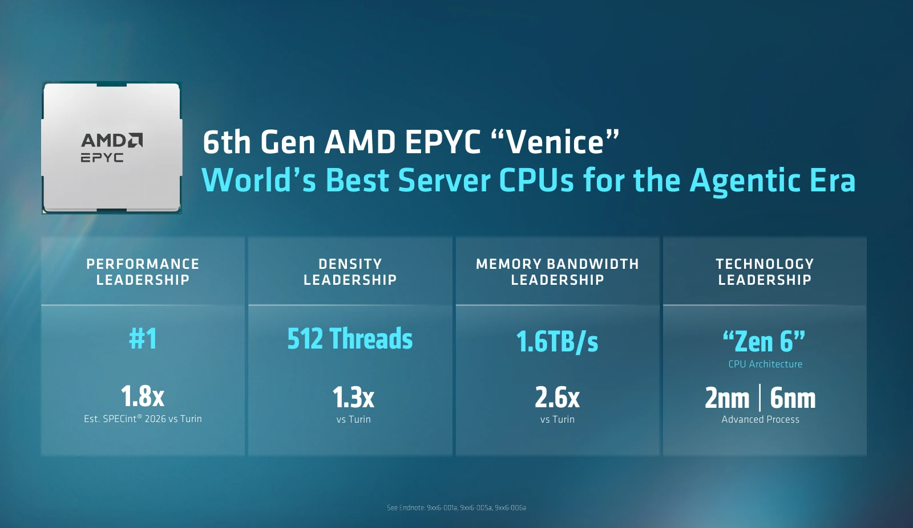

*图 10：AMD 官方演讲稿第 35 页。性能、密度与带宽倍数均以演讲稿脚注中的配置为准。*

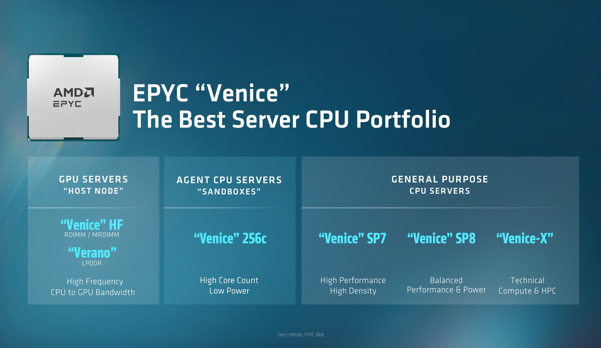

*图 11：AMD 官方演讲稿第 36 页。*

AMD 把产品族映射到三种 AI 数据中心角色：

1. **GPU host node**：追求 CPU–GPU I/O、内存带宽和较高单核性能，服务 Helios 的数据准备、通信和 GPU 调度。
2. **Agentic sandbox**：大量相互隔离的 agent、代码沙箱和工具服务更看重核心数、每瓦吞吐与虚拟化密度，256-core Venice 面向这一位置。
3. **通用与数据基础设施**：SP7/SP8 覆盖数据库、搜索、存储、网络和云 VM；Venice-X 通过 3D V-Cache 面向缓存敏感的技术计算/HPC。

这比“CPU 给 GPU 当配角”更准确。一个完整 agent 请求可能把少数毫秒花在模型上，却在检索、解释器、沙箱、数据库和远程工具上形成大量 CPU 工作；GPU token 吞吐继续提高后，非 GPU 部分反而更容易成为端到端 Amdahl 瓶颈。

### AMD 的性能图该怎样读

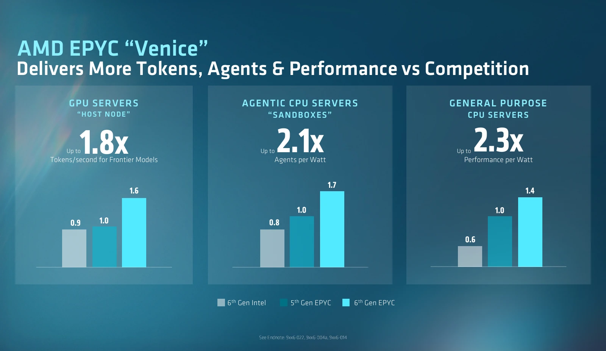

*图 12：AMD 官方演讲稿第 37 页。图中包括 GPU host、agentic CPU server 和通用 CPU server 三组方向性比较。*

AMD 在发布会上给出最高 1.8× host 吞吐、2.1× agents/W 和 2.3×通用性能/W 等对比。演讲稿脚注说明，部分“agents/W”把可用 CPU threads 当作一致理论负载下的 agent capacity proxy，并非真正运行多智能体业务图。对于此前宣传的“固定 100 kW 机架下最高 3.3×”口径，[Tom's Hardware 对方法的拆解](https://www.tomshardware.com/pc-components/cpus/amd-fires-back-at-nvidia-claiming-256-core-zen-6-venice-cpu-beats-vera-by-3-3x-in-rack-level-performance-company-shares-first-estimated-epyc-venice-benchmarks)显示，它是模型化计算而非两套实机机架对测：

- 固定机架功率，再根据估算节点功耗推算能装多少节点；
- Vera 端从 Grace 公开数据乘以估计的代际缩放；
- Venice 端从 Turin/EPYC 9965 结果乘以估计的代际缩放；
- 最后将节点数量与单节点结果相乘。

SPEC CPU2017、SPECjbb、NGINX、Redis、Memcached 和数据库吞吐可以说明通用服务器密度方向，但不能替代真实 agent graph 的端到端 benchmark。架构升级可信，具体倍数要等独立硬件和生产负载。

### 量产与供货

Lisa 在 [00:50:51](https://www.youtube.com/watch?v=crEztVjfAPM&t=3051s)宣布 Venice 已全面量产，所有主要服务器 OEM 与云厂商计划从 **2026Q4** 开始推出相关产品。官方产品信息见 [6th Gen AMD EPYC 9006 系列页面](https://www.amd.com/en/products/processors/server/epyc/9006-series.html)。

这里存在两个不同节奏：

- Helios 的 Venice host 属于 AMD 共同设计的机架系统，随 Helios 在 Q3 末开始出货；
- 更广泛的 SP7/SP8 OEM 和云产品从 Q4 滚动上市。

## 00:51:54–01:00:27｜Meta：从几百万颗 EPYC 到 6 GW 定制 MI450

Meta 基础设施负责人 Santosh Janardhan 的发言把“共同设计”解释得最清楚。他认为 AI 数据中心已经不能逐台优化服务器，而要把服务器、网络、供电、冷却和软件作为一个系统设计；开放和异构的意义，是允许 Meta 在不同负载之间选择合适的 CPU/GPU，而不是由一个供应商包办全部层次。

### CPU 合作已经跨越四代

Meta 现场回顾了 Milan → Bergamo → Turin → Venice 的合作，并称已经部署“数百万”颗 AMD CPU。Venice 不只是采购后的适配：Meta 是 lead partner，给出了大规模数据中心在功耗、密度、可服务性和 workload handoff 上的反馈。

### GPU 合作是另一份最高 6 GW 的多代协议

AMD 与 Meta 在 2026 年 2 月宣布：

- 多年、多代部署最高 **6 GW AMD Instinct GPU**；
- 首批 **1 GW** 从 **2026H2** 开始发货；
- 首批使用基于 MI450 架构、针对 Meta 工作负载定制的 GPU；
- 系统采用 Venice、ROCm 和 Helios 架构；
- 双方共同对齐 GPU、CPU、系统与软件路线。

正式条款见 [AMD/Meta 联合公告](https://www.amd.com/en/newsroom/press-releases/2026-2-24-amd-and-meta-announce-expanded-strategic-partnersh.html)。现场还强调，AMD Helios 与 Meta 通过 OCP 共同开发，这使 Meta 同时扮演**大客户、共同设计伙伴和开放机架标准推动者**，并非普通 logo endorsement。

### 三份 GW 协议不要相加成“已部署 14 GW”

| 伙伴 | 协议规模/上限 | 首批时间 | 首批/系统特点 |
|---|---:|---:|---|
| OpenAI | 6 GW | 2026H2 | 首批 1 GW MI450；多代 AMD GPU |
| Meta | 6 GW | 2026H2 | 首批 1 GW，定制 MI450 + Helios |
| Anthropic | 2 GW | 2027H1 | 首批 1 GW，标准 Helios/MI455X 路线 |

这些多年、多代协议中，Meta 与 Anthropic 明确写的是“最高”上限，OpenAI 则是 6 GW definitive agreement；它们都不能简单写成“AMD 已经交付 14 GW”。不过，三家前沿模型公司的路线对齐，确实把 Helios 从纸面 reference architecture 推进到具有明确客户牵引的系统项目。

---

# 四、推理分化：一套平衡型 GPU 不会适合所有延迟点

## 01:00:27–01:01:57｜Prefill 与 Decode 为什么适合解耦

Lisa 把推理服务划分为三类目标：

- 最大吞吐/最低成本，允许较高延迟；
- 在吞吐与交互性之间平衡；
- 超低延迟，每毫秒都重要。

LLM 请求又可以分为两个主要阶段：

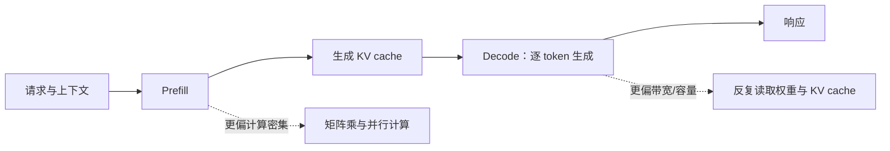
```mermaid
flowchart LR
    R["请求与上下文"] --> P["Prefill"]
    P --> K["生成 KV cache"]
    K --> D["Decode：逐 token 生成"]
    D --> O["响应"]
    P -. "更偏计算密集" .-> C["矩阵乘与并行计算"]
    D -. "更偏带宽/容量" .-> M["反复读取权重与 KV cache"]
```

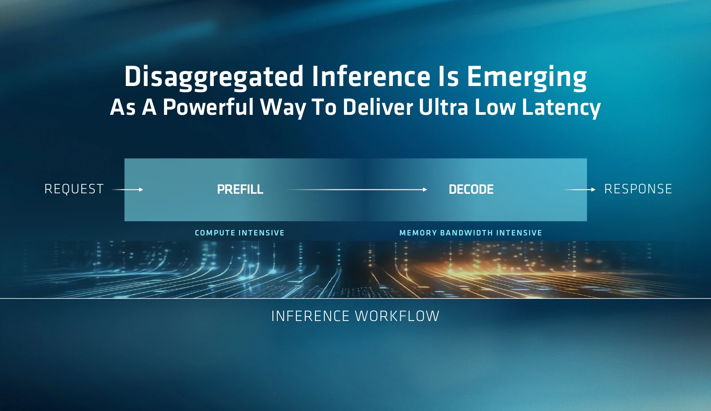

*图 13：AMD 官方演讲稿第 44 页。实际瓶颈会随模型、batch、上下文、量化和并行策略变化，不能把阶段标签绝对化。*

MI455X 是计算与 HBM 带宽较平衡的通用加速器；解耦推理则允许平台分别给 prefill 与 decode 选择硬件、batch 和调度策略。代价是 KV cache 传输、请求路由、背压、容错和两侧利用率变得更难。

## 01:01:57–01:06:41｜Cerebras + Helios：追求低延迟与高吞吐同时成立

Cerebras 联合创始人兼 CEO Andrew Feldman 登台。双方方案把 AMD CPU、Helios 和 Cerebras Wafer-Scale Engine（WSE）组合成异构推理系统：

- Helios 提供大 HBM 容量、通用训练/推理吞吐和大规模生态；
- WSE 依靠巨量片上 SRAM 与片上带宽面向极低延迟 token 生成；
- 系统在请求与阶段之间路由，以避免只能在“高吞吐”或“极快响应”中二选一。

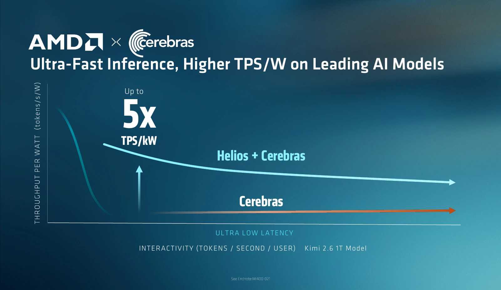

*图 14：AMD 官方演讲稿第 48 页。AMD/Cerebras 声称相对其基线最高提高 5× TPS/kW；模型、延迟区间和配置见演讲稿脚注。*

现场说法是混合系统在保持 WSE 超低延迟的同时带来最高 5× 吞吐；演讲稿将经济性写为最高 **5× TPS/kW**。脚注说明它来自 AMD/Cerebras 在 2026 年 7 月对 **Kimi 2.6 1T** 的联合建模，对照组是可比 interactivity 点的“仅 WSE”方案，不是对 NVIDIA 的生产实测。第一阶段计划在 **2026H2 进入 Cerebras Cloud**，以后再扩展其他交付形态。正式细节见 [AMD 与 Cerebras 的联合公告](https://ir.amd.com/news-events/press-releases/detail/1293/amd-and-cerebras-announce-industry-leading-ultra-low-latency-and-high-throughput-ai-inference-solution)。

### 对架构读者真正重要的点

这不是 AMD 承认 GPU “不适合推理”，而是推理市场正在按服务等级分层：

- offline/batch 关心 aggregate tokens/$；
- 在线聊天关心 TTFT、TPOT 和吞吐平衡；
- coding/agent 可能对串行 reasoning loop 极端敏感，单步时延会被几十或几百次循环放大；
- 超大上下文又把 KV cache 容量、搬运和存储层变成新的约束。

一个异构、解耦系统可能在指定 SLA 上更高效，但也会新增跨平台软件、KV cache 格式、路由与运维成本。5× 结果是否能泛化，需要等待公开配置和生产服务数据。

---

# 五、ROCm.ai：用 AI 加速 AMD 自己的软件追赶

## 01:06:41–01:11:10｜ROCm 的旧问题与新抽象

硬件段落结束后，AMD 把问题转成：如果开发者必须为每块新 GPU 手工移植内核，年度硬件节奏就无法转化为年度可用性能。

AMD 给出的软件进展包括：

- 300 万以上 Hugging Face 模型可在 AMD 平台运行；
- Top 10 AI 开源项目获得原生 AMD 支持；
- 开源贡献增长超过 10×；
- PyTorch、JAX、vLLM、SGLang 等框架/引擎的集成继续前移。

这些指标分别衡量“模型仓库兼容”“项目支持”和“代码贡献”，不能相互替代。一个模型能够加载，不代表它在特定 ROCm、GPU、量化和 serving engine 组合上达到生产性能。

AMD 把编程层次画成三层：

| 层次 | 例子 | 优势 | 代价 |
|---|---|---|---|
| 框架 | PyTorch、JAX、vLLM、SGLang | 开发快、模型生态大 | 性能依赖后端覆盖 |
| Pythonic DSL/库 | Triton、higher-level kernels | 在生产力和控制之间平衡 | 编译器与 autotuning 必须成熟 |
| 低层编程 | HIP、LLVM、手写 kernel | 最大控制与性能上限 | 专家稀缺、移植和维护成本高 |

ROCm 的长期难点并不是“能否运行 CUDA 之外的代码”这么简单，而是 day-0 模型支持、算子质量、性能分析、集群遥测、网络集合通信、容器/调度器验证矩阵和工程人才的总和。TensorWave 曾表示 MI300 早期的大模型训练障碍主要来自软件，经过约 12–16 个月改进后才足以认真考虑规模训练；这正是 AMD 现在试图压缩的滞后期。[The Register 对 TensorWave/ROCm 的采访](https://www.theregister.com/2025/05/14/tensorwave_training_mi325x/?td=readmore)

### AITER、ATOM、FlyDSL 与 MORI：ROCm.ai 下面的执行积木

发布会按抽象层依次提到四类组件：

- **AITER（AI Tensor Engine for ROCm）**：高性能 operator/kernel 库，提供 C++/Python API，后端包含 Triton、Composable Kernel 和手写汇编，覆盖 attention、MoE、GEMM、量化与通信。它已在 vLLM ROCm attention backend 和 SGLang ROCm 容器中生产集成，不是本场才首次发布。[ROCm/AITER](https://github.com/ROCm/aiter)
- **ATOM（AiTer Optimized Model）**：直接构建在 AITER 上的轻量、类 vLLM serving engine，提供 OpenAI-compatible API、TP/DP/EP、prefix cache、多种量化与 prefill/decode 解耦。仓库仍以 `atom-dev` nightly image 为推荐路径，AITER 集成表标为 active development，不能写成成熟 serving engine GA。[ROCm/ATOM](https://github.com/ROCm/ATOM)
- **FlyDSL**：Pythonic domain-specific language，目标是在较高生产力下继续显式控制低层 kernel；它是 AITER 的可选路径。
- **MORI**：面向 GPU 通信/数据移动的库，ATOM 使用其 all-to-all 与 MORI-IO 做解耦推理的 KV cache 传输。

它们与 ROCm.ai 的关系是：Skills/Hyperloom 决定“要优化什么”，AITER/FlyDSL 提供 kernel 表达，ATOM 提供 serving runtime，MORI 负责部分分布式通信；不能把所有 release-to-release 提升都归到 Hyperloom。

## 01:11:10–01:18:43｜ROCm.ai 的三层结构

ROCm.ai 的思路是让 coding agent 不只生成应用代码，还能理解 AMD 硬件、安装软件栈、检查环境、运行服务、读取 trace，并提出或实施优化。

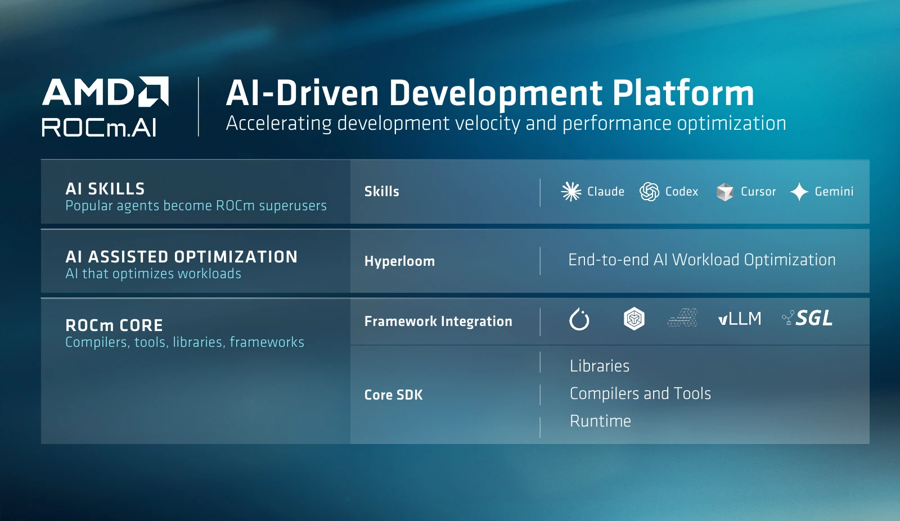

*图 15：AMD 官方演讲稿第 59 页。ROCm.ai 是覆盖开发者入口、工作负载优化和底层 ROCm 的平台层。*

### 第一层：AMD Skills，让通用 agent 获得经验证的 ROCm 工作流

AMD Skills 面向 Claude、Codex、Cursor、Gemini 等 agent，把版本化的 AMD 知识、命令和检查流程带入用户现有开发环境。AMD 官方博客给出的示例包括：

- `serving-llms-on-instinct`：通过 vLLM 在 Instinct 上部署 LLM endpoint；
- `tracelens`：把 PyTorch profiler trace 转成可执行的性能报告；
- `local-ai-use`：把图像、语音与 TTS 路由到 AMD 客户端硬件上的本地服务；
- `local-ai-app-integration`：把 NPU/iGPU/dGPU 本地 AI 接入应用。

其价值不在“agent 知道一个 shell 命令”，而在于把硬件探测、版本兼容、配置验证、服务启动和结果确认打包成可重复流程。需要注意，[AMD 的 ROCm.ai 官方博客](https://www.amd.com/en/blogs/2026/rocm-ai-the-ai-native-developer-experience-for-building.html)明确把 Skills catalog 标为 **Tech Preview**，名称、范围和可用性仍会变化。

### 第二层：ROCm CLI 与 Console，提供确定性执行和本地可观测性

AMD 展示的命令包括：

```bash
rocm install
rocm doctor
rocm serve qwen3
rocm update
```

CLI 的设计重点是 deterministic、scriptable：人、CI 或经授权的 agent 都调用同一个执行层。Console 则在本地展示遥测、日志、runtime 状态与诊断信息，企业不必把敏感性能数据发到外部服务。

这层很关键。直接让 LLM 任意修改驱动和系统配置风险过高；把可变的自然语言意图收敛到版本化、可审计的 CLI/Skill，才可能进入企业平台工程。

### 第三层：Hyperloom，优化端到端 workload 而非一个孤立 kernel

Hyperloom 是 agentic 性能优化系统，目标流程是：

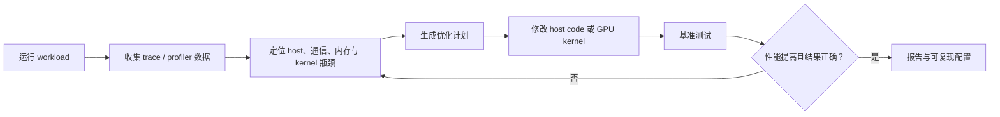
```mermaid
flowchart LR
    A["运行 workload"] --> B["收集 trace / profiler 数据"]
    B --> C["定位 host、通信、内存与 kernel 瓶颈"]
    C --> D["生成优化计划"]
    D --> E["修改 host code 或 GPU kernel"]
    E --> F["基准测试"]
    F --> G{"性能提高且结果正确？"}
    G -- "否" --> C
    G -- "是" --> H["报告与可复现配置"]
```

与只生成一段 Triton kernel 相比，端到端优化必须同时处理 parallelism、调度、KV cache、通信重叠、kernel fusion 和正确性回归。它的潜力很大，但也是最需要真实代码库验证的部分；[Phoronix](https://www.phoronix.com/news/AMD-ROCm-AI)也把跨工作负载的实际效果列为后续观察点。

AMD 现场称 Hyperloom 已处理约 14,000 个模型，并展示 MiniMax M3/vLLM 在 MI355X 上约 38% tokens/s 提升。这是单个 AMD 演示，不应与下面整个预览版 ROCm 栈的 3.3×/2.4×平均提升混为一谈。

### AMD 公布的 release-to-release 提升

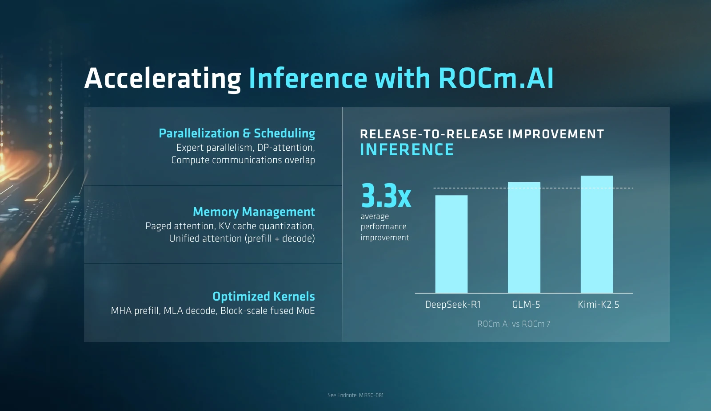

*图 16：AMD 官方演讲稿第 60 页；DeepSeek-R1、GLM-5、Kimi-K2.5 等工作负载平均 3.3×。*

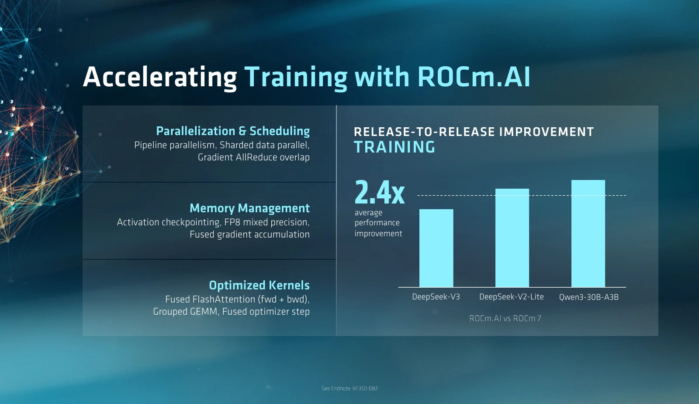

*图 17：AMD 官方演讲稿第 61 页；DeepSeek-V3、V2-Lite、Qwen3-30B-A3B 等平均 2.4×。*

最容易误写的点是：**3.3× inference 与 2.4× training 是 ROCm release-to-release 的平均改进，不是对 CUDA/NVIDIA 的跨平台领先倍数。**提升来自并行/调度、内存管理和优化 kernel 的组合：

- 推理：expert parallelism、DP attention、计算通信重叠、paged attention、KV cache quantization、MHA/MLA/MoE kernel；
- 训练：pipeline/sharded data parallel、gradient all-reduce overlap、activation checkpointing、FP8 mixed precision、FlashAttention/Grouped GEMM/optimizer fusion。

发布会总结页给出的正式可用时间是 **2026 年 8 月**。在此之前，应把已经开放的 Skills/CLI 预览、合作方 day-0 验证与完整 ROCm.ai GA 分开描述。

## 01:18:43–01:25:28｜OpenAI Philippe Tillet：抽象层与真实硬件之间

OpenAI 的 Philippe Tillet 登台。Tillet 是 Triton 语言/编译器的关键创建者之一，他讨论的核心不是某个 OpenAI 产品，而是如何让模型开发者用更高层的表达获得接近专家手写 kernel 的性能。

这段与 ROCm.ai 的关系可以概括为：

1. 前沿模型的 attention、MoE、量化和通信模式变化太快，固定库很难覆盖全部组合；
2. Triton 等 DSL 把 tile、memory access 和 parallel mapping 暴露给编译器与 autotuner；
3. AI agent 可以读取硬件信息、profiler 和代码，在更大搜索空间中提出优化；
4. 最终仍要用数值正确性、可重复 benchmark 和 production constraints 筛选结果。

OpenAI 现场称其 Helios 机架到手后，双方团队已让 GPT-class workload 跑在系统上。软件团队的提前协同，决定了 MI455X “day 0 可运行”与“day 0 达到高利用率”之间的距离。AMD 演讲稿列出 PyTorch core tests、Hugging Face 模型、vLLM 和 SGLang 的 MI455X day-0 进展，但这些伙伴表态属于早期验证，不等同于覆盖所有模型和规模。

Tillet 还区分了 **Triton** 与 **Gluon**：前者适合快速研究迭代和由编译器/autotuner 决定更多布局，后者允许开发者更显式地控制 tensor layout、异步拷贝、barrier、LDS 和 MFMA，适合追求极致 kernel。OpenAI/AMD 还通过 LLVM code generation 在数日内完成 MI450 的初始功能 bring-up；这证明开放编译链能快速接通新硬件，并不证明数日内就取得生产性能。

### ROCm.ai 能否改变竞争格局

它选择了一个合理的杠杆：CUDA 的优势很大一部分来自数十年累积的专家知识和工具默认值，agent/Skills 有机会把 AMD 平台的隐性知识显式化、版本化并快速分发。但它不会神奇地消除：

- 底层编译器、kernel 与通信库的缺口；
- GPU/NIC/交换机端到端遥测；
- Slurm/Kubernetes/容器生态的验证矩阵；
- 生产事故责任、权限和审计；
- 已经熟悉 CUDA 的工程团队迁移成本。

所以 ROCm.ai 更像“加速软件收敛的机制”，而不是软件成熟度已经追平的证据。

---

# 六、MI430X：把同一代 HBM4 平台转向 FP64 与主权 AI

## 01:25:28–01:27:34｜MI455X 之外的 MI400 系列

MI455X 针对 hyperscale AI 训练/推理；MI430X 则面向 scientific HPC 与 sovereign AI 的混合需求。它保留大容量 HBM4，同时把硬件资源明显倾向 FP64。

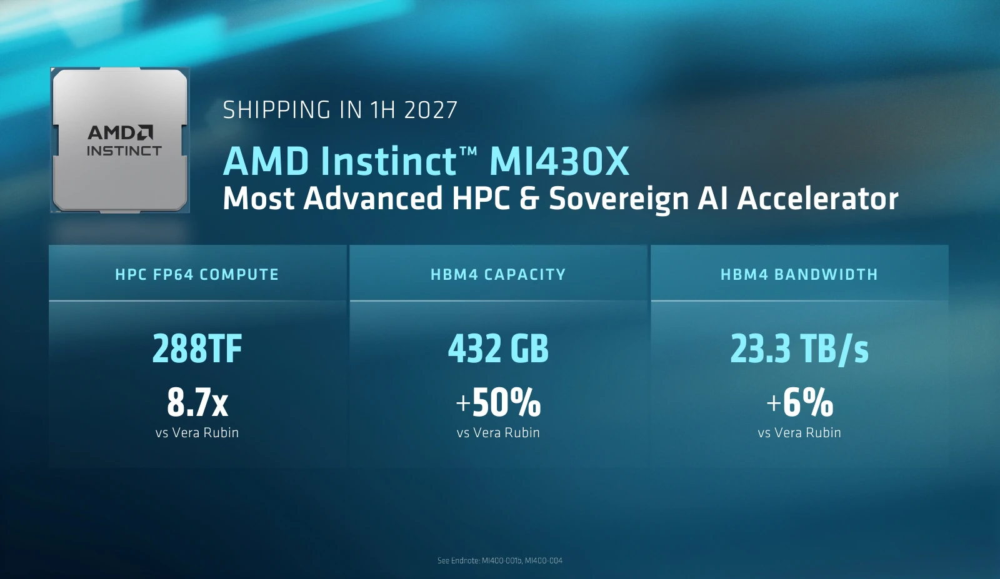

*图 18：AMD 官方演讲稿第 68 页。与 Vera Rubin 的倍数为 AMD 工程估算；不同产品的 FP64 定位不同。*

| MI430X 关键规格 | 数值 |
|---|---:|
| FP64 峰值 | 288 TFLOPS |
| HBM4 容量 | 432 GB |
| HBM4 带宽 | 23.3 TB/s |
| 计划出货 | 2027H1 |

AMD 将其称为 HPC 与 sovereign AI accelerator，是因为国家级系统越来越需要在一个平台上同时运行：

- FP64/FP32 科学模拟；
- AI surrogate model、数据同化和 foundation model；
- 超大数据集与大容量内存工作流；
- 对供应链、数据驻留和长期可维护性有主权要求的计算。

AMD 宣布美国 Oak Ridge National Laboratory 的 **Discovery** 和法国的 **Alice Recoque** 将采用 MI430X；后者也在 [AMD/Eviden 公告](https://www.amd.com/en/newsroom/press-releases/2025-11-18-amd-and-eviden-to-power-europe-s-new-exascale-supe.html)中得到确认。MI430X 的[官方产品页](https://www.amd.com/en/products/accelerators/instinct/mi400/mi430x.html)把性能数字明确标为 AMD Performance Labs 的 engineering projections，因此现阶段最可信的是产品定位、内存规格和采购项目，实际应用性能要等系统交付。

---

# 七、企业 AI：不是所有推理都应该送往前沿云模型

## 01:27:34–01:34:27｜从单一云端走向分布式 model placement

Dan McNamara 接棒后，发布会从 hyperscale 转入 enterprise AI。企业和前沿模型实验室的优化目标并不相同：

- 成本要能按业务单位、部门和 agent 追踪；
- 数据驻留、访问控制、审计和模型治理有硬约束；
- AI 必须接入已有数据库、身份系统、ERP、客服和网络；
- 机房往往只有标准 PCIe 服务器、风冷和有限电力；
- 不同请求的模型质量要求差异很大。

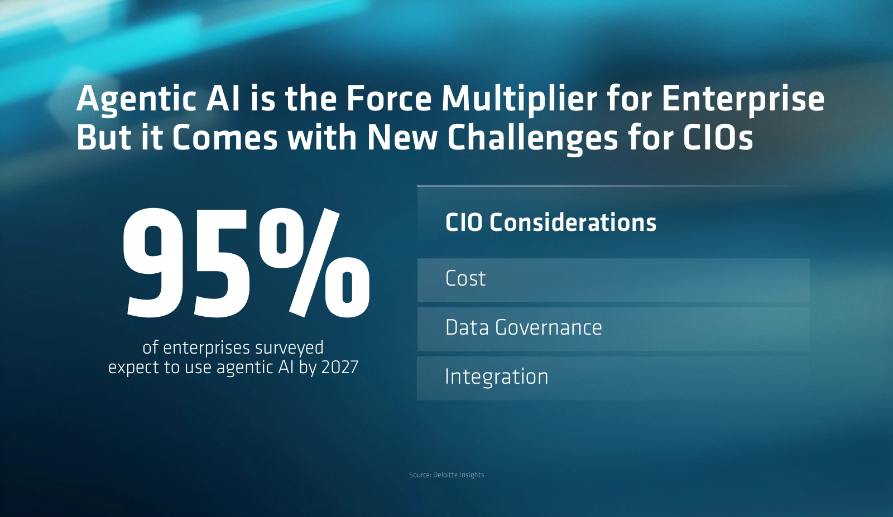

*图 19：AMD 官方演讲稿第 77 页。95% 是引用调查中“预计 2027 年使用 agentic AI”的企业比例，不等于 95% 已投入生产。*

因此 AMD 的答案是分层放置：

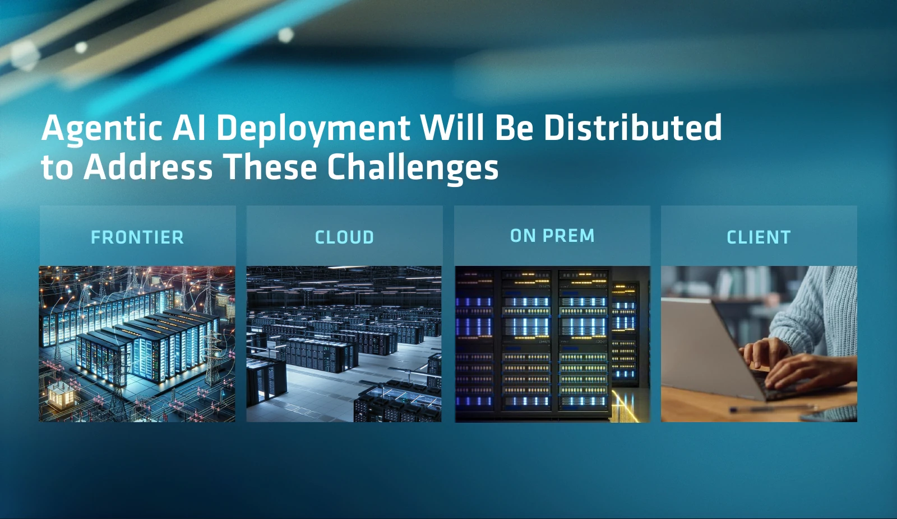

*图 20：AMD 官方演讲稿第 78 页。四层不是互斥部署，而是由 router、政策和数据位置协同。*

| 位置 | 适合的请求 | 主要约束 |
|---|---|---|
| Frontier API | 最难推理、最新能力、低频高价值任务 | 单 token 成本、数据与供应商依赖 |
| Cloud | 弹性突发、托管服务、区域部署 | egress、持续负载成本、主权 |
| On-prem | 稳定高频、敏感数据、定制模型 | 电力、冷却、运维、初始资本 |
| Client/edge | 低延迟、离线、个人上下文、隐私 | 内存容量、设备功耗、模型体积 |

这套逻辑的关键是 **model routing**：按质量门槛、延迟、成本、数据政策和设备状态选择模型。单纯把前沿模型换成小模型会损失质量；把所有请求都送到前沿模型又会浪费成本。

## 01:34:27–01:39:00｜MI350P：为现有风冷 PCIe 机房准备的 AI 卡

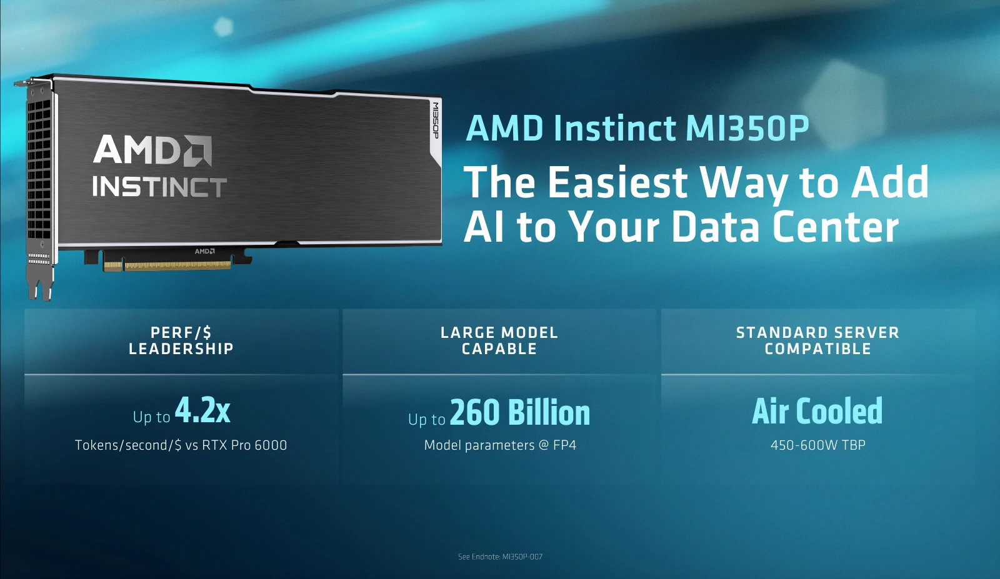

*图 21：AMD 官方演讲稿第 80 页。*

MI350P 与 MI355X/MI455X 的差异不在“更先进”，而在部署边界：

| 维度 | MI350P |
|---|---|
| 形态 | 标准双槽、被动风冷 PCIe 5.0 ×16 卡 |
| 架构/规模 | CDNA 4；128 CU；512 matrix cores |
| HBM | 144 GB HBM3E；约 4 TB/s |
| 低精度峰值 | 约 4.6 PFLOPS MXFP4/MXFP6 |
| TBP | 450–600 W |
| 模型容量口径 | FP4 下最高约 260B parameters |
| 目标 | 不重建液冷机架即可给现有数据中心增加推理能力 |

AMD 声称 MI350P 相比 RTX Pro 6000 可达最高 **4.2× tokens/s/$**。分模型内部测试中，Llama 3.3 70B 相比 RTX Pro 6000 最高 5.1× tokens/s，Mistral Small 3.2 24B 相比 NVIDIA H200 NVL 最高 2.5×，GPT-OSS 120B 相比 RTX Pro 6000 最高 2.1×。这些是不同对手基线、不同峰值并发点的 AMD 内部结果，受量化、batch、软件版本和 SLA 影响。

它的实际价值在于降低设施门槛：

- 不需要把传统企业机房立即改造成 200 kW 以上液冷机架；
- 能与 EPYC 服务器和企业软件栈一起采购；
- 260B FP4 容量让单机或较小规模系统运行相当大的量化模型；
- 450–600 W 仍不是“随便插卡”，服务器电源、风道、插槽间距和散热验证不可省略。

产品详细规格与部署注意事项可查 [MI350P 官方产品手册](https://www.amd.com/content/dam/amd/en/documents/epyc-business-docs/other/amd-instinct-mi350p-product-brochure.pdf)。发布会总结页将 MI350P 标为 **Available Now**。

### AMD 内部 token router 案例

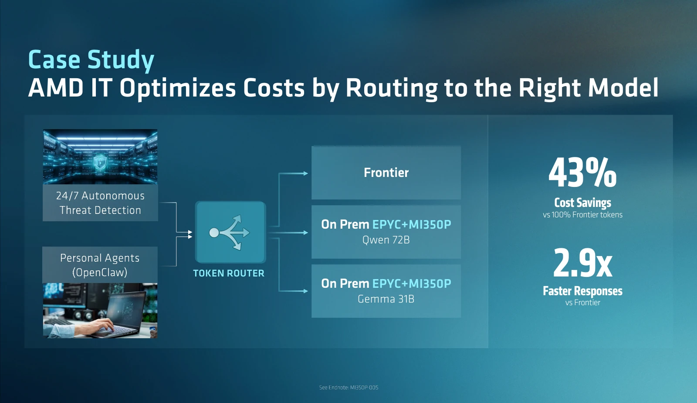

*图 22：AMD 官方演讲稿第 82 页。*

AMD IT 把 24/7 威胁检测、个人 agent 等请求按难度路由到：

- frontier model；
- 本地 EPYC + MI350P 上的 Qwen（主图标为 72B）；
- 本地 EPYC + MI350P 上的 Gemma（主图标为 31B）。

相对“100% 使用 frontier tokens”的基线，AMD 声称节省 **43% 成本**，并对适合本地模型的路径实现 **2.9× 更快响应**。这个案例说明 model placement 的收益不一定来自单模型 benchmark，而可能来自让多数简单请求避开昂贵、远程、排队的端点。要泛化到其他企业，仍需知道请求分布、质量门槛、失败回退、缓存、模型维护和本地折旧成本。

该页主图写 Qwen 72B/Gemma 31B，但演讲稿脚注的测试配置写 Qwen-3.6-35B-A2B/Gemma-4-31B，AMD 材料内部存在不一致；因此不能把主图中的 72B 直接当作 43%/2.9× 案例的已确认测试模型。

发布会没有确认一款正式命名为“AMD Token Router”的独立商业产品；这里是 AMD IT 的 gateway/router 案例。AMD 参与的正式开源项目是 [vLLM Semantic Router](https://github.com/vllm-project/semantic-router)，可做模型/工具选择、semantic cache、PII/prompt guard 和策略路由。

## 01:39:00–01:45:03｜AT&T：每月 1 万亿 token、100+ 生产模型与 OTel 2.0

AT&T CTO Jeremy Legg 给出了本场最具体的企业生产数据之一：

- 每月消耗 **1 万亿以上 token**，仍以两位数速度增长；AT&T 同日博客给出的平均值是每天约 450 亿，按 30 天约 1.35 万亿；
- 企业内部有 **100+ generative AI models** 投入生产；
- 每天约 30 万通电话，仅转写和洞察提取就是巨大负载；
- 用例覆盖客服、欺诈检测、基站/RAN 选址、HR、财务、现金预测和员工入职；
- AT&T 称自己是最早在 AMD 上完成模型 post-training 的电信企业之一。

### AT&T 的三个经验

1. **先重构 workflow，而不是给每个环节加一个 chatbot。**Jeremy 用“红绿灯之间飙车”形容只优化单点：某一步快了，流程下一步仍然等待。
2. **数据主权也包括模型和芯片选择权。**AT&T 不希望被单一模型、芯片或开发工具绑定；其数据才是长期资产。
3. **对 token 做 Moneyball。**按任务选择开源/闭源、远程/本地和不同规模模型，在 token 消耗上升时控制单位成本。

### OTel 2.0（Open Telco AI 2.0）

AT&T 表示此前 OTel/Open Telco AI 模型家族发布一年多获得 1800 万以上累计下载；现场发布 **OTel 2.0**。AT&T 称整体训练处理超过 1T token，其中在 AMD GPU 上使用 400B+ token 进行 post-training，并向行业开源。发布当天资料尚未给出可核对的权重仓库/model card，因此可写“正式宣布开源模型”，不擅自写成“权重已全面 GA 下载”。更多生产 token 与路由背景见 [AT&T Tokenomics 博客](https://about.att.com/blogs/2026/the-tokenomics-equation.html)。

AT&T 部分也提醒我们区分两类“开放”：

- 模型权重/训练方法开放，关系到领域适配与数据主权；
- 硬件/软件平台开放，关系到部署位置和供应商选择。

只有两者同时具备，企业才真正拥有迁移余地。

---

# 八、个人 AI：当 9B–27B 小模型逼近“昨日的前沿”

## 01:46:13–01:52:30｜为什么 AMD 认为 PC 会成为推理基础设施

Jack Huynh 把话题从企业服务器延伸到 personal AI。他的出发点不是让笔记本训练 frontier model，而是利用已经部署的海量 PC 为持续 agent 任务提供：

- **隐私**：个人数据和上下文留在设备；
- **可靠性**：断网仍可工作；
- **低时延**：没有广域网与云端排队；
- **边际 token 成本**：设备已购买后，高频本地推理不再按 API token 计费；
- **云端减负**：把简单、稳定、敏感任务留在本地，难题升级到数据中心。

“free token”是发布会的营销表述；本地推理仍有电费、设备折旧、模型维护和内存占用，只是成本结构从按调用付费变成固定资本与本地能源。

### 小模型效率正在快速变化

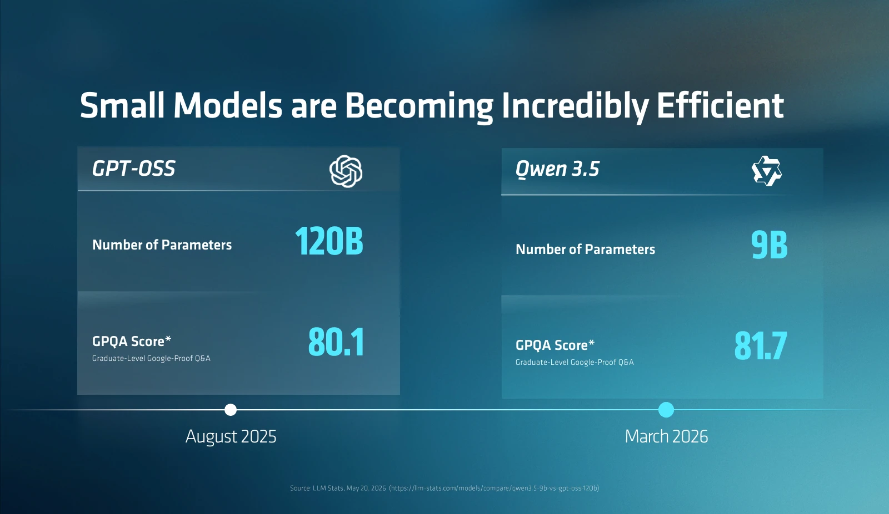

*图 23：AMD 官方演讲稿第 90 页。GPT-OSS 120B 与 Qwen 3.5 9B 的 GPQA 分数和日期来自演讲稿引用；benchmark 分数不代表所有真实任务质量。*

AMD 用两组例子说明硬件可运行模型的边界在快速移动：

- 2025 年 8 月，GPT-OSS 120B 在 GPQA 上约 80.1；
- 2026 年 3 月，Qwen 3.5 9B 约 81.7，以约 13× 更少参数略高于前者；
- 演讲稿还列出 Qwen 3.6 27B 在 GPQA 上约 87.8，高于 Sonnet 4.5 的 83.4、略高于 Opus 4.5 的 87.0。

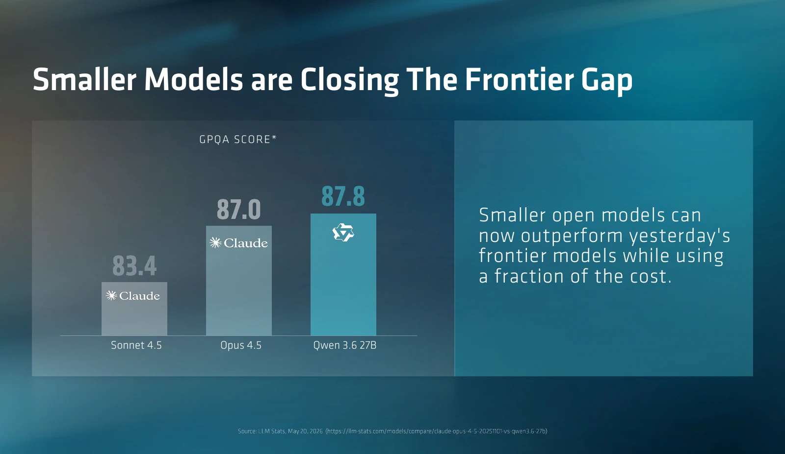

*图 24：AMD 官方演讲稿第 91 页。这里的结论只限于所列 benchmark/版本，不应外推为 27B 开源模型全面超过闭源前沿模型。*

参数量不是质量的充分指标，GPQA 也只覆盖一类研究生级问答；但更高效模型确实把可用 agent 从数据中心下放到统一内存 PC。

### 从 Ryzen AI 400 到 Ryzen AI Halo

AMD 的映射是：

| 平台 | 官方演讲稿中的模型规模口径 |
|---|---:|
| Ryzen AI 400 | 最高约 24B |
| Ryzen AI MAX | 最高约 200B |
| Ryzen AI Halo 开发平台 | 128 GB unified memory，原生运行最高约 200B 模型 |

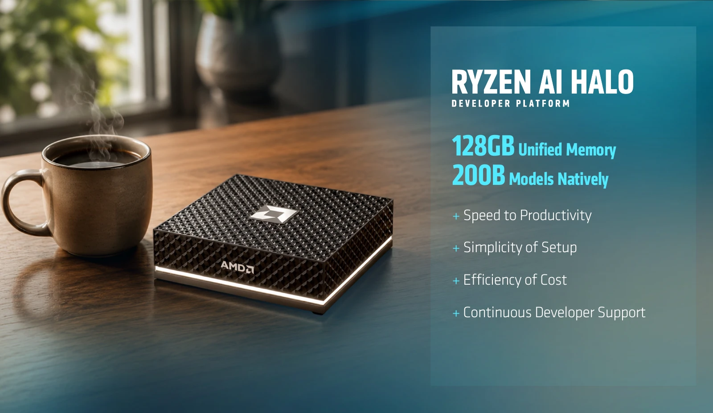

*图 25：AMD 官方演讲稿第 93 页。模型能装入内存不等于达到交互式速度；速度取决于量化、上下文、内存带宽和软件。*

Halo 是小型桌面开发机而不是普通轻薄本。128 GB 统一内存的优势是 CPU/GPU 可访问较大的同一内存池，避免独立显存只有 16/24/32 GB 时的模型切分；代价是共享带宽、系统保留内存和功耗仍会限制实际规模。

AMD 还把 ROCm libraries、runtime/compiler、PyTorch/JAX/vLLM/ONNX 以及 Lemonade、LM Studio、Ollama、CrewAI 等置于一条“从客户端到 Instinct”的软件路径中。“write once, run anywhere”应理解为尽量复用框架和模型资产，不是二进制、性能或所有 kernel 在不同 AMD 设备上完全一致。

### 与 Hugging Face 的合作

发布会宣布深化 Halo 与 Hugging Face 的合作：

- 提供原生 Halo 支持、优化模型与 agentic workflows；
- 共同开发本地 AI 体验、libraries 与 toolkits；
- 2026 年稍晚出货的每台 Halo box 附带一年 Hugging Face Pro。

这属于**模型/工具生态合作和随设备权益**，不要把它写成 Hugging Face 采购 Halo 或所有 Hub 模型都已为 Halo 手工优化。

## 01:52:30–01:54:10｜Gorgon Halo：192 GB 统一内存与 300B 模型

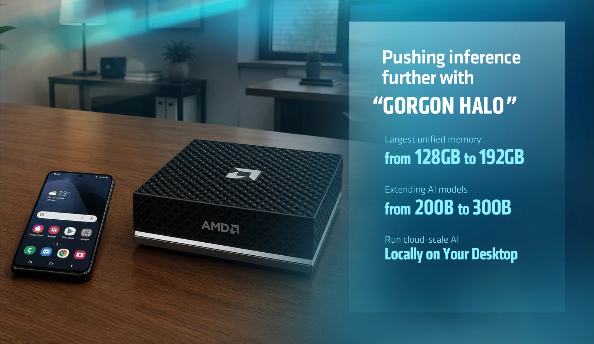

*图 26：AMD 官方演讲稿第 96 页。*

Gorgon Halo 是下一代 Ryzen AI Halo 开发平台的台上代号，采用 **Ryzen AI Max PRO 400 Series** 处理器；同一处理器系列还会进入 OEM 商用系统。

| 维度 | Ryzen AI Halo | Gorgon Halo |
|---|---:|---:|
| 统一内存 | 128 GB | 192 GB 系统统一内存；最多 160 GB 可配置给 GPU |
| 模型规模口径 | 最高 200B | 最高 300B+，限定 4-bit 量化 |
| 供货状态 | 已可用 | 计划 2026Q3，属于 2026H2 |

300B 仍是“模型可容纳”口径，而且要给 KV cache、runtime 和 OS 留出内存。更大的统一内存主要扩大了可实验范围；能否达到可接受的 tokens/s，需要看实际 APU、内存带宽、上下文和并行实现。[AMD 对 Ryzen AI Max PRO 400 的官方预告](https://www.amd.com/en/blogs/2026/amd-powers-next-generation-agent-computers-with-new-ryzen-ai-hal.html)

---

# 九、Cisco：把持续运行的 agent 当成需要管理和隔离的新端点

## 01:54:10–02:01:33｜从人触发的 burst 到机器速度的 steady state

Cisco 总裁兼首席产品官 Jeetu Patel 登台。他指出 chatbot 时代的推理通常由人发起，呈突发—空闲模式；agentic/physical AI 可以 24×7 运行，以机器速度调用模型和工具。这会改变企业端点的四件事：

1. **网络**：agent 会持续访问 SaaS、数据库、MCP server 与其他 agent；
2. **tokenomics**：错误 loop 或过度调用能在无人察觉时快速烧掉预算；
3. **行为**：需要知道 agent 正在做什么、代表谁以及调用了哪些资源；
4. **安全**：prompt injection、恶意工具、数据外泄和失控行为必须可隔离。

### 每台 Halo 设备内的完整栈

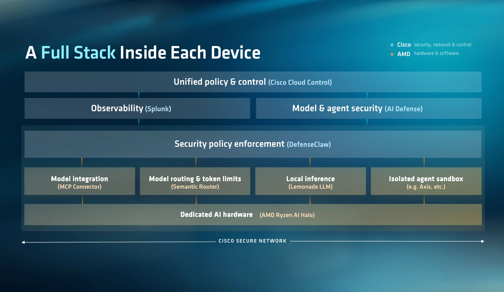

*图 27：AMD 官方演讲稿第 102 页。蓝色层主要来自 Cisco，黄色层主要来自 AMD；具体组件可用状态并不完全相同。*

| 层 | 组件 | 作用 |
|---|---|---|
| 统一策略与控制 | Cisco Cloud Control | 统一管理大量端点和策略 |
| 可观测性 | Splunk | 查看 agent、模型、token、成本与异常 |
| 模型/agent 安全 | Cisco AI Defense | 识别模型与 agent 风险 |
| 策略执行 | DefenseClaw | 限制 agent 访问资源并实时隔离 |
| 模型接入 | MCP integrations/connectors | 连接工具、数据和模型接口 |
| 路由/预算 | Semantic Router | 选择模型、限制 token 与成本 |
| 本地推理 | Lemonade LLM | 在 Halo 上运行本地模型服务 |
| 沙箱 | Isolated agent sandbox | 把 agent 生成/执行的代码与主机隔离 |
| 硬件 | Ryzen AI Halo | 本地统一内存与 AI 计算 |

这套组合把 PC 从“员工运行聊天应用的终端”变成“可以托管企业 agent 的受管计算节点”。最有价值的并非每个名称，而是控制闭环：

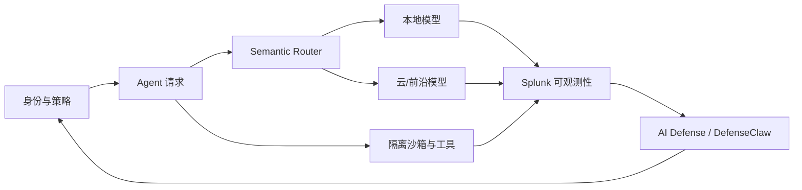
```mermaid
flowchart LR
    I["身份与策略"] --> A["Agent 请求"]
    A --> R["Semantic Router"]
    R --> L["本地模型"]
    R --> C["云/前沿模型"]
    A --> S["隔离沙箱与工具"]
    L --> O["Splunk 可观测性"]
    C --> O
    S --> O
    O --> D["AI Defense / DefenseClaw"]
    D --> I
```

“MCP Connector”更适合读作一组 MCP integrations/connectors，而不是已确认可单独采购的同名产品。Jeetu 在现场说，Halo 硬件已经可以购买；整套管理能力当时仅对选择性客户 early availability，计划在美国 **初秋 GA**。因此不能把图中的所有组件都写成发布会当天全球正式可用。联合合作与组件状态可查 [Cisco 官方架构博客](https://blogs.cisco.com/ai/from-one-desk-to-the-whole-enterprise-making-local-ai-resilient)。

### 技术上最值得关注的三个问题

- **本地并不天然安全**：模型、数据和工具集中到端点后，端点失陷的影响可能更大，必须有网络策略、代码隔离、密钥和审计。
- **路由器本身是控制平面**：它决定数据去哪、花多少钱、降级用什么模型，需要可解释规则和失败回退，而不能完全由一个不可审计 LLM 决定。
- **稳态 agent 需要新容量模型**：以“活跃用户数 × 平均聊天次数”规划会低估机器速度 loop；应监控 token rate、tool-call fan-out、并发、队列和每个 business outcome 的成本。

---

# 十、Physical AI：推理错误从“答案不好”变成“动作不安全”

## 02:01:33–02:03:44｜机器人需要确定性控制与概率模型同时工作

Jack 把 physical AI 定义为 agentic AI 的终极应用：数字 agent 的输出是文本或 API 调用，物理 agent 的输出可能是电机动作。它必须同时完成：

- 感知和传感器融合；
- 状态估计与实时控制；
- 高层 reasoning/action planning；
- multi-agent orchestration；
- 自我修正与学习；
- functional safety 与人与机器的隔离。

云端 LLM 可以接受偶发长尾延迟，闭环控制却有硬 deadline。模型给出“正确动作”但晚了 100 ms，在高速机械系统里仍可能是错误。因此机器人计算通常不是一颗大 GPU 包办所有任务，而是：

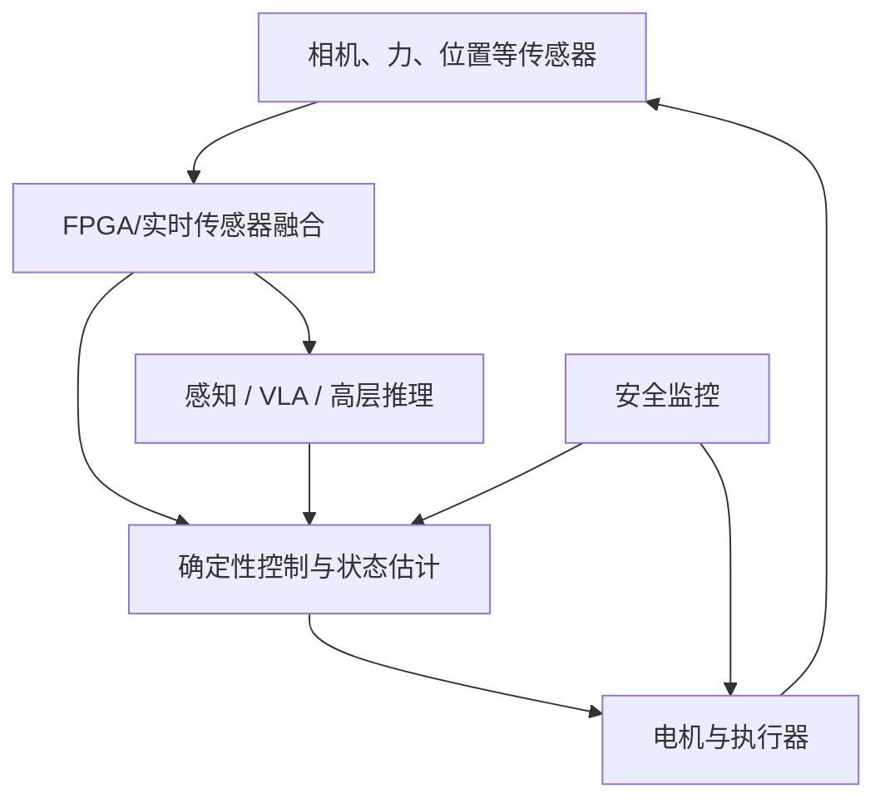
```mermaid
flowchart TB
    S["相机、力、位置等传感器"] --> F["FPGA/实时传感器融合"]
    F --> C["确定性控制与状态估计"]
    F --> P["感知 / VLA / 高层推理"]
    P --> C
    C --> M["电机与执行器"]
    M --> S
    G["安全监控"] --> C
    G --> M
```

CPU、GPU、NPU 与可编程逻辑的价值在于把 Linux/ROS 2、模型推理、低时延控制和自定义 I/O 放到一套可分区的异构系统里。

## 02:03:44–02:05:02｜Kria AI SOM：Ryzen AI Embedded X100 进入 COM-HPC

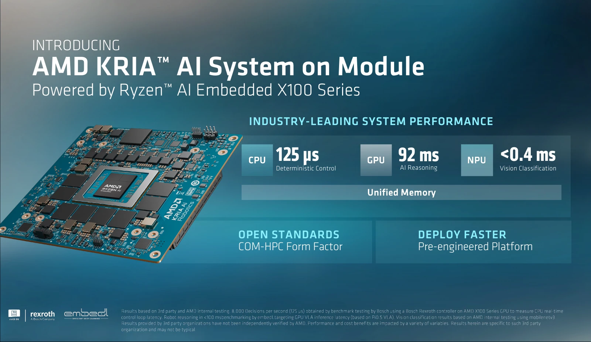

*图 28：AMD 官方演讲稿第 111 页。125 µs、92 ms 与 <0.4 ms 对应不同控制/推理/视觉工作负载，不是同一个模型的三个阶段。*

Kria AI SOM 把 Ryzen AI Embedded X100 放到开放 COM-HPC 模块形态中：

| 组件 | 最高配置/作用 |
|---|---|
| CPU | 最高 16 个 Zen 5 cores；ROS、规划、通用代码与控制 |
| GPU | RDNA 3.5 iGPU；并行视觉和 AI |
| NPU | XDNA 2；持续、能效导向的 AI 推理 |
| 内存 | 最高 128 GB LPDDR5X unified memory |
| 载板接口 | COM-HPC；由机器人载板提供相机、工业网络、FPGA 与专用 I/O |

AMD 展示的工作负载指标包括：

- 每秒 8000+ control decisions，即约 **125 µs 控制周期**；
- 低于 100 ms 的 VLA reasoning，演讲稿示例约 **92 ms**；
- 视觉分类低于 **0.4 ms**；
- 产品页还给出最高 234 concurrent agents、8 路相机输入的配置口径。

它们说明异构任务可以并行，但不能直接相加得到端到端机器人反应时间；传感器曝光、总线、ROS graph、规划器、执行器和安全监控都会加入时延。

### 与 Jetson Thor 的“3.4×”到底是什么

AMD 演讲稿给出三项 headline：

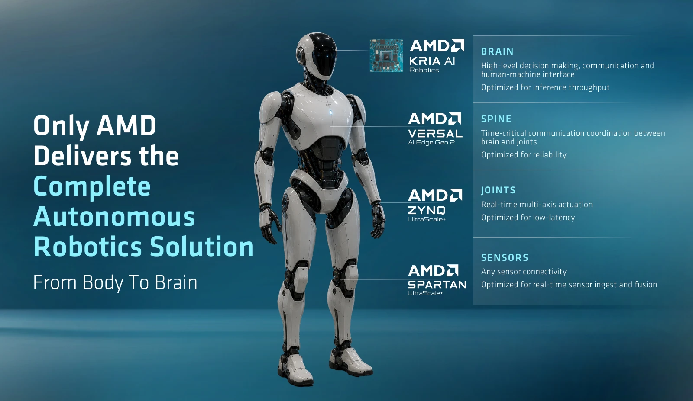

*图 29：AMD 官方演讲稿第 114 页；这张图展示 AMD 从 brain 到 sensor 的产品组合，不是单个 SOM 内含全部芯片。*

- 最高 3.4× better real-time results/reliability；
- 最高 2.3× more concurrent agents；
- 最高 1.6× more spare CPU capacity。

这不能缩写成“Kria 总体性能是 Jetson Thor 的 3.4 倍”。更完整的测试限制是：

- 3.4× 指十次任务中 control-loop deadline miss 更少，是实时可靠性指标；
- 1.6× 指运行工作负载后剩余的 CPU capacity；
- 2.3× 来自 mimik 对 455 种可行 agent workflow 的模型化容量扫描，不是量产 SOM 实机同时跑出 2.3× agent；
- OpenNav 对比使用按 X199 规格配置的 Ryzen AI Max+ 395 代理平台，对手为 Jetson AGX Thor Developer Kit/T5000；不是最终量产 X100 SOM 的直接实测；
- 测试由 AMD 委托。

因此，这组数据更适合证明“系统级实时性、剩余 CPU 和 agent density 是值得测的指标”，而不是宣布一个跨所有机器人任务的绝对性能倍数。[AMD/OpenNav 对测试方法的解读](https://www.amd.com/en/blogs/2026/from-benchmarks-to-behavior-rethinking-performance-in-a.html)

## 02:05:02–02:07:10｜Kria AI Robotics Developer Platform：从原型到量产不换模块

AMD 随后发布开发平台：Kria AI SOM 配合含 FPGA、传感器与工业 I/O 的 carrier card，软件套件建立在 ROCm 和 ROS 2 之上，支持 PyTorch、ONNX、MoveIt、仿真工具、优化库和参考应用。

发布会强调两件工程价值：

1. 原型阶段使用的 SOM 可直接进入量产设计，减少从开发板迁移到自研模块的重新验证；
2. 开放 baseboard schematic 和 FPGA design，允许厂商扩展传感器、实时网络和 safety I/O。

状态需要分开：

- Ryzen AI Embedded X100 已在 2026 年 6 月开始客户送样，预计 Q4 量产；
- Kria AI SOM 由 ODM 伙伴预计从 Q4 供货；
- Robotics Developer Platform 当时向 early-access 客户送样，预计 Q4 GA。

详见 [Kria AI 官方新闻稿](https://newsroom.amd.com/news/aai-2026-kria-robotics-dev-platform)与[产品页](https://www.amd.com/en/products/system-on-modules/kria/ai.html)。

### “从身体到大脑”的产品分工

AMD 最后的机器人图把自身组合映射为：

| 机器人层 | AMD 产品 | 优化目标 |
|---|---|---|
| Brain | Kria AI / Ryzen AI Embedded | 高层决策、VLA、人机交互与推理吞吐 |
| Spine | Versal | 关键通信、协调和可靠性 |
| Joints | Zynq | 多轴实时控制与低时延 |
| Sensors | Spartan | 传感器接入、预处理与融合 |

这张图的商业意图很明显：AMD 不只争夺机器人的“AI 主芯片”，还希望覆盖确定性控制、连接和传感器接口。真正的集成难题仍在 functional safety 认证、实时 OS/ROS 2 桥接、模型失效保护、供应周期和机器人 OEM 的长期维护。

---

# 十一、路线图：CPU、GPU 与机架都转向年度节奏

## 02:07:10–02:13:10｜Lisa Su 回场总结

### EPYC：Turin → Venice → Florence → Ravenna

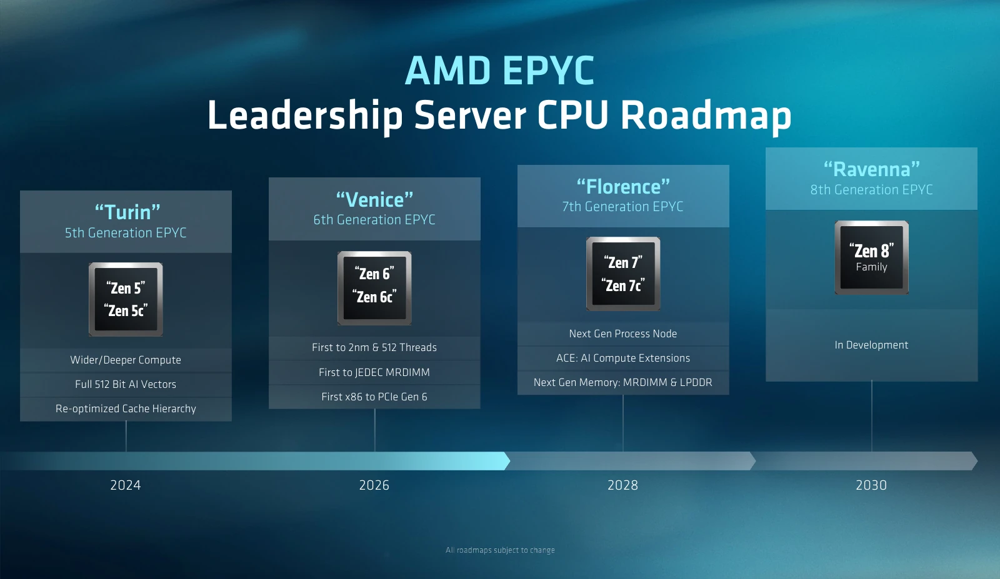

*图 30：AMD 官方演讲稿第 117 页。2028/2030 产品均为路线图，规格与名称可能改变。*

| 年份 | 代号 | 核心/主要方向 |
|---:|---|---|
| 2024 | Turin | Zen 5 / Zen 5c |
| 2026 | Venice | Zen 6 / Zen 6c；2nm；最高 512 threads；PCIe 6；MRDIMM |
| 2028 | Florence 家族 | Zen 7 / Zen 7c；新工艺、ACE AI compute extensions、新一代 MRDIMM/LPDDR；相关性能/密度点包括 Florence、Ferrara、Fidenza |
| 2030 | Ravenna | Zen 8 family；已在开发 |

“ACE AI extensions”说明 CPU 会继续加入面向 agentic/AI 的向量或数据处理能力，但发布会没有给出最终 ISA、SKU、功耗或软件支持细节。

### Instinct：MI350 → MI400 → MI500 → MI600

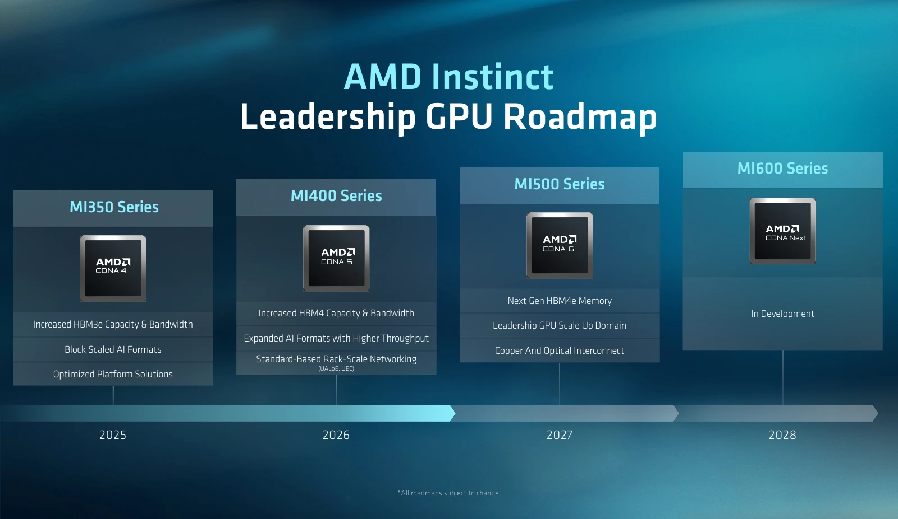

*图 31：AMD 官方演讲稿第 119 页。*

| 年份 | 产品 | 路线图重点 |
|---:|---|---|
| 2025 | MI350 Series / CDNA 4 | 更大 HBM3E、block-scaled formats、平台优化 |
| 2026 | MI400 Series / CDNA 5 | HBM4、UALoE/UEC 标准机架网络、更丰富低精度格式 |
| 2027 | MI500 Series / CDNA 6 | 下一代 HBM、更大 scale-up domain、铜与光互连 |
| 2028 | MI600 Series / CDNA Next | 开发中 |

AMD 还画出从 MI300 世代到 MI500 **四年推理吞吐超过 2000×** 的轨迹。这是跨硬件、精度、并行、系统和软件的路线图目标/投影，不是单一应用在同一 SLA 下已测出的芯片代际倍数。

### 机架：Helios → Helios 500 → Helios 600

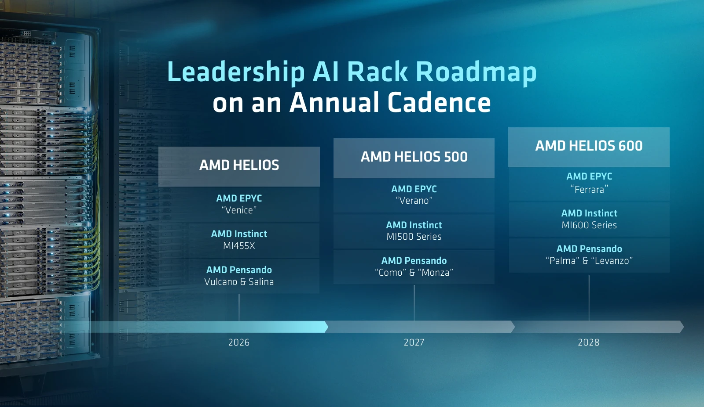

*图 32：AMD 官方演讲稿第 121 页。*

| 年份 | 机架 | 计划组件 |
|---:|---|---|
| 2026 | Helios | EPYC Venice + MI455X + Pensando Vulcano/Salina |
| 2027 | Helios 500 | EPYC Verano + MI500 + Pensando Como/Monza |
| 2028 | Helios 600 | EPYC Ferrara + MI600 + Pensando Palma/Levanzo |

年度 cadence 的意义是共同设计窗口也要年度化：CPU、GPU、HBM、NIC、交换机、液冷、固件和 ROCm 必须同步。任何一层晚一个季度，整个机架的“day-0”都会受影响。路线图中的 Verano/Ferrara 等名称与分工仍可能在正式 SKU 阶段重组，不能据此推导最终 socket、GPU 数量或功耗。

### 发布会当天的状态总表

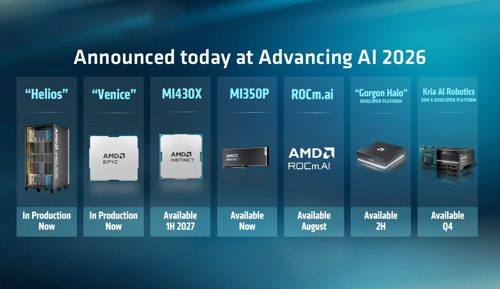

*图 33：AMD 官方演讲稿第 122 页。*

| 产品 | 2026-07-23 官方状态 | 需要补充的边界 |
|---|---|---|
| Helios | In Production Now | reference design/solution；Q3 末开始出货、Q4 爬坡；规模生产 token 待验证 |
| 6th Gen EPYC Venice | In Production Now | Helios 先行；广泛 OEM/云平台从 Q4 |
| MI430X | Available 2027H1 | 预发布 HPC/主权 AI 产品 |
| MI350P | Available Now | 通过 OEM/服务器验证交付，不等于所有机型即插即用 |
| ROCm.ai | Available August 2026 | Skills 首批可装但仍 Tech Preview；不同组件状态不同 |
| Gorgon Halo | Available 2026H2 | 更具体产品计划为 Q3；正式系列 Ryzen AI Max PRO 400 |
| Kria AI SOM / Robotics Platform | Available Q4 | 当时是 samples/early access，量产与 GA 目标在 Q4 |

---

# 十二、技术判断：这场发布会真正改变了什么

## 1. Helios 是 AMD 架构可信度的分水岭，但还不是“已经赢下 Rubin”

它第一次把 Instinct、EPYC、Pensando、商用交换芯片、OCP 机架和 ROCm 组织成完整 72-GPU scale-up 系统。31 TB HBM4、260 TB/s scale-up 和约 43 TB/s 双向聚合 scale-out 是有意义的系统差异，不只是单卡营销。

但目前的领先结论主要来自理论规格、AMD 内部 benchmark/建模和预生产客户验证。行业还没有相同模型、精度、上下文、SLA、功耗、软件版本和持续时间下的两套量产机架公开横评。更准确的结论是：**AMD 已获得正面对标 72-GPU 机架系统的架构资格，生产竞争从 2026H2 才真正开始。**

## 2. 开放标准降低长期锁定，也把风险从厂商内部转移给生态

OCP、UALink/ESUN、Ultra Ethernet 和 ROCm 允许 OEM、交换芯片、NIC、CPU 与软件各自创新。长期看，这可能带来更广供应链和更强议价；短期看，多厂商固件、telemetry、资格验证、互操作和事故责任更复杂。

选择 Helios 的团队不应只问“是否开放”，而要问：

- 哪些接口已有多供应商合规产品？
- 交换机/NIC/GPU 的 firmware matrix 谁维护？
- UALoE 到原生 UALink 的迁移路径是什么？
- 集群级故障定位由 OEM、AMD、网络厂商还是云平台负责？

## 3. HBM 容量会成为推理差异化，但有效利用比标称容量更难

432 GB/卡和 31 TB/架可以减少权重与 KV cache 分片、提高并发或容纳更大上下文。收益最终取决于：

- 权重与 KV cache 的实际精度；
- attention/kernel 是否利用 23.3 TB/s；
- scale-up 集合通信和拓扑；
- prefix cache 命中与请求长度分布；
- scheduler 能否在 TTFT、TPOT 和吞吐之间找到稳定点。

“50% 更多 HBM”绝不能直接翻译成“50% 更快”。

## 4. ROCm.ai 的方向正确，验证标准应该高于普通开发者工具

agent 可以显著降低安装、诊断和内核优化门槛，但它触及驱动、系统配置、集群和生产代码，必须具备：

- 版本锁定与可重复执行；
- 权限最小化和变更审批；
- 数值正确性回归；
- benchmark 防过拟合；
- 修改 diff、来源和审计日志；
- 离线/私有环境的模型与 telemetry 控制。

它能否成为 AMD 软件生态的“速度乘数”，取决于真实仓库和生产事故，而不是 demo 中生成一个更快 kernel。

## 5. 企业与客户端不是 hyperscale 的缩小版

MI350P、Semantic Router、Halo 和 Cisco 栈表明，企业优化目标是数据、成本、治理和部署设施的组合。正确架构往往是：

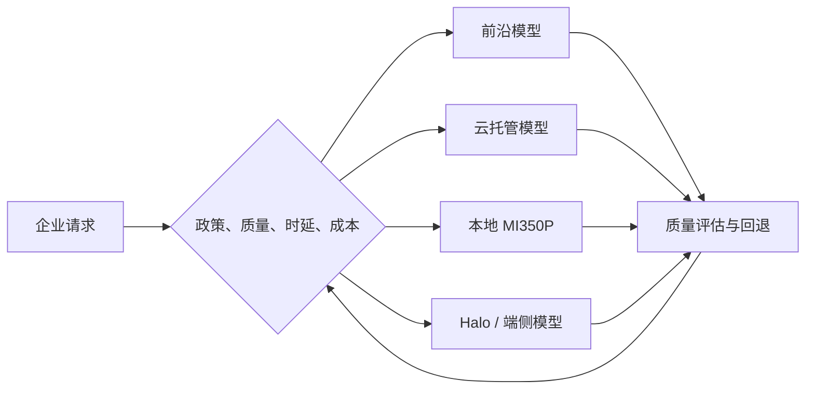
```mermaid
flowchart LR
    Q["企业请求"] --> P{"政策、质量、时延、成本"}
    P --> F["前沿模型"]
    P --> C["云托管模型"]
    P --> O["本地 MI350P"]
    P --> H["Halo / 端侧模型"]
    F --> E["质量评估与回退"]
    C --> E
    O --> E
    H --> E
    E --> P
```

这里最关键的产品可能不是某一块卡，而是能持续测量质量、成本、延迟和政策的 router/evaluation 控制平面。

## 6. Physical AI 把 benchmark 讨论拉回实时性与安全

机器人不能只看 TOPS。控制 deadline、剩余 CPU、传感器 I/O、故障隔离、功能安全和模型失效处理可能比单模型 tokens/s 更重要。AMD 同时拥有 CPU、GPU/NPU、FPGA、adaptive SoC 的组合，确实适合这类异构问题；能否形成易开发、可认证、长期支持的机器人平台，才是 Kria 发布后的核心考题。

---

# 十三、给数据中心技术团队的核查清单

如果要把本场发布会转成采购或架构评估，至少要求供应商回答：

1. 用你的模型、精度、上下文、batch、TTFT/TPOT SLA 跑多少 tokens/s，而不是理论 FP4？
2. 72 GPU 域在 link failure、交换机重启和 GPU 隔离时如何降级？
3. 31 TB HBM4 中多少可被应用使用，KV cache 与权重怎样分配？
4. 单架实际峰值/平均功耗、进出水温、流量、压差和 facility water 要求是什么？
5. Q3 出货、Q4 爬坡分别对应工程样机、客户验收还是生产容量？
6. ROCm、driver、firmware、PyTorch/vLLM/SGLang 的受支持版本矩阵和升级策略是什么？
7. UALoE、ESUN、UEC 和未来 UALink 的可观测性、拥塞控制与互操作认证由谁提供？
8. tokens/$ 计算中使用了什么硬件价格、利用率、电价、折旧和工程迁移成本？
9. OEM 的 field service、备件、液冷故障域和 SLA 是什么？
10. 对生产 workload 是否允许复现 benchmark，并提供质量、功耗和至少数小时持续负载数据？

---

# 十四、资料索引

## AMD 官方总资料

- [Advancing AI 2026 官方新闻资料包](https://newsroom.amd.com/press-kits/advancing-ai-2026-all-news/)
- [AAI 2026：AMD Delivers Full-Stack Compute for the Agentic AI Era](https://ir.amd.com/news-events/press-releases/detail/1294/aai-2026-amd-delivers-full-stack-compute-for-the-agentic-ai-era)
- [完整主旨演讲视频](https://www.youtube.com/watch?v=crEztVjfAPM)
- [132 页 Keynote Deck](https://www.amd.com/content/dam/amd/en/documents/corporate/events/advancing-ai-2026-distribution-deck.pdf)

## 数据中心硬件与网络

- [AMD Helios 发布](https://newsroom.amd.com/news/aai-2026-helios-update/)
- [AMD Helios 产品页](https://www.amd.com/en/products/rackscale-solutions/helios.html)
- [MI455X 官方规格](https://www.amd.com/en/products/accelerators/instinct/mi400/mi455x.html)
- [6th Gen EPYC 9006](https://www.amd.com/en/products/processors/server/epyc/9006-series.html)
- [AI Networking Built for Scale](https://www.amd.com/en/blogs/2026/ai-networking-built-for-scale.html)
- [AMD Pensando Vulcano 800](https://www.amd.com/en/blogs/2026/amd-pensando-vulcano-800-ai-nic-scale-out-and-across.html)
- [Helios Resilient Scale-Up Networking](https://www.amd.com/en/blogs/2026/amd-helios-resilient-scale-up-networking-for-ai.html)

## 合作伙伴一手资料

- [AMD / Anthropic：最高 2 GW](https://ir.amd.com/news-events/press-releases/detail/1292/amd-and-anthropic-announce-strategic-partnership-to-deploy-up-to-2-gigawatts-of-amd-instinct-mi450-series-gpus)
- [OpenAI / AMD：6 GW 多代合作](https://openai.com/index/openai-amd-strategic-partnership/)
- [Meta / AMD：最高 6 GW](https://about.fb.com/news/2026/02/meta-amd-partner-longterm-ai-infrastructure-agreement/)
- [Microsoft / AMD：Azure 部署 Helios](https://ir.amd.com/news-events/press-releases/detail/1291/microsoft-to-deploy-next-gen-amd-instinct-and-amd-epyc-processors-as-the-companies-expand-their-long-term-strategic-partnership)
- [Cerebras / AMD：解耦推理](https://ir.amd.com/news-events/press-releases/detail/1293/amd-and-cerebras-announce-industry-leading-ultra-low-latency-and-high-throughput-ai-inference-solution)
- [AT&T：The Tokenomics Equation](https://about.att.com/blogs/2026/the-tokenomics-equation.html)
- [Cisco：本地 AI 企业架构](https://blogs.cisco.com/ai/from-one-desk-to-the-whole-enterprise-making-local-ai-resilient)

## 软件、企业、客户端与机器人

- [ROCm.ai 新闻稿](https://newsroom.amd.com/news/aai-2026-rocm-ai-software/)
- [ROCm.ai 技术博客](https://www.amd.com/en/blogs/2026/rocm-ai-the-ai-native-developer-experience-for-building.html)
- [ROCm AITER](https://github.com/ROCm/aiter)
- [MI430X 产品页](https://www.amd.com/en/products/accelerators/instinct/mi400/mi430x.html)
- [MI350P 产品页](https://www.amd.com/en/products/accelerators/instinct/mi350/mi350p.html)
- [Ryzen AI Halo 产品页](https://www.amd.com/en/products/processors/desktops/ryzen/ryzen-ai-halo.html)
- [Kria AI SOM](https://www.amd.com/en/products/system-on-modules/kria/ai.html)

## 开放标准

- [OCP Open Rack Wide 1.0](https://www.opencompute.org/documents/open-rack-wide-orw-base-specification-v1-0-0-final-pdf)
- [OCP ESUN 1.0](https://www.opencompute.org/blog/the-ocp-esun-10-specification-has-been-released)
- [UALink 规范入口](https://ualinkconsortium.org/specification/)
- [Ultra Ethernet 规范版本历史](https://ultraethernet.org/specification-history/)
- [UEC 1.0 发布](https://www.linuxfoundation.org/press/uec-launches-spec-1.0)

## 独立技术视角

- [The Register：Helios 机架分析](https://www.theregister.com/systems/2026/07/23/amd-attacks-the-rack-with-helios-systems-that-rival-nvidias/5277246)
- [Tom's Hardware：MI455X 与 Helios](https://www.tomshardware.com/pc-components/gpus/amd-takes-the-wraps-off-its-instinct-mi455x-ai-accelerator-cdna-5-and-helios-rack-scale-architecture-combine-to-take-the-fight-to-nvidia-in-the-data-center)
- [ServeTheHome：发布会现场记录](https://www.servethehome.com/amd-advancing-ai-2026-keynote-live-coverage/)
- [Phoronix：ROCm.AI](https://www.phoronix.com/news/AMD-ROCm-AI)
- [Tom's Hardware：Helios 量产时间争议](https://www.tomshardware.com/tech-industry/artificial-intelligence/amd-denies-report-of-mi455x-delays-as-nvidia-vr200-systems-are-rumored-to-arrive-early-company-says-helios-systems-on-target-for-2h-2026)

---

## 一句话收束

Advancing AI 2026 的核心不是 AMD 发布了更多 SKU，而是它试图证明自己能够同时交付 **GPU、CPU、网络、开放软件和年度机架系统**，再把同一套计算能力向企业、本地设备和机器人延伸。Helios 已经让 AMD 获得架构层面的入场券；真正决定它能否把“开放替代方案”变成高利用率生产基础设施的，将是接下来几个季度的交付、软件和运维执行。
