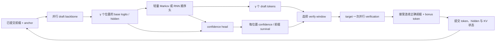
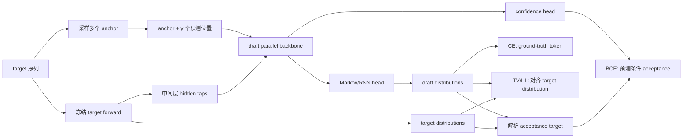
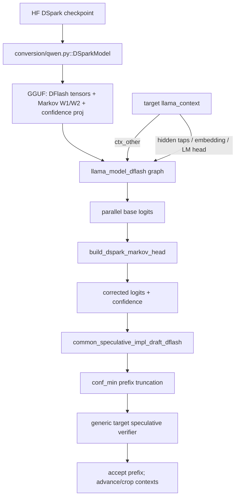
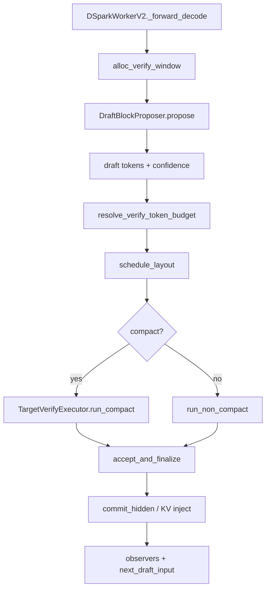
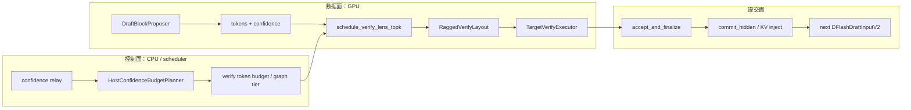
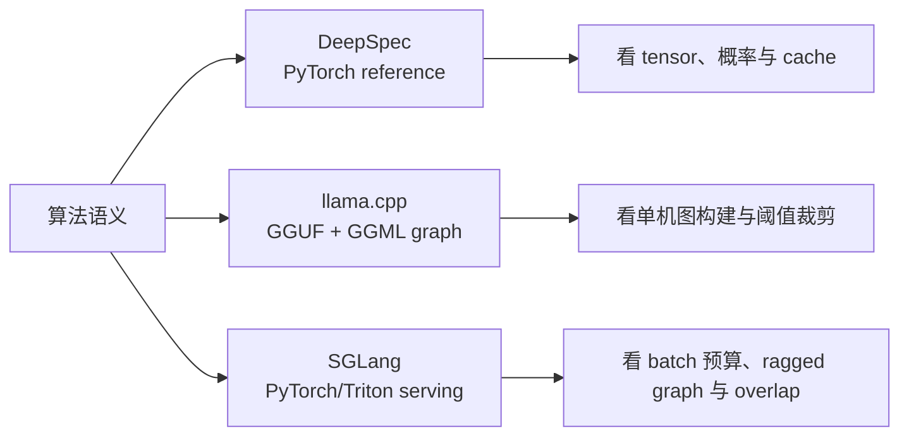

# DSpark 完整实验记录与实现导读

> 从 DeepSpec 参考实现，到 llama.cpp 单机运行时，再到 SGLang 生产级动态调度

实验日期：2026-07-17　　整理日期：2026-07-20

## 1. 这篇文档解决什么问题

本文面向已经了解投机解码基础、读过 DSpark 论文，但还没有把论文概念与开源代码完全对应起来的读者。目标不是再复述一次论文，而是回答下面几个工程问题：

1. DSpark 的“半自回归 block drafter”在代码里究竟做了什么？
2. Markov head 为什么既保留 block 并行，又能引入 token 间依赖？
3. confidence head 预测的是什么，怎样变成 verify length？
4. target verification、连续前缀接受和状态提交分别在哪里发生？
5. DeepSpec、llama.cpp、SGLang 为什么看起来差别很大，但仍是同一个 DSpark？
6. 在一台只有 Intel Arc、没有 NVIDIA CUDA 的 Windows 机器上，哪些部分能真实运行？

本文依据三类证据，后文会明确标注边界：

| 证据等级 | 含义 | 本文实例 |
|---|---|---|
| 本机实跑 | 模型或程序在本机真正执行并产生结果 | DeepSpec、llama.cpp |
| 本机源码验证 | 执行上游 CPU reference、测试或参数 guard | SGLang 56 个测试 |
| 官方外部资料 | 论文、上游 PR、官方博客提供的信息 | SGLang GPU serving 设计 |

最重要的结论先说：三套代码并不是三个互相替代的版本，而是 DSpark 的三个观察层次。

- **DeepSpec** 最适合理解算法张量和正确性语义。
- **llama.cpp** 最适合理解算法怎样压进 GGUF/GGML，并在低依赖单机环境运行。
- **SGLang** 最适合理解多请求、高并发下怎样减少无效 target verification。

官方入口：[DSpark 论文](https://arxiv.org/abs/2607.05147)、[DeepSpec](https://github.com/deepseek-ai/DeepSpec)、[llama.cpp DSpark PR](https://github.com/ggml-org/llama.cpp/pull/25173)、[SGLang DSpark PR](https://github.com/sgl-project/sglang/pull/30261)、[SGLang 集成说明](https://www.lmsys.org/blog/2026-07-06-dspark-sglang/)。

## 2. 先建立一套统一的 DSpark 执行模型

### 2.1 一轮解码的数据流

设当前已经提交的最后一个 token 为 anchor，draft block 长度为 `γ`。一轮 DSpark 大致经历：



这个流程里有两种“并行”不要混淆：

- draft backbone 对 `γ` 个位置做一次 block forward，而不是调用 `γ` 次完整小模型。
- target 对候选前缀做一次并行 forward，而不是逐 token 验证。

顺序依赖只放在很轻的 Markov/RNN head 中，因此 DSpark 被称为“半自回归”：昂贵 backbone 是 block-parallel，廉价 head 是 position-sequential。

### 2.2 Markov head：半自回归的核心

对 block 的第 `i` 个位置，draft backbone 已经给出 base logits `b_i`。以 vanilla Markov 为例：

```text
e_i       = W1[previous_token]
delta_i   = W2(e_i)
logits_i  = b_i + delta_i
token_i   = sample(logits_i)
previous_token = token_i
```

其中：

- `W1` 把上一个 token 映射到低秩空间，实验 checkpoint 的 rank 是 256。
- `W2` 把低秩向量投影成完整词表上的 bias。
- 第 0 位的 previous token 是已经提交的 anchor。
- 第 `i+1` 位使用刚生成的 `token_i`。

昂贵部分 `b_0 ... b_{γ-1}` 已经并行算完；顺序部分只剩 embedding lookup、低秩投影和采样。这解决了纯 block drafter 的典型问题：越靠后的 token 缺少显式的块内因果条件，接受率容易快速衰减。

### 2.3 confidence 与 survival probability

confidence head 对每个位置预测“该 draft token 在 target verification 中存活”的概率，记作 `c_i`。如果想验证到第 `i` 位，前面的 token 必须都被接受，因此前缀存活概率是：

```text
s_i = c_0 × c_1 × ... × c_i
```

这里区分两种工程用法：

- llama.cpp 当前 PR 使用局部阈值：遇到第一个 `c_i < conf_min` 的位置就截断。
- SGLang 使用 `s_i` 和 serving engine 的 step cost，在整个 batch 中动态分配 verify token 预算。

STS（Sequential Temperature Scaling）用于校准不同位置的 confidence。它为各位置学习温度 `T_i`：

```text
calibrated_confidence_i = sigmoid(raw_logit_i / T_i)
```

如果 confidence 没有校准，scheduler 看到的“0.8”不一定真的对应约 80% 存活概率，预算决策就会偏离真实收益。

### 2.4 target verification 与连续前缀接受

target 对 `[anchor, draft_0, ..., draft_{k-1}]` 一次 forward，得到候选位置上的 target 分布。标准投机解码必须保证输出仍服从 target 分布，因此不是简单比较 argmax：

```text
accept_probability_i = min(1, p_target(token_i) / p_draft(token_i))
```

从头开始逐位置抽样接受；第一次拒绝后，后面的 draft token 全部作废，并从 target 与 draft 的残差分布采样修正 token。如果整个候选前缀都接受，还可以提交一个 target bonus token。

所以常见指标有两个：

- `accepted draft length`：本轮真正接受的 draft token 数。
- `acceptance length`：本轮最终向前推进的 token 数，通常包含 target token/bonus token。

### 2.5 状态提交为什么不能省略

被拒绝的 draft 尾部可能已经写入临时 hidden 或 KV cache。下一轮开始前必须：

1. 只提交被接受前缀对应的 target 状态。
2. crop 或回滚 draft cache，删除未接受尾部。
3. 把新的最后 token/hidden 注入下一轮 drafter。

如果这一步错误，短输出可能看似正常，但下一轮会基于错误上下文继续生成。这也是三套实现中 `_update`、`ctx_other`、`commit_hidden` 等代码值得重点看的原因。

### 2.6 从论文 Figure 1 看完整架构，而不只是 Markov head


> 图源：Cheng 等，*DSpark: Confidence-Scheduled Speculative Decoding with Semi-Autoregressive Generation*，Figure 1，[arXiv:2607.05147v1](https://arxiv.org/abs/2607.05147v1)，[CC BY 4.0](https://creativecommons.org/licenses/by/4.0/)。这是论文示意图，不是本机实验截图。

论文 Figure 1 实际把 DSpark 分成两个相互配合、但可以独立理解的子系统：

1. **生成侧**：重型 parallel backbone 一次产生整个 block 的基础表示，轻型 sequential head 逐位置注入已经采样的前缀信息。
2. **验证侧**：confidence head 估计每个位置的条件存活概率，scheduler 按数据难度与系统负载决定 target 应验证多长的前缀。

图里的 `D` 是上一轮 target 产生并已经提交的 anchor。drafter 用它作为第一个条件，不需要重新自回归地跑完整上下文；`E/F/G/H` 是 block proposal。scheduler 删除 `H` 只是**不把它送入本轮 target verification**，不能直接把它当成“错误 token”。target 最终接受 `E/F`、拒绝 `G`，再产生修正 token `G*`；这一步才决定提交状态。

对应到三套源码：

| Figure 1 节点 | DeepSpec | llama.cpp | SGLang |
|---|---|---|---|
| target hidden / anchor | `Qwen3DSparkEvaluator._propose` | `ctx_other` + target feature extraction | `DFlashDraftInputV2` / KV injection |
| parallel backbone | `forward_dspark_draft_block` | DFlash GGML graph | `DraftBlockProposer.propose` |
| sequential head | `VanillaMarkov.sample_block_tokens` | `build_dspark_markov_head` | `run_markov_block` / folded sampler |
| confidence | `predict_confidence_step` | `conf_proj` + sigmoid | `DSparkConfidenceHead.apply_sts` |
| prefix scheduler | evaluator 的静态 threshold | `conf_min` 局部阈值 | `DSparkVerifyPlanner` + SPS table |
| target verify / commit | `verify_draft_tokens` + `_update` | 通用 verifier + 两个 context | `TargetVerifyExecutor` + `accept_and_finalize` |

这张映射表也揭示一个重要边界：**加载了 DSpark 的 Markov/Confidence 权重，不等于实现了论文全部的 hardware-aware scheduling**。DeepSpec 更偏算法 reference，llama.cpp PR 提供单请求静态截断，SGLang 才把 confidence 接入多请求运行时预算。

### 2.7 论文为什么需要半自回归：首位置容量与 suffix decay


> 图源同上，Figure 2。曲线来自论文 Qwen3-4B 离线实验，不属于本机 32-token 实验。

Figure 2 使用的是“给定前面位置已接受，本位置也被接受”的 **conditional acceptance**。它不是从 block 起点累计到当前位置的 survival probability。两者关系是：

```text
conditional acceptance: c_i = P(position i accepted | positions < i accepted)
prefix survival:        s_i = Π_{j=0..i} c_j
```

并行 drafter 可以把 latency 预算用在更深的 backbone 上，因此第一个 draft 位置可能比很浅的自回归 drafter 更强；但各位置独立预测时，越靠后的 token 越容易发生多模态组合冲突。例如上下文同时允许 `of course` 和 `no problem`，独立边际预测可能拼出 `of problem`。

DSpark 不是把整个 drafter 改回自回归，而是保留已经并行得到的 `b_0...b_{γ-1}`，只让低成本 head 做：

```text
logits_i = backbone_logits_i + transition(previous_sampled_token)
```

所以它的关键架构判断是：**让昂贵计算保持 O(1) 次 block forward，把不可避免的顺序性压缩到低秩 lookup/projection 与 sampling loop**。这也是为什么论文默认选择 Markov head：RNN 能记住更长的块内前缀，但实现、状态和部署复杂度更高，论文观察到的额外收益主要出现在更长 proposal 上。

### 2.8 串行 head 为什么没有吃掉并行收益


> 图源同上，Figure 4。右侧 latency 数据是在论文指定硬件和 batch size 128 下测得，不能外推为本机 CPU 延迟。

一轮耗时可以拆成：

```text
T_round = T_target_verify + T_parallel_backbone + γ × T_sequential_head_step
```

普通自回归 drafter 的顺序项包含多层 Transformer forward；DSpark 的顺序项只包含低秩 Markov/RNN head 与采样。只要 `γ × T_head_step` 远小于 backbone 和 target verification，增加 block 长度不会线性复制整个 drafter 成本。

源码里这个边界非常具体：

- DeepSpec 的 `_forward_backbone()` 在所有位置上运行 draft layers，`sample_block_tokens()` 才进入短循环。
- llama.cpp 的 `build_dspark_markov_head()` 先拿到 graph 中整块 base logits，然后仅对每个 block 位置添加 `W2(W1[token])`。
- SGLang 允许 sampler 被折叠进 CUDA graph；否则也只在 `sample_draft_block()` 内做 head 级递推。

因此“半自回归”不是泛泛的折中词，而是明确的计算边界：Transformer backbone 并行、output dependency 顺序。

### 2.9 训练架构：三个 loss 分别服务哪个推理阶段

论文训练时冻结 target；draft 共享并冻结 target 的 token embedding 与 LM head，只训练 parallel backbone、sequential head 和 confidence head。训练数据从长序列中采样多个 anchor，每个 anchor 形成一个长度 `γ` 的预测 block。



三个 loss 不是重复监督：

其中第三项也可直接称为 **confidence loss**。

| loss | 训练对象 | 对推理的直接作用 |
|---|---|---|
| CE | 正确下一个 token 的概率 | 保证 drafter 学会任务数据的 token prediction |
| TV/L1 distribution matching | draft 与 target 的完整分布距离 | 直接提高标准 speculative acceptance；接受概率与总变差距离相关 |
| confidence BCE | 每位置解析 acceptance rate | 给 scheduler 一个可校准的条件存活估计，不直接决定最终 token |

位置权重 `w_k = exp(-k / γ)` 强调 block 前部，因为前面一处拒绝会让后面全部失去提交机会。源码中的命名为 `l1_loss`，对应论文公式的 distribution-matching/TV 项；这里的 L1 概率距离与总变差只差常数系数，权重超参数会吸收尺度差异。

### 2.10 confidence、STS 与 scheduler 是三层，不要合并理解


> 图源同上，Figure 5、6。Figure 5 是静态阈值诊断，Figure 6 是论文 calibration 结果；两者都不是本机 SGLang full-server 测量。

这三层分别回答不同问题：

1. **confidence head**：当前位置在此前都接受的条件下，有多大概率也被接受？
2. **STS**：模型输出的数值是否能当作真实概率使用？
3. **scheduler**：在当前 batch 和硬件容量曲线下，这个概率值不值得占用一个 target verify slot？

Figure 5 说明静态阈值能提高“送去验证的 token 中最终被接受的比例”，但接受率提高不等于吞吐一定提高：阈值过高也会丢掉本来几乎免费的可接受 token。Figure 6 说明 raw confidence 有判别力但可能过度自信；scheduler 计算的是期望收益，概率绝对值偏差会系统性扭曲预算。

STS 对每个位置学习温度并按从左到右的累计 survival 校准。它保持排序关系，却修正概率尺度，所以特别适合后面的 top-survival allocation。

### 2.11 hardware-aware prefix scheduler 的目标函数

对 batch 中请求 `r` 的第 `j` 个 draft token：

```text
a[r,j] = Π_{i=1..j} c[r,i]                # prefix survival
B       = Σ_r (1 + verify_len[r])          # target 本轮物理 token batch
τ       = Σ_r (1 + Σ_{j<=verify_len[r]} a[r,j])
Θ       = τ × SPS(B)                       # 期望 output tokens / second
```

`SPS(B)` 不是模型概率，而是当前 engine 对不同 target token batch size 的实测 steps-per-second 表。scheduler 把所有可扩展前缀位置按 survival 排序，沿着这条 admission path 增加预算，选择使 `Θ` 最大的长度组合。

这里有两个常见误解：

- 不是为每个 request 独立找一个 confidence threshold；候选位置在整个 batch 中竞争有限 target capacity。
- 不是 confidence 越高就无条件多验证；如果 `SPS(B)` 在某个 batch tier 急剧下降，再高的边际接受收益也可能抵不过物理吞吐损失。

### 2.12 为什么 production 实现需要 ragged verify 与异步调度


> 图源同上，Figure 8。图中是论文生产系统数据；本机无 NVIDIA CUDA，只验证了 SGLang CPU scheduler/STS reference 与参数 guard。

Figure 8 的架构含义是：低负载时 target 还有空余 capacity，scheduler 可以给请求更长前缀；高负载时则收紧平均 verify budget，避免低 survival 尾部挤占并发请求。

动态长度马上引出三个系统问题：

1. **padding 浪费**：请求长度 `[2, 6, 3]` 若都 pad 到 6，会算 18 个位置；ragged packing 只需处理 11 个有效位置，再按 graph tier 取整。
2. **CUDA graph shape**：每轮 token 数变化会破坏固定 shape replay，因此 SGLang 把物理 token 数映射到捕获好的 tier。
3. **调度同步**：若 CPU 必须等本轮 GPU confidence 回传后再规划下一轮，decode pipeline 会产生气泡；production path 使用有滞后的 confidence relay 估计容量，再用当前真实 confidence 做 token 排序。

论文特别强调 **non-anticipating property**：是否验证位置 `j` 不能依赖未来才实例化的 candidate，否则 selection event 会泄漏未来 token 信息并产生偏差。论文算法用首次吞吐不再上升时 early stop；异步 production 设计则用历史容量估计形成因果屏障。这里“近似”的是下一步容量，不是 target acceptance 规则。

## 3. 实验环境、模型与固定版本

### 3.1 硬件

| 项目 | 实际环境 |
|---|---|
| 操作系统 | Windows 11 + WSL2 Ubuntu 22.04 |
| CPU | Intel Core Ultra 5 125H，14 核 / 18 逻辑处理器 |
| 内存 | 约 31.46 GiB |
| GPU | Intel Arc 核显 |
| NVIDIA CUDA | 无，`torch.cuda.is_available() == False` |
| 磁盘 | D 盘约 431 GiB 可用（实验开始时） |
| 环境管理 | uv；Windows 与 WSL 分别建立环境 |

### 3.2 固定源码

| 项目 | 固定 commit | 本地分支 | 实验时上游状态 |
|---|---|---|---|
| DeepSpec | `005e03b81cec38b7da6399833d609ee89a2587f2`（上游基线） | `codex/deepspec-validation` | 官方参考仓库 |
| llama.cpp | `27cc3bae61b1d00db07e8fa0f02b23c5fee30ab9` | `codex/dspark-study` | PR #25173 未合并 |
| SGLang | `dd694b43dac56355f9f9192eca47d9a899e03a93` | `codex/dspark-study` | PR #30261 已合并 |

本文解释的是这些固定 commit，不把后续主线变化倒灌进实验结论。

### 3.3 模型

| 角色 | 模型 | 关键配置 |
|---|---|---|
| target | `Qwen/Qwen3-4B` | 4B target |
| draft | `deepseek-ai/dspark_qwen3_4b_block7` | block size 7、5 层 drafter、vanilla Markov rank 256 |
| target hidden taps | Qwen3-4B 中间层 | `[1, 9, 17, 25, 33]` |

DeepSpec 使用原始 Hugging Face 权重；llama.cpp 复用同一套本地权重转换为 Q8_0 GGUF。SGLang 阶段没有加载完整模型，只执行 CPU reference 与上游测试。

## 4. 实验一：DeepSpec——先把算法张量跑通

### 4.1 为什么先从 DeepSpec 开始

DeepSpec 是最接近论文表达的 Python/PyTorch 实现。这里的目标不是验证大公司的算法“是否正确”，而是亲自执行第二层实现，观察：

```text
输入前缀 → draft block → Markov 修正 → target verify → accepted prefix → cache update
```

Python 对象和 tensor shape 都容易插桩，因此最适合作为后续 C++/serving 实现的参照系。

### 4.2 环境过程

最初尝试在 WSL 的 `/mnt/d` 建虚拟环境，遇到三个问题：

1. 双层 shell 对 `<` 版本约束的转义错误。
2. Python 3.10 与上游固定 `numpy==2.4.4` 不匹配。
3. 在 `/mnt/d` 写入 PyTorch 大量小文件非常慢。

最后改用 Windows 原生 uv：

```powershell
cd D:\proj\dspark-blog\deepspec
uv venv --clear --python 3.11 .venv-win
uv pip install --python .venv-win\Scripts\python.exe `
  -r experiments\requirements-windows.txt
```

环境安装约 62 秒。正式环境为 Python 3.11.15、PyTorch 2.9.1+cpu、Transformers 5.10.2。

### 4.3 模型下载故障

Hugging Face Xet 和普通 HTTPS 都在大权重长连接上出现停滞，但已有小分片能成功，说明不是仓库权限或格式错误。最终使用 `curl -C -` 的 HTTP Range 续传逐文件下载，并核对四个权重文件 SHA-256。

这个过程的重要经验是：下载失败和模型执行失败必须分开记录。下载器长连接不稳定，不意味着 DSpark 代码有问题。

### 4.4 预检与正式运行

8-token 预检通过后，执行正式实验：

```powershell
$env:HF_HUB_OFFLINE='1'
$env:TRANSFORMERS_OFFLINE='1'

.venv-win\Scripts\python.exe -m experiments.first_run_qwen3_4b `
  --target-model .cache\models\Qwen3-4B `
  --draft-model .cache\models\dspark_qwen3_4b_block7 `
  --max-new-tokens 32 --device cpu `
  --output results\first-run-qwen3-4b\run.json
```

prompt 是：

```text
Explain speculative decoding in one short paragraph.
```

输出：

> Speculative decoding is a technique used in natural language processing where a model generates text by making educated guesses about the next word based on partial or incomplete information, allowing

### 4.5 实验结果

| 指标 | 数值 |
|---|---:|
| 输入 token | 21 |
| 输出 token | 32 |
| 总耗时 | 23.4349 s |
| 模型加载 | 0.7682 s |
| generation | 22.6489 s |
| 观察速度 | 1.413 tok/s |
| 峰值 RSS | 10,449,645,568 bytes，约 9.732 GiB |
| verify count | 13 |
| 平均 proposal length | 7.0 |
| 平均 accepted draft length | 1.4615 |
| 平均 acceptance length | 2.4615 |

逐轮记录：

```text
proposal_lengths:
[7, 7, 7, 7, 7, 7, 7, 7, 7, 7, 7, 7, 7]

accepted_draft_lengths:
[3, 1, 1, 2, 0, 2, 0, 0, 0, 4, 2, 0, 4]

acceptance_lengths:
[4, 2, 2, 3, 1, 3, 1, 1, 1, 5, 3, 1, 5]
```

本轮 `confidence_threshold=0`，所以每轮 proposal 都保留完整 7 tokens。这里主要验证完整 DSpark 路径，而不是动态 confidence 裁剪。

### 4.5.1 DeepSpec 训练源码：论文三个 loss 怎样落地

训练入口是 `deepspec/trainer/dspark_trainer.py::Qwen3DSparkTrainer.run_batch()`。它把缓存好的 target hidden states 与训练 token 交给 `Qwen3DSparkModel.forward()`，再调用 `compute_dspark_loss()`：

```text
CacheCollator batch
  ├─ input_ids / loss_mask
  ├─ target_hidden_states          → draft backbone 的 KV injection
  └─ target_last_hidden_states     → target logits / acceptance soft label
                    ↓
Qwen3DSparkModel.forward
                    ↓ DSparkForwardOutput
compute_dspark_loss
  ├─ ce_loss
  ├─ l1_loss (论文 distribution matching / TV)
  └─ confidence_loss
```

`Qwen3DSparkModel.forward()`（`deepspec/modeling/dspark/qwen3/modeling.py:388`）先由 `sample_anchor_positions()` 从每条序列采样多个 anchor，再用 `create_noise_embed()` 和 `create_dspark_attention_mask()` 把这些 block 打包成一次训练 forward。它不是每个 anchor 单独跑一次模型，这与论文的 anchor-bounded packing 目标一致。

关键张量与职责：

| 张量 | 形状语义 | 用途 |
|---|---|---|
| `output_hidden_4d` | `[batch, anchors, γ, hidden]` | parallel backbone 输出 |
| `prev_token_ids` | `[batch, anchors, γ]` | anchor 加 teacher-forced 前一 token，供 Markov head 使用 |
| `draft_logits` | `[batch, anchors, γ, vocab]` | Markov 修正后的 draft 分布 |
| `aligned_target_logits` | 同上 | 冻结 target 的对齐分布 |
| `confidence_pred` | `[batch, anchors, γ]` | 未 sigmoid 的条件接受 logit |

源码对论文公式的对应：

- `_compute_accept_rate_3d()` 用 `1 - 0.5 * |p_draft-p_target|_1` 构造解析 acceptance target。
- `_compute_local_l1_term()` 对完整 draft/target 概率分布做 L1 matching。
- `binary_cross_entropy_with_logits(confidence_pred, accept_rate_3d)` 训练 confidence head。
- `_build_loss_weight_mask()` 生成随位置指数衰减的权重。
- `_compute_local_probabilistic_stats()` 对 acceptance 做 `cumprod`，估计 block 的期望接受长度。

`initialize_embeddings_and_head(..., freeze=True)` 会复制 target embedding 和 LM head，再令两者 `requires_grad_(False)`。这不只是节省参数：draft 与 target 使用同一 token 表示和输出投影，distribution matching 才处于同一词表概率空间。

本机实验执行的是 evaluation 路径，没有重新训练 Qwen3-4B DSpark checkpoint；上述训练部分属于**固定源码验证 + 论文映射**，不是本机训练成功声明。

### 4.6 DeepSpec 关键代码一：`Qwen3DSparkEvaluator._propose()`

位置：`deepspec/eval/dspark/evaluator.py:99`

算法位置：构造一轮 draft proposal。

输入包含当前输出 token、position、draft KV cache 和 target 中间层 hidden states。它创建长度 7 的 block：第一个位置放当前 anchor，其余位置放 mask token，然后调用 `forward_dspark_draft_block()`。

输出 `DSparkDraftProposal`，主要包含：

- target 将要验证的 anchor + draft prefix；
- 每个 draft token 的概率分布；
- 可选 confidence logits。

理解要点：`_propose()` 是 orchestration，不负责 Markov 数学本身。读代码时先看它怎样组织输入，再向下进入 draft ops。

### 4.7 DeepSpec 关键代码二：`forward_dspark_draft_block()`

位置：`deepspec/eval/dspark/draft_ops.py:22`

算法位置：一次并行 draft backbone forward。

它把 target 的五个中间层特征拼接并映射回 drafter hidden size，再让 5 层轻量 drafter 在非因果 block 结构中一次产生 7 个位置的 hidden states。

输入/输出可以概括为：

```text
target hidden taps + mask block + draft cache
    → lightweight block backbone
    → block_hidden [batch, γ, hidden]
```

容易误解之处：这里得到的是 7 个位置的 hidden，并不等于已经恢复了完整的左到右 token 依赖；顺序依赖在下一个 Markov head 阶段补入。

### 4.8 DeepSpec 关键代码三：`build_dspark_proposal()`

位置：`deepspec/eval/dspark/draft_ops.py:96`

算法位置：把并行 hidden 变成半自回归 token block。

处理顺序：

1. `lm_head` 把 7 个 hidden 并行变成 base logits。
2. `sample_draft_tokens()` 调用 Markov head 顺序修正与采样。
3. 生成 corrected logits 和 draft probabilities。
4. confidence head 存在时计算 confidence。
5. threshold 大于 0 时只保留 confident prefix。

它是“parallel backbone”和“sequential head”的结合点。

### 4.9 DeepSpec 关键代码四：`VanillaMarkov.sample_block_tokens()`

位置：`deepspec/modeling/dspark/markov_head.py:55`

算法位置：恢复块内相邻 token 依赖。

本 checkpoint 使用 vanilla、rank 256。对第 `i` 位：

```text
low_rank = markov_w1(previous_token)
bias     = markov_w2(low_rank)
logits_i = base_logits_i + bias
token_i  = sample(logits_i)
```

输出为 `sampled_tokens [1, 7]` 与 `corrected_logits [1, 7, vocab]`。后者不能丢，因为 target 的 lossless speculative acceptance 需要 draft probability。

### 4.10 DeepSpec 关键代码五：`verify_draft_tokens()`

位置：`deepspec/eval/base_evaluator.py:186`

算法位置：target verification。

target 一次 forward 得到整个候选块的 target probability，代码逐位置计算标准 speculative acceptance；拒绝时从残差分布取修正 token，全接受时取 bonus token。

理解要点：DSpark 改进的是候选怎么产生、验证多少；输出保持 target 分布依赖的仍是这里的 acceptance/rejection 规则。

### 4.11 DeepSpec 关键代码六：`Qwen3DSparkEvaluator._update()`

位置：`deepspec/eval/dspark/evaluator.py:134`

算法位置：提交本轮状态并准备下一轮。

它根据真正接受长度 crop draft KV cache，丢弃未接受尾部，再把 target 新 hidden state 送回 drafter。这个函数把“本轮验证结果”变成“下一轮合法上下文”。

### 4.12 DeepSpec 端到端调用链与状态副作用

把六个关键函数连起来，reference evaluator 的真实控制流是：

```mermaid
sequenceDiagram
    participant Loop as generate_decoding_sample
    participant Eval as Qwen3DSparkEvaluator
    participant Draft as draft_ops / DSpark model
    participant Target as target model
    Loop->>Eval: _propose(output_ids, caches, target_hidden)
    Eval->>Draft: forward_dspark_draft_block(anchor + masks)
    Draft-->>Eval: block_hidden
    Eval->>Draft: build_dspark_proposal
    Draft-->>Eval: tokens + corrected draft probs + confidence
    Loop->>Target: one forward over scheduled proposal
    Target-->>Loop: target probs + hidden + temporary KV
    Loop->>Loop: verify_draft_tokens
    Loop->>Eval: _update(accepted length, target hidden)
    Eval-->>Loop: cropped draft cache + next injected feature
```

| 函数边界 | 主要输入 | 主要输出 | 状态副作用 |
|---|---|---|---|
| `_propose` | 已提交 token、draft cache、target hidden taps | `DSparkDraftProposal` | draft cache 前推到 proposal 尾部，仍属暂态 |
| `forward_dspark_draft_block` | anchor/mask block、position、injected target features | block hidden | 写入本轮 draft KV |
| `build_dspark_proposal` | block hidden、anchor | token、corrected logits/probs、confidence | Markov 链在 block 内更新 `prev_token`，不提交全局上下文 |
| `verify_draft_tokens` | draft/target probability、随机数 | accepted prefix、修正/bonus token | 决定逻辑提交长度，不直接修正 draft cache |
| `_update` | verification result、target hidden | 下一轮 feature/cache | crop 未接受 draft KV，建立下轮合法状态 |

这里最值得学习的边界是：proposal 对象同时保留 token 和 **corrected draft distribution**。如果只保存 token，target 可以做 greedy equality，却无法执行保持 target distribution 的 rejection sampling。

## 5. 实验二：llama.cpp——把 DSpark 压进 GGML graph

### 5.1 研究对象

实验固定 `ggml-org/llama.cpp#25173` 的 commit：

```text
27cc3bae61b1d00db07e8fa0f02b23c5fee30ab9
```

该 PR 相对基线只改 15 个文件、约 300 行，核心集中在：

- `conversion/qwen.py`
- `src/models/dflash.cpp`
- `common/speculative.cpp`
- `common/arg.cpp`

这比 SGLang 的生产集成小很多，适合观察 DSpark 最小运行时映射。

### 5.2 GGUF 转换

复用 DeepSpec 已下载的权重，target 和 draft 都转为 Q8_0：

```powershell
cd D:\proj\dspark-blog\llama.cpp

& D:\proj\dspark-blog\deepspec\.venv-win\Scripts\python.exe `
  .\convert_hf_to_gguf.py `
  D:\proj\dspark-blog\deepspec\.cache\models\Qwen3-4B `
  --outtype q8_0 `
  --outfile D:\proj\dspark-blog\research\artifacts\Qwen3-4B-Q8_0.gguf

& D:\proj\dspark-blog\deepspec\.venv-win\Scripts\python.exe `
  .\convert_hf_to_gguf.py `
  D:\proj\dspark-blog\deepspec\.cache\models\dspark_qwen3_4b_block7 `
  --target-model-dir D:\proj\dspark-blog\deepspec\.cache\models\Qwen3-4B `
  --outtype q8_0 `
  --outfile D:\proj\dspark-blog\research\artifacts\Qwen3-4B-DSpark-Q8_0.gguf
```

| GGUF | 字节数 | SHA-256 |
|---|---:|---|
| target | 4,280,405,280 | `5A03875A...278D00` |
| draft | 659,703,200 | `BC48A1C3...17EED3` |

`--target-model-dir` 很重要：DeepSpec draft checkpoint 依赖 target 的 tokenizer、token embedding 和 lm-head 语义，不是一个独立聊天模型。

### 5.3 构建过程

最初直接在 `/mnt/d` 全量 Ninja 构建，多次触发 2–4 分钟外层 timeout，但构建状态持续前进，说明不是编译错误，而是 WSL 跨 NTFS 小文件 I/O 慢。

最后保留 D 盘源码作为受控副本，在 WSL 原生 `/tmp/llama-dspark-27cc3bae` 构建同一 commit：

```bash
cmake -S . -B build -G Ninja \
  -DGGML_NATIVE=ON -DGGML_OPENMP=ON \
  -DLLAMA_CURL=OFF \
  -DLLAMA_BUILD_TESTS=OFF \
  -DLLAMA_BUILD_EXAMPLES=OFF \
  -DLLAMA_BUILD_SERVER=ON

ninja -C build llama-server
```

原生 WSL 构建 server 约 151 秒。

### 5.4 第一次失败：为什么 `llama-speculative` 不工作

最初误用旧示例程序，稳定出现：

```text
dflash requires ctx_other to be set
Command terminated by signal 11
```

峰值 RSS 约 10.3 GiB、无 swap，因此不是内存不足。沿错误反向追踪：

1. DFlash/DSpark 模型需要访问 target context。
2. 旧示例分别调用两次普通 `common_init_from_params()`。
3. draft context 没有得到 `ctx_other`。
4. PR 文档实际指定的是 `llama-server`。
5. server 走 `common_speculative_init_from_params()`，其中设置 `cparams.ctx_other = ctx_tgt`。

换成 server 后，同一模型正常生成。这个失败非常有学习价值：**有 DSpark 类型和权重支持，不代表所有旧 speculative frontend 都自动支持新的上下文依赖。**

### 5.5 正确运行

完整启动和请求已封装为：

```powershell
wsl -d Ubuntu-22.04 -- `
  bash /mnt/d/proj/dspark-blog/research/scripts/run_llamacpp_dspark_wsl.sh

wsl -d Ubuntu-22.04 -- bash -lc `
  'CONF_MIN=0.5 RUN_LABEL=conf05 bash /mnt/d/proj/dspark-blog/research/scripts/run_llamacpp_dspark_wsl.sh'
```

固定 prompt `Speculative decoding is`、greedy、seed 42、32 output tokens。两次文本完全相同：

> a technique used in neural machine translation (NMT) to improve the quality of the generated translations by considering the potential future words in the target sequence. This approach

| `conf_min` | generation | 速度 | draft 生成/接受 | 接受率 | mean len |
|---:|---:|---:|---:|---:|---:|
| 0.0 | 4436.20 ms | 7.21 tok/s | 86 / 18 | 20.93% | 2.38 |
| 0.5 | 3440.71 ms | 9.30 tok/s | 25 / 17 | 68.00% | 2.42 |

`conf_min=0.5` 少生成了 61 个低置信 draft，却只少接受 1 个。它证明 confidence 截断路径实际生效；但单 prompt 结果不能推出普遍 28.9% 加速。

### 5.6 llama.cpp 关键代码一：DSpark GGUF tensor

位置：

- `conversion/qwen.py:679`
- `src/llama-arch.cpp:606`
- `src/llama-model.h:603`
- `src/models/dflash.cpp:39`

`DSparkModel` 继承 DFlash 转换逻辑，再加入 Markov W1/W2 与 confidence projection。运行时只要发现 `markov_w1.weight`，就把该 DFlash draft 识别为带 DSpark head 的模型。

这体现了 llama.cpp 的实现策略：不创建庞大的新模型架构，而是在现有 DFlash 模型上挂可选 tensor 和 graph 分支。

### 5.7 llama.cpp 关键代码二：`build_dspark_markov_head()`

位置：`src/models/dflash.cpp:125`

这是整个 PR 最关键的函数。它把 DeepSpec 的 Python 顺序循环编成 GGML graph：

1. 读取 DFlash 已生成的 `base logits [vocab, tokens]`。
2. 从 GGUF metadata 读取训练 block size。
3. 对每个 block 取 anchor token 作为 `prev`。
4. 每个位置执行 `W1[prev] → W2 → vocab bias → base + bias`。
5. 图内对修正 logits 做 argmax，作为下一位置的 `prev`。
6. confidence head 存在时，对 `[position hidden; W1(prev)]` 投影并 sigmoid。
7. 把 position-major 结果重新排列成运行时需要的 block-major 布局。

与 DeepSpec 的一个语义差异是：当前 PR 的图内 conditioning chain 固定使用 greedy argmax；外部 sampling 只影响最后读取 proposal 时的 token pick。源码中也保留了对应限制说明。

### 5.8 llama.cpp 关键代码三：proposal 与 confidence 截断

位置：`common/speculative.cpp:904`、`:1172`

`common_speculative_impl_draft_dflash` 同时服务 DFlash 和 DSpark。DSpark 分支：

```text
构造 anchor + mask block
    → llama_decode(ctx_dft, entire_block)
    → 从位置 0 读取 DSpark proposal
    → 若 confidence < conf_min 则停止
    → 把保留 token 交给通用 target verifier
```

为什么 DSpark 从位置 0 读，而普通 DFlash 常从位置 1 读？这里的 DSpark graph 已把 anchor 作为 conditioning 输入，并从第一个预测位置输出 next-token proposal；两者的 block layout 约定不同。

### 5.9 llama.cpp 关键代码四：`ctx_other`

位置：`common/speculative.cpp:2319`

```text
draft context params.ctx_other = target context
```

这条连接让 DFlash/DSpark graph 能访问 target 的 embedding、lm-head 和共享状态语义。它看起来只是一行初始化，却决定 draft 模型能否构图，也解释了旧示例失败、server 成功的根因。

### 5.10 llama.cpp 的双上下文架构：共享权重不等于共享 KV

完整链路可以分成“模型转换”“图构建”“运行时编排”三层：



`llama_model_dflash::graph` 有两个 batch 模式：

- `ubatch.embd` 路径接收 target 的融合 hidden features，把投影后的 K/V 注入 draft 自己的 cache。
- token batch 路径对 `anchor + masks` 做非因果 block attention，产生 base logits，再接 DSpark Markov/Confidence head。

draft GGUF 可以不重复存 embedding 与 output projection。图构建时若 `model.tok_embd` 或 `model.output` 为空，就通过 `cparams.ctx_other` 取 target model 的 tensor。这里共享的是**只读模型权重和跨模型访问入口**；target context 与 draft context 仍各自拥有推理 memory/KV，不能把 `ctx_other` 理解成“两个模型共用一份 KV cache”。

| 对象 | 所有者 | 生命周期 / 作用 |
|---|---|---|
| target weights、embedding、LM head | target model | draft graph 通过 `ctx_other` 只读访问 |
| target KV | target context | target verification 和已提交前缀 |
| injected feature KV | draft context | DFlash/DSpark backbone 条件信息 |
| mask-block draft KV | draft context | proposal 暂态，接受后按通用 speculative 路径对齐 |
| `t_logits` | 当前 GGML graph | 先是 base logits，后被 Markov-corrected logits 替换 |
| `t_h_nextn` | 当前 GGML graph | 复用 nextn 输出通道传递 confidence |

这也解释了旧 `llama-speculative` frontend 的崩溃：它分别创建两个普通 context，却没有建立跨 context 的依赖边。修复点不是“给指针判空”，而是必须从初始化层创建正确的 target→draft 架构连接。

### 5.11 `conf_min` 为什么只是论文调度器的一个局部切片

`common/speculative.cpp` 对每条 sequence 从位置 0 顺序读取 confidence，遇到第一个低于 `conf_min` 的位置就停止。它满足“只保留连续前缀”，也能避免明显低价值的 target verification；但没有：

- 把 `c_i` 累乘成跨位置 survival 后在 batch 中排序；
- 读取本机不同 target token batch size 的 SPS 曲线；
- 在多个请求之间分配统一 verify budget；
- 根据当前系统负载改变预算。

所以本机 `conf_min=0.5` 实验验证的是 **confidence-aware prefix truncation**，不是论文完整的 **hardware-aware prefix scheduling**。这个区别是理解 llama.cpp 与 SGLang 实现范围的关键。

## 6. 实验三：SGLang——从单请求阈值走向生产调度

### 6.1 为什么 SGLang 实现大得多

实验固定已合并 PR `sgl-project/sglang#30261` 的头 commit：

```text
dd694b43dac56355f9f9192eca47d9a899e03a93
```

PR 涉及 84 个文件、约 17,700 行新增。原因不是 Markov head 更复杂，而是 production serving 还要解决：

- 同 batch 不同请求使用不同 verify length；
- 变长 verification 怎样进入 CUDA graph；
- scheduler 怎样知道多验证一个 token 值不值；
- overlap 模式怎样避免 CPU 调度气泡；
- 裁剪后怎样观察本来可能接受的尾部。

### 6.2 本机硬件边界

SGLang 的 DSpark 参数 hook 明确要求 CUDA。实际执行固定 commit 的 `_handle_dspark(device="cpu")` 得到：

```text
ValueError: DSpark speculative decoding only supports CUDA device.
```

因此没有伪造完整 server 或 GPU 吞吐。本机实验目标改为：执行与调度算法相关的真实 CPU reference 和上游测试。

### 6.3 最小测试环境

Windows 原生导入 SGLang 时首先缺少 POSIX `resource`，说明它不是 Windows 原生服务路径。WSL 环境已有 torch 2.9.1+cpu，再用 WSL uv 安装 `msgspec`。

SGLang 顶层包会加载大量 CUDA/server 依赖，而被测 SPS、STS 和 planner 本身不需要这些依赖。因此 `scripts/run_sglang_cpu_test.py`：

1. 绕过 `sglang/__init__.py` 的公共服务入口。
2. 为未参与计算的服务期类型提供 import contract。
3. 直接运行上游测试文件、测试函数和断言。
4. 保留 DSpark CPU reference、成本表、STS、planner 原码不变。

### 6.4 测试结果

| 上游测试 | 直接覆盖 | 结果 |
|---|---|---:|
| `test_dspark_sps_table.py` | SPS/加性成本表、JSON、边界查表 | 21/21 |
| `test_dspark_scheduler.py` | survival、预算、per-request verify length、ragged layout | 25/25 |
| `test_dspark_sts.py` | confidence head、STS、数据 shard | 10/10 |
| 合计 | DSpark CPU 算法路径 | 56/56 |

这证明固定版本中的纯 CPU 调度与校准逻辑可执行，不等价于 CUDA kernel 或完整 serving 已在本机验证。

### 6.5 SGLang 一轮 decode 的真实主干

入口：`python/sglang/srt/speculative/dspark_components/dspark_worker_v2.py:493`



读 SGLang 时先顺着这条主干走，不要一开始钻进 Triton kernel。每个子模块解决的问题会清楚很多。

### 6.6 SGLang 关键代码一：`_handle_dspark()`

位置：`python/sglang/srt/arg_groups/speculative_hook.py:276`

它负责把用户配置变成合法 DSpark runtime config：

- 验证 CUDA device。
- 检查 PP、DP attention 与 draft checkpoint 条件。
- 强制 `speculative_num_steps=1`、top-k=1，因为 DSpark 的自然单位是一个 block forward。
- 解析 `gamma`。
- 设置 `speculative_num_draft_tokens = gamma + 1`，其中多出来的 1 是 anchor/verify window 约定。

这部分值得先读，因为很多后续 tensor shape 都来自这里的统一约束。

### 6.7 SGLang 关键代码二：Markov 与 confidence head

位置：`python/sglang/srt/models/dspark.py`

- `run_markov_block():32` 对每个位置调用 head 修正 base logits，并把刚采样 token 作为下一位置条件。
- `DSparkConfidenceHead:287` 从 draft hidden/Markov 特征生成 confidence raw logits。
- `apply_sts():326` 按位置温度做校准，再 sigmoid。

这部分与 DeepSpec 最接近，可以用来做跨实现对照：先理解这里，再看 llama.cpp 如何把相同逻辑构成 GGML graph。

### 6.8 SGLang 关键代码三：`DraftBlockProposer.propose()`

位置：`dspark_components/dspark_draft.py:244`

它负责：

1. 根据 running batch 和上一轮 bonus token 准备 draft 输入。
2. 运行 draft block forward。
3. 通过 DSpark sampler 产生 token block。
4. 返回 draft hidden、draft tokens、confidence tap 和 folded 状态。

`DraftProposal` 是 drafter 与 planner/target verifier 的边界。后续调度只需要 proposal 与 confidence，不应重新理解模型内部细节。

### 6.9 SGLang 关键代码四：动态 verify budget

位置：

- `dspark_planner.py:361::resolve_verify_token_budget()`
- `dspark_planner.py:1019::HostConfidenceBudgetPlanner.compute_budget()`
- `dspark_sps.py:14::SpsCostTable`
- `kernels/dspark_schedule.py:49::compute_sort_survival()`

先对 confidence 做前缀乘积，得到每个候选位置的 survival probability。然后成本表提供不同总 verify token 数下的 steps per second。planner 比较不同预算：

```text
预期每步提交 token 数 × 该预算下的 steps per second
```

选择使预期吞吐最大的预算，再把额外 token 优先分给 survival probability 高的位置。

这解释了 DSpark 的“confidence-scheduled”不是固定阈值：

- batch 很小时，多验证几个 token 的 target 边际成本可能很低。
- 并发很高时，过长 verify window 会挤占 batch capacity。
- 同一 batch 中，容易预测的请求应该拿到更长 window。

### 6.10 SGLang 关键代码五：`RaggedVerifyLayout`

位置：`python/sglang/srt/speculative/ragged_verify.py:46`

假设同一 batch 三个请求的 verify length 是 `[2, 6, 3]`。固定宽度实现会按 6 padding，计算 18 个位置；ragged layout 只前端打包 11 个有效位置，再按捕获好的 graph tier 向上取整。

```text
request 0: [a x]
request 1: [a x x x x x]
request 2: [a x x]

packed: [a x | a x x x x x | a x x]
```

因此被 confidence 裁掉的尾部真正不进入 target attention/MLP，而不是仍计算后再 mask。CUDA graph 的 key 也从单纯 batch size 扩展到总 verify token tier。

### 6.11 SGLang 关键代码六：verify、accept 与 commit

位置：`dspark_components/dspark_verify.py`

- `TargetVerifyExecutor.run_compact():352` 按 ragged layout 执行 target verification。
- `accept_and_finalize():86` 计算连续正确长度、bonus、输出 token 和 commit length。
- `commit_hidden():282` 只提交合法 hidden/KV，处理 compact 与非 compact 布局差异。
- `DsparkVerifyEpilogue` 可把 scatter、accept、commit 融入 CUDA graph，减少 host 往返。

这里对应 DeepSpec 的 `verify_draft_tokens + _update`，但多了 batch、图捕获和异步执行维度。

### 6.12 overlap confidence relay

SGLang 的 overlap scheduler 让 CPU 在当前 GPU forward 期间准备后续调度。DSpark confidence 通过异步通道延迟传递，planner 使用前序 step 的 confidence 进行预算，避免每轮等待 device-to-host 同步。

这是一项 serving 工程折中：调度信息可能有时间滞后，但换来 decode loop 更少的 CPU/GPU 气泡。它不是 DSpark 数学定义的必要部分，却决定生产实现能否把理论收益转成 wall-clock 收益。

### 6.13 SGLang 的控制面、数据面与提交面

把 SGLang DSpark 仅看成“大量 kernel”很难读懂。更有效的划分是三层：



`DSparkWorkerV2.forward_batch_generation()` 是公共入口，decode batch 进入 `_forward_decode()`。这一轮的关键对象流是：

| 对象 | 生产者 | 消费者 | 为什么要独立存在 |
|---|---|---|---|
| `DraftProposal` | `DraftBlockProposer.propose` | planner、verifier | 隔离模型 forward 与调度逻辑 |
| calibrated `confidence` | folded sampler 或 `compute_confidence_tensor` | budget planner、layout scheduler | 同时服务全局预算与 per-request 长度 |
| `VerifyBudgetDecision` | `HostConfidenceBudgetPlanner` | `_forward_decode` | 把历史 relay、SPS curve 和本轮 batch 绑定 |
| `RaggedVerifyLayout` | `schedule_layout` | compact verifier、commit | 保存 packed index、每请求长度和 cache location 映射 |
| accept result | `accept_and_finalize` | scheduler、KV inject、observer | 区分输出 token、commit length、自然停止等状态 |

### 6.14 从 confidence 到物理 target batch 的完整路径

1. `models/dspark.py::apply_sts()` 把 raw confidence logit 除以每位置温度，再 sigmoid。
2. `kernels/dspark_schedule.py::compute_sort_survival()` 对位置做 `cumprod`，得到 prefix survival。
3. `HostConfidenceBudgetPlanner.compute_budget()` 使用 relay confidence、request generation 防陈旧校验和 SPS cost table，决定总额外 token budget。
4. `DSparkVerifyPlanner.schedule_layout()` 把总预算转换成每请求 verify length。
5. `RaggedVerifyLayout` 把逻辑二维 `[request, position]` 映射成物理 packed token 序列和 cache loc。
6. `TargetVerifyExecutor.run_compact()` 只让被选中的 token 进入 target forward。
7. `accept_and_finalize()` 仍按标准 lossless acceptance 计算提交前缀；scheduler 没有权力越过拒绝点。

当 SPS table 未初始化且为 flat table 时，源码会明确警告 budget 退化为 verify-all。这说明“启用 compact mode”本身不自动带来动态收益：必须先用目标硬件 profile 得到有意义的成本曲线。

### 6.15 overlap 中的陈旧信息怎样不破坏 token 正确性

overlap 模式下 `prepare_verify_budget()` 从 `FutureMap` 解析前序 confidence。`req_generation` 用来检查 relay 数据是否仍属于同一个 request generation，避免 request slot 被复用后把旧 confidence 套到新请求。

需要区分两类信息：

- **容量信息**可以滞后：历史 confidence 用于估计下一步总预算/graph tier，错误只影响本轮算多算少。
- **本轮 token 排序与 acceptance**不能伪造：当前 proposal 的真实 calibrated confidence 决定哪些位置优先，target distribution 最终决定接受结果。

因此 overlap 是性能近似而不是输出分布近似。真正保证输出正确性的仍是连续前缀约束、request generation 防陈旧检查和 target verifier。

## 7. 三套实现怎样一一对应



| 算法阶段 | DeepSpec | llama.cpp | SGLang |
|---|---|---|---|
| block backbone | `forward_dspark_draft_block` | DFlash graph | `DraftBlockProposer` / draft model |
| Markov 顺序头 | `VanillaMarkov.sample_block_tokens` | `build_dspark_markov_head` | `run_markov_block` |
| confidence | proposal builder | `conf_proj` + sigmoid | `DSparkConfidenceHead` + STS |
| verify 长度 | 固定 threshold，实验为 0 | `conf_min` 首个低置信截断 | survival + SPS 动态预算 |
| target verify | `verify_draft_tokens` | 通用 speculative verifier | `TargetVerifyExecutor` |
| 状态提交 | `_update` / crop cache | llama context/KV 路径 | `commit_hidden` + KV inject |
| 调度粒度 | 单样本参考循环 | 单机 sequence | 多请求 batch、每请求变长 |

### 7.1 关键状态由谁拥有

| 状态 / 张量 | 产生阶段 | 谁必须保留 | 何时失效或提交 |
|---|---|---|---|
| anchor token | 上一轮 target commit | decode loop / request state | 生成新修正或 bonus token 后被替换 |
| target hidden taps | target forward | drafter 输入桥接层 | 注入当前 draft cache 后可释放暂态副本 |
| base logits | parallel draft backbone | 当前 proposal/graph | Markov 修正后不再用于最终 acceptance |
| Markov feature/state | sequential head | block 内局部状态 | block 结束即失效；RNN variant 也不跨 block 继承 |
| corrected draft logits/probs | sequential head | verifier | 本轮 acceptance 完成后失效 |
| conditional confidence | confidence head + STS | planner / proposal | 用于本轮排序，overlap 时可 relay 到容量规划 |
| prefix survival | scheduler | budget/layout builder | 当前 batch 的 request 集合或 generation 改变即失效 |
| ragged layout | SGLang planner | target verifier + commit | 本轮 packed forward 完成后失效 |
| target temporary KV/hidden | target verification | target context / verify executor | 只提交 accepted prefix 与修正/bonus 对应部分 |
| draft temporary KV | draft forward | draft context | 接受后 crop/重建，拒绝尾部必须丢弃 |
| accepted prefix / bonus | target verifier | request output state | 立即成为下一轮 committed prefix |

这张表的核心是区分三种生命周期：**模型权重长期存在、request cache 跨轮存在、proposal/layout 仅本轮存在**。很多移植错误都来自把本轮暂态当成已提交状态，或让 request slot 复用后继续消费旧 confidence。

### 7.2 共同不变量

不管实现怎样变化，下面几个不变量必须成立：

1. draft token 最终必须经 target verification。
2. 只提交从头连续接受的前缀。
3. 拒绝后的尾部状态必须清除。
4. Markov head 使用前一 token 恢复块内依赖。
5. confidence 只决定计算多少，不能改变 lossless acceptance 语义。

### 7.3 论文机制与开源实现覆盖矩阵

符号说明：✅ 有直接源码；△ 有局部实现、工具或静态近似；— 固定版本未见对应实现；“本机”列只表示本次真实执行范围。

| DSpark 论文机制 | DeepSpec | llama.cpp PR #25173 | SGLang PR #30261 | 本次验证边界 |
|---|---|---|---|---|
| block/anchor 训练 | ✅ `Qwen3DSparkModel.forward` | — | — serving runtime | 只读源码，未重训 |
| CE + distribution matching + confidence loss | ✅ `compute_dspark_loss` | — | — | 只读源码，未重训 |
| parallel DFlash backbone / KV injection | ✅ | ✅ | ✅ | DeepSpec、llama.cpp CPU 实跑；SGLang 未跑 CUDA |
| vanilla/gated Markov head | ✅ | ✅ vanilla | ✅ | 三者均读源码；前两者真实 generation |
| RNN head | ✅ | — | ✅ | 未用 RNN checkpoint 实跑 |
| confidence head | ✅ | ✅ optional | ✅ required for dynamic mode | DeepSpec/llama 路径实跑；SGLang CPU 单测 |
| STS runtime calibration | △ confidence 统计，无固定 evaluator runtime STS | — | ✅ calibration JSON + per-position temperatures | SGLang 10/10 CPU tests |
| 静态 confidence prefix cut | ✅ threshold | ✅ `conf_min` | static/cap modes | llama `0/0.5` A/B 实跑 |
| hardware-aware SPS scheduler | — | — | ✅ | SGLang scheduler/SPS 46/46 CPU tests |
| ragged target verification | — | — | ✅ compact layout/kernel | layout/reference 测试；CUDA forward 未跑 |
| CUDA graph tier / fused commit | — | GGML backend graph，不是同一机制 | ✅ | 未在本机验证 GPU |
| overlap confidence relay | — | — | ✅ | 源码验证，未跑 full server |

矩阵里的“—”不是项目缺陷，而是定位不同。例如 llama.cpp PR 的目标是把 DSpark drafter 放进轻量单机 runtime，不承担论文生产 scheduler 的全部职责。

### 7.4 八个架构问题的集中回答

#### 问题一：为什么 sequential head 不会退化成普通自回归 drafter？

因为顺序循环不再运行 Transformer backbone，只在已经并行产生的每位置 base logits/hidden 上执行低秩 transition 与 sampling。DeepSpec 的 `_forward_backbone()` 和 `VanillaMarkov.sample_block_tokens()`、llama.cpp 的 DFlash graph 和 `build_dspark_markov_head()` 清楚地分开了这两个成本域。

#### 问题二：Markov 低秩矩阵具体做了什么？

`W1[prev_token]` 是一个 rank 维 token embedding；`W2` 把它投影回 vocab 维 bias。加到 `base_logits_i` 后采样的新 token 又成为下一位置索引。低秩分解避免保存完整 `vocab × vocab` transition matrix，代价约为两张 `vocab × rank` 权重。

#### 问题三：conditional confidence 与 prefix survival 为什么不能混用？

`c_i` 假设此前位置已经接受，只描述当前位置；target 能到达位置 `i` 的概率是 `s_i=Πc_j`。llama.cpp 的 `conf_min` 直接看局部 `c_i`，SGLang `compute_sort_survival()` 才构造面向全局预算的累计收益。

#### 问题四：STS 为什么不仅是分类准确率问题？

scheduler 比较的是 `expected accepts × SPS(B)`，需要 confidence 的绝对概率尺度。只要排序正确但整体过度自信，top-k 顺序可能不变，最优总 budget 却会被系统性高估。SGLang `apply_sts()` 在 `cumprod` 前校准每位置 logit，正是为了修复这个输入。

#### 问题五：为什么只能提交连续前缀，为什么不能回看未来再选？

第一个拒绝位置之后的 draft token 条件上下文已经不成立；跳过拒绝点接受后位会改变目标分布。更隐蔽的问题是，若 admission decision 使用了未来 candidate 才能计算的信息，选择事件本身就依赖未来随机量。论文 early stop 和 production 的历史容量屏障都在维护 non-anticipating property，最终 verifier 仍严格从左到右接受。

#### 问题六：动态 verify length 为什么成为系统架构问题？

它使每请求 query 长度不同，固定宽度会 padding 浪费，固定 CUDA graph shape 又无法直接 replay。SGLang 用 `RaggedVerifyLayout` 做逻辑到物理 packed 映射，再把总 token 数映射到 graph tier；这是论文 scheduler 真正节省 target compute 的执行条件。

#### 问题七：target/draft 到底共享什么？

训练语义上共享并冻结 embedding 与 LM head；运行时还要把 target hidden taps 注入 drafter。它们不共享全部 request KV。DeepSpec 用两个 cache 对象和 `_update` 对齐；llama.cpp 用 `ctx_other` 访问 target 权重/上下文接口，同时保留 target、draft 两份 memory；SGLang 则显式管理 target cache loc、draft KV injection 和 commit layout。

#### 问题八：三个训练 loss 怎样影响推理？

CE 提升正确 token 预测，distribution matching 直接缩小 draft/target 概率差并提高 rejection-sampling acceptance，confidence BCE 学习调度信号。confidence 不参与最终 token 的“裁判”，因此即使它估计不准，正确 verifier 仍保持 target distribution，只是速度可能变差。

### 7.5 不能直接比较的指标

DeepSpec 1.41 tok/s 与 llama.cpp 7–9 tok/s 不能直接解释成“llama.cpp 框架快 5 倍”，因为：

- DeepSpec 使用原始权重，llama.cpp 使用 Q8_0。
- prompt、seed 和采样路径不同。
- PyTorch 与 GGML 内核不同。
- 计时范围不同。
- confidence 设置不同。

本文的速度数字用于说明“本机能跑到什么程度”，不是严格 framework benchmark。

## 8. 失败记录与排查方法

### 8.1 环境安装慢，不等于模型慢

DeepSpec 和 llama.cpp 都暴露了 `/mnt/d` 的跨文件系统 I/O 问题。判断依据不是“等了很久”，而是：

- 编译进度持续增长；
- 没有 compiler error；
- 移到 WSL 原生文件系统后同 commit 成功。

### 8.2 模型下载失败，不等于 checkpoint 错误

先检查小文件、HTTP status、已有分片和 hash，再判断是权限、格式还是长连接问题。本实验用 Range 续传解决，模型 hash 最终一致。

### 8.3 内存错误与上下文错误要用证据区分

`llama-speculative` 失败时峰值 RSS 只有约 10.3 GiB，系统仍有余量；错误又明确指向 `ctx_other`。继续改量化或 swap 都是错误方向，应该沿上下文初始化调用链回溯。

### 8.4 硬件不支持时不要伪造“跑通”

SGLang 代码直接拒绝 CPU DSpark server。正确做法是：

- 执行能真实运行的 CPU reference/tests；
- 记录 guard 原文；
- 把 CUDA kernel 与吞吐列入未验证边界；
- 使用官方数据时明确标注来源。

## 9. 针对这台机器的最快复现路径

### 9.1 想观察完整算法 tensor：DeepSpec

模型已缓存时：

```powershell
cd D:\proj\dspark-blog\deepspec
$env:HF_HUB_OFFLINE='1'
$env:TRANSFORMERS_OFFLINE='1'

.venv-win\Scripts\python.exe -m experiments.first_run_qwen3_4b `
  --target-model .cache\models\Qwen3-4B `
  --draft-model .cache\models\dspark_qwen3_4b_block7 `
  --max-new-tokens 32 --device cpu `
  --output results\first-run-qwen3-4b\run.json
```

预计峰值内存约 10 GiB、generation 约 23 秒。适合插入 tensor dump 或修改 confidence 规则。

### 9.2 想最快看到 token：llama.cpp

```powershell
cd D:\proj\dspark-blog\research
wsl -d Ubuntu-22.04 -- `
  bash /mnt/d/proj/dspark-blog/research/scripts/run_llamacpp_dspark_wsl.sh
```

target + draft GGUF 共约 4.6 GiB。模型启动约 44–49 秒，启动后的短生成约 7–9 tok/s。编译应放 WSL 原生文件系统，不要放 `/mnt/d`。

### 9.3 想学习生产 scheduler：SGLang CPU 测试

```powershell
cd D:\proj\dspark-blog

wsl -d Ubuntu-22.04 -- bash -lc `
  '/mnt/d/proj/dspark-blog/deepspec/.venv/bin/python research/scripts/run_sglang_cpu_test.py test/registered/spec/dspark/test_dspark_sps_table.py'

wsl -d Ubuntu-22.04 -- bash -lc `
  '/mnt/d/proj/dspark-blog/deepspec/.venv/bin/python research/scripts/run_sglang_cpu_test.py test/registered/spec/dspark/test_dspark_scheduler.py'

wsl -d Ubuntu-22.04 -- bash -lc `
  '/mnt/d/proj/dspark-blog/deepspec/.venv/bin/python research/scripts/run_sglang_cpu_test.py test/registered/spec/dspark/test_dspark_sts.py'
```

这三组测试不生成自然语言，但能直接观察成本表、survival、预算和 verify length。

## 10. NVIDIA 机器上的后续实验

本机没有 CUDA，下一步不应继续在 Intel Arc 上绕过 guard，而应换 NVIDIA 机器做公平 A/B。

### 10.1 最小对照组

在同一 GPU、模型、精度、prompt 集、并发、输入/输出长度下比较：

1. non-spec target-only；
2. DSpark static，全 block verification；
3. DSpark compact，无 SPS table 的 full-window ragged 基线；
4. DSpark compact + 实测 SPS table；
5. 可选 cap-accept，用于观察裁剪后的 acceptance ceiling。

关键环境变量与参数：

```bash
SGLANG_RAGGED_VERIFY_MODE=static
SGLANG_RAGGED_VERIFY_MODE=compact
SGLANG_RAGGED_VERIFY_MODE=cap-accept

--speculative-algorithm DSPARK
--speculative-dspark-sps-table-path sps_table.json
```

### 10.2 必须记录的指标

- aggregate throughput；
- per-user decode speed；
- accepted draft length；
- 每请求 verify length 分布；
- target verify tokens/step；
- graph tier 命中分布；
- confidence ECE；
- static/compact 的输出一致性。

只有这样才能判断动态裁剪是否真的减少 wall-clock，而不是只让“接受率百分比”看起来更高。

## 11. 推荐源码阅读顺序

### 第一遍：只建立算法语义

1. `deepspec/eval/dspark/evaluator.py::_propose`
2. `deepspec/eval/dspark/draft_ops.py::forward_dspark_draft_block`
3. `deepspec/modeling/dspark/markov_head.py::VanillaMarkov.sample_block_tokens`
4. `deepspec/eval/base_evaluator.py::verify_draft_tokens`
5. `deepspec/eval/dspark/evaluator.py::_update`

阅读问题：每一步的 tensor shape 是什么？哪一步并行、哪一步顺序？拒绝尾部在哪里清除？

### 第二遍：看本地运行时映射

1. `llama.cpp/conversion/qwen.py::DSparkModel`
2. `llama.cpp/src/models/dflash.cpp::build_dspark_markov_head`
3. `llama.cpp/common/speculative.cpp` 的 DSpark proposal 分支
4. `common_speculative_init_result` 的 `ctx_other`

阅读问题：Python tensor 怎样变成 GGUF tensor？顺序依赖怎样放入 graph？frontend 为什么必须使用正确初始化入口？

### 第三遍：看 production serving

1. `sglang/.../speculative_hook.py::_handle_dspark`
2. `sglang/.../models/dspark.py`
3. `sglang/.../dspark_draft.py::DraftBlockProposer`
4. `sglang/.../dspark_worker_v2.py::_forward_decode`
5. `sglang/.../dspark_planner.py`
6. `sglang/.../ragged_verify.py`
7. `sglang/.../dspark_verify.py`

阅读问题：预算在哪里产生？怎样分给每个 request？哪些操作在 CPU、哪些在 GPU？为什么 compact graph 真正减少 target 计算？

## 12. 实验结论与验证边界

### 12.1 已验证

- DeepSpec Qwen3-4B + block-7 在 Windows CPU 完成 32-token generation。
- DeepSpec proposal、Markov、target verify、cache update 路径被真实调用。
- llama.cpp DSpark PR 完成 GGUF 转换、CPU 编译和 `llama-server` generation。
- llama.cpp `conf_min=0/0.5` 产生相同文本，并观察到 draft 数量显著变化。
- SGLang SPS 21、scheduler 25、STS 10，共 56/56 CPU 测试通过。
- SGLang CUDA device guard 被实际触发。

### 12.2 未验证

- llama.cpp DSpark 的 GPU backend、长上下文和高并发稳定性。
- llama.cpp `conf_min` 在多数据集上的最佳取值。
- SGLang DSpark 的 CUDA/Triton kernel、full CUDA graph、DP attention 和真实吞吐。
- 三框架在同精度、同 prompt、同采样设置下的严格性能对照。

### 12.3 最终理解

DSpark 的关键不只是“给 DFlash 加一个 Markov head”。它同时解决两个浪费来源：

1. **候选质量**：用轻量顺序头改善 block 后缀的条件依赖。
2. **验证成本**：用 confidence 估计前缀存活，再根据运行时负载决定值得验证多少。

DeepSpec 展示第一层算法闭环；llama.cpp 展示怎样把闭环压进单机 graph；SGLang 展示怎样把 confidence 变成面向整个 serving batch 的资源分配问题。按这个层次阅读，三套代码就不再是三个庞杂项目，而是同一条 DSpark 数据流在不同运行时中的展开。

## 13. 本地证据索引

| 内容 | 路径 |
|---|---|
| DeepSpec 正式运行记录 | `D:\proj\dspark-blog\deepspec\specs\001-qwen3-4b-dspark-first-run-record.md` |
| DeepSpec 结构化结果 | `D:\proj\dspark-blog\deepspec\results\first-run-qwen3-4b\run.json` |
| llama.cpp 阶段 spec | `specs\001-llamacpp-dspark-experiment.md` |
| llama.cpp 结构化结果 | `results\llamacpp-summary.json` |
| SGLang 阶段 spec | `specs\002-sglang-dspark-experiment.md` |
| SGLang 结构化结果 | `results\sglang-summary.json` |
| 三实现简明对照 | `specs\003-three-implementations-comparison.md` |
| llama.cpp 复现脚本 | `scripts\run_llamacpp_dspark_wsl.sh` |
| SGLang CPU 测试引导器 | `scripts\run_sglang_cpu_test.py` |
| 原始日志与 GGUF | `artifacts\`（Git 忽略，本机保留） |
