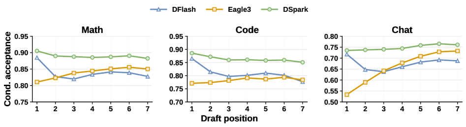
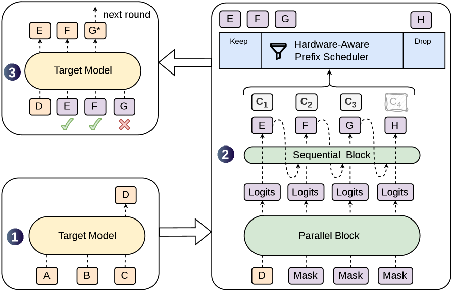
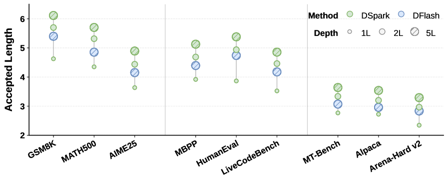
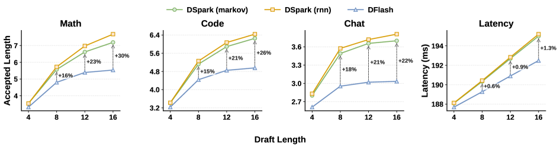
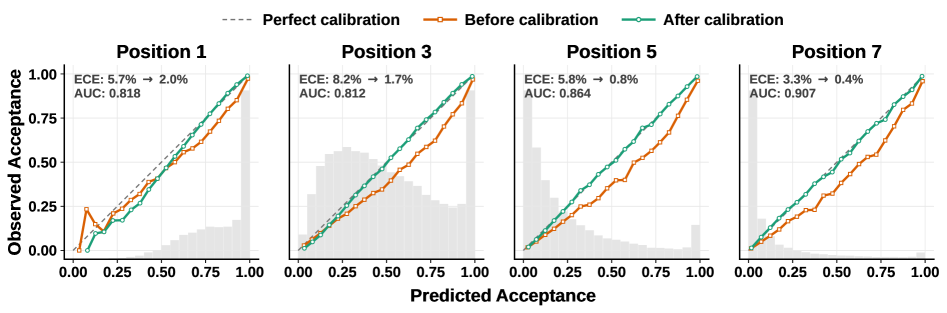
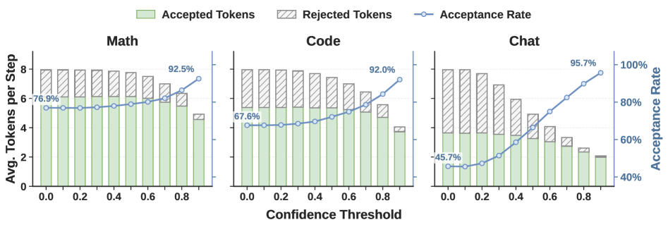
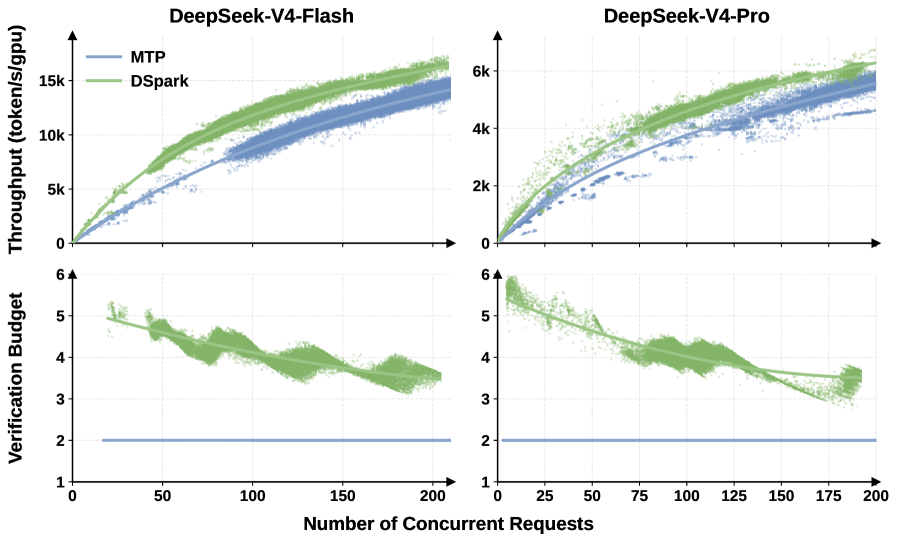
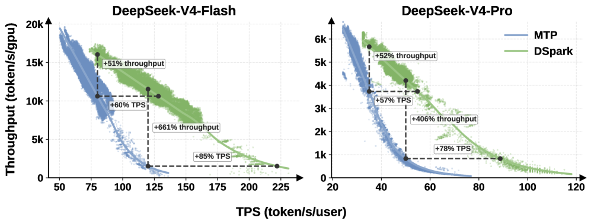

# DSpark 技术解读：让投机推理在高并发下不塌方

> 一篇给同事讲的 DSpark 论文（arXiv:2607.05147，DeepSeek，2026-07）技术博客。
> 假设读者已熟悉投机推理（speculative decoding）的基本机制（小猜大验、拒绝采样、无损）——这部分不再科普。
> 本文按论文顺序，每节先引用原论文一段，再解读。配图全部从论文直接嵌入。
>
> 论文：DSpark: Confidence-Scheduled Speculative Decoding with Semi-Autoregressive Generation
> 作者：Xin Cheng 等 32 人（DeepSeek）
> 状态：已部署于 DeepSeek-V4 生产环境，真实流量下每用户提速 60–85%

---

## 0. 一句话讲清 DSpark 干了啥

DSpark 治的是投机推理两个被忽视的瓶颈：

1. **草稿后段衰减**：并行起草器一次出一整块，但各位置"各猜各的、互相看不见"，后段接受率快速衰减。DSpark 用**半自回归**（并行骨干 + 极轻串行头）治它，接受长度 +16–18%。
2. **高并发验证浪费**：生产高并发下，无脑全验会把 batch 容量浪费在"注定被拒"的 token 上，拖垮整台服务器。DSpark 用**置信度调度验证**治它——只验值得验的。

第二点才是 60–85% 生产提速的来源。

---

## 1. 为什么需要 DSpark：两个被忽视的瓶颈

### 原文（论文 3. Architecture 开篇）

> Recall from Equation 1 that the per-token latency of speculative decoding is L = (T_draft + T_verify)/τ. Autoregressive drafters achieve high τ but pay T_draft ∝ γ; parallel drafters collapse T_draft to a single pass but sacrifice τ because each position is predicted independently. Meanwhile, fixed-length verification wastes T_verify on low-confidence suffix tokens that are almost certain to be rejected.

### 解读

这段把 DSpark 要治的两个病钉死在一个公式上：`L = (T_draft + T_verify) / τ`。

- **自回归起草器**（如 EAGLE）：每个位置看前一个，τ 高，但起草成本 `T_draft ∝ γ`（猜越多越慢），被迫用短块浅架构。
- **并行起草器**（如 dFlash）：一次出整块，T_draft 与 γ 解耦，**但每个位置独立预测、牺牲 τ**——后段衰减。
- **固定长度验证**：把 T_verify 浪费在"几乎注定被拒"的低置信后段 token 上。

所以提升推理速度 = 三个杠杆：降 T_draft（起草更快）、提 τ（起草更准）、降有效 T_verify（验证更聪明）。**DSpark 的两个组件各打一个杠杆**——半自回归提 τ（顺便保住并行速度=降 T_draft），置信度调度验证 降有效 T_verify。这是读整篇的钥匙。

### 两个瓶颈的相互作用（论文 3.2 引言）

> This performance bottleneck stems from two interacting factors. First, on the data side, draft acceptance rates inherently vary across domains... Second, on the system side, the actual cost of verifying an extra token depends strictly on the engine load. Under light system load, an extra verification incurs minimal penalty even if rejected. However, under high-concurrency deployments, every unnecessary verification occupies target model batch capacity that could otherwise serve other active requests.

解读：验证该验多少，沿**两条轴**变——
- **数据轴**：代码这种结构化文本猜得准（接受高），开放式闲聊猜不准（接受低）；
- **系统轴**：服务器闲时多验一个几乎免费，**忙时多验一个 = 抢了别的用户 batch 容量**。

所以"验多验少"不能一刀切，得看草稿可信度 **+** 当前负载。这正是 置信度调度验证 要把两个信号统一进一个调度决策的原因。

---

## 2. 起草器架构：自回归 vs 并行 vs dFlash

### 原文（论文 2.2）

> Existing approaches fall into two categories. Autoregressive drafters generate draft tokens sequentially... their drafting cost grows linearly with the block size: T_draft ∝ γ, which forces autoregressive drafters to use small γ and shallow architectures... Parallel drafters produce all γ draft tokens in a single forward pass, making T_draft nearly independent of the block size... Among them, DFlash (Chen et al., 2026) is a state-of-the-art parallel drafter, which conditions its draft model on rich context features extracted from the target model (KV injection).

### 解读：三类起草器对照

```
自回归(EAGLE系)  : 逐个猜, τ高, 但 T_draft∝γ → 短块+浅架构(1层)
并行(Medusa/dFlash): 一次出整块, T_draft与γ解耦 → 大块+深架构
                    但各位置独立 → 后段衰减(suffix decay)
dFlash           : 并行+KV injection, DSpark直接拿它当骨干
```

**dFlash 的 KV injection** 是它比 EAGLE 强的地方——"the target knows best"，大模型 prefill 的隐藏特征已隐含多个未来 token 的信息。dFlash 把目标多层隐藏状态抽出、投影、注入到起草器**每一层的 K/V**：

```
H_ctx = 投影( 目标多层隐藏状态拼接 )          ← 公式(2)
K_i = [ 目标上下文 ; 草稿token ]               ← 注入每层K/V, 公式(3)
V_i = [ 目标上下文 ; 草稿token ]
```

比 EAGLE 的"塞输入"强（塞输入会随层稀释，注入每层 K/V 让信息持久），代价极小（约 42MB vs 70GB 模型）。

### dFlash 的命门：后段衰减（论文 Figure 2 实证）



> *Figure 2：逐位置条件接受率。自回归的 Eagle3 保持稳定甚至上升，并行起草器 DFlash 遭受后段衰减（suffix decay）。*

这张图是 dFlash 命门的实证：并行起草器越往后接受率越掉。**DSpark 组件一就是来补这一刀的。**

---

## 3. DSpark 总体架构

### 原文（论文 3 节）

> DSpark addresses these limitations with two complementary components:
> • Semi-autoregressive generation (Section 3.1). A parallel backbone handles the bulk of draft computation, which keeps T_draft nearly independent of γ. A lightweight sequential block then injects dependency among draft tokens, improving τ at minimal additional latency.
> • Confidence-scheduled verification (Section 3.2). A confidence head estimates per-position acceptance probabilities, and a hardware-aware scheduler uses these estimates to prune low-confidence suffix tokens, cutting unnecessary verification compute.

### 解读：一个管草稿、一个管验证

```
组件一 半自回归(3.1) = dFlash并行骨干 + 轻量串行头
  → 治后段衰减, 提τ
组件二 置信度调度验证(3.2)      = 置信度头 + 硬件感知调度器
  → 治高并发验证浪费, 降有效T_verify
```

两个组件互补，谁也不和谁抢活——一个打草稿侧杠杆（提 τ）、一个打验证侧杠杆（降有效 T_verify）。

### 一个完整解码周期（论文 Figure 1）★核心图



> *Figure 1：给定 prompt ABC，目标模型出 anchor D；DSpark 用重型并行骨干 + 轻量串行头生成草稿 EFGH 和置信度 c1–c4；硬件感知前缀调度器评估分数，保留 EFG、丢低置信的 H；目标模型并行验证，E✓F✓G✗，补修正 token G\* 完成本轮。*

这张图是全文最重要的图，走一遍周期：

```
prompt: A B C
  ① 目标模型跑一步 → D(anchor, 目标模型亲自给的, 干净确定)
  ② DSpark起草: 一次出 E F G H + 置信度 c1 c2 c3 c4
  ③ 调度器评估 → 保留EFG、丢低置信的H
  ④ 目标验证EFG: E✓ F✓ G✗
  ⑤ G被拒 → 目标从自己分布重采样修正G*
  本轮接受 E F + G*(bonus), 共3个真token; G*变下轮anchor
```

后面 4、5 两章把组件一、组件二讲透。

---

## 4. 组件一：半自回归生成——治后段衰减

### 原文（论文 3.1）

> A parallel drafter produces all γ draft logits in one forward pass, so each prediction cannot condition on tokens sampled elsewhere in the block. When the context admits multiple plausible continuations, e.g., "of course" and "no problem", a parallel drafter may produce incoherent combinations such as "of problem" or "no course", because each position marginalizes over all possible predecessors rather than conditioning on the one actually sampled. Acceptance rate thus decays rapidly along the block... We therefore adopt a semi-autoregressive structure that splits draft generation into two stages.

### 解读：病根——多模碰撞

并行起草器一次出整块，每个位置**看不见本块别处采样的 token**。后果是多模碰撞：

```
上下文允许两种续写: "of course" 和 "no problem"
并行起草器同时算位置1和位置2:
  位置1: "of" 50%、"no" 50%
  位置2: "course" 50%(配of)、"problem" 50%(配no)   ← 看不见位置1采到了啥
各自独立采样 → 可能出 "of"+"problem" 或 "no"+"course" ✗ 胡说
```

因为每个位置是"对所有可能前驱做平均"，没条件在"实际采到的那一个"上。这就是 suffix decay 的根源。

### 药：并行骨干 + 极轻串行头（"大件 + 小补丁"）

> It keeps the computationally expensive draft backbone fully parallel, appending only a lightweight serial output head to inject local transition information. This design preserves the drafting speed of parallel models while significantly mitigating suffix decay.

解读：**别让位置间完全看不见，让后段能"看见"前段采了啥、微调偏好。但绝不能回到"一个一个慢算"。**

```
大件 = 并行骨干(dFlash)        一次前向算完全部位置的"基础偏好"(base logit U_k)
                                保留并行速度, 不退化成慢算
小补丁 = Markov头(串行)        拿前一个采样token, 给当前位置加一点偏置
                                串行, 但极轻, 延迟可忽略
```

"半自回归"就这么来的——大头并行、小头串行。串行那部分必须小到不拖累延迟（`T_sequential ≪ T_parallel`），否则毁了并行骨干的速度优势。

### Markov 头怎么算（论文公式 4、5）

> P(X|x_0) = ∏ p_k(x_k | x_0, x_<k),  p_k = softmax( U_k + B_k )
> B(x_{k−1}, ·) = W_1[x_{k−1}] W_2   (低秩分解, r=256)

解读：每个位置最终选词 = softmax( 大件基础偏好 U_k + 小补丁 B_k )。Markov 头只看**前一个 token**：

```
B(前一个token) = W_1[前一个token] · W_2
                 ↑查表成256维向量   ↑投回成V维logit偏置
```

说人话：模型学了一张"词→词搭配"低秩表。起草时查"前一个是 of"，就把"course"加分、"problem"减分——治掉"of problem"碰撞。

**为什么低秩 r=256 而不是全 V×V**：词表 V 通常 5–15 万，全矩阵几十亿参数太大；低秩后每词只存一个 256 维向量，存储和每步计算都可忽略——这是它能"轻到不拖速度"的关键。

### position-1 小修改

> instead of feeding an anchor token plus γ mask tokens and predicting only the mask positions, we treat the anchor itself as the first prediction position, so γ input tokens (anchor + γ−1 masks) yield γ draft logits.

解读：dFlash 原版 anchor 只当条件、不产出预测，白白占一个输入位。DSpark 让 anchor 那位**顺便也产出一个预测**——白捡一位预测，省一次计算、质量不变。

### 实证：小补丁的参数效率极高（论文 Figure 3）



> *Figure 3：起草器深度的影响。固定提议长度，DSpark 随层数增加而提升。值得注意的是，浅的 2 层 DSpark 胜过更深的 5 层 DFlash 基线，凸显串行建模的参数效率。*

解读：**2 层 DSpark > 5 层 DFlash**——加一个极轻的串行头，比堆并行骨干的层更划算。这证明"大件+小补丁"的精度-参数权衡极好。

### 实证：延迟开销极小（论文 Figure 4 右图）



> *Figure 4：左三图 DSpark 跨块大小持续优于 DFlash；右图显示串行头在 serving 时引入的延迟开销极小。*

解读：右图证明串行头"轻到不拖速度"不是空话——延迟开销极小。左三图证明块越大 DSpark 优势越大（γ=15 时比 γ=7 优势更显著），因为后段越长 dFlash 衰减越狠、DSpark 治得越值。

---

## 5. 组件二：置信度调度验证——治高并发验证浪费

**这是 DSpark 真正的杀手锏，60–85% 提速主要来自这里。**

### 5.1 思想：只把算力路由给"正回报"的 token

> fully unlocking the potential of large draft blocks requires a unified mechanism that routes target model compute only toward tokens with a positive expected return. DSpark achieves this by coupling a confidence head that predicts prefix survival probabilities, with a hardware-aware prefix scheduler that dynamically determines the optimal verification lengths based on current system load.

解读：核心一句话——**只把目标模型算力路由给"预期回报为正"的 token**。靠两个部件耦合：置信度头（给质量信号）+ 硬件感知调度器（给系统信号）。

为什么缺一不可？单独一个都不行：
- 只有置信度（不看负载）→ 知道哪个可信，但不知"验得起验不起"，忙时硬验照样拖垮；
- 只有负载感知（不看置信）→ 知道多忙，但不知"哪个草稿值得验"，乱丢乱留。

**置信度调度验证 把质量和系统两个信号乘起来，才是完整决策。**

### 5.2 置信度头：打"能活过验证"的分

> the confidence head outputs a scalar c_k ∈ (0,1) for each draft position k. Crucially, c_k models the conditional probability that the draft token at position k will survive target verification, given that all preceding tokens in the block have been accepted.
> c_k = σ( w⊤[h_k ; W_1[x_{k−1}]] )   (公式7)
> We supervise c_k using the analytical acceptance rate: c*_k = 1 − ½‖p^d_k − p^t_k‖_1   (公式8)

解读：每个草稿位置出一个分 c_k ∈ (0,1)，意思是"**给定前面都被接受了，位置 k 能活过验证的条件概率**"。注意是条件概率（后面要连乘）。

**怎么训（最漂亮的一点）**：训练标签 c\*_k 用**理论接受率** = `1 − ½·TV(草稿分布, 目标分布)`。直觉——草稿分布和目标分布越像（TV 越小），接受率越高。这直接连回投机推理的接受概率 `min(1, p^t/p^d)`——把所有 token 接受期望加起来正好等于 `1 − ½·TV`。**所以置信度头学的是"这一位置草稿和目标差多远"**，把打分从拍脑袋变成有理论根据的。

### 5.3 STS 校准：让分的绝对值准

> our hardware-aware scheduling approach precisely requires the absolute magnitudes of the cumulative acceptance probabilities to compute the expected acceptance length τ. Because neural confidence estimates are often overconfident... we introduce Sequential Temperature Scaling (STS)... temperature scaling is an order-preserving transformation: it rectifies the predicted probabilities to match empirical acceptance rates without disrupting the relative draft token rankings.

解读：这一步最绕但关键。

**为什么需要校准**：调度器要用这些分算 τ，而 τ 是置信度的**连乘累加**（`τ ≈ c_1 + c_1·c_2 + c_1·c_2·c_3 + …`），**需要绝对量级准**。但神经网络打分天生过度自信。**连乘会把过度自信放大成灾难**：

```
位置         1      2      3      4
真实存活率   0.7    0.6    0.5    0.4
过度自信输出 0.9   0.85   0.8   0.75   (每个偏高一点)
整块4个全活的联合概率:
  真实: 0.7×0.6×0.5×0.4 = 0.084
  预测: 0.9×0.85×0.8×0.75 = 0.459   ← 差5.5倍!
```

每个位置单独看只偏高一点，连乘起来误差滚雪球。调度器拿错的 τ 决定"验多长"会严重高估、过度验证、白占 batch。

**STS 怎么治**：温度缩放就是"给 logit 除个温度 T"降温去自信。STS 特别在**逐位置、从左到右校准累积乘**：

```
位置1: 找T1, 让 c1 校准后 ≈ 真实0.7
位置2: c1已定, 找T2, 让 c1·c2 ≈ 0.42 (前2位都活的真实率)
位置3: 找T3, 让 c1·c2·c3 ≈ 0.21
...
```

**关键**：温度缩放是**保序**的——只改绝对数值（0.9→0.7），不改排名（谁高谁低不变），不打乱"哪个 token 更可信"的判断。

### 实证：STS 治过度自信（论文 Figure 6）



> *Figure 6：Alpaca 上的可靠性图。原始置信度估计判别力强但过度自信；事后校准让前缀存活概率与经验接受率对齐。阴影直方图是各置信度 bin 的样本数分布。*

解读：左（校准前）预测分集中在高置信区、和实际命中率对不上；右（STS 后）分和经验接受率对齐了。这就是"绝对值变准、排名不变"的视觉证据。

### 5.4 硬件感知调度器：贪心 + 早停

> We formulate verification length selection as a global throughput maximization problem... the total batch size is B = Σ(1+ℓ_r), and the expected number of successfully accepted tokens is τ = Σ(1 + Σ a_{r,j})... let SPS(B) denote the engine throughput, measured in steps per second, for a given forward-pass batch size B. Crucially, this capacity curve is profiled once during engine initialization and stored as a lightweight cost table. Our scheduler then aims to maximize Θ = τ · SPS(B).

解读：核心就一个公式 **Θ = τ · SPS(B)**：

```
τ       = 这批请求期望被接受的总token数
SPS(B)  = 引擎在batch=B时每秒几步(B越大越慢, 提前profile好的表)
Θ       = 每秒产出多少真token ← 要最大化
```

矛盾：多验草稿 → τ 涨但 B 大 → SPS 跌。一增一减，Θ 先涨后跌，**找峰值**。

**"Hardware-Aware" aware 的就是 SPS 这条曲线**——引擎"batch 多大→每秒几步"的实测表。SPS 是**实测**出来的（不是理论算的）：引擎启动时拿不同 B 各跑几步、掐表测每秒几步，存成查找表。它把硬件所有真实行为压缩成一个实测值，换 GPU/换模型重新 profile 照样能用。

### 算法 1：贪心 + 早停

> Because a_{r,j} is monotonically non-increasing with respect to j... the marginal gain in expected accepted tokens for extending request r's verification length from j−1 to j is exactly a_{r,j}... the optimal allocation would be determined by greedily selecting the draft tokens with the highest survival probabilities from the global pool... the scheduler employs an early-stopping mechanism. By breaking the greedy search immediately when the throughput drops (Θ ≤ Θ_best), the truncation decision relies solely on the prefix processed up to that exact step.


*（算法 1 伪代码见论文；上图 Figure 1 已展示其在一个周期中的决策结果：保留 EFG、丢 H。）*

解读：因为"边际增益 = a_{r,j}（存活概率）单调递减"，所以**把所有候选按存活概率从高到低排，贪心逐个纳入，每纳入一个算 Θ，Θ 一跌就早停**。具体走一遍（3 请求 A/B/C）：

```
候选按存活概率降序: (A,1)=0.8 > (B,1)=0.65 > (A,2)=0.6 > (C,1)=0.5 > ...

基线(都不验): B=3, τ=3, Θ_best=3×SPS(3)
纳入(A,1): B=4, τ=3.8, Θ=3.8×SPS(4)   >基线 → 更新, 继续
纳入(B,1): B=5, τ=4.45                  → 更新, 继续
纳入(A,2): B=6, τ=5.05                  → 更新, 继续  ← 峰值附近
纳入(C,1): B=7, τ=5.55                  → 微涨, 更新
纳入(A,3): B=8, τ=5.97, Θ=406 < 峰值    → 跌了! 早停 ✗

返回: A验2个、B验1个、C验1个 (丢掉A第3、4位等低分token)
```

不是所有请求验一样多——草稿可信的多验、不可信的少验、服务器一忙就少验。"该验的验、不该验的丢"。**这就是图 1 里"保留 EFG、丢 H"的算法实质。**

### 实证：置信度阈值↑ → 接受率↑（论文 Figure 5）



> *Figure 5：阈值 0 对应标准固定长度验证。阈值升，整体接受率稳步上升，因为置信度头有效剪掉了那些最终会被拒的 token（带阴影条）。*

解读：这条证明"剪掉低置信 token"确实在提升有效接受——被剪掉的（阴影条）正是那些本会被拒的废 token。

### 5.5 早停的一石二鸟：性能 + 无损（最妙的一点）

> Lossless speculative decoding strictly requires the non-anticipating property: admission decisions must not depend on future candidate tokens... A retrospective global search would thus inadvertently leak x_{r,k} into the admission decision for step k, introducing selection bias... By breaking the greedy search immediately when the throughput drops (Θ ≤ Θ_best), the truncation decision relies solely on the prefix processed up to that exact step. This isolates the admission event from future tokens, ensuring exact target-distribution recovery.

解读：这是 置信度调度验证 设计最精妙、最易被忽略的一点。

**问题**：DSpark 的置信度头用了 Markov 特征（依赖前一个**采样**的 token）。要算下一位存活概率，得先知道上一位采到了啥。那调度器能不能"先看完整个块、回顾式地全局搜最优"？

**不能**。投机推理有个铁律——**非预期性（non-anticipating）：接受/拒绝决策不能依赖未来 token**。一旦"决定验不验第 k 位"时偷看了第 k+1 位，就用未来信息挑 token，引入选择偏差，**无损保证就破了**。

**解法 = 早停**。Θ 一跌就立刻断，截断点**只用"到这一步为止"的信息**，不看后面——隔离未来 token。

所以早停**一石二鸟**：

```
性能: Θ一跌就停, 不浪费batch在低回报token
无损: 截断只看前缀不看未来, 分布严格=目标模型
```

这俩本来在系统设计里经常冲突（要快就得近似、要无损就得严谨），**置信度调度验证 用算法结构让它们一致了**。这是整个 DSpark 最该被记住的设计巧思。

### 实证：负载自适应（论文 Figure 8）★最能体现 置信度调度验证 价值



> *Figure 8：上排(a,b)：不同并发水平下的聚合输出吞吐。下排(c,d)：每请求平均目标验证预算。并发负载上升时，动态调度器自动收紧每请求验证长度，防止资源争用。*

解读：这张图最能体现 置信度调度验证 的价值——**下排证明"并发↑ → 每请求验证预算自动收缩"**，这正是"高并发下不无脑全验、动态裁验证长度"的实证。上排证明这样做让聚合吞吐在高并发下不塌方。这就是 60–85% 提速的机制根源。

> 实用性评估（置信度调度验证）：成熟度——已生产部署，60–85% 是真实流量硬数据；落地难度——高（要 profile 引擎 SPS、做 STS 校准，工程深度大）；价值——这是 DSpark 区别于前人的核心，治的是"高并发塌方"这个生产痛点。

---

## 6. 训练：直接优化最终指标，不拐弯

### 原文（论文 3.3 Training）

> The training objective consists of three terms: a cross-entropy loss L_ce, a distribution-matching loss L_tv, and a confidence loss L_conf. All three are position-weighted by w_k = exp(−(k−1)/γ)... The cross-entropy loss L_ce trains the drafter to predict the correct next token... The distribution-matching loss L_tv penalizes the total variation distance between the draft and target distributions... Since the total variation distance is a direct proxy for the acceptance rate: the per-step acceptance probability equals 1 − ½‖p^d − p^t‖_1, minimizing L_tv directly maximizes the expected acceptance rate. The confidence loss L_conf is a binary cross-entropy that trains the confidence head to predict the soft acceptance label c*_k.
> The overall objective is a weighted combination (α_ce=0.1, α_tv=0.9, α_conf=1.0).

### 解读：三项损失各训什么

```
L_ce   (交叉熵, 权重0.1)   训草稿器猜对下一token     ← 最朴素, 权重反而最小
L_tv   (分布匹配, 权重0.9)  训草稿器分布贴近目标       ← 主损失!
L_conf (置信度, 权重1.0)    训置信度头预测接受率       ← 标签=公式8的c*_k
```

冻结：目标模型整体 + 草稿器的 embedding/LM head；只训：骨干 + 串行头 + 置信度头。**参数效率高**，草稿器像个轻量适配器。

### 最值得讲：主损失是 L_tv，不是 L_ce

这个权重分配**反直觉但极有道理**：交叉熵 L_ce 只给 0.1，分布匹配 L_tv 给 0.9。

**为什么？** 因为投机推理要的不是"草稿偶尔猜对真值"，而是"草稿分布和目标分布贴近 → 被接受的概率高"。

- L_ce 只看"草稿在真值那一位对不对"——一个点；
- L_tv 看"整个分布贴不贴近目标"——整体形状。

而 **接受率 = 1 − ½·TV**，TV 就是分布差。所以**直接最小化 TV = 直接最大化接受率 = 直接优化"草稿会被接受"这件事本身**。L_ce 只是个防跑偏的辅助。

这是"目标对齐"的设计哲学：**训练损失直接对着推理时的真实指标（接受率）优化，而不是代理指标（猜对真值）**。和置信度头拿"理论接受率"当标签，是同一个哲学——不拐弯抹角，直接拿最终指标当监督。

### 位置权重为什么压早期

`w_k = exp(−(k−1)/γ)`：第一位权重最大（=1），越往后越小。原因——**前缀式验证，第一个拒绝后面全废**：早期位置错了，后面哪怕猜对也丢，所以早期准确性对 τ 贡献不成比例地大。三项损失共用这套权重，统一"优先保前段"，从 dFlash 沿用。

---

## 7. 实战效果：DeepSeek-V4 生产部署

### 原文（论文引言 + 摘要）

> We deployed DSpark within the DeepSeek-V4 serving system to assess its performance under live user traffic. Compared to the prior MTP-1 production baseline, DSpark significantly broadens the system's operational envelope. Specifically, it consistently accelerates per-user generation speeds by 60%–85% (V4-Flash) and 57%–78% (V4-Pro) at matched aggregate throughput capacities. Furthermore, under strict SLAs where the baseline's capacity deteriorates severely... DSpark mitigates verification overhead to maintain robust throughput. By overcoming this performance cliff, DSpark unlocks strict interactivity tiers that were previously unattainable, effectively shifting the Pareto frontier of LLM serving.

### 实证：生产 Pareto 前沿移动（论文 Figure 7）



> *Figure 7：聚合输出 token 吞吐 vs 每请求生成速度（tok/s/user），真实流量下。*

解读：等吞吐下每用户提速 60–85%；严格 SLA 下基线容量塌方处，DSpark 保住吞吐——**推动了 Pareto 前沿**，解锁以前够不着的严格交互性档位。

开源：DSSpark checkpoints（DeepSeek-V4-Flash/Pro 预览）+ DeepSpec 训练仓库（含 Eagle3、DFlash、DSpark）。

---

## 8. 总结与思考

### 8.1 贡献收口

```
组件一 半自回归(3.1): dFlash骨干 + Markov头 → 治后段衰减, τ涨16-18%
组件二 置信度调度验证(3.2):     置信度头 + STS校准 + 硬件感知调度器 → 治高并发验证浪费
训练(3.3):           主损失L_tv直接优化接受率, 不用代理指标
实战:                DeepSeek-V4生产, 60-85%提速, 推动Pareto前沿
```

### 8.2 几个值得记住的设计巧思

1. **"大件 + 小补丁"的半自回归**：大头并行保速度、小头串行治衰减，不退化成慢算。
2. **置信度头用理论接受率当标签**：从拍脑袋变成有理论根据的，且直接连回接受公式。
3. **STS 校准连乘**：因为连乘放大偏差，必须逐位校准累积乘，不是全局一个温度。
4. **早停一石二鸟**：性能（省算力）+ 无损（不看未来），用算法结构让冲突的俩目标一致。
5. **训练直接优化最终指标**：L_tv 主损失直接最大化接受率，置信度标签也是接受率——目标对齐。
6. **硬件感知 = SPS 实测曲线**：把硬件行为压缩成一张表当代价函数，决策和生产对齐。

### 8.3 局限与诚实标注

1. **很新**：dFlash 2026-02（ICML'26）、DSpark 2026-07（预印本+生产报告），独立第三方复现尚未跟上。
2. **661% 等极端数字**是 DeepSeek 自家生产在极端 SLA 下的数据，基线 MTP-1 接近运营边界，要打折看。
3. **SPS 简化假设**：只把 B 当主变量，真实非平滑特性要 5.2 节工程手段补。
4. **早停全局最优前提**：Θ 单峰才全局最优，隐含假设 SPS 平滑下降。
5. **要训起草器**：不是即插即用、零成本。

### 8.4 判断

DSpark 的真正价值不在"+16-18% 接受长度"，而在**把投机推理从"算法技巧"推向"系统级工程"**——它第一次让"投机预算"从静态变成按负载动态的量，并保证无损。这是高并发 serving 场景下能用的投机推理，不是离线 benchmark 好看的投机推理。

趋势：**并行骨干 + 轻量自回归修正 + 硬件感知调度**这条路（dFlash→DSpark）很可能成为下一阶段 serving 主流，值得盯。


