# Made by Google 2026 AI 技术调研

> 研究范围：Pixel 11、Pixel Watch 5 及同期 Google 官方资料中的 AI 功能、端云路径、执行机制、安全边界和产品成熟度。与 AI 无关的外观、价格和常规硬件规格不在本文范围内。

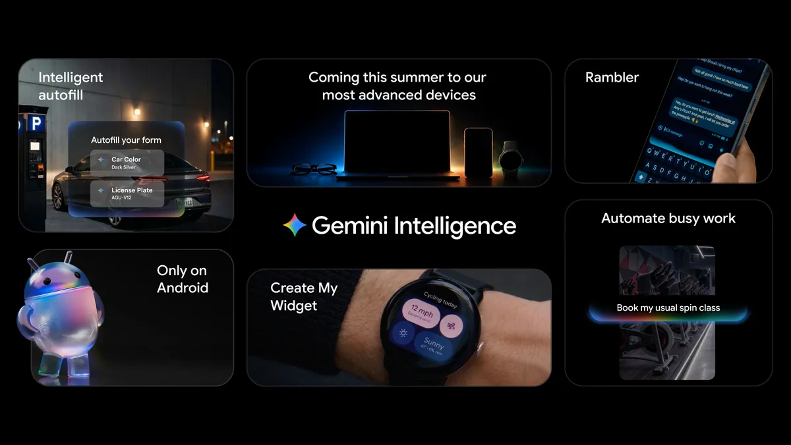

_来源：[Gemini Intelligence on Android](https://blog.google/products-and-platforms/platforms/android/gemini-intelligence/)，Google 官方博客。_

# 一、执行摘要

## 1.1 一句话结论

**Made by Google 2026 的关键不是 Pixel 11 增加了多少 Gemini 功能，而是 Android 开始把模型、个人上下文、App 权限和端云计算组合成一套受监督的任务执行系统。**

> **官方原文摘录｜Google Blog**  
> “Android transitions from an operating system into an intelligence system.”
>
> **中文解读：** Google 对产品方向的定义已经超出“在操作系统里加入聊天助手”。模型正在进入系统层，主动理解上下文、调用功能并执行任务。[查看原文](https://blog.google/products-and-platforms/platforms/android/gemini-intelligence/)

## 1.2 六个技术结论

1. **Gemini Intelligence 不是一个新模型名称，而是 Android 上的 AI 产品系统。** 它把 Gemini、个人上下文、系统权限、App 操作、端侧芯片和可穿戴传感器组合成一套体验。

2. **本次最重要的变化是从“生成答案”走向“执行任务”。** Pixel 可以根据自然语言目标调用多个 App、动态填写参数、在后台继续工作，并在购买或提交前交还控制权。

3. **它属于受监督的受限域 Agent，而非通用自主 Agent。** 系统能够理解目标、选择工具、在多个 App 之间传递状态并动态填参，但执行范围仍受支持的 App、任务类型和人工确认边界约束。

4. **系统采用端侧、受保护云和普通在线服务混合执行。** 低延迟与隐私敏感处理优先放在设备端，复杂个人化推理可进入 Private AI Compute，订餐、地图和健康服务仍需连接在线系统。

5. **研究含量最高的落地是 Sign-to-Text 与 Health Guardian。** 前者采用“端侧姿态提取、云端语言翻译”的隐私型拆分；后者把长期可穿戴信号建模为通用生理表示。

6. **不少能力属于扩围和产品化，而非从零首发。** 多步骤 App 操作、Magic Cue 和语音翻译在 Pixel 10 阶段已有基础；Pixel 11 的主要增量是支持范围、系统整合、交互控制和端侧性能。

# 二、研究框架与能力地图

## 2.1 阅读路径

本文不按发布会出场顺序复述功能，而是沿四条技术主线展开：

1. **移动端 Agent**：系统如何理解目标、选择 App、传递状态并受控执行；
2. **端云混合架构**：哪些处理留在设备端，哪些进入受保护云或在线服务；
3. **感知与生成能力**：语音、手语、相机如何把模型嵌入手机输入链路；
4. **可穿戴健康 AI**：长期传感器数据如何形成可复用生理表征，并转化为趋势与紧急检测。

各专题尽量采用同一结构：**功能结论 → 用户流程 → 技术机制 → 官方原文与截图 → 技术判断与限制**。

## 2.2 AI 能力矩阵

| 能力 | 解决的问题 | 关键技术 | 已知执行位置 | 技术判断 |
|---|---|---|---|---|
| 跨 App 多步骤任务 | 订餐、购物、票务等事务 | 目标理解、工具选择、UI 操作、动态填参、人工确认 | 手机内安全虚拟窗口 + 在线 App/服务 | **受限域 Agent，发布会核心** |
| 上下文卡片与 Watch 建议 | 减少消息、日历、地图之间的切换 | 实体抽取、个人上下文检索、动作建议 | Private Compute Core、Private AI Compute 与服务协同 | 主动建议，不等于自主行动 |
| Rambler | 把停顿、改口和混合语言整理成可发送文本 | 实时语音识别、意图重写、语气保留 | 实时音频不保存；其余处理位置按功能配置 | 输入体验升级，非普通听写 |
| Live Translate 媒体配音 | 翻译视频和音频内容 | 端侧生成式语音/翻译模型 | Tensor G6 设备端 | 本地执行明确，但支持范围有限 |
| Sign-to-Text | ASL 直接输入文字 | MediaPipe 姿态点 + SL2T 流式翻译 | 姿态提取本地；坐标序列上云翻译 | 隐私型端云拆分，技术亮点 |
| Magic Capture | 同时获得好照片与完整视频 | 多帧理解、选帧、裁切、去模糊 | on-device intelligence + Gemini 协同 | AI 负责选择，不是生成动作 |
| Health Guardian | 从长期数据识别健康趋势与紧急状态 | SensorFM、WavesFM、多模态传感器模型 | 趋势分析依赖服务；呼吸紧急检测在 Watch 本地 | 长期战略价值高，医学边界严格 |
| Health Coach | 把健康数据变成训练和生活计划 | 长期记忆、环境上下文、计划生成 | App + Premium + 互联网 | 健康规划 Agent，不是医疗诊断 |

## 2.3 证据口径

| 证据类型 | 本文用途 |
|---|---|
| Google 官方博客原文 | 确认产品定位、数据路径、权限边界和医学限制 |
| 官方发布会截图 | 还原真实交互流程与现场公开范围 |
| Google 技术说明与研究博客 | 解释隔离机制、模型结构和训练数据 |
| 本文技术判断 | 基于公开证据的分析，不视作 Google 官方承诺 |

---

# 三、系统底座：端云执行与隐私隔离

## 3.1 架构结论

Gemini Intelligence 不是“全本地 AI”。它按照延迟、隐私、算力和在线服务依赖，把任务分配到设备端、Private AI Compute 和普通在线服务。安全机制的重点也不是阻止一切数据离开设备，而是让敏感数据在不同执行环境中保持隔离、可控制和可审计。

## 3.2 隔离层级

Google 公布了三类与环境数据相关的隔离机制：受保护虚拟机提供设备硬件隔离，Private Compute Core 提供设备进程隔离，Private AI Compute 为需要更强模型的敏感请求提供服务器隔离。

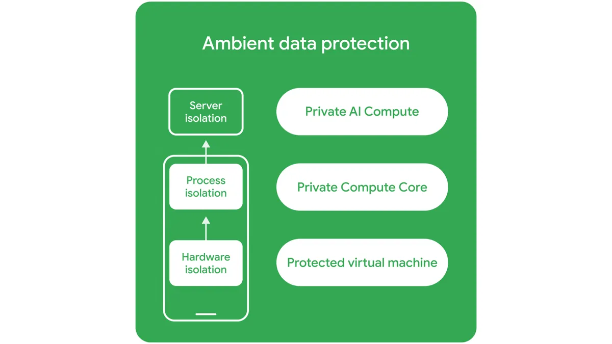

_来源：[Android Agent 安全与隐私说明](https://blog.google/security/android-gemini-intelligence-security-privacy/)，Google 官方博客。该图说明环境数据如何受到 Private Compute Core、Private AI Compute 等机制保护。_

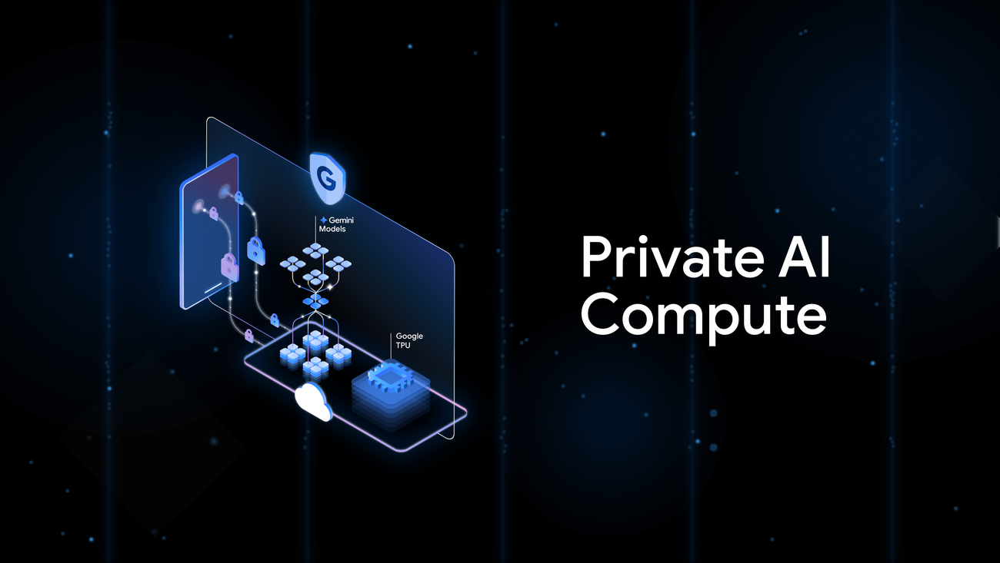

_来源：[Private AI Compute technical brief](https://services.google.com/fh/files/misc/private_ai_compute_technical_brief.pdf)，Google 官方技术说明。该图是概念表达，不是部署拓扑；具体机制以技术说明中的远程证明、加密和隔离设计为准。_

### 3.2.1 官方原文与解读

> **官方原文摘录｜Private AI Compute**  
> “Remote attestation and encryption are used to connect your device to the hardware-secured sealed cloud environment.”
>
> **中文解读：** 设备不是把敏感请求直接送入普通云实例，而是先验证远端执行环境，再通过加密通道连接到硬件保护的隔离空间。它仍属于云端计算，但试图提供接近端侧处理的访问控制。[查看原文](https://blog.google/innovation-and-ai/products/google-private-ai-compute/)

## 3.3 三类执行环境

| 执行环境 | 功能示例 | 作用 | 边界 |
|---|---|---|---|
| **设备端** | Gemini Nano 基础能力、Watch 离线核心动作、Live Translate、呼吸紧急检测、SL2T 姿态提取 | 低延迟、离线、持续运行、减少原始数据上传 | “设备端参与”不代表整个功能全部本地 |
| **Private AI Compute** | 部分复杂且敏感的个人上下文推理 | 需要更强模型，同时使用远程证明、加密与隔离环境 | 仍然是云端；公开的是安全设计，不是零风险证明 |
| **Google/第三方在线服务** | Gmail、Maps、OpenTable、Health Coach 等 | 在线知识、账号数据和真实事务必须连接服务 | 第三方 App 的数据政策和错误同样影响结果 |

## 3.4 控制与透明度

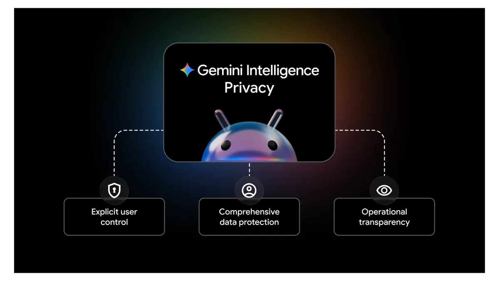

_来源：[Android Agent 安全与隐私说明](https://blog.google/security/android-gemini-intelligence-security-privacy/)。_

Google 将系统安全归纳为三类控制：

1. **显式控制**：功能可开关，App 自动化和 Autofill 等能力采用 opt-in；
2. **数据保护**：结合 Private Compute Core、Private AI Compute、pKVM 与既有账号安全体系；
3. **运行透明**：显示实时状态和活动历史，并提供可审计组件与第三方审计。

> **官方原文摘录｜Android Security Blog**  
> “This visibility is provided through real-time indicators, activity logs in the Privacy Dashboard, and the use of open-source components.”
>
> **中文解读：** 安全边界不只依靠后台隔离，也依靠用户能否看到 Agent 正在操作什么、调用过哪些 App，以及关键安全组件是否允许外部验证。[查看原文](https://blog.google/security/android-gemini-intelligence-security-privacy/)

## 3.5 评估重点

- 每项功能使用的具体 Gemini/Nano 模型版本；
- 单次请求何时从本地升级到 Private AI Compute；
- 跨 App 任务的规划、视觉理解和错误恢复分别在哪里运行；
- 多模型并发时的内存、功耗和热限制。

还需要区分三种不同承诺：**数据不离开设备、Google 员工不可访问、数据不用于训练或广告**。它们不是同一件事，必须逐功能核对。

---

# 四、核心能力一：移动端跨 App Agent

## 4.1 功能结论

Pixel 11 展示的核心能力不是自动点击本身，而是把自然语言目标转换成一条受监督的跨 App 执行链。系统会选择工具、传递前一步结果、动态填写参数，并把不可逆操作留给用户确认。因此它属于**受监督的受限域 Agent**，而非传统录制宏，也不是可以处理任意任务的通用 Agent。

## 4.2 用户流程

演示任务是：指定餐厅、日期、时间和人数，要求系统完成订位准备。系统先定位正确餐厅，再进入 OpenTable 填写交易参数，最后停在确认界面。

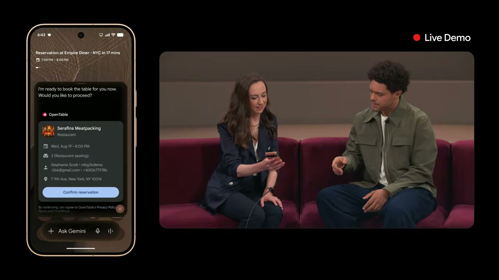

_来源：[Made by Google '26 官方回放 00:56:41–00:58:34](https://www.youtube.com/watch?v=c84y9gAY90c&t=3401s)。_

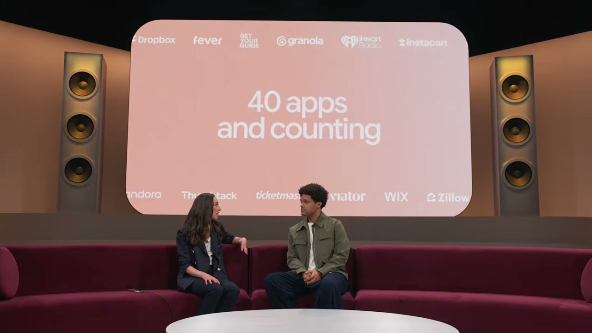

_来源：[Made by Google '26 官方回放约 00:57:47](https://www.youtube.com/watch?v=c84y9gAY90c&t=3467s)。_

### 4.2.1 执行链

1. 用户给出**目标和约束**，而不是逐步点击指令；
2. 系统选择 Maps 确认地点，再选择 OpenTable 执行订位；
3. 第一项工具的结果成为第二项工具的输入；
4. 系统动态填入餐厅、日期、时间、人数和联系人；
5. 任务可以在后台继续，用户能够查看进度、接管或中止；
6. 真正提交前停止，要求用户确认。

## 4.3 技术机制

| 组件 | 在演示中的作用 |
|---|---|
| 目标理解 | 从自然语言中提取餐厅、时间、人数等约束 |
| 工具路由 | 先用 Maps 消除地点歧义，再进入 OpenTable |
| 状态传递 | 把地点结果和用户约束传给下一 App |
| UI 操作 | 在手机内的安全虚拟窗口中完成页面导航和填表 |
| 后台执行 | 用户离开界面后继续工作，并通过通知提供进度 |
| 人工确认 | 在购买、订位或提交前停止，避免直接完成不可逆操作 |

> **官方原文摘录｜Gemini Intelligence on Android**  
> “You can track the progress live via notifications.”
>
> **中文解读：** 后台执行并不意味着系统获得完全自主权。Google 把实时进度、随时中止和最终确认作为 Agent 产品的一部分，而不是额外的安全提示。[查看原文](https://blog.google/products-and-platforms/platforms/android/gemini-intelligence/)

## 4.4 Agent 判定

| 判据 | 固定宏 | 本次公开能力 | 结论 |
|---|---|---|---|
| 输入 | 固定入口、固定参数 | 自然语言目标与动态约束 | 超出传统录制宏 |
| 步骤 | 预先写死按钮序列 | 根据任务选择 Maps、OpenTable 等工具 | 具备工具路由 |
| 状态 | 通常不理解页面结果 | 读取地点结果并继续填充下一 App | 具备跨步骤状态传递 |
| 参数 | 固定或手工录入 | 从指令、账号和 App 状态组装 | 具备上下文填参 |
| 控制 | 开始后机械执行 | 可查看、接管、中止，并保留最终确认 | 具备受控执行边界 |
| 泛化范围 | 单一脚本 | 官方称已覆盖 40+ App，但任务类型有限 | 是受限域 Agent，不是通用 Agent |

这套能力符合“目标驱动、调用工具、根据状态继续行动”的 Agent 基本定义。当前能力仍限定在支持的 App 和任务类型内，跨界面变化、失败重试和长任务成功率还需要真实环境评测。最准确的称呼是：**受监督的多 App 执行 Agent**。

## 4.5 授权、可观察性与人工确认

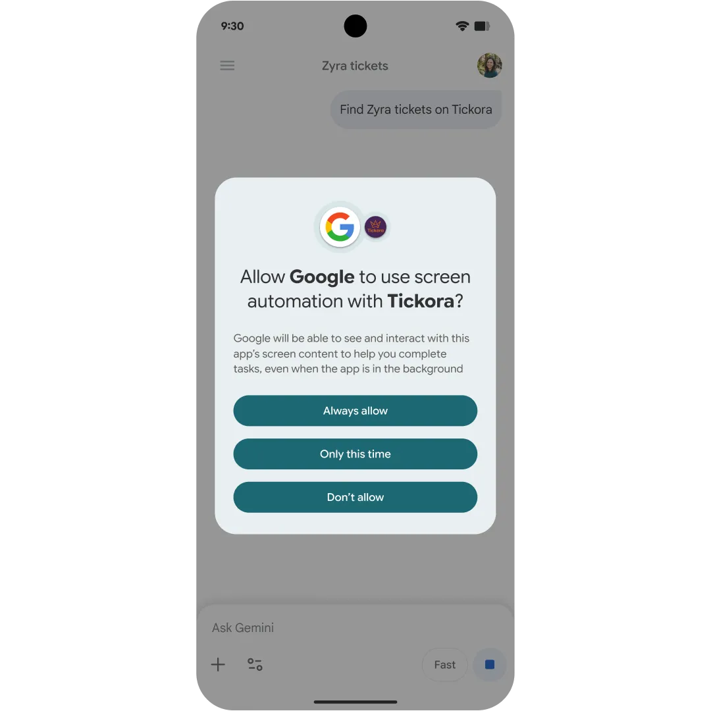

_来源：[Android Agent 安全与隐私说明](https://blog.google/security/android-gemini-intelligence-security-privacy/)，Google 官方博客。用户可按 App 授权自动化。_

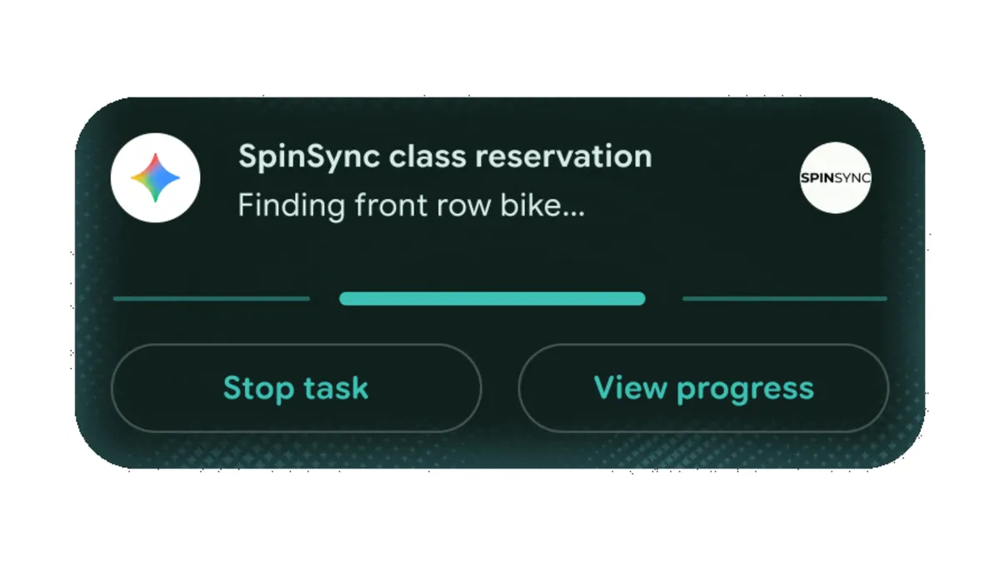

_来源：同上。该界面显示运行状态、查看进度和停止任务。_

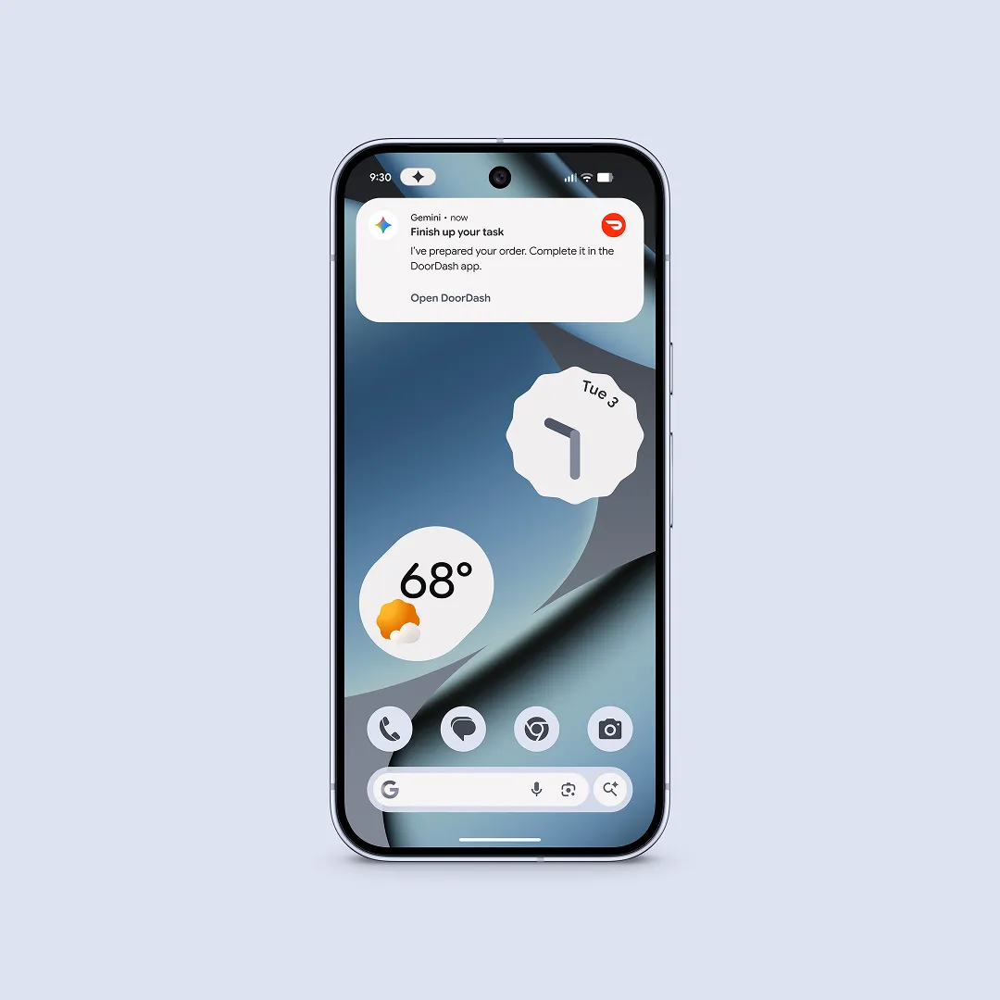

_来源：[Gemini 多步骤任务官方预览](https://blog.google/innovation-and-ai/products/gemini-app/android-multi-step-tasks/)。这张图展示的是早期 DoorDash 示例，与发布会的 OpenTable 演示共同说明“执行准备由系统完成、最终交易由用户确认”的产品边界。_

### 4.5.1 安全控制

- 只在用户明确下令后开始；
- 只访问用户允许的 App，而不是整个设备；
- 通过通知和不可忽略的状态提示显示正在运行；
- 用户可以实时查看、跳入接管或停止；
- 购买与支付保留人工确认；
- Android Privacy Dashboard 计划记录 AI assistant 使用过哪些 App。

> **官方原文摘录｜Gemini 多步骤任务预览**  
> “Gemini automates the task by running the app you need in a secure, virtual window on your phone.”
>
> **中文解读：** 自动化不是在后台获得整个 Android 系统的自由访问权，而是在手机内受限环境中操作被允许的 App。这是其权限隔离的关键实现边界。[查看原文](https://blog.google/innovation-and-ai/products/gemini-app/android-multi-step-tasks/)

## 4.6 技术价值与限制

**技术价值：** Android 同时掌握系统权限、屏幕状态、账号服务和 App 入口，能够把模型的推理结果直接转化为系统动作。这比只提供 API 调用的云端 Agent 更接近真实个人事务。

**主要限制：**

- 支持 40+ App 不等于任意任务都能完成；
- UI 变化、地点歧义、错误参数和第三方服务异常都可能中断流程；
- 提示注入与账号越权仍是系统级风险；
- 完整任务成功率、失败恢复率和人工接管成本尚需真实环境评测。

Google 表示正在构建新的提示注入防护；这说明风险已经进入正式安全设计，但不代表问题已经消失。

---

# 五、核心能力二：输入、翻译与无障碍

## 5.1 Rambler：从语音识别到意图重写

### 5.1.1 功能结论

Rambler 的目标不是逐字听写，而是把包含停顿、改口、重复和填充词的自然口语整理成可发送文本，同时保留个人语气，并支持一句话内混合语言。

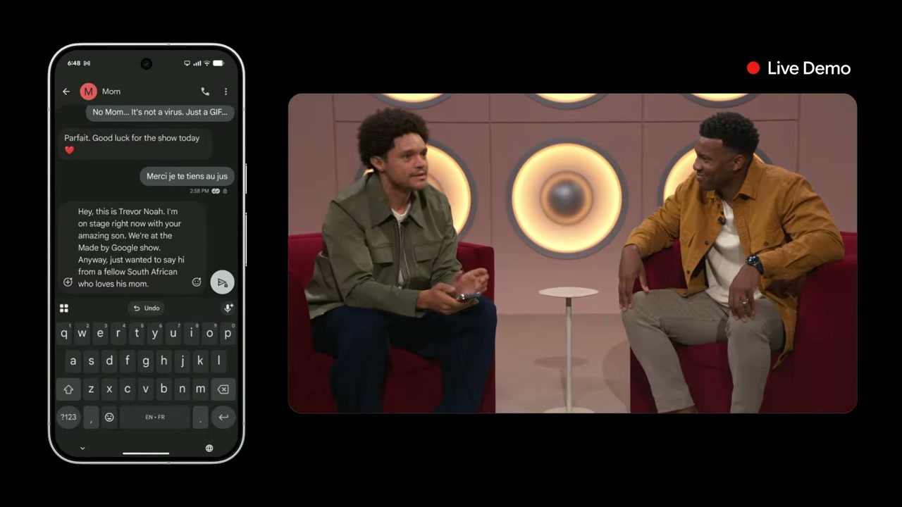

_来源：[Made by Google '26 官方回放 00:58:46–01:03:20](https://www.youtube.com/watch?v=c84y9gAY90c&t=3526s)。_

### 5.1.2 技术机制

实时识别 → 指代与意图理解 → 删除口语噪声和改口 → 结构重排 → 生成可编辑草稿。

> **官方原文摘录｜Gemini Intelligence on Android**  
> “Take the important parts.”
>
> **中文解读：** Rambler 的输出目标是语义完整且可发送的文本，而不是对音频逐字转写。模型必须识别哪些内容是有效意图，哪些只是停顿、重复或自我修正。[查看原文](https://blog.google/products-and-platforms/platforms/android/gemini-intelligence/)

### 5.1.3 执行位置与限制

- 音频只用于实时转写，官方称不保存；
- 使用时界面会显示 Rambler 正在工作；
- Google 没有明确披露整条重写链是否全部在本地运行；
- “全球 rollout”仍受国家、语言、账号和用量限制。

## 5.2 Live Translate：端侧媒体配音

### 5.2.1 功能与执行位置

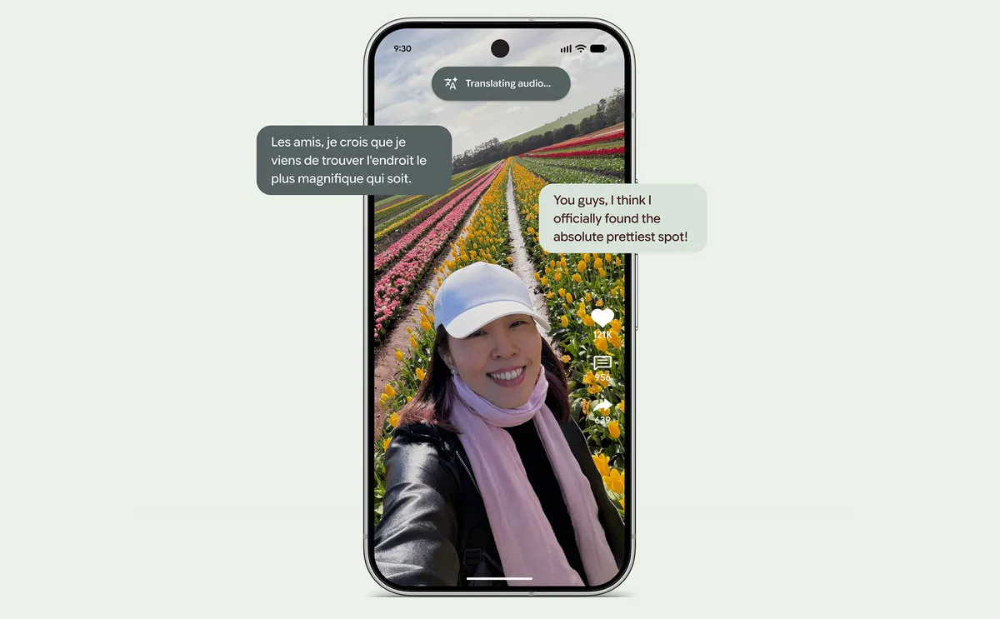

_来源：[Pixel 11 官方功能介绍](https://blog.google/products-and-platforms/devices/pixel/pixel-11-features/)。_

Google 明确表示，视频和音频翻译使用 Tensor G6 上的端侧生成式模型。该设计有利于延迟、离线能力和隐私，但只支持部分国家、语言、媒体与 App，翻译也不保证瞬时完成。

## 5.3 Sign-to-Text：端侧降维后再上云

### 5.3.1 功能结论

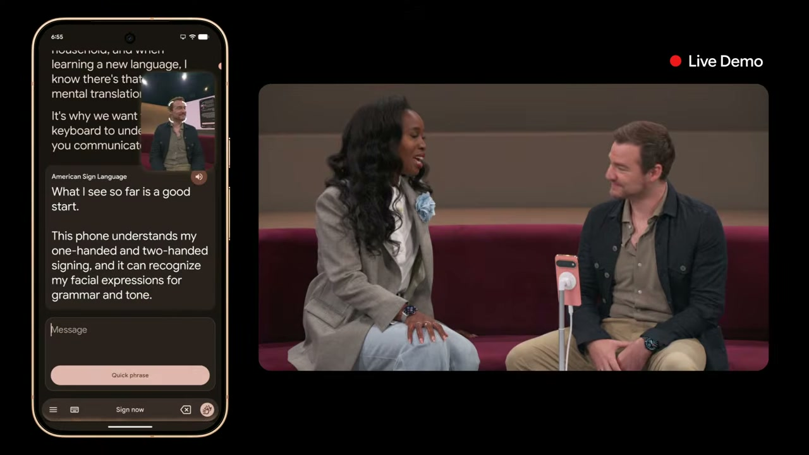

_来源：[Made by Google '26 官方回放 01:06:14–01:10:37](https://www.youtube.com/watch?v=c84y9gAY90c&t=3974s)。_

这项功能的关键不是“摄像头识别手势”，而是完整的手语翻译：手、身体、头部和面部表情共同承载语法与语义，不能按孤立手势查词。

### 5.3.2 数据路径

1. Pixel 相机采集 ASL 视频；
2. MediaPipe Holistic 在设备端提取人体姿态 landmark；
3. 原始视频立即丢弃；
4. 只把几何坐标序列发送到服务器；
5. SL2T 模型进行流式翻译；
6. 英文文本写入 Gboard 或 Live Transcribe。

> **官方原文摘录｜Google DeepMind**  
> “Only these geometric coordinates are sent to the server for translation, allowing the original video to be discarded immediately.”
>
> **中文解读：** 设备端先把原始视频压缩成不含完整画面的几何 landmark，再将坐标序列送往云端翻译。它不是全本地方案，但显著减少了人像、环境和身份信息的暴露。[查看原文](https://deepmind.google/blog/putting-sign-language-ai-into-users-hands/)

### 5.3.3 技术价值与限制

这套设计的价值在于**先在端侧完成隐私降维，再调用更强的云端序列模型**。它比“原始视频全部上传”更克制，也比强行要求全本地更现实。

训练与产品限制包括：

- 训练数据超过 10 万小时，覆盖 50 多种手语，ASL 约占四分之一；
- Pixel 11 首发支持 ASL → 英语；
- 速度、遮挡、取景和方言差异仍会影响准确率；
- 官方研究结果不能直接等同于所有真实场景表现。

---

# 六、核心能力三：相机 AI

## 6.1 Magic Capture：多帧选择而非动作生成

### 6.1.1 功能结论

Magic Capture 的核心不是凭空生成动作，而是从连续采集的真实帧中理解主体和时刻，自动选择更好的照片，同时保存完整视频。

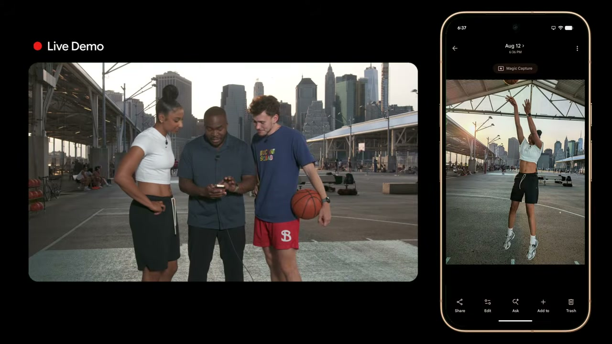

_来源：[Made by Google '26 官方回放 00:48:49–00:52:39](https://www.youtube.com/watch?v=c84y9gAY90c&t=2929s)。_

### 6.1.2 技术机制

Magic Capture 在约 400 帧中识别主体、动作和关键时刻，选择更好的构图与表情，并同时交付 12MP 照片和视频。公开能力还包括自动裁切与去模糊。

### 6.1.3 技术价值与限制

其价值是让 AI 替用户完成“持续盯屏幕、判断何时按快门”的工作，而不是生成现场没有发生的动作。Google 只说明使用 on-device intelligence 与 Gemini models，没有披露逐阶段模型位置、功耗和失败率。

## 6.2 其他影像能力的定位

| 功能 | 技术定位 | 不应混淆的概念 |
|---|---|---|
| Camera Looks | 色调、对比、肤色与场景渲染管线 | 不应全部称为生成式 AI |
| Instant Night Sight | Tensor G6、ISP、传感器和软件协同 | 不只是单一模型升级 |
| Creator Suite | 拍摄、编辑和生成能力的工作流整合 | 产品整合不等于新基础模型 |

---

# 七、核心能力四：可穿戴健康 AI

## 7.1 Health Guardian：从单项算法到持续健康系统

### 7.1.1 功能结论

Health Guardian 把 Watch 的长期传感器数据分成两类用途：一类是胰岛素抵抗、血压和睡眠呼吸等趋势；另一类是呼吸紧急事件的本地检测与升级呼救。前者用于长期观察，后者用于时间敏感的安全响应。

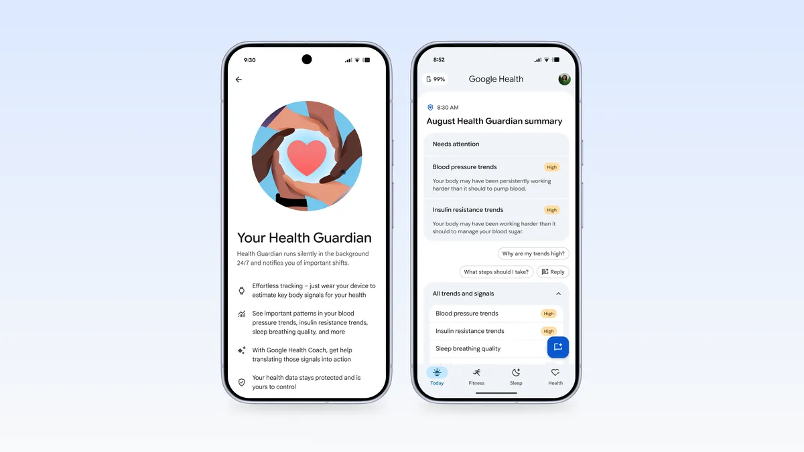

_来源：[Health Guardian 官方介绍](https://blog.google/products-and-platforms/products/google-health/pixel-watch-health-guardian/)。_

发布能力包括胰岛素抵抗趋势、血压趋势、睡眠呼吸质量和呼吸紧急检测。前三项是长期一般健康趋势，不是实时血糖、实时血压或医学诊断，不能据此调整药物或治疗。

> **官方原文摘录｜Health Guardian**  
> “Insulin resistance trends are built with our latest large sensor foundational model, which is pretrained on over one trillion minutes of data.”
>
> **中文解读：** Google 正在用大规模自监督传感器预训练替代“每个健康指标单独训练一个模型”。同一个基础表征可以适配代谢、心血管、睡眠等多种下游任务。[查看原文](https://blog.google/products-and-platforms/products/google-health/pixel-watch-health-guardian/)

## 7.2 SensorFM 与 WavesFM

### 7.2.1 模型机制

| 模型 | 输入 | 建模目标 | 官方披露规模 |
|---|---|---|---|
| SensorFM | PPG、加速度、EDA、皮肤温度、高度等分钟级特征 | 学习跨设备、跨人群的通用生理表示 | 500 万同意用户、超过 1 万亿分钟、100+ 国家、20+ 设备、35 个任务 |
| WavesFM | PPG/加速度原始短波形 + 多日序列 | 同时学习局部波形形态和长期变化 | 第一阶段约 680 万小时/32.4 万人；第二阶段约 530 万小时/1 万人；58 个任务 |

SensorFM 使用缺失感知编码，使同一模型能够适配不同传感器组合；WavesFM 采用短波形编码器与长时间编码器两阶段结构。两者共同说明，Watch 正从“每个指标一个算法”转向“可复用生理表征 + 下游任务”。

> **官方原文摘录｜Google Research**  
> “SensorFM learns a single, reusable representation of sensed human physiology.”
>
> **中文解读：** SensorFM 的目标不是直接输出某一种疾病结论，而是先学习通用生理表示，再用较少标注数据适配具体健康任务。[查看原文](https://research.google/blog/sensorfm-towards-a-general-intelligence-and-interface-for-wearable-health-data/)

### 7.2.2 技术价值与限制

覆盖多设备、多年份和数百万用户的纵向传感器数据，比单次聊天功能更难复制。但基础模型规模大，不等于临床有效性已经充分验证；真实价值仍取决于疾病终点、亚群公平性、误报/漏报和监管证据。

## 7.3 呼吸紧急检测

### 7.3.1 用户与设备流程

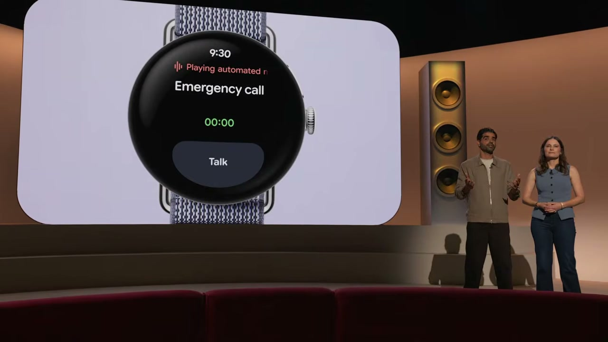

_来源：[Made by Google '26 官方回放 01:13:28–01:16:36](https://www.youtube.com/watch?v=c84y9gAY90c&t=4408s)；[产品说明](https://blog.google/products-and-platforms/devices/pixel/pixel-watch-breathing-emergency-detection/)。_

检测链在 Watch 端完成：PPG 判断持续严重低氧，运动与高度传感器排除活动和海拔变化；若用户没有响应，设备依次触发强震动、全屏提示、声音警报和 30 秒倒计时，最后通过手机或 LTE Watch 呼叫急救并发送位置。

### 7.3.2 医学与产品边界

> **官方原文摘录｜Pixel Watch 产品说明**  
> “Breathing emergency detection may not detect every instance of a breathing emergency.”
>
> **中文解读：** 这是风险检测和升级呼救工具，不是保证发现所有事件的医疗监护系统；漏检、误触和连接失败必须与功能一起理解。[查看原文](https://blog.google/products-and-platforms/devices/pixel/pixel-watch-breathing-emergency-detection/)

限制包括：

- 可能漏检，也可能因传感器读数不佳误触；
- 睡眠超过 30 分钟后不运行；
- 不面向慢性低血氧、部分呼吸/心脏疾病或孕期用户；
- 呼救依赖设备电量、蜂窝/电话连接，急救响应不保证；
- 截至发布时仅部分欧洲市场可用，获 CE 标记，未获美国 FDA 评估或许可。

## 7.4 Health Coach

### 7.4.1 功能结论

Health Coach 使用用户授权的睡眠、运动、营养、环境和健康记录生成训练与生活计划，并能根据天气、恢复状态或旧伤调整方案。它具备长期上下文、目标、计划和跨设备执行，接近健康规划 Agent。

但它需要 Google Health Premium、Health App 和互联网；官方明确说明它不是医疗建议。

---

# 八、端侧算力底座

## 8.1 Tensor G6

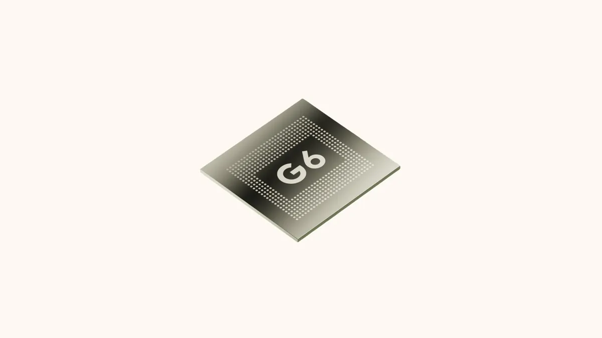

_来源：[Pixel 11 官方发布](https://blog.google/products-and-platforms/devices/pixel/google-pixel-11-pro-xl/)。_

| 指标 | Google 官方口径 | 解读 |
|---|---:|---|
| TPU compute | 比 Tensor G5 多 50% | 提高端侧模型吞吐与并发基础 |
| 端侧 AI 任务速度 | 最高 3.5× | 内部特定工作负载，不代表所有 Gemini 请求 |
| 端侧 AI 能耗 | 最高少 3.5× | 有利于相机、语音和持续感知 |
| Web 浏览 / App 启动 | 快 25% / 15% | 平台性能，不等同于 AI 性能 |

Google 没有公开 Nano 参数量、上下文长度、量化方式、TPU TOPS，以及多模型持续运行时的内存、功耗和热限制。因此，这些数字应保留为厂商内部测试口径。

---

# 九、发布状态与成熟度

| 功能 | 截至 2026-08-13 的状态 | 主要限制 |
|---|---|---|
| 跨 App 多步骤任务 | Pixel 11 称支持 40+ App | 部分国家/语言，18+，兼容性和用量不同；需监督和最终确认 |
| 上下文卡片/主动建议 | 分批推出 | 个人数据需授权；触发规则与误触率未披露 |
| Rambler | 开始 rollout | 部分国家/语言；结果可能有误 |
| Sign-to-Text | Pixel 11 首发可用 | 初期 ASL → 英语；更多设备和语言后续加入 |
| Magic Capture | Pixel 11 系列 | 模型位置、功耗、失败率未披露 |
| Live Translate 媒体配音 | Pixel 11 能力 | 部分国家、语言、媒体和 App |
| 胰岛素抵抗/血压趋势 | 预计 2026 年 9 月 | 需长期数据；一般健康用途 |
| 睡眠呼吸质量趋势 | Coming soon | 不能用于筛查睡眠呼吸暂停 |
| 呼吸紧急检测 | 部分欧洲市场 | Pixel Watch 4/5；CE；未获 FDA 评估；依赖连接 |
| Health Coach | 已推出 | Premium + App + 互联网；不是医疗建议 |

对中国大陆用户，硬件销售、Google 服务、账号、语言、网络和订阅可用性都需要以所在地支持页为准。“全球 rollout”不等于中国大陆可直接使用。

---

# 十、综合技术判断

## 10.1 真正的竞争门槛是执行可靠性

移动端 Agent 的评价标准不应只是模型 benchmark，而应包括：完整任务成功率、错误恢复率、越权率、人工接管成本、不可逆操作确认和提示注入防护。Google 的优势是同时控制 Android、Pixel、Gemini、账号服务与主要 App 入口；风险也来自同样深的权限整合。

## 10.2 端侧 AI 的重点是任务放置

本次最值得借鉴的不是“所有模型本地化”，而是让低延迟动作、持续传感和隐私预处理留在设备端，让超出算力的敏感推理进入可验证的受保护云，让在线事务进入必要的服务端。

评估端云架构时应追问：什么原始数据离开设备、以什么表示离开、进入哪个受信环境、保存多久、谁能验证，而不是只问一句“是不是 on-device”。

## 10.3 本次最值得跟踪的三个方向

1. **跨 App Agent 的真实任务成功率与第三方开放机制**；
2. **Sign-to-Text 的端侧数据降维和多手语扩展**；
3. **SensorFM/WavesFM 如何从一般健康趋势进入经过验证的临床场景**。

---

# 附录 A：发布会 AI 时间索引

| 时间 | 内容 | 视频 |
|---|---|---|
| 00:19:38 | Gemini Intelligence 总览 | [跳转](https://www.youtube.com/watch?v=c84y9gAY90c&t=1178s) |
| 00:36:35 | Tensor G6、端侧 AI 与隐私 | [跳转](https://www.youtube.com/watch?v=c84y9gAY90c&t=2195s) |
| 00:48:49 | Magic Capture | [跳转](https://www.youtube.com/watch?v=c84y9gAY90c&t=2929s) |
| 00:54:30 | 上下文卡片与 Watch 建议 | [跳转](https://www.youtube.com/watch?v=c84y9gAY90c&t=3270s) |
| 00:56:41 | Maps → OpenTable 多步骤任务 | [跳转](https://www.youtube.com/watch?v=c84y9gAY90c&t=3401s) |
| 00:58:46 | Rambler 与多语言输入 | [跳转](https://www.youtube.com/watch?v=c84y9gAY90c&t=3526s) |
| 01:06:14 | Sign-to-Text | [跳转](https://www.youtube.com/watch?v=c84y9gAY90c&t=3974s) |
| 01:13:28 | Health Guardian 与呼吸紧急检测 | [跳转](https://www.youtube.com/watch?v=c84y9gAY90c&t=4408s) |
| 01:19:09 | Health Coach | [跳转](https://www.youtube.com/watch?v=c84y9gAY90c&t=4749s) |

# 附录 B：主要官方资料

- [Made by Google '26 完整回放](https://www.youtube.com/watch?v=c84y9gAY90c)
- [Made by Google 2026 官方合集](https://blog.google/products-and-platforms/devices/pixel/made-by-google-2026/)
- [Gemini Intelligence on Android](https://blog.google/products-and-platforms/platforms/android/gemini-intelligence/)
- [Gemini 多步骤任务早期预览](https://blog.google/innovation-and-ai/products/gemini-app/android-multi-step-tasks/)
- [Android Agent 安全与隐私说明](https://blog.google/security/android-gemini-intelligence-security-privacy/)
- [Private AI Compute 产品说明](https://blog.google/innovation-and-ai/products/google-private-ai-compute/)
- [Private AI Compute technical brief](https://services.google.com/fh/files/misc/private_ai_compute_technical_brief.pdf)
- [DeepMind：Sign-to-Text](https://deepmind.google/blog/putting-sign-language-ai-into-users-hands/)
- [Health Guardian](https://blog.google/products-and-platforms/products/google-health/pixel-watch-health-guardian/)
- [Google Research：SensorFM](https://research.google/blog/sensorfm-towards-a-general-intelligence-and-interface-for-wearable-health-data/)
- [WavesFM](https://arxiv.org/abs/2605.09173)
- [呼吸紧急检测](https://blog.google/products-and-platforms/devices/pixel/pixel-watch-breathing-emergency-detection/)

> 图片说明：全部产品图来自 Google 官方博客；发布会截图来自 Google 官方完整回放。文中未使用自绘流程图代替官方架构证据。性能、行业领先和隐私保证均保留为 Google 官方口径，不视为独立验证。
