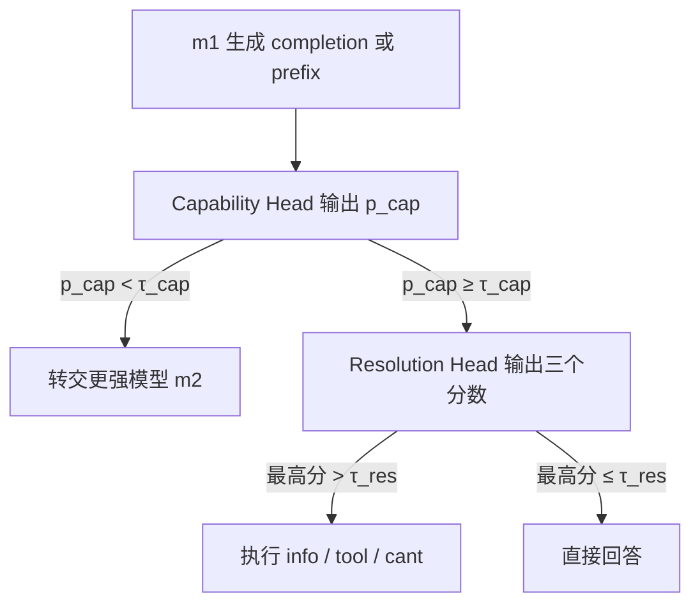
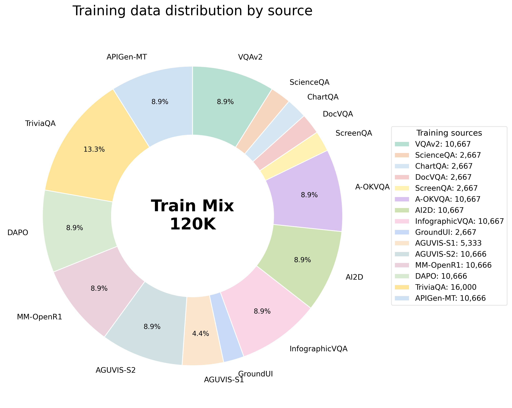
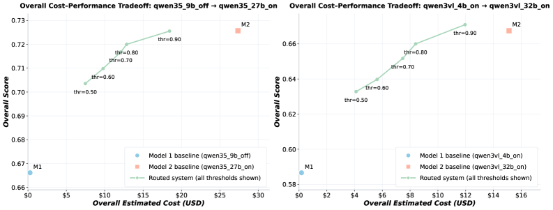
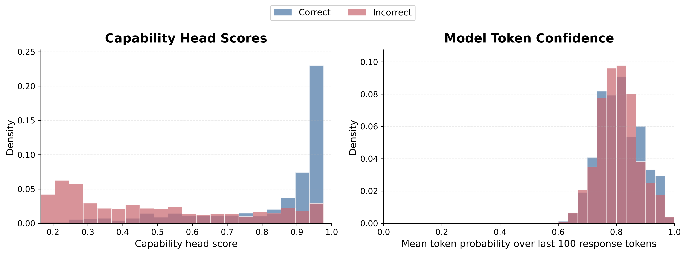

# Multi-Head Latent Control: A Unified Interface for LLM Agent Decision Making

> 论文：[arXiv:2607.14277v1](https://arxiv.org/abs/2607.14277)  
> 作者：Amirhosein Ghasemabadi、Ruichen Chen、Bahador Rashidi、Di Niu  
> 代码：[Multi-Head-Latent-Control](https://github.com/Amirhosein-gh98/Multi-Head-Latent-Control)

## 1. 整体介绍

> **论文原文：**“more than next-token prediction”  
> ——[Abstract](https://arxiv.org/abs/2607.14277)


> 图 1：左侧是 Multi-Head Latent Control 的总体架构，中间是多步骤 Agent loop，右侧是在 AndroidWorld 上的成本—成功率结果。[论文 Figure 1](https://arxiv.org/html/2607.14277#S1.F1)

这篇论文研究的不是如何让语言模型更好地预测下一个 token，而是如何让模型在作为 Agent 运行时，做出一组额外的**控制决策**。

一个可靠的 Agent 不仅要决定接下来生成什么，还要判断：

1. 当前模型是否有能力完成这个任务；
2. 是否应该把任务交给更强的模型；
3. 当前是否缺少必要信息；
4. 是否需要调用搜索、数据库或其他工具；
5. 当前条件下是否无法完成任务；
6. 是否可以直接回答。

这些判断并不天然包含在 next-token prediction 目标中。一个模型可以生成语言流畅的回答或格式正确的工具调用，但这并不意味着它选择了正确的处理方式。

论文指出，两种过度保守的策略同样存在问题：

- 所有任务都调用工具；
- 所有任务都交给最大的模型。

这会带来额外计算、延迟、外部调用和 token 成本。在长时程 Agent 中，控制错误还会沿多步骤执行轨迹继续传播。[论文 §1 Introduction](https://arxiv.org/html/2607.14277#S1)

Multi-Head Latent Control 的基本做法是：

```text
冻结原始 LLM / VLM
→ 读取模型生成过程中的 hidden-state trajectory
→ 使用轻量控制 Head 预测部署决策
```

系统包含两个控制头：

- **Capability Head**：判断当前模型是否足以完成这个实例，还是应该转交更强模型；
- **Resolution Head**：当任务继续留在当前模型时，判断应该请求信息、调用工具、无法回答还是直接回答。

因此，这篇论文把 Agent 控制拆成了两个层次：

```text
第一层：谁来做？
第二层：当前模型应该怎么做？
```

## 2. Insight 与核心贡献

> **论文原文：**“from a model’s latent generation process”  
> ——[Abstract](https://arxiv.org/abs/2607.14277)

### 2.1 核心 Insight：模型内部可能已经包含控制信息

现有 Router 通常在生成开始前读取 prompt 特征，然后决定使用哪个模型。Multi-Head Latent Control 不只看输入，而是等待模型开始生成以后，读取生成 token 对齐的 hidden states。

其核心假设是：

> 模型是否能够解决当前任务、当前是否需要工具或更多信息，这些信号可能没有可靠地出现在最终回答或 token probability 中，但仍然存在于生成过程的内部表示里。

这也是论文使用 **latent control** 这个名字的原因。控制信号不是由模型再生成一句“我会不会做”得到，而是由轻量预测器从 hidden-state trajectory 中解码出来。[论文 §2 与 §3](https://arxiv.org/html/2607.14277#S3)

### 2.2 为什么要冻结 backbone

作者不希望为每一个新 LLM 或 VLM 重新进行完整微调。论文采用 post hoc adaptation：

```text
backbone 参数保持冻结
只训练附加的轻量控制 Head
```

训练数据仍然由同一个冻结 backbone 产生。模型先生成 completion，系统记录生成过程的 hidden states，再用外部监督训练 Head。

这样做的意义是：控制能力被放在模型外部的轻量接口中，而不是重新写入整个基础模型。[论文 §3.4](https://arxiv.org/html/2607.14277#S3.SS4)

### 2.3 为什么需要两个 Head

“模型是否胜任”和“模型应该采取什么动作”是两个不同的问题。

假设 Capability Head 认为当前模型不足以完成任务，那么最合理的动作是直接升级到更强模型，此时不必再让当前模型决定是否调用工具。

只有当 Capability Head 决定保留当前模型时，Resolution Head 才需要继续判断：

- 是否请求更多信息；
- 是否调用工具；
- 是否无法回答；
- 是否直接回答。

这种分解避免把模型选择、工具调用、澄清和拒答全部塞进一个混合分类器中。[论文 §3.1～§3.3](https://arxiv.org/html/2607.14277#S3)

### 2.4 论文的核心贡献

论文的主要贡献可以概括为四点：

1. **提出冻结模型上的轻量控制层。**  
   不修改 backbone，直接从 hidden-state trajectory 中读取推理时控制信号。

2. **提出 Capability Head。**  
   对具体实例判断当前模型是否足够，并据此决定保留控制权还是升级到更强模型。

3. **提出 Resolution Head。**  
   在保留当前模型后，选择请求信息、调用工具、无法回答或直接回答。

4. **证明这些控制信号具有实际系统价值。**  
   在多模型路由、AndroidWorld、When2Call、TriviaQA 和 prefix-time routing 中，控制 Head 改善了成本—质量权衡或干预决策质量。[论文 §1 Contributions](https://arxiv.org/html/2607.14277#S1)

## 3. 架构与方法

> **论文原文：**“The backbone is frozen”  
> ——[§3.1 Problem Setup](https://arxiv.org/html/2607.14277#S3.SS1)

### 3.1 输入：生成 token 对齐的 hidden-state trajectory

设输入为 $x$，冻结的 primary model $m_1$ 生成：

$$
\hat y=(\hat y_1,\ldots,\hat y_N)
$$

对模型的第 $\ell$ 层，论文定义：

$$
H^{(\ell)}
=
[h_1^{(\ell)};\ldots;h_N^{(\ell)}]
\in\mathbb{R}^{N\times d}
$$

其中：

- $N$ 是 completion 中的生成 token 数；
- $d$ 是模型的 hidden size；
- $h_t^{(\ell)}$ 是生成 token $\hat y_t$ 对应的 hidden state；
- $H^{(\ell)}$ 就是这一层的 hidden-state trajectory。

论文只读取与**生成 token** 对齐的 hidden states，不把 prompt hidden states 或其他 conditioning signals 作为 Head 输入。作者这样设计，是为了在 text-only 和 vision-language 场景中使用统一接口。[论文 §3.1～§3.2](https://arxiv.org/html/2607.14277#S3.SS1)

### 3.2 两个 Head 默认读取不同层

Capability 与 Resolution 两类信息不一定在同一层最容易区分。论文默认使用：

$$
H^{\mathrm{cap}}=H^{(L)}
$$

$$
H^{\mathrm{res}}=H^{(\ell_{\mathrm{res}})}
$$

也就是：

- Capability Head 读取 final-layer trace；
- Resolution Head 读取选定的 middle-layer trace。

Appendix C 的消融结果支持这个选择：在论文测试的设置中，final layer 对 adequacy prediction 的整体表现最好，middle layer 对 resolution decision 的 F1 和 accuracy 最好。[Appendix C.1](https://arxiv.org/html/2607.14277#A3.SS1)；[Appendix C.2](https://arxiv.org/html/2607.14277#A3.SS2)

由于不同 completion 的长度不同，论文先把可变长轨迹压缩成固定预算表示：

$$
\tilde H^{\mathrm{cap}}
=
\Pi_{\mathrm{cap}}(H^{\mathrm{cap}})
$$

$$
\tilde H^{\mathrm{res}}
=
\Pi_{\mathrm{res}}(H^{\mathrm{res}})
$$

这里的 $\Pi$ 表示轨迹投影或压缩。论文正文定义了这个接口，但没有把它展开成具体的平均池化、卷积或采样公式。

### 3.3 从轨迹表示得到两个控制输出

压缩后的轨迹分别进入两个 encoder：

$$
z_{\mathrm{cap}}
=
e_{\phi}^{\mathrm{cap}}(\tilde H^{\mathrm{cap}}),
\qquad
z_{\mathrm{res}}
=
e_{\phi}^{\mathrm{res}}(\tilde H^{\mathrm{res}})
\tag{1}
$$

然后通过 sigmoid 得到控制分数：

$$
p_{\mathrm{cap}}
=
\sigma\!\left(h_{\mathrm{cap}}(z_{\mathrm{cap}})\right)
$$

$$
\mathbf{s}_{\mathrm{res}}
=
\sigma\!\left(h_{\mathrm{res}}(z_{\mathrm{res}})\right)
\tag{2}
$$

两个输出分别是：

| 输出 | 形状 | 含义 |
|---|---:|---|
| $p_{\mathrm{cap}}$ | 标量 | 当前模型对这个实例是否足够 |
| $\mathbf{s}_{\mathrm{res}}$ | 三维向量 | `info`、`tool`、`cant` 三类干预分数 |

Resolution vector 写成：

$$
\mathbf{s}_{\mathrm{res}}
=
[s_{\mathrm{info}},s_{\mathrm{tool}},s_{\mathrm{cant}}]
\in[0,1]^3
$$

“直接回答”没有第四个显式输出。当三个干预分数都没有超过阈值时，系统直接回答。[论文 Eq. (1)～(2)](https://arxiv.org/html/2607.14277#S3.SS2)

### 3.4 推理时怎样决定执行路径



系统首先检查 Capability Head：

$$
p_{\mathrm{cap}}<\tau_{\mathrm{cap}}
\quad\Rightarrow\quad
\text{transfer to }m_2
$$

否则保留 $m_1$，再检查 Resolution Head：

$$
\max_{a\in\mathcal A}s_{\mathrm{res},a}>\tau_{\mathrm{res}}
$$

其中：

$$
\mathcal A=\{\mathrm{info},\mathrm{tool},\mathrm{cant}\}
$$

如果最高分超过阈值，就执行对应干预；否则直接回答。

论文默认使用：

$$
\tau_{\mathrm{cap}}=0.8,
\qquad
\tau_{\mathrm{res}}=0.5
$$

阈值越高，Capability routing 越倾向于把任务交给大模型，成本和性能也随之变化。[论文 §3.3](https://arxiv.org/html/2607.14277#S3.SS3)

### 3.5 两个 Head 分别怎样训练

共同训练流程为：

```text
冻结 backbone 生成 completion
→ 保存生成 token 对齐的 hidden-state trajectory
→ 构造对应 Head 的 ground truth
→ 只训练轻量控制 Head
```

#### Capability Head



> 图 3：Capability Head 使用约 120K 个混合样本，覆盖视觉问答、图表和文档理解、UI grounding、数学推理、开放域问答以及多轮工具使用。[论文 Figure 3 与 Appendix A.1](https://arxiv.org/html/2607.14277#A1.F3)

Capability Head 的训练数据来自 VQAv2、ScienceQA、ChartQA、DocVQA、ScreenQA、A-OKVQA、AI2D、InfographicVQA、GroundUI、AGUVIS、MM-OpenR1、DAPO-Math、TriviaQA 和 APIGen-MT-5k 等数据集。

这些数据集并不直接共同计算一个 `correctness_score`。实际关系是：

```text
数据集提供 prompt 和 reference
→ 冻结 backbone 生成 completion 与 hidden-state trajectory
→ 外部 LLM Judge 比较 completion 和 reference
→ 得到 [0,1] 的 scalar adequacy score
→ Capability Head 从 hidden states 回归这个分数
```

论文实验使用 Qwen3-VL-30B-A3B 作为 Judge。连续分数比简单的正确/错误标签包含更多信息，因为回答可能部分正确或不完整。[论文 §3.4.1](https://arxiv.org/html/2607.14277#S3.SS4.SSS1)；[Appendix A.1](https://arxiv.org/html/2607.14277#A1.SS1)

训练损失为 weighted MSE：

$$
\mathcal L_{\mathrm{cap}}
=
\frac{1}{M_{\mathrm{cap}}}
\sum_{i=1}^{M_{\mathrm{cap}}}
w_i\,
\ell_{\mathrm{reg}}
\left(
p_{\mathrm{cap}}^{(i)},
y_i^{\mathrm{cap}}
\right)
\tag{3}
$$

$w_i$ 用来补偿高 adequacy 与低 adequacy 样本数量不均衡的问题。

#### Resolution Head

Resolution Head 使用 When2Call。该数据集的 released training data 是 preference-oriented，并不直接包含 Head 所需的逐样本 resolution label。

作者使用外部 Judge LLM 离线派生 gold label：

| 正确处理方式 | GT |
|---|---|
| 请求更多信息 | $[1,0,0]$ |
| 调用工具 | $[0,1,0]$ |
| 当前条件下无法回答 | $[0,0,1]$ |
| 直接回答 | $[0,0,0]$ |

随后，冻结 backbone 回答相同 query，并保存 hidden-state trajectory。即使 backbone 表面选择了错误动作，Resolution Head 仍然针对外部 Judge 给出的正确 resolution label 训练。[Appendix A.2](https://arxiv.org/html/2607.14277#A1.SS2)

训练损失为三个动作维度上的 BCE：

$$
\mathcal L_{\mathrm{res}}
=
\frac{1}{M_{\mathrm{res}}}
\sum_{i=1}^{M_{\mathrm{res}}}
\sum_{a\in\mathcal A}
\ell_{\mathrm{BCE}}
\left(
s_a^{(i)},
y_{i,a}^{\mathrm{res}}
\right)
\tag{4}
$$

## 4. 实验结果

> **论文原文：**“Lower cost and higher score are preferred.”  
> ——[Figure 2](https://arxiv.org/html/2607.14277#A0.F2)

论文在 Qwen3-VL、Qwen3.5 和 Gemma 三个模型家族上进行实验，覆盖 2B～32B、thinking 与 non-thinking 模型。

评估任务包括：

- Capability routing：SimpleVQA、ScreenSpot-Pro、CharXiv-Reasoning、MathVerse、MathVista、MMLU-Pro；
- 长时程 Agent：AndroidWorld；
- Resolution decision：When2Call；
- Web search decision：TriviaQA。

[论文 §4 Experiments](https://arxiv.org/html/2607.14277#S4)

### 4.1 动态路由能否减少大模型调用

Figure 1(c) 与 Table 1 给出的 AndroidWorld 结果是：

| 系统 | 得分 | 付费 API 成本 |
|---|---:|---:|
| Qwen3-VL-4B | $0.47$ | $0$ |
| Qwen3-VL-32B | $0.58$ | $\$2.70$ |
| Routed 4B $\rightarrow$ 32B | $0.60$ | $\$0.25$ |
| Qwen3.5-9B | $0.51$ | $0$ |
| Qwen3.5-27B | $0.59$ | $\$1.49$ |
| Routed 9B $\rightarrow$ 27B | $0.56$ | $\$0.21$ |

第一组 routed system 的付费成本下降 $90.7\%$，第二组下降 $85.8\%$。这里的小模型被假设在本地运行，因此表中的 API cost 只计算 fallback 大模型调用。[论文 Table 1](https://arxiv.org/html/2607.14277#S3.T1)

### 4.2 Threshold 怎样控制成本与性能



> 图 2：两组 routed system 在不同 Capability threshold 下的 overall cost–performance tradeoff。[论文 Figure 2](https://arxiv.org/html/2607.14277#A0.F2)

横轴是 overall estimated cost，纵轴是 overall score，越靠左上越好。

图中包含三类点：

- 只使用本地小模型；
- 始终使用大模型；
- 使用不同 threshold 的 routed system。

threshold 较低时，更多任务留在本地，成本低但更容易保留小模型错误；threshold 较高时，更多任务升级到大模型，性能提高但成本上升。

因此，Capability score 不是一个固定路由答案，而是可以通过 threshold 选择不同的成本—质量工作点。论文主结果使用的 operating point 是 $0.8$。

### 4.3 Resolution Head 是否比模型表面动作更可靠

When2Call 实验比较：

```text
backbone 自己在文本中选择的动作
vs.
从 hidden states 读取 Resolution Head 的动作
```

论文报告：

- Qwen-VL-2B：F1 从 $37.3$ 提升到 $49.0$，accuracy 从 $52.7$ 提升到 $65.1$；
- Qwen3.5-4B：F1 从 $43.5$ 提升到 $54.5$，accuracy 从 $57.9$ 提升到 $69.5$。

这说明模型表面动作即使错误，hidden-state trajectory 中仍可能保留足够信息，让轻量 Head 恢复更合理的 resolution decision。[论文 §4.2 与 Table 3](https://arxiv.org/html/2607.14277#S4.SS2)

### 4.4 Capability Head 能否改善工具调用决策

在 TriviaQA 中，Capability Head 不再把低 adequacy 样本交给更强模型，而是把它们升级为 web search。

以 Qwen3-VL-4B 为例：

- 任务得分从 $0.292$ 提升到 $0.756$，相对提高 $158.9\%$；
- missed-needed web calls 从 $708$ 降到 $244$，减少 $65.5\%$；
- web calls 从 $67$ 增加到 $518$。

因此，Head 的作用不是简单减少工具调用，而是更准确地识别哪些问题确实需要外部搜索。[论文 §4.3 与 Table 4](https://arxiv.org/html/2607.14277#S4.SS3)

### 4.5 为什么 token confidence 不能替代 Capability Head



> 图 4：在 Qwen3.5-9B / ScreenSpot-Pro 上，对比 Capability Head score 与回答最后 100 个 token 的平均 probability。[论文 Figure 4](https://arxiv.org/html/2607.14277#A2.F4)

右图中，正确样本与错误样本的 token confidence 大量重叠，说明模型可以用很高的 token probability 生成错误答案。

左图中，Capability Head score 的区分更明显：

- 正确样本更集中在高分区域；
- 错误样本分布更宽，并明显延伸到低分区域。

这直接支持论文的核心 Insight：adequacy signal 不一定可靠地存在于表层 token probability 中，但可以从 hidden-state trajectory 中被解码出来。[Appendix B.3](https://arxiv.org/html/2607.14277#A2.SS3)

### 4.6 能否在回答完成前提前路由

默认方法需要等待小模型完成回答以后再运行 Capability Head，这可能浪费已经朝错误方向发展的生成计算。

论文因此测试 prefix-time Capability Head：

- Full 训练 / Full 推理；
- Full 训练 / Prefix-200 推理；
- Prefix-200 训练 / Prefix-200 推理。

结果表明，直接把 full-trained Head 用于短 prefix 会明显退化；如果要在前 200 个 token 提前判断，最好直接使用 prefix trajectory 训练 Head。

Appendix C.4 还比较了 $50$、$200$、$1000$ 和 full length。总体上，越长的 trajectory 能提供越强、校准越好的 adequacy signal，但 prefix training 已经可以支持有用的早期路由。[论文 §4.4](https://arxiv.org/html/2607.14277#S4.SS4)；[Appendix C.4](https://arxiv.org/html/2607.14277#A3.SS4)

## 5. 总结

Multi-Head Latent Control 解决的是 Agent 推理过程中的控制问题，而不是生成加速问题。

其完整主链可以概括为：

```text
冻结 primary model 生成 completion 或 prefix
→ 收集生成 token 对齐的 hidden-state trajectory
→ Capability Head 判断当前模型是否胜任
→ 不胜任：转交 stronger model
→ 胜任：Resolution Head 判断 info / tool / cant
→ 没有干预信号：直接回答
```

论文最重要的 Insight 是：模型能否解决任务、是否需要工具或更多信息，这些信号可能没有可靠地体现在最终文本和 token probability 中，但仍然可以从模型生成过程的 hidden states 中读取。

Capability Head 负责“谁来做”，Resolution Head 负责“当前模型怎么做”。两个 Head 都只读取冻结 backbone 的 latent trajectory，通过外部 Judge 构造的监督进行训练。

实验结果表明，这套控制信号可以：

- 减少不必要的大模型调用；
- 改善多模型系统的成本—质量权衡；
- 提高 clarification、tool use、abstention 与 direct answer 的选择质量；
- 更准确地识别何时需要 web search；
- 在部分生成 prefix 上提前发现模型可能无法完成任务。

