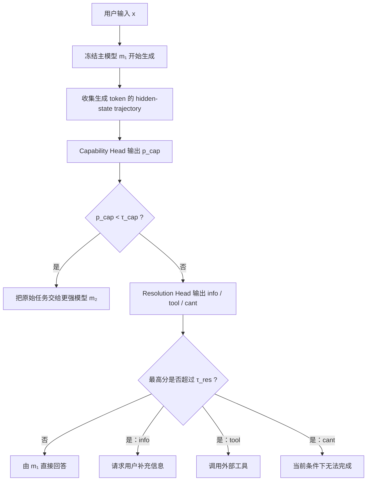
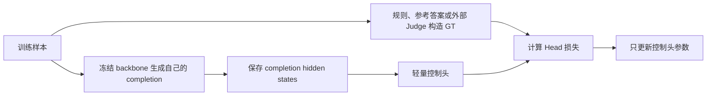

# Multi-Head Latent Control: A Unified Interface for LLM Agent Decision Making

> 论文：**Multi-Head Latent Control: A Unified Interface for LLM Agent Decision Making**  
> arXiv：[2607.14277](https://arxiv.org/abs/2607.14277)  
> 作者：Amirhosein Ghasemabadi、Ruichen Chen、Bahador Rashidi、Di Niu  
> 机构：University of Alberta、Huawei Technologies Canada  
> 代码：[Multi-Head-Latent-Control](https://github.com/Amirhosein-gh98/Multi-Head-Latent-Control)  
> 版本：arXiv v1，2026-07-15  
> 阅读方式：本文不是逐段翻译论文，而是按“问题、方法、训练、实验、落地”的顺序重组内容。Related Work 不单独展开；附录只在解释训练数据、图表和局限时引用。

---

## 先说结论：这是一层“推理控制面”，不是一个新模型

这篇论文要做的事情是：

> 让一个冻结的小模型在生成过程中暴露自己的 hidden states，再用两个轻量控制头判断“小模型是否胜任”以及“下一步应该直接回答、调用工具、请求更多信息还是放弃”，从而减少不必要的大模型调用和错误的 Agent 行为。

它不是新的基础模型，也不是新的 Transformer 结构，更不是新的推理引擎。它是在已有 LLM/VLM 旁边增加的一层 **推理时控制逻辑**。

可以先把系统理解成两部分：

```text
基础模型：负责生成内容、推理、工具参数和自然语言
控制头：负责判断由谁处理，以及应该采取哪类行为
```

这篇论文最重要的思想不是“多头”，而是：

> 模型在生成答案时形成的 hidden-state trajectory，可能比输入问题、输出文本或者 token confidence 更能反映模型是否正在走向正确答案。

---

摘要中的信息可以拆成三个问题：Agent 还需要做哪些生成之外的决策，论文为此增加了什么模块，以及这些模块带来了怎样的系统收益。

### Agent 的问题不只是预测下一个 token

普通语言模型的核心目标是：

$$
P(y_t\mid x,y_{<t})
$$

即根据输入 $x$ 和已经生成的 token，预测下一个 token $y_t$。

但一个可靠的 Agent 在真实部署中，还需要做一组“控制决策”：

1. 当前推理是否应该继续；
2. 当前模型能力是否足够；
3. 是否应该把任务交给更强的模型；
4. 是否缺少必要的用户信息；
5. 是否应该调用搜索、数据库、API 等外部工具；
6. 当前条件下是否根本无法完成；
7. 是否可以直接回答。

这些问题与“下一个 token 是什么”并不完全相同。

例如，用户要求 Agent 预订机票。语言模型可能非常流畅地生成一个订票工具调用，但如果用户没有提供出发地和日期，那么真正正确的行为不是“继续生成更漂亮的工具调用”，而是“先询问缺失参数”。

因此，论文关心的是：

> 能否在不重新微调基础模型的情况下，增加一个专门负责部署时决策的轻量控制接口？

### 两个控制头分别解决两个问题

论文把部署决策拆成两个层次。

第一层是 **Capability Head**：

> 当前主模型 $m_1$ 是否足以处理这个具体任务？

它输出一个标量：

$$
p_{\mathrm{cap}}\in[0,1]
$$

分数越高，表示越相信当前模型能够完成任务；分数较低时，把原始任务转交给更强的模型 $m_2$。

第二层是 **Resolution Head**：

> 如果任务继续由当前模型处理，应该采用什么处置方式？

它输出三个干预分数：

$$
\mathbf{s}_{\mathrm{res}}
=
[s_{\mathrm{info}},s_{\mathrm{tool}},s_{\mathrm{cant}}]
$$

分别表示：

- `info`：请求更多信息；
- `tool`：调用工具；
- `cant`：当前条件下无法完成；
- 三个分数都不触发：直接回答。

### 论文报告了怎样的收益

论文报告：

- 在 AndroidWorld 中，4B→32B 动态路由相比始终使用 32B，将付费大模型 API 成本降低约 90.7%；
- 在多个 benchmark 的平均结果中，付费大模型成本降低约 27%～53%；
- Resolution Head 在 WHEN2CALL 上最高提高 11.7 个 F1 点和 12.4 个准确率点；
- 在 TriviaQA 的工具升级实验中，任务得分相对提升最高约 158.9%，应该调用工具却漏掉的情况最多减少约 65.5%。

这些数字说明控制信号可能具有系统价值，但要注意：

- “成本”主要指付费大模型 API token 成本；
- 本地小模型的计算、功耗和延迟被记为 0；
- “158.9%”是相对提升，基线较低时相对百分比会显得很大。

---

## 为什么 Agent 需要独立的推理时控制层

> 对应论文：§1 Introduction

### “会回答”不等于“会做部署决策”

在普通问答中，模型只需要完成一次输入到输出的映射：

```text
问题 → 回答
```

但在长时程、多步骤 Agent 中，执行过程更像：

```text
理解任务
  ↓
规划下一步
  ↓
选择工具或模型
  ↓
执行动作
  ↓
分析结果
  ↓
判断是否继续、重试、升级或结束
```

一次错误的控制决策可能在后续步骤中不断放大。例如：

- 应该追问参数，却错误调用工具；
- 当前工具不具备能力，却不断重试；
- 小模型已经明显不会，却继续生成很长的错误推理；
- 一个简单步骤也始终调用昂贵的大模型；
- 每一步都调用外部搜索，带来高延迟和额外费用。

因此，Agent 的可靠性不仅取决于基础模型的知识和生成能力，还取决于它是否知道：

> 什么时候继续、什么时候停、什么时候求助、什么时候调用外部能力。

### 始终使用最大模型不是免费午餐

“所有任务都交给最大模型”看起来简单，但存在四类成本：

1. **计算成本**：更大模型需要更多 GPU/NPU 计算；
2. **Token 成本**：商业 API 按输入输出 token 收费；
3. **延迟成本**：长上下文和多轮 Agent 会放大延迟；
4. **系统成本**：工具、搜索和外部 API 调用可能有额外费用、限流与失败风险。

尤其在多步骤任务中，一次任务可能包含几十甚至上百次模型调用。即使每次只多花少量 token，累计成本也会很高。

这也是论文将 AndroidWorld 作为重要案例的原因：GUI Agent 不是只回答一道题，而是在每一步观察屏幕、推理、执行动作并继续循环。

### 现有控制方式为什么仍然不够

论文主要指出三类现有方案的局限。

#### 方案一：在生成前使用输入侧 Router

典型流程是：

```text
用户输入
  ↓
单独的 Router 根据问题文本判断难度
  ↓
小模型或大模型
```

它的优势是可以在生成前做决定，不浪费小模型生成计算。

但缺点是它只看输入侧信号。一个问题看起来复杂，不代表小模型一定不会；一个问题看起来简单，也可能因为图像细节、知识缺失或推理错误而失败。

#### 方案二：增加外部编排器

系统可以增加一个单独的 LLM 或规则引擎，负责规划模型、工具和 Agent 的协作。

问题是：

- 系统结构更重；
- 编排器本身也有推理成本；
- 控制模型可能同样犯错；
- 每次更换基础模型，都可能需要重新适配编排策略。

#### 方案三：为控制行为微调整个模型

可以把模型微调成更擅长工具调用、拒答或协作，但基础模型更新速度很快。每出现一个新 backbone，都重新进行端到端微调，维护成本很高。

## 核心思路：从生成轨迹中读取模型的“自知能力”

论文提出一个关键假设：

> 模型是否正在正确理解问题、是否在犹豫、是否缺少信息、是否需要工具，这些信息可能已经存在于模型生成过程中的内部激活里，只是最终输出文本没有把它可靠地表达出来。

换句话说，模型可能出现下面这种情况：

```text
内部 hidden states 已经包含“不确定、缺信息、方向错误”的信号
                            ↓
但最终 decoder 仍然生成了一个流畅而错误的回答
```

因此，与其仅分析最终文本，不如直接学习 hidden-state trajectory 与正确控制决策之间的映射。

这里论文使用了“self-awareness”这个词，但应当作工程意义上的理解：

> 它不是说模型获得了意识，而是训练了一个分类/回归器，从模型内部激活中预测模型是否胜任以及应该采取什么行为。

### 为什么可以后装到冻结模型上

`post hoc adaptation` 可以翻译为“后装式适配”。

它的含义是：

- 基础模型已经训练完成；
- 不修改模型参数；
- 不重新对整个 LLM/VLM 进行微调；
- 在它旁边训练一个很小的控制模块。

但这并不意味着一个控制头可以适配所有模型。公开代码明确要求：

- Head 必须匹配具体 backbone；
- 必须匹配 thinking / non-thinking 模式；
- Prompt template 和 hidden-state 层选择也应保持一致。

因此，更准确的说法是：

> 对每个冻结 backbone，可以较低成本地单独训练一个配套 Head。

---

## 整体架构：两个控制头分别决定“谁来做”和“怎么做”


*图 1：Multi-Head Latent Control 总体框架。左上是单次控制决策，左下是多步骤 Agent 循环，右侧是 AndroidWorld 的成本—成功率结果。*

图 1 同时包含方法、Agent 循环和 AndroidWorld 结果，是整篇论文最重要的一张图。

### 先认识图里的组件

- 小模型 $m_1$：默认执行请求的主模型；
- 大模型 $m_2$：能力更强但成本更高的 fallback；
- 雪花：模型冻结，不更新参数；
- 火焰：轻量控制头需要训练；
- $H$：小模型生成 token 时形成的 hidden-state trajectory；
- Capability Head：决定留在 $m_1$ 还是转到 $m_2$；
- Resolution Head：决定直接回答、请求信息、调用工具或放弃。

### 一次请求如何流过这套系统

用户输入可以是普通问答、复杂推理，也可以是长时程 Agent 的某一步。

请求首先进入小模型 $m_1$。小模型开始生成，并产生一系列 hidden states：

```text
第 1 个生成 token → h₁
第 2 个生成 token → h₂
第 3 个生成 token → h₃
...
第 N 个生成 token → hₙ
```

这些 hidden states 组成轨迹：

$$
H=[h_1;h_2;\ldots;h_N]
$$

同一条轨迹被两个控制头读取，但两个头关心的问题不同。

#### Capability Head：判断当前模型是否胜任

它回答：

```text
当前模型是否足够胜任？
├─ 是 → Continue locally
└─ 否 → Transfer to stronger
```

当它决定升级时，原始任务交给大模型 $m_2$。论文不是把 $m_1$ 的 KV cache 或 hidden states 迁移给 $m_2$，因为两个模型的参数和 hidden space 不同；通常是让 $m_2$ 对原始任务重新生成。

#### Resolution Head：判断当前模型该采取什么动作

如果任务继续留在当前模型，则判断：

```text
直接回答
请求更多信息
调用工具
当前条件下无法完成
```

图中只直接画出了 Ask for more info、Invoke tool 和 Directly answer；论文方法中还包含 Abstain / Cannot answer。

### 两个 Head 同时读取轨迹，但控制策略按顺序执行

图形布局把两个头并排放置，但论文的正式推理策略是分层的：

```text
先看 Capability Head
├─ 小模型不胜任 → 直接转大模型
└─ 小模型胜任
      ↓
   再看 Resolution Head
```

两个头可以在实现中同时计算分数，但控制逻辑首先使用 Capability 决定是否保留 $m_1$。

### 为什么长时程 Agent 要在每一步重新判断

图中 Agent 循环包括：

1. `Reason`：规划下一步；
2. `Perform action`：执行动作或调用工具；
3. `Analyze results`：验证并提取结果；
4. `Reflect`：反思当前状态，决定下一步。

关键点是：

> 路由不是只在任务开始时做一次，而是可以在 Agent 的每一步重复执行。

例如：

```text
步骤 1：简单规划 → 4B
步骤 2：普通工具参数生成 → 4B
步骤 3：复杂屏幕理解，4B 不胜任 → 32B
步骤 4：根据结果做简单确认 → 4B
```

这样不需要让大模型负责完整轨迹，只在困难步骤中调用它。

这与“整条任务一旦升级就永久使用大模型”不同。动态逐步路由可以获得更细粒度的成本控制。

### 图中的成本—效果曲线说明了什么

右侧横轴是付费 API 成本，纵轴是 AndroidWorld 成功率。

Qwen3-VL 组：

- 始终使用 4B：成本近似 0，成功率约 47%；
- 始终使用 32B：成本约 2.70 美元，成功率约 58%；
- 4B→32B 动态路由：成本约 0.25 美元，成功率约 60%。

Qwen3.5 组：

- 始终使用 9B：成功率约 51%；
- 始终使用 27B：成功率约 59%，成本约 1.49 美元；
- 9B→27B 动态路由：成功率约 56%，成本约 0.21 美元。

第一组中动态路由略高于始终使用大模型，可能来自任务步骤差异、模型互补性、路由选择以及 benchmark 波动，不能简单理解为 4B 在能力上超过 32B。

还要注意论文的成本定义：

> 本地小模型成本被假设为 0，只计算 fallback 大模型的付费 API token。

因此，这张图证明的是“付费大模型成本与任务质量的权衡”，不是完整系统的总能耗或端到端延迟。

---

## 方法详解：hidden states 如何变成控制决策

> 对应论文：§3.1 Problem Setup 与 §3.2 Control Prediction from Hidden States

前面的系统图回答了“两个 Head 放在哪里”。这一节进一步回答数据究竟怎样流动。整套方法可以先压缩成四步：

```text
生成 completion
    ↓
提取指定层、与生成 token 对齐的 hidden states
    ↓
将可变长轨迹编码成固定维表示
    ↓
分别输出 capability score 和 resolution scores
```

### 第一步：从生成 token 提取 hidden-state trajectory

令：

- $x$：LLM/VLM 输入；
- $m_1$：被冻结的主模型；
- $m_2$：更强的 fallback 模型；
- $\hat y$：$m_1$ 生成的回答。

$$
\hat y=(\hat y_1,\hat y_2,\ldots,\hat y_N)
$$

其中 $N$ 是生成 token 数量。

#### 一条 hidden-state trajectory 是什么

假设 $m_1$ 的 hidden size 为 $d$。在第 $\ell$ 层，每个生成 token $\hat y_t$ 对应一个 hidden state：

$$
h_t^{(\ell)}\in\mathbb{R}^{d}
$$

将全部生成 token 的 hidden states 堆叠起来：

$$
H^{(\ell)}
=
[h_1^{(\ell)};\ldots;h_N^{(\ell)}]
\in\mathbb{R}^{N\times d}
$$

它有两个维度：

- $N$：回答长度；
- $d$：每个 token 的内部表示维度。

这不是一个 token 的向量，而是一条随生成过程演化的轨迹。

### 第二步：两个 Head 读取不同深度的特征

论文认为两类信息可能在不同深度上更容易分离：

- “最终答案是否可靠”更接近模型最后形成的语义判断，因此 Capability Head 默认读取最后一层；
- “需要工具、缺少信息、无法完成”等行为控制信号可能在中间表示中更清晰，因此 Resolution Head 默认读取选定的中间层。

默认设置：

$$
H^{\mathrm{cap}}=H^{(L)}
$$

$$
H^{\mathrm{res}}=H^{(\ell_{\mathrm{res}})}
$$

其中 $L$ 是最后一层，$\ell_{\mathrm{res}}$ 是通过验证实验选出的中间层。

论文的消融结果显示：

- Capability：最后层整体最好；
- Resolution：中间层在 WHEN2CALL 上最好。

这并不是理论上永远成立，而是论文对这些 backbone 的经验选择。新的模型仍然需要重新验证。

### 第三步：把可变长轨迹压缩成固定预算表示

不同回答的 token 数 $N$ 不同：

```text
短回答：20 个 token
长推理：2000 个 token
```

控制头不能简单假设固定长度，因此论文定义：

$$
\tilde H^{\mathrm{cap}}
=
\Pi_{\mathrm{cap}}(H^{\mathrm{cap}})
$$

$$
\tilde H^{\mathrm{res}}
=
\Pi_{\mathrm{res}}(H^{\mathrm{res}})
$$

$\Pi$ 表示将可变长轨迹转换为固定计算预算的表示。

论文正文没有把 $\Pi$ 写成一个简单的平均池化公式。开源轻量实现的处理思路包括：

1. 只保留 completion token；
2. 对 token states 做归一化和投影；
3. 使用 gated dilated 1D convolution 建模局部轨迹模式；
4. 使用 Set Attention Blocks 建模 token 间关系；
5. 使用 attention pooling 得到固定维表示；
6. 再由 MLP 输出控制分数。

公开轻量 Capability Head 会得到约 256 维轨迹表示，再映射为一个 logit。不同 checkpoint 的具体结构应以配套配置文件为准。

### 为什么只读取生成 token 的 hidden states

论文明确排除：

- Prompt token 的 hidden states；
- System/template/control token；
- 视觉输入 token 等 conditioning signals。

只保留：

> 与模型生成 completion token 对齐的 hidden states。

这样做的优点是：

- 文本 LLM 与视觉语言模型可以使用统一接口；
- 控制头关注模型“形成回答”的过程；
- 不需要为图像 token、文本 token 设计不同输入格式。

缺点是它主动放弃了输入侧信号。Prompt 本身的难度、图像质量、上下文长度等信息可能对路由有用，但论文为了统一接口没有直接使用它们。

---

### 第四步：轨迹编码器输出两个控制信号

#### 先把两条轨迹编码成固定维表示

两个头分别将压缩轨迹编码成固定表示：

$$
z_{\mathrm{cap}}
=
e_{\phi}^{\mathrm{cap}}(\tilde H^{\mathrm{cap}})
$$

$$
z_{\mathrm{res}}
=
e_{\phi}^{\mathrm{res}}(\tilde H^{\mathrm{res}})
$$

这里的 $e_\phi$ 是轨迹编码器。

随后输出：

$$
p_{\mathrm{cap}}
=
\sigma(h_{\mathrm{cap}}(z_{\mathrm{cap}}))
$$

$$
\mathbf{s}_{\mathrm{res}}
=
\sigma(h_{\mathrm{res}}(z_{\mathrm{res}}))
$$

$\sigma$ 是 Sigmoid，把结果限制在 0～1。

#### Capability score 表示当前模型是否胜任

输出：

$$
p_{\mathrm{cap}}\in[0,1]
$$

它不是严格的数学概率证明，而是一个经过监督训练的 adequacy score。

直观含义：

```text
p_cap 接近 1：小模型很可能胜任
p_cap 接近 0：小模型很可能不胜任
```

它真正学习的是“小模型回答质量”，而不是“大模型相对小模型的收益”。

因此：

- 小模型失败但大模型也失败时，Head 仍可能要求升级；
- 小模型和大模型各有所长时，单纯 adequacy score 未必是最优效用路由；
- 真正面向生产的路由目标还可以加入大模型成功概率、延迟和费用。

#### Resolution scores 表示当前模型需要哪种干预

输出：

$$
\mathbf{s}_{\mathrm{res}}
=
[s_{\mathrm{info}},s_{\mathrm{tool}},s_{\mathrm{cant}}]
$$

它没有显式的 `direct_answer` 输出。

三个输出分别是独立 Sigmoid，而不是四分类 softmax。训练 GT 映射为：

| 行为 | `tool` | `info` | `cant` |
|---|---:|---:|---:|
| 调用工具 | 1 | 0 | 0 |
| 请求更多信息 | 0 | 1 | 0 |
| 无法完成 | 0 | 0 | 1 |
| 直接回答 | 0 | 0 | 0 |

论文公式的排列是 `[info, tool, cant]`，开源训练代码内部常使用 `[tool_call, request_for_info, cannot_answer]`。阅读 checkpoint 配置时需要确认具体顺序，不能只看自然语言名称。

#### 为什么“直接回答”被编码成全零

Resolution Head 被设计成一个“是否需要干预”的模块：

```text
tool = 0
info = 0
cant = 0
```

表示：

> 没有任何干预理由，因此按默认路径直接回答。

它的好处是将“直接回答”定义为无干预状态；缺点是阈值和校准非常重要。如果三个分数都被系统性低估，模型会过度直接回答。

### 控制头只做决策，不负责生成具体内容

控制头只输出决策信号，不生成具体内容：

- 决定 `direct answer`，但不生成答案文本；
- 决定 `request info`，但不生成具体追问；
- 决定 `tool`，但不选择工具名和参数；
- 决定 `cannot answer`，但不生成拒答说明；
- 决定转大模型，但不把 $m_1$ 的 hidden states 变成 $m_2$ 的 KV cache。

这些具体内容仍由基础模型和 Agent runtime 负责。

---

## 推理时策略：何时继续、升级模型或调用工具

> 对应论文：§3.3 Inference-Time Policy

两个 Head 输出的只是连续分数，Agent runtime 还需要把分数转换为动作。论文使用的是一个两级策略：先判断是否保留当前模型，再判断当前模型是否需要干预。



论文默认：

$$
\tau_{\mathrm{cap}}=0.8
$$

$$
\tau_{\mathrm{res}}=0.5
$$

即：

```text
p_cap < 0.8  → 升级到大模型
p_cap ≥ 0.8  → 保留小模型

Resolution 最高分 > 0.5 → 执行相应干预
三个分数均不超过 0.5 → 直接回答
```

### 阈值其实是质量—成本的控制旋钮

提高 $\tau_{\mathrm{cap}}$：

- 更严格地要求小模型证明自己胜任；
- 更多请求被转给大模型；
- 成本提高；
- 通常任务质量提高。

降低 $\tau_{\mathrm{cap}}$：

- 更多请求留在小模型；
- 成本降低；
- 小模型错误可能增加。

所以 0.8 不是普适真理。生产部署需要在自己的流量上校准。

### 如何避免完整生成后才升级造成的浪费

默认方法在小模型完成回答后再判断。这有一个明显问题：

> 如果最终决定转大模型，小模型刚才的整段生成计算基本被浪费。

论文因此研究 prefix-time Capability Head：

```text
只观察前 K 个生成 token
       ↓
提前判断是否应该升级
```

论文测试 $K=50、200、1000$ 和完整回答。总体规律是：

- 50 token 信号较弱；
- 200 token 已能恢复较有用的 adequacy 信号；
- token 越多，判断越准确、校准越好；
- 专门在 prefix 上训练，优于拿 full-trajectory Head 直接截断使用。

这说明早期路由是可行方向，但仍然需要先让小模型生成一部分内容，不是零成本的输入侧路由。

---

## 训练过程：两个 Head 的 GT 从哪里来

> 对应论文：§3.4 Control Heads Training

### 共同原则：冻结 backbone，只训练轻量 Head



两个 Head 可以读取同一 backbone 的生成轨迹，但 GT 和损失不同：

| Head | 学习目标 | GT | 损失 |
|---|---|---|---|
| Capability | 小模型回答是否足够好 | `correctness_score ∈ [0,1]` | 加权 MSE |
| Resolution | 应采取哪类处置行为 | 三维 0/1 向量 | 三路 BCE |

### Capability Head：学习“当前模型回答得够不够好”

论文使用约 120K 混合训练样本。训练数据的目的不是训练一个只会判断数学题的 verifier，而是学习跨模态、跨任务的通用 adequacy signal。


*图 3：Capability Head 的 120K 训练混合数据覆盖视觉问答、推理、知识、grounding、工具调用和 Agent 交互。*

图中包含 15 个来源：

- VQAv2：自然图像问答；
- ScienceQA：科学与教育推理；
- ChartQA：图表理解；
- DocVQA：文档与 OCR；
- ScreenQA：屏幕内容理解；
- A-OKVQA：需要外部知识的视觉问答；
- AI2D：科学图解理解；
- InfographicVQA：信息图与 OCR；
- GroundUI：UI 元素定位；
- AGUVIS Stage 1：GUI 动作与坐标；
- AGUVIS Stage 2：更完整的 Agent GUI 交互；
- MM-OpenR1：多模态复杂推理；
- DAPO-Math：文本数学推理；
- TriviaQA：开放域知识问答；
- APIGen-MT：多轮工具和 API 任务。

这些来源不是分别训练 15 个 Head，而是统一变成：

$$
(\tilde H_i^{\mathrm{cap}},y_i^{\mathrm{cap}})
$$

然后混合训练同一个、但只属于当前 backbone 的 Capability Head。

#### `correctness_score` 是怎样构造的

每条样本属于一个具体任务，不是把多个 benchmark 的分数加在一起。

流程是：

```text
一个数据集样本
├─ 问题/图像/上下文
└─ 数据集原有参考答案或动作 GT
           ↓
当前冻结 backbone 生成自己的 completion
           ↓
该任务对应的规则评分器或外部 Judge
           ↓
correctness_score ∈ [0,1]
```

开源实现采用“能规则判断就先规则判断，否则 Judge”的方式。

##### 普通 QA：规则匹配优先，Judge 兜底

先对答案做归一化和精确匹配。如果无法确定，再把以下信息交给 Qwen3-VL-30B-A3B Judge：

```text
问题
参考答案
目标小模型生成的最终回答
```

Judge 被要求返回：

```json
{"total_score": 0.0}
```

其中数值在 0～1 之间。代码读取 `total_score` 并截断到合法范围。

这里没有严格规定 0.3、0.6、0.8 分别表示什么，因此开放问答的连续分数属于 LLM 生成的伪标签。

##### DAPO-Math：优先验证数学等价性

优先使用数学验证器检查表达式是否等价，也检查 boxed answer。能确定时直接得到 0 或 1，不能确定时再交给 Judge。

##### TriviaQA：归一化匹配后再交给 Judge

归一化后完全相等或明显包含时直接得 1，否则使用通用 Judge。

##### GroundUI：使用几何匹配分数

根据预测框与 GT 框计算：

$$
\text{score}
=
\frac{
\text{IoU}
+
\text{center score}
+
\text{size score}
}{3}
$$

因此它的 `correctness_score` 可以是连续的几何匹配分数。

##### AGUVIS：联合动作规则和视觉 Judge

解析动作类型、点击坐标、滑动起止点、文本参数等，得到 rule score；同时使用视觉 Judge 评价动作语义，最终取二者较大值。

##### APIGen：同时检查内容、策略与格式

Judge 从相关性、正确性、策略和格式四个方面评分，得到总分；代码还会与规则相似度取较大值。

因此，Capability GT 的准确总结是：

> 它是任务规则 GT 与大模型 Judge 伪 GT 的混合，最终都被统一成 0～1 的 `correctness_score`。

#### weighted MSE 如何训练 Capability Head

训练集：

$$
\mathcal D_{\mathrm{cap}}
=
\{(\tilde H_i^{\mathrm{cap}},y_i^{\mathrm{cap}})\}_{i=1}^{M_{\mathrm{cap}}}
$$

损失：

$$
\mathcal L_{\mathrm{cap}}
=
\frac{1}{M_{\mathrm{cap}}}
\sum_{i=1}^{M_{\mathrm{cap}}}
w_i
\ell_{\mathrm{reg}}
\left(
p_{\mathrm{cap}}^{(i)},
y_i^{\mathrm{cap}}
\right)
$$

默认：

$$
\ell_{\mathrm{reg}}(p,y)=(p-y)^2
$$

即加权均方误差。

$w_i$ 用于处理数据不平衡。例如，训练集中正确回答明显多于失败回答时，可以提高失败样本权重，避免 Head 学成“总是预测模型会做”。

训练代码中的 `failure_threshold=0.5` 主要用于：

- 区分成功/失败样本；
- 计算类别权重；
- 统计 failure precision、recall 和 F1。

真正部署时的路由阈值可以是 0.8，并不要求与训练统计阈值相同。

### Resolution Head：学习“当前模型应该采取什么动作”

Resolution Head 使用 WHEN2CALL。

原始数据包含：

- 对话上下文；
- 当前提供的工具定义；
- SFT 数据中的正确 assistant response；
- preference 数据中的 chosen / rejected response。

但它没有直接提供论文所需的统一四类标签，因此作者使用外部 Qwen3-30B-A3B 标注模型离线产生：

```text
tool_call
request_for_info
cannot_answer
direct_answer
ambiguous
```

明显结构化的 `<TOOLCALL>` 或工具调用 JSON 可以被规则直接识别；模糊样本被丢弃。

随后映射成三维 Head target：

| 外部 Judge 类别 | Resolution GT |
|---|---|
| `tool_call` | `[1,0,0]` |
| `request_for_info` | `[0,1,0]` |
| `cannot_answer` | `[0,0,1]` |
| `direct_answer` | `[0,0,0]` |
| `ambiguous` | 丢弃 |

这里的 Judge 输出是伪 GT，不是绝对客观的人类 ground truth。

#### 一个完整样本：缺少工具参数时应该先追问

WHEN2CALL 中有一条样本：

```text
可用工具：
calculate_standard_deviation(numbers)

用户：
Compute the standard deviation for a dataset with outliers.
```

工具要求 `numbers`，但用户没有提供具体数据。

数据集中的正确 response 是请求用户给出数字。外部 Judge 因此产生：

```text
request_for_info
```

转换为：

```text
[tool_call, request_for_info, cannot_answer]
=
[0,1,0]
```

接下来，真正要安装 Resolution Head 的目标小模型只看到：

- 对话；
- 可用工具；
- 四种行为模式的系统提示。

它不会看到数据集的正确 assistant response，而是自己生成 completion。

假设小模型错误地立即调用工具，训练样本仍然是：

```text
Head 输入：该错误 completion 对应的 hidden-state trajectory
训练目标：[tool_call, request_for_info, cannot_answer] = [0,1,0]
```

论文希望 Head 能从内部状态中恢复“缺少必要参数”的信号，即使模型表面动作错误。

#### 三路 BCE 如何训练 Resolution Head

训练集：

$$
\mathcal D_{\mathrm{res}}
=
\{(\tilde H_i^{\mathrm{res}},\mathbf y_i^{\mathrm{res}})\}_{i=1}^{M_{\mathrm{res}}}
$$

其中：

$$
\mathbf y_i^{\mathrm{res}}\in\{0,1\}^3
$$

损失：

$$
\mathcal L_{\mathrm{res}}
=
\frac{1}{M_{\mathrm{res}}}
\sum_{i=1}^{M_{\mathrm{res}}}
\sum_{a\in\mathcal A}
\ell_{\mathrm{BCE}}
\left(
s_a^{(i)},y_{i,a}^{\mathrm{res}}
\right)
$$

即分别对 `tool`、`info` 和 `cant` 计算 Binary Cross Entropy。

开源 Qwen3-VL-2B 示例配置使用：

- 中间层 hidden states；
- completion token mask；
- 5 个 epoch；
- AdamW；
- 学习率 $10^{-4}$；
- 决策阈值 0.5；
- 类别权重与 weighted sampler 处理不平衡。

这些是一个具体 recipe，不是所有模型的固定超参数。

---

## 实验结果：控制信号是否真的有用

> 对应论文：§4 Experiments and Results，以及附录中的补充图表

### 实验覆盖了哪些能力

论文使用的 backbone 包括：

- Qwen3-VL 2B、4B、32B；
- Qwen3-VL thinking 变体；
- Qwen3.5 4B、9B，并以 27B thinking 作为 fallback；
- Gemma 4B 及更大 fallback。

任务覆盖：

- Capability 路由：CharXiv、MathVerse、MathVista、ScreenSpot-Pro、SimpleVQA、MMLU-Pro；
- 长时程 Agent：AndroidWorld；
- Resolution：WHEN2CALL；
- 工具升级：TriviaQA；
- prefix-time：只观察部分生成 token 的早期判断。

论文表格给出了大量具体数字，本文不逐表展开，只解释四张图传达的结论。

### 动态路由能否降低大模型成本

图 1 已在方法部分展开。实验侧最重要的观察是：

- 小模型很便宜，但成功率低；
- 始终使用大模型成功率高，但成本高；
- 动态路由位于更好的 Pareto 区域；
- 在长时程 Agent 中，可以逐步骤选择模型，而不是整条轨迹永久使用大模型。

图 1 说明的是系统最终价值，而不是 Head 本身的分类准确率。

### 路由阈值如何控制成本与性能


*图 2：两个 routed system 在不同 Capability 阈值下的成本—性能曲线。*

左图是：

```text
Qwen3.5-9B → Qwen3.5-27B-Thinking
```

右图是：

```text
Qwen3-VL-4B → Qwen3-VL-32B-Thinking
```

这张图的横轴是 **Overall Estimated Cost**，也就是论文口径下的估算调用成本；纵轴是 **Overall Score**，也就是各 benchmark 得分汇总后的整体任务质量。

图中：

- `M1`：始终使用小模型；
- `M2`：始终使用大模型；
- 绿色曲线：不同路由阈值下的动态系统；
- `thr=0.50...0.90`：Capability threshold。

随着阈值从 0.5 增加到 0.9：

```text
小模型必须得到更高 capability score 才能保留请求
                            ↓
更多请求升级到大模型
                            ↓
总成本增加，整体任务得分通常提高
```

图中最值得注意的不是某一个固定点，而是：

> 一个训练好的 Capability score 可以作为连续控制旋钮，在成本和质量之间选择运行点。

阈值 0.8 是论文主结果使用的一个 operating point，不是唯一正确答案。

生产中还可以将阈值设计成动态值：

- 高风险任务使用更高阈值；
- 低成本场景使用更低阈值；
- 根据大模型拥塞、网络状况和预算实时调整；
- 不同用户等级使用不同阈值。

### 训练数据为什么必须覆盖多种任务

前文展示的图 3 给出了 120K Capability 训练混合数据。它的重点不是每个扇区的精确比例，而是训练分布覆盖了非常不同的失败模式：

- 视觉识别失败；
- OCR 与文档理解失败；
- 图表推理失败；
- 数学推理失败；
- 知识缺失；
- GUI grounding 与坐标错误；
- 工具调用和 Agent 行为错误。

如果只用数学题训练，Head 可能学到的是：

> 某些数学推理 hidden states 看起来像失败。

但论文真正需要的是：

> 跨任务判断当前 backbone 对这个实例是否胜任。

论文的训练数据宽度消融显示，只使用 visual-math 数据训练的 Head 迁移到 ScreenSpot-Pro 时明显变差，而 120K 混合数据更可靠。

因此，Head 的“通用 self-awareness”不是天然出现的，依赖于：

- 足够多样的监督数据；
- 任务特定评分器；
- 大量外部 Judge 伪标签；
- 与目标 backbone 匹配的生成轨迹。

### token confidence 能否替代 latent control signal


*图 4：在 Qwen3.5-9B 与 ScreenSpot-Pro 上，Capability Head score 和平均 token probability 对正确、错误样本的区分能力。*

这张图比较 Qwen3.5-9B 在 ScreenSpot-Pro 上两种信号。

左侧：

- 横轴是 Capability Head score；
- 蓝色表示正确样本；
- 红色表示错误样本。

可以看到：

- 正确样本大量集中在 0.9～1.0；
- 错误样本分布更广，并在低分区域明显增多；
- 两类仍有重叠，但分离度较强。

右侧：

- 横轴是最后 100 个 response token 的平均 token probability；
- 正确和错误样本大量重叠在约 0.7～0.9。

这说明语言模型可能以很高 token probability 流畅地生成错误答案。

Token probability 回答的是：

> 模型对“接下来生成这个 token”是否自信？

Capability Head 尝试回答的是：

> 整条生成轨迹是否对应一个足够正确的任务解答？

二者不是同一个问题。

但图 4 只能说明在该模型和 benchmark 上，Capability Head 的分离度更好，不能证明 hidden states 在所有分布外任务上都可靠，也不能把它解释成真正意义上的意识。

---

## 与现有推理优化如何配合

Multi-Head Latent Control 处在推理系统的控制面，因此它不会替代模型路由、投机解码或底层推理引擎。下面这张表可以帮助确定它与相邻技术的边界。

| 方法 | 何时决策 | 主要输入 | 目标 |
|---|---|---|---|
| 输入侧 Router | 生成前 | Prompt、任务类别 | 选择模型 |
| Multi-Head Latent Control | 部分或完整生成后 | completion hidden states | 选模型与干预行为 |
| Speculative Decoding | 大模型生成过程中 | Draft token 与 target 验证 | 加速大模型解码 |
| 外部 Orchestrator | Agent 执行过程中 | 文本状态、规则或另一个 LLM | 编排模型、工具和步骤 |
| Token confidence | 生成过程中/生成后 | token probability | 估计局部生成置信度 |

### 与投机解码：先决定要不要调用，再考虑怎样加速

投机解码回答：

> 大模型已经要运行了，怎样让它生成得更快？

本文回答：

> 这一请求是否有必要调用大模型？

二者可以叠加：

```text
Capability Head 决定升级
        ↓
大模型被调用
        ↓
再用 speculative decoding 加速大模型
```

### 与传统 Router：决策更晚，但看到的信息更多

传统 Router 在生成前判断，节省小模型试运行成本；本文利用生成轨迹，可能更准确地看到实例级失败，但需要先支付部分或全部小模型生成成本。

这是一种典型权衡：

```text
输入侧 Router：更早、更便宜，但信息少
Latent Router：更晚、有额外计算，但信息更丰富
```

---

## 工程落地：系统需要增加哪些组件

从 AI Infra 角度看，这个方法的难点不在两个小型 Head 本身，而在于推理 runtime 能否低开销地暴露生成过程中的内部状态，并把控制结果接入模型、工具和 Agent 的调度链路。

一个生产级实现需要推理 runtime 支持：

1. 返回指定层 hidden states；
2. 只选择 completion token 对应位置；
3. 在 GPU/NPU 上就地运行轻量 Head；
4. 避免把大规模 hidden states 拷贝到 CPU；
5. 支持 prefix-time 触发；
6. 根据 score 执行模型路由或工具策略；
7. 记录质量、成本和阈值校准数据。

理想实现是：

```text
LLM decode kernel
    ↓
指定层 hidden states
    ↓
同一设备上的轻量 Head
    ↓
只把几个控制分数返回控制面
```

而不是：

```text
生成完整回答
  ↓
卸载模型
  ↓
重新加载同一模型
  ↓
对回答再做一次 forward 提取 hidden states
```

公开 README 的最小示例将 generation runtime 和 auxiliary-head scoring runtime 分开，更接近研究验证路径。真正产品化需要把 Head 与 vLLM、Transformers、llama.cpp、QNN 等执行环境融合，减少重复前向和数据搬运。

如果部署在端云系统中，可以是：

```text
手机/PC NPU 上的小模型
       ↓
本地 Capability Head
       ↓
简单请求留在端侧
困难请求发送云端大模型
```

这与高通、Apple、AMD 等端侧推理场景非常契合，但前提是底层 runtime 能暴露对应层 hidden states。仅通过封闭 API 调用一个模型，通常拿不到这些内部状态。

---

## 局限性：论文结论不能被过度外推

### Capability score 不是完整的路由效用

Capability Head 直接学习的是“**小模型是否胜任**”，而不是“**大模型相对小模型的收益是否大于调用成本**”。

更完整的路由目标应考虑：

$$
U
=
P(m_2\text{ 成功})-P(m_1\text{ 成功})
-\lambda_{\mathrm{cost}}C
-\lambda_{\mathrm{latency}}L
$$

本文没有直接学习这个效用。

### GT 大量依赖外部 Judge

Capability 的开放任务分数与 Resolution 四分类都大量使用大模型生成伪标签。

因此会受到：

- Judge 偏差；
- 参考答案质量；
- Judge prompt；
- 采样随机性；
- 任务定义歧义；
- 数据泄漏和领域偏差。

的影响。

### Head 与具体 backbone 绑定

每个 Head 与以下内容绑定：

- 基础模型；
- 模型 revision；
- hidden size 和层数；
- thinking 模式；
- chat template；
- completion token mask；
- hidden-layer selection。

更换 backbone 后通常需要重新生成轨迹、重新打标签和重新训练 Head。

### 论文的成本口径没有覆盖完整系统

论文只计算付费 fallback API 成本，但系统实际还包括：

- 本地小模型 prefill/decode；
- hidden-state 读取；
- Head 推理；
- 如果升级，大模型重新 prefill；
- 网络传输；
- 工具调用；
- 内存和功耗。

因此生产评估应统计端到端 latency、energy、吞吐和总拥有成本，而不只是 API token。

### 完整生成后再路由仍然浪费计算

如果小模型完成回答后才升级，它的整段计算可能被丢弃。Prefix Head 可以缓解，但较短 prefix 的判断能力更弱。

### 固定阈值会随着线上分布漂移

固定阈值 0.8 在论文 benchmark 上有效，不代表在医疗、金融、代码或公司内部流量上也可靠。

需要持续监控：

- failure recall；
- 不必要升级率；
- 漏升级率；
- 各领域校准误差；
- 大模型调用成本；
- 分布漂移。

---

## 总结

这篇论文真正的贡献可以分成三层。

第一层是一个经验发现：

> 模型生成轨迹中的 hidden states，比表面回答和平均 token confidence 包含更有用的胜任度与处置信号。

第二层是一个方法设计：

```text
Capability Head：选模型
Resolution Head：选行为
```

通过两个轻量 Head，将“模型选择”和“行为干预”统一到 frozen backbone 的 latent control interface 中。

第三层是一个系统观点：

> 推理系统不应只优化单次模型调用速度，还应优化是否调用大模型、何时调用工具以及何时停止。

它与 speculative decoding、量化、KV cache 优化、推理引擎加速并不冲突，而是位于更上层的控制面：

```text
控制面：决定由谁执行、采用什么行为
数据面：真正执行模型计算、管理 KV cache、调度算子和内存
```

所以最准确的一句话总结是：

> Multi-Head Latent Control 是一个读取冻结模型生成期 hidden-state trajectory 的轻量控制层，它用 Capability Head 判断是否升级模型，用 Resolution Head 判断是否直接回答、追问、调用工具或放弃，从而改善 Agent 系统的质量—成本权衡。
