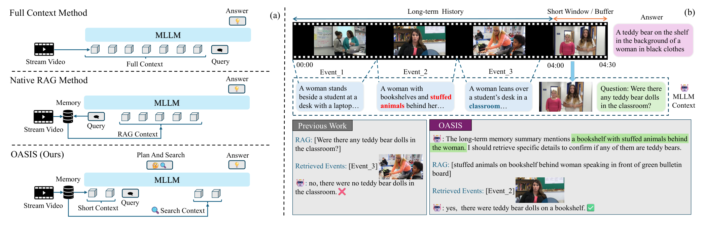
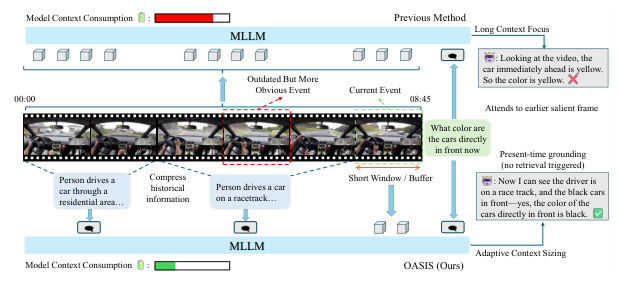
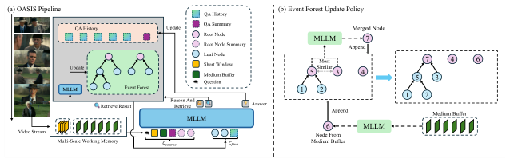
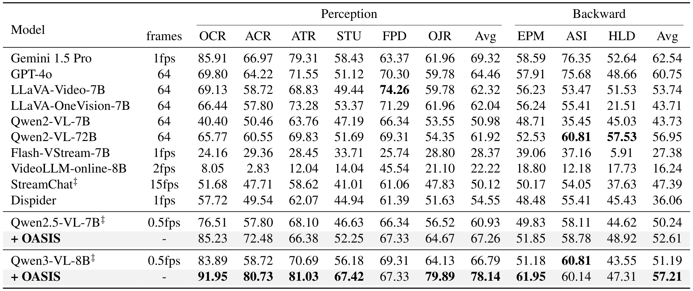
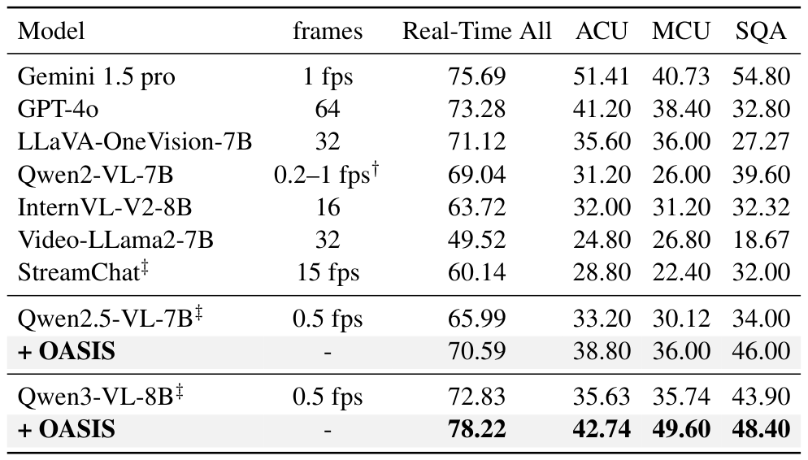
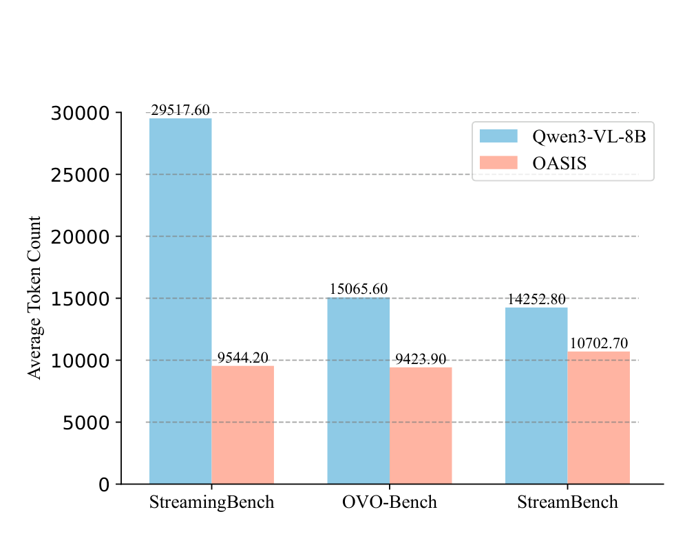
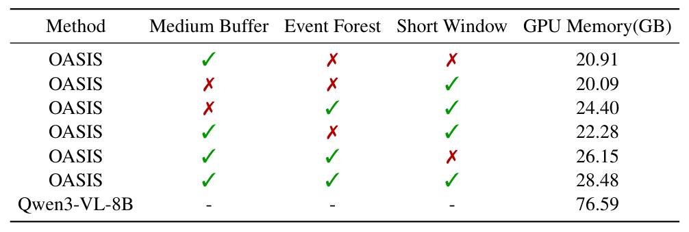
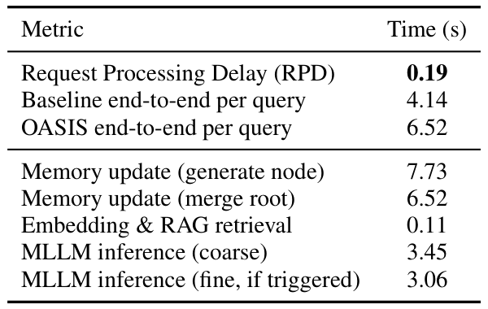
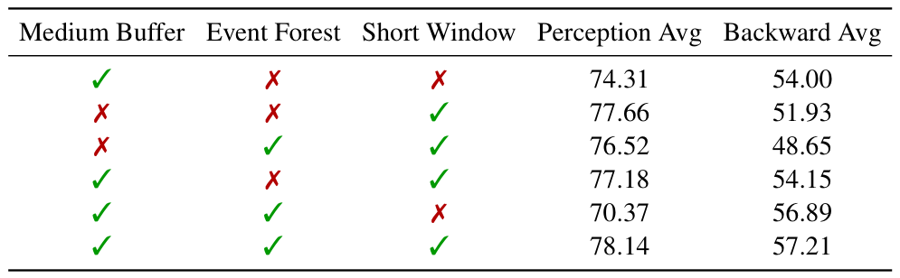
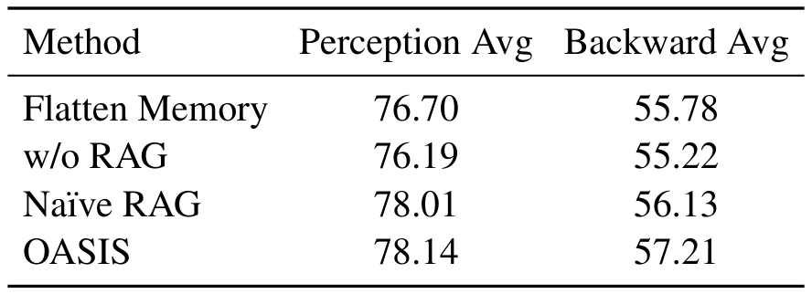

# OASIS 技术解读：让流式视频 Agent 知道何时回看、去哪里找

> 本文面向准备做视频理解、连续时序数据或长期记忆 Agent 的同事。重点不是逐段复述论文，而是回答三个问题：OASIS 究竟解决什么、机制为什么可能有效、它离实际产品还有多远。

## 先给结论

OASIS 研究的不是“如何把越来越长的视频全部塞进多模态大模型”，而是：**在历史持续增长、关键证据又非常稀疏时，模型能否先判断当前证据是否充分；如果不充分，再推断缺少什么证据，并定向回到历史中查证。**

它最值得借鉴的并不是某棵特定的“事件森林”，而是三条更通用的系统原则：

1. **当前信息和历史信息不应默认获得同等注意力。** 当前高保真短窗口应该常驻，旧历史应退到外部记忆。
2. **检索应该是一项策略决策，而不是每次请求固定执行的流水线步骤。** Agent 先决定要不要检索，再决定检索什么。
3. **检索词不一定等于用户原问题。** 系统应先推理“什么证据能使问题变得可判定”，再把这个证据需求送去搜索。

实验支持 OASIS 能同时提升流式视频问答准确率，并显著减少输入词元和峰值显存。不过它并非没有代价：以 Qwen3-VL-8B 为例，单次查询延迟从基线的 4.14 秒增加到 6.52 秒；方法也没有在手机或其他端侧设备上验证。因此更准确的定位是：**一套训练免费的流式视频外部记忆与推理策略，而不是已经完成端侧落地的视频 Agent。**

## 核心信息

- 标题：OASIS: On-Demand Hierarchical Event Memory for Streaming Video Reasoning
- 标题翻译：OASIS：面向流式视频推理的按需分层事件记忆
- 作者：Zhijia Liang、Jiaming Li、Weikai Chen、Yanhao Zhang、Haonan Lu、Guanbin Li
- 机构：中山大学、OPPO AI Center、深圳河套学院等
- 发表时间：2026
- 发表渠道：CVPR 2026
- DOI：未报告
- arXiv：2604.17052
- 论文链接：[arXiv](https://arxiv.org/abs/2604.17052) · [HTML](https://arxiv.org/html/2604.17052) · [CVPR Open Access](https://openaccess.thecvf.com/content/CVPR2026/html/Liang_OASIS_On-Demand_Hierarchical_Event_Memory_for_Streaming_Video_Reasoning_CVPR_2026_paper.html)
- 代码 / 项目：[Solus-sano/OASIS](https://github.com/Solus-sano/OASIS)
- 数据 / 资源：OVO-Bench、StreamingBench、StreamBench
- 论文类型：无需额外训练的流式多模态推理方法

## 原文摘要翻译

流式视频理解面对一个根本矛盾：历史会无限增长，但真正决定答案的证据通常极为稀疏。如果不断扩大记忆，模型会被大量无关历史淹没；如果过度压缩，关键细节又可能被不可逆地丢掉。作者将这种结构比作“沙漠中的绿洲”——无关内容是广阔沙漠，少量决定性事件是绿洲，真正困难的是发现应该去哪里找，而不是保存尽可能多的内容。

为此，论文提出 OASIS。它不把所有历史都堆进模型上下文，而是把视频组织为多分辨率、层次化的事件记忆，并采用按需推理策略。系统先基于短上下文做粗推理；如果当前证据不足，才进入精细推理，推断还需要什么证据，并根据这个语义假设定向检索历史事件。该方案无需额外训练，可以作为外部组件接到不同的多模态大模型上。论文报告，在多种流式视频基准和不同模型骨干上，OASIS 提升了长时程问答能力，同时控制了词元、显存和系统成本。

## 创新点

### 1. 将长视频记忆问题改写成“时间路由”问题

过去的直觉经常是扩上下文、加摘要或做 RAG。OASIS 的判断更尖锐：在流式视频中，最稀缺的不是存储空间，而是**模型当下的注意力和推理预算**。历史可以存，但不应该始终参与推理。

### 2. 让模型先决定“要不要检索”

粗推理阶段只看当前短窗口、低分辨率中期记忆和少量高层摘要。只有模型认为证据不足时，才触发长期记忆检索。这个门控使上下文大小跟随问题变化，而不是跟随视频长度线性增长。

### 3. 从“问题相似度”升级到“证据需求”

OASIS 不直接拿用户原问题做一次固定 top-k 搜索。模型会先生成一个面向任务的内部检索意图，例如把“教室里有没有泰迪熊”转化为“女性身后书架上的毛绒动物”。随后仍然使用 embedding 和余弦相似度检索，但搜索对象已经从宽泛问题变成更具体的证据假设。

### 4. 在线维护层次化事件记忆

系统把近期高保真画面、中期低帧率画面、长期事件层级和问答历史分别管理。事件森林的根节点数量被限制，超限时只合并时间相邻且语义相近的节点，使活跃索引保持紧凑。

## 一句话总结

**OASIS 是一套面向流式视频的“先判断、后回忆”机制：先用小上下文回答，答不稳时再生成证据需求，定向展开分层历史记忆。**

## 研究问题

### 流式视频为什么不是普通的长视频

离线长视频通常在处理开始前已经完整存在，可以全片扫描、统一切分或反复重建索引。流式视频则持续到来，未来画面未知，系统还要随时回答关于“现在”和“过去”的问题。

这会带来三个相互冲突的要求：

- 当前问题需要高保真、低延迟的视觉证据；
- 某些问题依赖很久以前的一两个细节；
- 历史不能无限进入模型的活跃上下文。

> “The real difficulty lies in discovering where to look, not how much to remember.” — Abstract

直译就是：真正的困难在于发现应该去哪里找，而不在于能够记住多少。这里的 `where to look` 不是泛泛地说“提高检索能力”，而是要求系统在每次提问时做一次时间路由：决定答案应该从当前短窗口、中期缓冲，还是更久远的某个事件中寻找。[查看 Abstract 完整英文段落](https://arxiv.org/html/2604.17052#Sx1)

这并不意味着容量和压缩不重要。作者真正反对的是把容量当作问题本身：即使关键画面已经放进上下文，模型仍可能因为旧事件太多而关注错误位置。**记忆容量决定证据有没有保存，时间路由决定此刻能不能找到。**

### Figure 1：三种路线到底差在哪里

*图 1：论文 Figure 1。左侧是三类方法，右侧用“教室里是否有泰迪熊”展示朴素 RAG 与 OASIS 的差异。*

#### Full Context：什么都给模型看

上方路线不断把历史帧堆入 MLLM。优点是理论上不丢信息，问题是成本随视频增长，而且旧画面会与当前画面竞争注意力。这里的失败不只是“太贵”，还包括**注意力污染**：关键证据可能明明在上下文里，却被大量旧信息淹没。

#### Naive RAG：每次拿原问题做固定检索

中间路线把历史写进外部记忆，再用原始问题做 top-k 检索。它比全上下文节省，但策略是刚性的：不论当前信息够不够，都检索；检索依据主要是问题与记忆的表面语义相似度。

右侧例子中，问题包含“教室”，朴素 RAG 容易召回同样描述教室的 Event 3，却错过真正包含书架和毛绒玩具的 Event 2。**与问题在主题上相似，并不代表能决定答案。**

#### OASIS：先提出证据假设，再精确回看

OASIS 从高层记忆里注意到“女性身后的书架上有毛绒动物”，于是将检索目标具体化为书架、女性身后、毛绒动物，再召回 Event 2 核验是否为泰迪熊。

这张图定义了论文最重要的区别：Full Context 始终让全部历史参加推理，代价是成本增长和注意力污染；Naive RAG 固定拿原问题检索，容易召回“主题相似但不能判定答案”的片段；OASIS 则把是否检索和检索什么都变成推理决策。当然，它也引入了新的失败点——如果证据充分性判断或检索计划本身出错，系统仍会沿着错误方向寻找。

### Figure 2：有时最好的检索就是不检索

*图 2：论文 Figure 2。问题问的是“现在正前方车辆的颜色”，长上下文模型被较早出现的黄色车辆吸引；OASIS 只看当前短窗口，回答黑色。*

Figure 1 强调“需要回忆时怎样找准”，Figure 2 强调相反分支：“当前证据已经足够时不要回忆”。两张图合在一起，才是完整策略：

1. 先基于当前短窗口做 grounding。
2. 如果当前证据足以判定，直接回答。
3. 只有证据不足时，才启动历史检索。

这比“给 RAG 加一个更好的向量模型”更有意义，因为系统首先控制的是**是否允许历史进入本轮注意力**。

论文把这个问题称为 `temporal routing problem`。这里的 routing 不是网络路由，而是将有限推理预算导向“现在”“中期摘要”或“某个长期事件”。

## 数据与任务定义

OASIS 主要评估两类能力：

- **Present-time grounding**：依据当前画面回答，例如当前车辆颜色、眼前正在发生什么；
- **Backward tracing**：回到较早历史寻找证据，例如某个物体是否出现过、之前发生了什么。

论文使用三个流式视频基准。OVO-Bench 同时测试实时感知和历史回溯，最直接对应“看当下”与“找过去”的平衡；StreamingBench 通过 ACU、MCU 和 SQA 等子任务测试累积理解、干扰上下文与连续问答；StreamBench 则使用更开放的问题和答案空间，检验方法是否只对结构化选择题有效。

实验采用 Qwen2.5-VL-7B、Qwen3-VL-8B 和 GLM-4.6V 作为骨干，说明作者关注的是外部记忆策略能否跨模型迁移，而不是训练一个 OASIS 专用大模型。

关键默认设置是：高保真短窗口覆盖 8 秒、采样率 2 fps；中期缓冲覆盖 32 秒、采样率 1 fps；每个事件节点保留 16 个关键帧；事件森林最多保留 4 个根节点；合并深度惩罚系数 \(\lambda=0.1\)。精细推理阶段默认取回 2 个事件节点和 1 组历史问答，向量模型为 Qwen3-Embedding-0.6B。全部实验运行在单张 NVIDIA A800 80GB 上。

## 方法主线

### 先纠正一个容易误读的地方

图 3 里画了一个较小的多模态大模型方框负责更新事件森林，也画了一个较大的方框负责问答。**这表示两种调用角色，不表示训练了两个不同大小或不同参数的模型。** 论文实现说明中明确写的是：同一个模型实例同时负责事件摘要、节点合并、问答更新和最终推理。

换句话说，可以把它理解成同一位员工在不同时间执行两套工作流：

- 后台记忆维护调用：把新视频变成事件节点、合并摘要；
- 前台问答调用：判断证据是否充分、必要时检索并作答。

实际工程当然可以换成“大模型问答、小模型整理记忆”，但那是可能的后续优化，不是论文已经验证的设计。

### Figure 3：从视频流到答案的完整 Pipeline

*图 3：论文 Figure 3。左侧是完整推理链路，右侧是事件森林的在线追加与合并。图中文字较小，建议打开原图查看。*

> “short context by default ... long-term evidence only when semantically required.” — Conclusion

默认在短上下文中推理，只有语义上确实需要时才检索长期证据。这句话比“先粗后细”更准确：Coarse 阶段并不是粗糙地回答，而是在受控的小上下文里完成一次证据充分性判断；Fine 阶段也不是固定的第二步，而是被这个判断按需触发。因而 OASIS 节省上下文的关键不是摘要压得更短，而是让长期历史不再默认参加每一次推理。[查看 Conclusion 完整英文段落](https://arxiv.org/html/2604.17052#S5)

### 机制流程

1. **输入并分层。** 视频输入被拆成最近 8 秒的高帧率短窗口和 32 秒的低帧率中期缓冲；模型从中期缓冲提取关键帧，生成摘要与向量，更新事件森林。
2. **生成粗粒度判断。** 问题与短窗口、中期缓冲、问答摘要及根节点摘要一起送入模型，输出“直接回答”或“需要检索”。
3. **查询精细证据。** 证据不足时，模型生成任务导向的内部检索意图，再从事件森林和完整问答历史中查询少量相关节点，并排除重复的祖先或后代。
4. **拼接并回写。** 召回证据与粗粒度上下文拼接后送入同一个模型生成答案；最终问答再更新摘要和历史，供后续问题使用。

### 三尺度记忆分别负责什么

#### Short Window：最近、最清楚、始终可见

它保存当前时刻附近的高帧率画面，负责“现在是什么”。因为上下文很短，模型不容易被久远事件抢走注意力。

#### Medium Buffer：更长一些，但降低采样密度

它以较低帧率覆盖最近一段连续历史，既给 Coarse 阶段提供近程背景，也是生成新事件节点的原料。它相当于从感知缓存到长期记忆之间的过渡层。

#### Event Forest：长期事件的层次化索引

“森林”不是一堆决策树模型，也不是随机森林算法。它是一组事件树：

- 叶节点对应较短、较具体的视频片段；
- 父节点由时间相邻且语义接近的事件合并而来；
- 父节点保存更抽象的摘要，同时仍保留子节点和关键帧；
- 多个尚未合并到同一根下的事件树共同组成 forest。

单个事件节点可以写成：

\[
R_j = ([t_s^{(j)}, t_e^{(j)}], F_j, s_j, e_j, d_j)
\]

其中时间区间说明事件发生在何时，\(F_j\) 是关键帧，\(s_j\) 是文本摘要，\(e_j\) 是检索向量，\(d_j\) 是节点深度。

### 事件森林怎么在线更新

Figure 3(b) 给出一个具体例子：森林当前有三个根节点 5、3、4，新节点 6 从 Medium Buffer 写入。追加后根节点变为 5、3、4、6；如果数量超过上限，系统从**时间相邻**的根节点中选择最适合合并的一对，这里是 5 和 3，再让 MLLM 生成父节点 7。更新后根节点为 7、4、6，而 5、3 仍作为 7 的子节点保留。

合并得分为：

\[
\operatorname{score}(R_j,R_k)=\cos(e_j,e_k)-\lambda(d_j+d_k)
\]

前一项鼓励语义相似事件合并，后一项惩罚反复合并已经很深的节点，避免少数树无限长高。系统只在时间相邻的根节点之间选择，是为了避免把相隔很远、仅仅语义相似的事件错误拼成一个连续事件。

父节点会重新计算：

- 两个子事件时间范围的并集；
- 在子节点关键帧中重新采样后的关键帧集合；
- MLLM 合并生成的高层摘要；
- 新摘要对应的 embedding；
- 新的树深度。

### QA History 为什么也是记忆的一部分

视频不是唯一历史。连续问答中，用户的前一问和系统的前一答也可能给后一问提供指代和语境。因此系统同时保留：

- **QA Summary**：持续更新的压缩摘要，进入 Coarse Context；
- **QA History**：较完整的历史问答，Fine 阶段按需检索。

这种双轨设计与视频记忆一致：高层摘要常驻，细节按需展开。

### Coarse 与 Fine 两阶段到底做了什么

粗阶段的上下文可以概括为：

\[
C_{coarse} = \{q_i,\; \text{Short Window},\; \text{Medium Buffer},\; \text{QA Summary},\; \text{Root Summaries}\}
\]

模型在提示词约束下输出两种结果之一：

- 当前证据足够：直接给出答案；
- 当前证据不足：输出工具调用，并产生内部检索意图 \(I_i\)。

Fine 阶段会将 \(I_i\) 编码成向量，对全部事件节点和 QA History 做余弦检索，取回少量候选。为减少重复证据，如果某个节点已被选中，算法会贪心排除其祖先和后代，避免同一事件的粗摘要和细节点同时挤占上下文。

最终上下文增加：

\[
C_{fine} = \{\text{retrieved event nodes},\; \text{retrieved QA pairs}\}
\]

然后 MLLM 基于 \(C_{coarse}+C_{fine}\) 给出答案。

### OASIS 还用不用 embedding 检索

**用。** 论文容易被读成“OASIS 不依赖相似度搜索”，但方法细节清楚地使用了 embedding、余弦相似度和 top-k。

真正变化发生在检索之前：

- Naive RAG：`用户原问题 → embedding → top-k`；
- OASIS：`先判断是否缺证据 → 生成证据需求 → embedding → top-k → 层级去重`。

因此更准确的说法是：**OASIS 没有抛弃向量检索，而是给向量检索前面加了一层推理与策略控制。**

## 关键结果

### 1. 准确率：对“看现在”和“找过去”都有提升

OVO-Bench 上的核心结果如下：

*表 1：OVO-Bench 主结果。左侧六列为当前感知，右侧三列为历史回溯；每组最后的 Avg 是正文重点使用的平均分。*

最明显的是 Qwen3-VL-8B：当前感知提升 11.35 分，历史回溯提升 6.02 分。GLM-4.6V 上也有明显提升，说明效果并非只来自某一个骨干。

*表 2：StreamingBench 主结果。重点比较同一骨干的原模型与 `+ OASIS` 两行。*

StreamingBench 上，Qwen3-VL-8B 的 ACU、MCU 和 SQA 从 72.83、35.63、43.90 提升到 78.22、42.74、48.40，继续支持“当前上下文 + 按需历史”的组合设计。

但应保留两个限定：

- HourVideo 上 Qwen3-VL-8B 只从 35.11 提升到 37.35，收益并不总是很大；
- StreamBench 中 Qwen2.5-VL 的部分子任务出现下降，方法不是对所有模型和问题类别单调增益。

### 2. Figure 4：平均输入词元明显下降

*图 4：论文 Figure 4。OASIS 在三个基准上都降低平均输入词元，StreamingBench 的差距最大。*

从原图可以直接读出：StreamingBench 从 29,517.60 降到 9,544.20，约减少 67.7%；OVO-Bench 从 15,065.60 降到 9,423.90，约减少 37.4%；StreamBench 从 14,252.80 降到 10,702.70，约减少 24.9%。这组结果是 OASIS 最强的工程证据之一：活跃上下文不再随历史长度无条件增长。不过不同基准降幅差别很大，说明节省程度依赖视频长度、问题分布和 Fine 检索触发率。

### 3. 峰值显存：从 76.59GB 降到 28.48GB

*表 13：论文补充材料中的峰值 GPU 显存分解。完整 OASIS 为 28.48GB，全上下文 Qwen3-VL-8B 为 76.59GB。*

完整配置的峰值显存为 28.48GB，显著低于全上下文基线的 76.59GB。组件分解也显示：Short Window、Medium Buffer 和 Event Forest 都会增加一些成本，但真正昂贵的是让完整历史持续进入模型上下文。

不过“28.48GB 能在消费级 GPU 上运行”这类表述需要谨慎。它确实低于 80GB 数据中心卡，但仍高于许多手机、眼镜和普通 PC 的可用加速器内存；而论文实际测试是在 A800 80GB 上完成的。

### 4. 延迟：输入更少，但一次问答更慢

*表 6：延迟与响应性结果。RPD 在 StreamBench 上测量，其余延迟在单张 A800 上使用 Qwen3-VL-8B 和 OVO-Bench 测量。*

检索本身只有 0.11 秒，主要开销来自额外的 MLLM 推理。事件节点生成与合并可以在 32 秒 Medium Buffer 周期内异步执行，因此不一定阻塞前台；但 Coarse/Fine 的模型调用会直接影响用户等待时间。

这说明 OASIS 优化的是**活跃上下文和显存**，而不是自动优化所有系统指标。若用于实时产品，降低路由和摘要调用成本会是首要工程任务。

### 5. 消融：哪些模块真的有用

#### 记忆组件消融

*表 4：记忆组件消融。前三列的勾叉依次表示中期缓冲、事件森林和短窗口是否启用。*

这张表说明不同记忆承担不同职责：

- Short Window 更利于当前感知；
- Event Forest 和 Medium Buffer 更利于历史回溯；
- 完整组合取得最好平衡。

也要注意，组件并非“加一个就一定更高”。例如 Event Forest + Short 的回溯只有 48.65，低于仅 Medium Buffer。这意味着层次记忆只有与正确的中期上下文和推理策略配合时才有价值，不能把“建一棵树”本身当作答案。

#### 推理策略消融

*表 5：推理策略消融。`Flatten Memory` 表示取消根节点数量限制，`Naive RAG` 表示直接使用原问题检索。*

OASIS 相比 Naive RAG 只多 0.13 感知分和 1.08 回溯分。这个结果支持“先推理证据需求”有价值，但增益并不压倒性。论文最大的收益来自整个系统组合——短上下文、层次记忆、按需触发和检索计划——而不能全部归功于内部查询改写。

## 深度分析

### 为什么它可能有效

#### 1. 把“保存历史”和“让历史参与本轮推理”分开

过去很多方案把记忆容量和上下文容量混为一谈。OASIS 允许历史存在于外部结构中，同时限制进入当前推理的证据数量。这个隔离让系统既不必永久丢掉历史，也不必每次为全部历史付费。

#### 2. 同时防两种相反错误

- Figure 1 防的是“该回忆时找错地方”；
- Figure 2 防的是“不该回忆时被历史干扰”。

很多 RAG 工作只优化第一种错误，OASIS 把“是否检索”也纳入策略，因此问题定义更完整。

#### 3. 让记忆具有不同分辨率

当前画面需要像素细节，长期历史更适合先看摘要。统一粒度会浪费预算：全用高分辨率太贵，全用摘要又丢细节。OASIS 用短窗口、中期缓冲、根摘要和事件关键帧形成逐级展开路径。

#### 4. 将用户意图转换为可验证的证据条件

“有没有泰迪熊”在语义空间里可能与整个教室场景相似，但“书架上的毛绒动物是不是熊”更接近真正需要核验的视觉证据。这一层转换与 Agent 规划相似：先定义完成条件，再调用工具。

### 它与普通视频 RAG 的本质区别

普通视频 RAG 往往把检索当成固定步骤，直接用用户问题或简单改写去取 top-k 片段，再将历史证据和当前画面一起堆进上下文。OASIS 的不同首先在检索之前：Coarse 阶段决定是否需要访问历史，并将用户问题转换为面向判定条件的内部证据需求。检索之后，它还会排除已选事件的祖先和后代，避免同一事件的粗摘要与细节点重复占用上下文。因此，OASIS 的上下文大小由问题难度和证据充分性决定，而不是由一个固定 top-k 决定。

### Event Forest 的“有界”应怎样理解

论文限制的是根节点集合和当前上下文，而不是严格证明整个历史存储为常数：

- 根节点数量有上限；
- Coarse 阶段只读取有限根摘要；
- Fine 阶段只取少量事件和 QA；
- 但被合并的子节点、关键帧和完整 QA History 仍可能长期累积；
- 检索描述中会对全部事件节点计算相似度，节点规模增大后还需要真正的向量索引。

因此生产系统还需要冷存储、过期策略、去重、分区索引和隐私清理。OASIS 解决的是**有界活跃工作集**，不是完整解决无限历史的存储治理。

### 对企业 Agent 最值得复用的部分

OASIS 的结构并不限于视频。只要业务有连续数据、当前状态和稀疏历史证据，就可以迁移：

在视频监控中，Short Window 可以是当前数秒画面，Medium Buffer 是最近一分钟的低帧率流，长期记忆则保存人物、车辆和异常事件；系统可以据此回答“刚才谁拿走了包”。直播助手可以把当前话题和画面作为短窗口，把最近数分钟转写作为中期缓冲，把商品、嘉宾和优惠承诺组织成长期事件。会议、设备运维和客服也有相同结构：当前发言、指标或对话需要高保真保留，更早的决策、故障和工单则按问题定向召回。

真正可以先做的原型，不需要训练大模型：

1. 固定一个近期上下文窗口。
2. 把更早事件转成摘要、时间戳和 embedding。
3. 让现有 MLLM 输出 `直接回答` 或 `需要检索`。
4. 需要检索时先生成“要验证的证据条件”。
5. 记录触发率、答案变化率、召回证据质量、词元和延迟。
6. 与“始终 RAG”和“始终全上下文”做 A/B 对照。

这比一开始复刻完整事件森林更可操作，因为最有价值、也最需要先验证的假设是：**模型能否可靠决定什么时候查历史，以及怎样表达证据需求。**

### 如果要真正产品化，我会改哪些地方

#### 1. 记忆维护不一定继续用同一个大模型

论文使用同一 MLLM 简化了零训练接入，但生成事件节点 7.73 秒、合并根节点 6.52 秒。产品中可尝试轻量 VLM、文本模型或规则完成事件切分和摘要，把大模型只留给难问题。

#### 2. 为路由增加可观测性和置信度

至少记录：为什么直接答、为什么触发检索、内部检索意图、召回节点、最终答案是否因检索改变。否则一旦答错，很难区分是感知错、路由错、检索错还是推理错。

#### 3. 从一次检索扩展为验证闭环

当前 Fine 阶段更接近一次计划、一次检索、一次回答。复杂问题可能需要：检索 → 核验 → 发现证据不足 → 再检索。可以引入最大步数、停止条件和失败回退。

#### 4. 给长期记忆加生命周期

需要定义哪些事件永远保留，哪些只保留摘要，哪些可删除；还应处理重复事件、敏感信息、用户撤回和跨租户隔离。论文的事件树只是信息结构，不是完整的数据治理方案。

## 局限

1. **检索门控依赖提示词和 MLLM 自我判断。** 论文没有训练独立的置信度模型。模型可能在证据不足时过早回答，也可能不必要地频繁检索。
2. **不是完整的多跳 Agent。** Fine 阶段主要是一次内部查询和一次证据扩展，面对跨多个远距离事件的组合问题仍可能失败。
3. **事件切分仍较机械。** 初始节点来自固定、非重叠时间窗，再通过相邻节点合并，并不等于学习到了真正的语义事件边界。
4. **全量历史存储并非严格有界。** 根集合和活跃上下文有界，但下层节点、关键帧与完整 QA History 可能持续增长。
5. **向量检索仍是最后一公里。** 如果内部证据需求生成错误，后续相似度搜索再准确也会找错方向。
6. **延迟增加。** Qwen3-VL-8B 单次问答由 4.14 秒增至 6.52 秒；实时交互场景需要更轻的路由与摘要模型。
7. **端侧价值尚属结构迁移，不是实机结论。** 论文在 A800 80GB 上实验，没有报告手机 NPU、端侧功耗、热管理或网络断开场景。
8. **训练免费不等于零工程成本。** 视频采样、异步写入、事件合并、向量索引、存储治理和监控仍需要完整系统支持。

## 我的笔记

### 这篇论文最值得讲的是什么

如果给同事做分享，我会把重点放在一句话上：**不要把历史记忆当成永远展开的 prompt，要把它当成 Agent 可以选择调用的工具。**

事件森林是论文给出的具体实现，但更普适的贡献是通信与工具策略：

- 当前证据够不够？
- 是否需要访问历史？
- 什么证据能够使问题可判定？
- 召回后是否真的支持答案？

这套问题可以迁移到视频、日志、会议、客服、个人记忆和设备状态，不依赖 GUI 操作，也不要求先训练新模型。

### 对公司的现实判断

这篇论文值得做技术分享，因为问题定义和两阶段策略都很清楚；但是否值得直接复刻整套系统，取决于公司是否真的拥有连续视频或时序数据。最低成本的验证并不是先实现事件森林，而是用现有模型对比“始终 RAG、从不 RAG、按需 RAG”三种策略。最大的产品风险是路由误判、长时记忆治理和交互延迟。它可以作为端云分层记忆的设计参考，但论文没有完成端侧验证。相比依赖操作系统控制权的 GUI Agent，这种记忆与检索策略更容易嵌入一个边界明确的业务流。

### 我会如何评价它的贡献强度

- **问题重定义：强。** 从容量转向时间路由，是一条清晰且可迁移的主张。
- **系统设计：中上。** 多尺度记忆、事件森林和 Coarse/Fine 推理组合完整。
- **单个算法组件：中等。** 层次摘要、embedding 检索和节点合并都不是全新部件。
- **实验说服力：中上。** 跨多个骨干和基准，准确率、词元、显存、延迟都有报告。
- **对 Naive RAG 的决定性优势：有限。** 计划式检索相对朴素 RAG 的额外增益不算大。
- **端侧落地成熟度：低。** 尚缺真实设备、功耗、网络与长期运行验证。

最终我会把 OASIS 定位为：**一篇系统思想比单点算法更有价值的论文。** 它没有发明一种神奇的新记忆模型，而是把若干成熟部件组织成一个合理的决策流：默认信任当下，必要时才回忆；回忆之前先想清楚自己在找什么。

## 引用

- Liang, Z., Li, J., Chen, W., Zhang, Y., Lu, H., & Li, G. *OASIS: On-Demand Hierarchical Event Memory for Streaming Video Reasoning*. CVPR 2026. [arXiv:2604.17052](https://arxiv.org/abs/2604.17052)
- 论文 HTML：[arxiv.org/html/2604.17052](https://arxiv.org/html/2604.17052)
- 官方代码：[github.com/Solus-sano/OASIS](https://github.com/Solus-sano/OASIS)

---

> 说明：本文中的结论区分了论文已报告结果与基于方法结构作出的工程判断。实验数字来自论文正文及补充材料；“适合企业 Agent”“可迁移到端云分层”等属于本文分析，不代表论文已经在这些业务和设备上验证。
