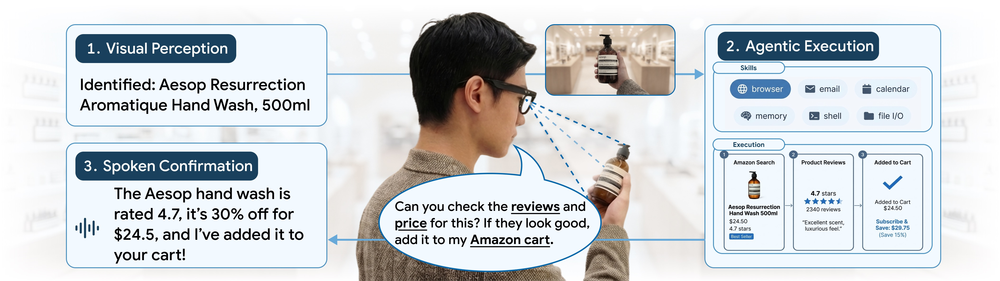
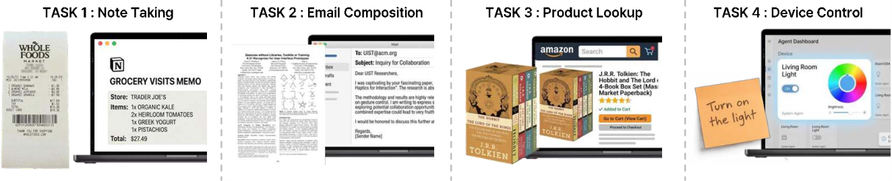
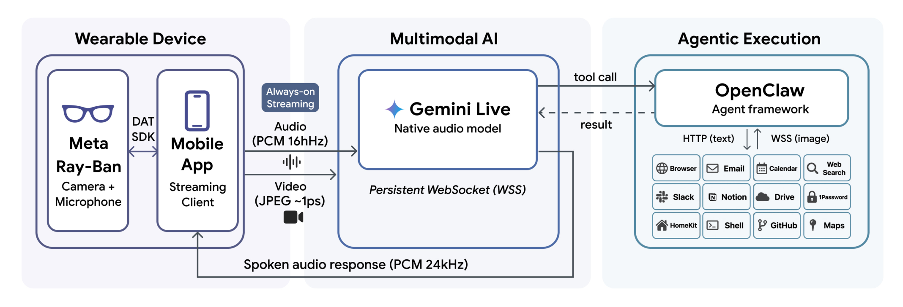
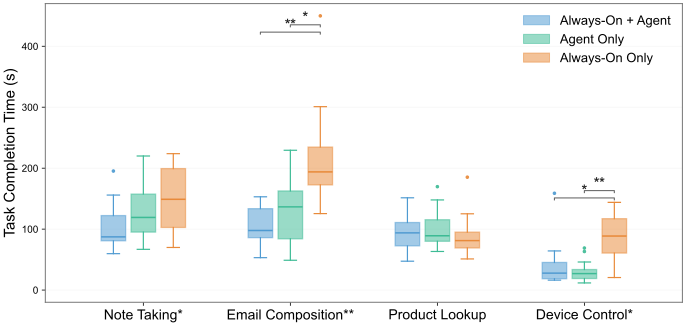
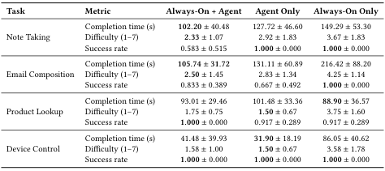
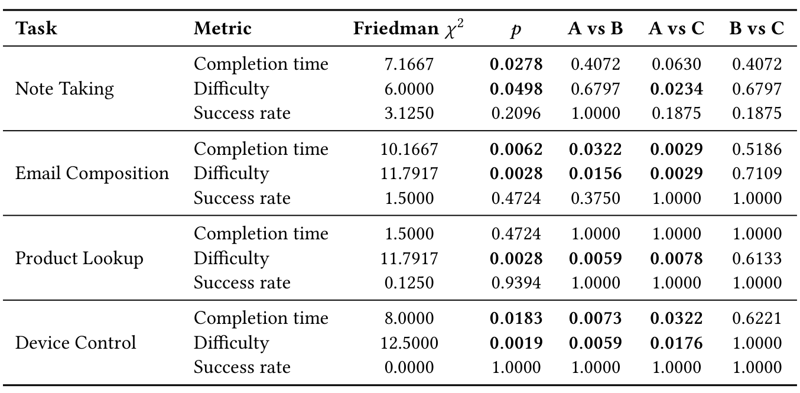
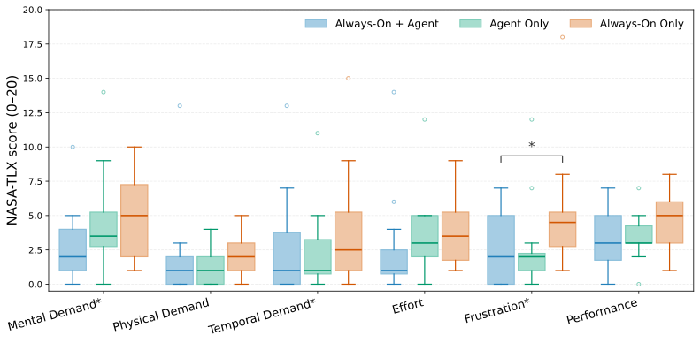
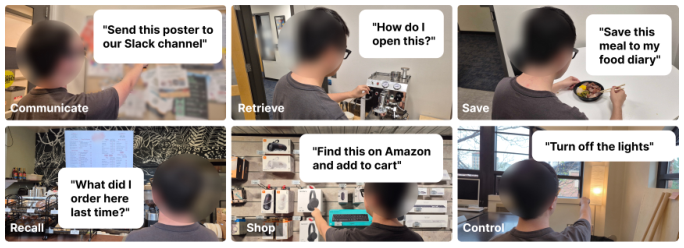
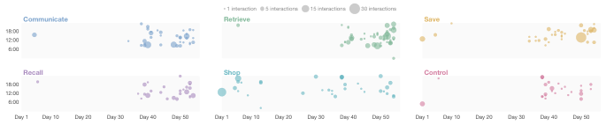

# VisionClaw 技术解读：智能眼镜如何从“看见”走到“代办”

> VisionClaw 不是把一个完整 Agent 塞进眼镜，而是把眼镜变成 Agent 的第一视角入口：用户看到现实对象后直接说出意图，系统理解眼前内容，调用浏览器、邮件、日历、笔记或智能家居完成任务，再把结果通过眼镜读回来。

这篇论文最值得关注的地方不是模型创新，而是它把三个此前相互割裂的环节接成了一条可运行链路：**现实世界感知、自然语音交互、数字世界执行**。它也提供了两类难得的证据：一组十二人的受控对照实验，以及四名作者在日常生活中的长期自传式部署。

但论文标题里的 `Always-On` 容易制造三个误解：它目前不是主动观察并自主行动的 Agent，不是把核心推理部署在眼镜端，也没有解决全天视频的长期记忆。本文会把系统真正做到的事、实验真正支持的结论和仍未解决的问题分别讲清。

## 核心信息

- 标题：VisionClaw: Always-On AI Agents Through Smart Glasses
- 标题翻译：VisionClaw：通过智能眼镜实现常驻式 AI Agent
- 作者：Xiaoan Liu、DaeHo Lee、Eric J. Gonzalez、Mar Gonzalez-Franco、Ryo Suzuki
- 机构：科罗拉多大学博尔德分校、光州科学技术院、Google
- 发表时间：2026 年 4 月 8 日（arXiv v2）
- 发表渠道：目前可确认的是 arXiv 预印本，尚未查到正式会议接收信息
- DOI：未报告；PDF 中的 `10.1145/nnnnnnn.nnnnnnn` 是 ACM 模板占位符，不是有效 DOI
- 论文链接：[arXiv 摘要](https://arxiv.org/abs/2604.03486) · [HTML 全文](https://arxiv.org/html/2604.03486v2) · [PDF](https://arxiv.org/pdf/2604.03486v2)
- 代码 / 项目：[Intent-Lab/VisionClaw](https://github.com/Intent-Lab/VisionClaw)
- 论文类型：可穿戴 AI/HCI 系统论文，贡献集中在系统集成、交互范式和实证研究

## 原文摘要翻译

论文提出 VisionClaw：一种把实时第一视角感知与通用任务执行结合起来的常驻式可穿戴智能体。

系统以 Meta Ray-Ban 智能眼镜为交互入口，通过 Gemini Live 和 OpenClaw，让用户依据当下看到的环境直接用语音委托任务。用户可以通过眼镜把现实物品加入亚马逊购物车、从纸质文档生成笔记、在移动中获取会议简报、从海报创建日历事件，或者控制物联网设备。

作者通过一项十二人的受控实验评估系统。结果显示，相比只有 Agent 执行能力或只有常驻感知能力的基线，VisionClaw 在相应比较中将任务完成时间缩短了 13%–37%，并将感知难度降低了 7%–46%。此外，四名用户平均使用 13.8 个活跃日，共产生 555 次交互、累计 25.8 小时。自传式部署揭示了六类使用场景和四种交互模式，说明可穿戴 Agent 可能支持更普适、更情境化、更环境化的人机交互。

## 创新点

### 1. 把“第一视角上下文”直接变成 Agent 的任务参数

传统 Agent 想处理现实对象，通常要求用户先拍照、上传、复制文字或重新描述。VisionClaw 让“这张收据”“这篇论文”“这个商品”直接指向眼镜当前看到的对象，省掉现实信息向数字系统的手工搬运。

### 2. 将实时多模态前端与通用执行后端解耦

Gemini Live 负责理解画面、语音和指代，OpenClaw 负责邮件、网页、笔记、日历、消息和设备控制。两者之间通过一个通用 `execute` 工具调用连接。前端可以保持低延迟对话，复杂任务则交给较慢但工具丰富的 Agent。

### 3. 用严格的三条件对照拆分“看见”和“执行”的作用

作者没有只展示 Demo，而是比较：只有眼镜感知、只有手机 Agent、同时具备感知和执行。这个设计能回答收益到底来自免手持视觉、Agent 自动执行，还是两者结合。

### 4. 记录真实长期使用，而不只做十分钟实验室任务

四名作者把系统接入自己的邮件、日历、文件、记忆和智能家居，留下 555 次真实交互。虽然样本偏差明显，但这些记录揭示了多轮任务链、机会式捕获、无屏等待和个人数据网络效应等实验室很难观察到的现象。

### 5. 贡献是系统和交互范式，不是新模型

论文没有训练新的视觉语言模型，没有提出新 Agent 学习算法，也没有设计 OASIS 式长期视频记忆。它的创新可以概括为：**把现有感知模型、眼镜硬件和工具 Agent 组合成新的交互闭环，并证明这个闭环在某些现实任务上有价值。**

## 一句话总结

**VisionClaw 把智能眼镜从“随身看图问答器”推进成“现实上下文驱动的 Agent 入口”：眼前所见不再只是回答问题的材料，而可以直接触发数字行动。**

它最强的证据是降低了部分现实到数字任务的交互成本；它没有证明组合系统更可靠，也没有实现严格端侧、主动式或具有长期视觉记忆的 Agent。

## 研究问题

### 作者与团队为什么值得关注

这是高校主导、Google 研究人员参与的合作项目。第一作者来自科罗拉多大学博尔德分校，团队同时包含光州科学技术院与 Google 的研究者。

Mar Gonzalez-Franco 长期研究沉浸式交互、增强现实和人机协同，并负责 Google 的 BIRD 实验室。

Ryo Suzuki 团队持续研究生成式人工智能、混合现实和新型交互。因此，这项工作不是以模型榜单为目标，更接近一支成熟人机交互团队对下一代眼镜入口的完整原型验证。作者背景提高了它在产品交互和系统设计上的参考价值，但不等于论文已经通过正式顶会评审。

### 两条技术路线各自只完成了一半

论文从一个很准确的断裂出发。

桌面和手机 Agent 已经能浏览网页、写邮件、管理日历、搜索个人数据，但它们主要活在屏幕里，不知道用户正在看哪张海报、手里拿着什么商品，也不知道一句“把这个记下来”里的“这个”指什么。

智能眼镜正好相反。它拥有自然的第一视角，可以看见并听见用户周围的环境，却大多停在描述、问答、提醒或步骤指导。它能够回答“这是什么”，但通常不能继续完成“把它加入购物车”“给作者发邮件”“保存到 Notion”。

作者用一句很短的原文概括目标：让系统能够 **“both perceive the physical world and take action”**，也就是既感知物理世界，又在数字世界采取行动。[对应 Introduction](https://arxiv.org/html/2604.03486v2#S1)

### 真正的痛点是“上下文交接成本”

设想用户看到一张活动海报，想创建日历事件。普通手机 Agent 的流程通常是：

```text
看到海报
→ 拿出手机
→ 拍照或手工输入
→ 打开 Agent
→ 解释时间、地点和活动名称
→ 等待 Agent 创建事件
```

VisionClaw 想把它压缩成：

```text
看到海报
→ 说“把这个活动加到日历”
→ 系统读取当前第一视角
→ Agent 创建事件
→ 眼镜播报结果
```

少掉的不只是点击次数，而是把现实对象重新编码为文本、图片附件或应用输入的认知过程。论文中记笔记和写邮件这类信息量较大的任务受益更明显，正好支持这个判断。

### Figure 1：从现实商品到数字行动


*图 1：论文 Figure 1。用户看着商品提出请求，系统识别物体、执行多步浏览器任务，并通过眼镜语音确认完成。*

这张图把论文的产品故事讲得很直白：眼镜看到一瓶商品，用户只需要说“查一下评价和价格，如果不错就加入购物车”。后续的商品识别、网页搜索、评价判断、购物车操作和结果反馈被压缩成一次语音委托。

这里最重要的不是亚马逊购物本身，而是任务的起点发生了变化。GUI Agent 从屏幕中的按钮和页面开始，VisionClaw 从用户眼前的现实对象开始。

### 与已有工作的准确位置关系

相关工作大体分成三类：

- 手机与桌面 Agent：Mobile-Agent、AppAgent、OS-Copilot 等解决屏幕内的操作和工具调用，但缺乏自然的现实世界上下文。
- 可穿戴与智能眼镜助手：Memoro、ProMemAssist、Satori 等探索问答、记忆、提醒、主动指导或特定任务，但执行空间通常较窄。
- 第一视角视频理解：EgoLife、流式视频问答、个性化视频理解等研究长视频感知，但重点不是通用数字任务执行。

VisionClaw 的位置是在三者交界处：它不追求新的视觉模型，也不追求更强的 GUI 点击，而是验证“第一视角感知 + 通用工具执行”是不是一个独立、有价值的交互范式。

论文对这道桥的描述很准确：

> *“real-time egocentric perception from smart glasses with executable AI agents”*

前半句是眼镜带来的实时第一视角，后半句是通用智能体带来的外部执行；VisionClaw 的核心贡献就是把两者接通。

## 数据与任务定义

论文包含两组互补研究。第一组在实验室里控制变量，回答组合系统是否更快、更轻松；第二组把系统放进真实生活，观察用户到底会拿它做什么。

### 受控实验：三种能力组合

十二名参与者完成全部三种条件，采用组内设计：

1. **Always-On Only**：Meta Ray-Ban + Gemini Live。能看、能听、能回答，但不能自主执行。用户最后仍要切到手机手工完成操作。
2. **Agent Only**：手机 + OpenClaw。能调用工具完成任务，但看不到现实对象。用户必须用语音转文字或键盘明确提供上下文。
3. **Always-On + Agent**：完整 VisionClaw。眼镜持续提供第一视角和语音，OpenClaw 接收任务并执行。

这个设计把两种关键能力拆开比较：视觉感知是否存在、Agent 执行是否存在。三组都尽量保持实时语音为主要交互方式，减少“某组只是因为输入方式不同”造成的混淆。

参与者共十二人，九男三女，平均年龄 27.8 岁。参与者对 AI 助手熟悉度较高，只有一人用过 AI 智能眼镜；每人实验约九十分钟。任务顺序用拉丁方平衡，每项任务准备三个不同实例，避免重复看同一张收据或同一本书产生学习效应。

### 四项任务为什么这样选


*图 3：论文 Figure 3。任务分别是收据转 Notion 笔记、纸质论文生成合作邮件、书封查询并按评分加入购物车、语音控制智能灯。*

四项任务都要求用户从现实对象发起数字行动，但信息结构和执行成本不同：

1. 收据记笔记：识别店名、商品和总价，写入 Notion。它要求读取小字和结构化转录，对视觉最苛刻。
2. 邮件撰写：从打印论文识别题目和第一作者，生成合作邮件草稿。它同时依赖视觉理解、内容生成和外部应用写入。
3. 商品查询：识别书封，查询亚马逊评分；评分高于 4.5 才加入购物车。它的信息较少，也最接近常见手机操作。
4. 设备控制：按照指令开关灯或改变颜色。现实上下文简单，执行路径短。

每项任务记录完成时间、是否成功、感知难度；每种条件完成后测 NASA-TLX 工作负荷，以及控制感、可靠性、信任、易用性、有用性和完成信心。

### 长期部署：四名作者使用自己的数据

长期研究由四名研究团队成员在 2026 年 2 月至 3 月间完成。参与者自己部署 OpenClaw，把系统接入邮件、日历、笔记、云盘和个人记忆，佩戴眼镜通勤、工作、做饭、购物和社交。

作者选择自传式研究有现实理由：外部用户很难在短期内安全地开放完整私人数据，持续音视频又有明显隐私风险。但这也决定了证据边界——参与者知道系统怎样工作，愿意调试，能忍受失败，并且比普通用户更容易想到复杂用法。

日志记录语音命令、工具调用、Agent 回复和时间戳。三个作者先用大模型辅助初始分类，再独立编码、迭代讨论，最终形成六类场景。因此这里的“六类”是研究团队对真实日志的归纳，不是预先规定的产品菜单。

## 方法主线

### Figure 2：系统并不是运行在眼镜里


*图 2：论文 Figure 2。左侧眼镜与手机负责感知和中继，中间 Gemini Live 负责实时多模态理解，右侧 OpenClaw 负责查询、购物、通信、控制、保存和回忆。*

系统分为三层：

- 感知层：Meta Ray-Ban 采集第一视角视频和音频，经手机应用传输。
- 多模态层：Gemini Live 持续接收 JPEG 帧和原始音频，负责对话、场景理解和工具调用判断。
- 执行层：OpenClaw 运行在 Mac 或虚拟服务器上，调用浏览器、邮件、日历、消息、文件、记忆和智能家居技能。

因此，所谓“运行在 Meta Ray-Ban 上”描述的是交互载体，而不是计算部署。核心视觉理解在 Gemini 云端，智能体执行在 Mac 或服务器，手机承担设备连接、数据预处理和协议桥接。

### 机制流程

1. **感知输入。** 眼镜通过 Meta 可穿戴设备访问工具包（DAT SDK）把摄像头和麦克风数据交给手机。摄像头原始流为每秒 24 帧，发送给 Gemini 前降到约每秒 1 帧，并以 50% 的 JPEG 质量压缩；用户也可以切换纯音频模式降低耗电和网络压力。
2. **实时理解。** 手机通过持久 WebSocket 把音频块和图像帧交给 `gemini-2.5-flash-native-audio-preview`。模型直接理解原始音频，不先走独立语音识别、文本模型、语音合成三级流水线。
3. **行动委托。** 当 Gemini 判断请求需要外部行动时，生成 `execute(task: ...)` 函数调用。手机客户端拦截调用，并把包含视觉上下文和用户意图的任务发送给 OpenClaw。
4. **执行与反馈。** OpenClaw 调用一个或多个技能完成网页、消息、笔记、日历或 IoT 操作，结果回到 Gemini；Gemini 再生成简短语音，通过手机和眼镜播报给用户。

论文把它称为 **“see-and-act loop”**：所见、所说、所做形成闭环。[对应系统设计](https://arxiv.org/html/2604.03486v2#S3.SS4)

### 为什么把 Gemini 与 OpenClaw 分开

这是一种快慢系统分工。

Gemini Live 需要维持自然对话、处理打断、理解语气和当前画面，适合做高频实时前端。OpenClaw 的浏览器自动化或个人数据检索可能需要十几秒和多次工具调用，不适合阻塞所有对话逻辑。

两者之间只暴露一个通用 `execute` 工具。论文附录中的系统提示要求 Gemini：涉及搜索、过去信息、邮件日历、持久化、应用服务或设备控制时都必须调用执行层；调用前先给用户一句语音确认，避免长时间沉默；传入任务时包含人物、平台、数量、日期和视觉上下文。

这种设计的好处是执行后端可替换，也能把复杂权限收口在一个边界。缺点是任务描述一旦丢失关键上下文，后端没有原始连续视频可重新判断；而且实时模型和慢 Agent 的双层链路增加了延迟、状态同步和错误归因难度。

### 工程实现细节

iOS 客户端使用 Swift 和 SwiftUI，最低支持 iOS 17。

论文在 iPhone 15 Pro 和 iPhone 16 Pro 上进行了测试。

Android 客户端使用 Kotlin，并在 Pixel 与三星手机上测试。两端都支持 Meta Ray-Ban，也支持用手机摄像头替代眼镜，便于开发调试。

输入音频被重采样为 16 kHz 单声道 PCM Int16，每 100 毫秒发送一块。Gemini 返回 24 kHz PCM，由播放队列顺序播出。

工具调用通过带令牌认证的 HTTP 请求发送到 OpenClaw 网关，默认端口为 18789；结果再包装成工具响应，通过持久连接写回 Gemini。

开源仓库还提供 WebRTC 等工程能力，但论文实验的核心闭环仍是眼镜/手机、Gemini Live、OpenClaw 三段式架构。它可以复现产品原型，却不是一个离线可运行的软件包：Gemini API、网络连接和外部服务账号仍是必要条件。

### 它是不是端侧 Agent

按严格端侧标准，答案是否定的：

- 眼镜端：摄像、收音、播报；
- 手机端：连接设备、压缩帧、传输音频、路由工具调用；
- 云端 Gemini：多模态理解与对话；
- Mac/VPS 上的 OpenClaw：规划、工具调用和个人数据访问。

关键 Agent 闭环没有运行在眼镜或手机上。更准确的产品定位是“以智能眼镜为入口的云端 Agent 系统”。对端侧团队而言，真正值得继续做的是把唤醒、隐私过滤、关键帧选择、危险动作门控、短期记忆和部分轻量识别迁移到手机 NPU 或眼镜 SoC。

## 关键结果

摘要中的“快 13%–37%、难度低 7%–46%”是总体概括。完整数据比这一句话复杂得多。

### Figure 4：组合系统并不是每个任务都最快


*图 4：论文 Figure 4。三种颜色分别表示 VisionClaw、Agent Only 和 Always-On Only；星号表示整体或两两比较达到显著。*

记笔记、邮件撰写和设备控制的三条件整体差异显著；商品查询不显著。

最明确的组合收益出现在邮件撰写：VisionClaw 平均约 105.7 秒，Agent Only 约 131.1 秒，Always-On Only 约 216.4 秒。VisionClaw 相比只有眼镜感知显著更快，说明“看懂论文后还要手工写邮件”是很大的尾部成本。

设备控制里，Agent Only 平均约 31.9 秒，反而比 VisionClaw 的 41.5 秒更快；两者都显著快于 Always-On Only 的 86.1 秒。这说明简单控制任务的主要收益来自 Agent 能执行，视觉并没有增加价值，反而可能增加一次感知和路由成本。

商品查询中，Always-On Only 平均约 88.9 秒，VisionClaw 约 93.0 秒，Agent Only 约 101.5 秒，组间没有显著差异。商品封面容易描述，手工操作也熟悉，因此“自动看到”没有形成明显优势。

### Table 2：漂亮的速度收益伴随成功率代价


*表 2：原论文表 2。截图列出四项任务在三种条件下的完成时间、难度和成功率，建议打开原图查看。*

总体成功率是这篇论文最需要强调的反面证据：

- VisionClaw：85.4%；
- Agent Only：89.6%；
- Always-On Only：97.9%；
- 三组成功率差异不显著，$p=.269$。

VisionClaw 并没有通过自动化换来更高可靠性，均值反而最低。最突出的失败是收据记笔记：VisionClaw 成功率只有 58%，另外两组都是 100%。原因是收据文字小、视角受限、画面可能晃动；一旦视觉识别错了，后续结构化和写入执行得再顺也只会把错误自动化。

这说明第一视角 Agent 的误差会沿执行链放大：感知错误不是一个错误回答，而可能变成错误邮件、错误笔记或错误购买。

### Table 3：哪些显著差异真正站得住


*表 3：原论文表 3。三个字母依次代表仅常驻感知、仅智能体执行和 VisionClaw。*
*原表给出了 Friedman 检验、Holm 校正与 Wilcoxon 两两比较。*

按校正后的两两比较看，最稳的结论主要有：

- 邮件撰写：VisionClaw 显著快于 Always-On Only，$p=.0029$；感知难度也显著更低。
- 设备控制：VisionClaw 和 Agent Only 都显著快于 Always-On Only，说明执行能力是主要变量。
- 商品查询：完成时间不显著，但两种 Agent 条件的感知难度都低于 Always-On Only。
- 记笔记：完成时间整体检验显著，但 VisionClaw 与其他条件的校正后两两差异没有达到 0.05。

所以论文最有力的实验证据不是“VisionClaw 全面领先”，而是：**当任务同时包含较多现实信息和较多数字操作时，感知与执行的组合更可能降低交互成本。**

### Figure 5：认知负荷下降，但不能直接等同于信任提升


*图 5：论文 Figure 5。分数越低表示工作负荷越低；心理需求、时间需求和挫败感的三条件整体差异显著。*

VisionClaw 在心理需求、时间需求和挫败感上均值更低，三个维度的 Friedman 整体检验达到显著。其中校正后的两两比较里，VisionClaw 相比 Always-On Only 的挫败感下降最明确；其他维度的两两比较证据没有摘要措辞听起来那么强。

自定义问卷中，控制感和有用性的整体差异显著；可靠性、信任、易用性和完成信心都没有显著差异。参与者仍会复核重要邮件和购买结果。

这组结果揭示了一个重要区分：

- 交互负担：系统是否少让我输入、少让我盯着屏幕；
- 执行信任：系统是否真的做对、我是否敢让它继续。

VisionClaw 改善了前者，却尚未证明改善后者。

## 深度分析

### 长期部署的规模和行为分布

四名作者总计产生：

- 55 个活跃参与者日，个人范围为 5–19 个活跃日；
- 118 个会话、555 次语音发起的交互；
- 累计 25.8 小时，平均每个活跃日 10.1 次交互；
- 每条命令平均触发 3.2 次工具执行，最高一次达到 27 次；
- 39% 的交互使用摄像头进行视觉 grounding；
- 29% 的交互使用两个或更多数据源；
- 端到端中位延迟 12.2 秒，浏览器任务 15.5 秒，纯语音且无工具调用为 8.4 秒。

工具调用以 shell 执行和浏览器自动化为主，分别占 32% 和 31%；文件读写、网页搜索与抓取各占 12%，记忆检索占 3%。这说明长期部署并不是简单的眼镜问答，大量价值来自 OpenClaw 已有的电脑和网络工具生态。

### 六类使用场景


*图 7：论文 Figure 7。六个场景分别对应通信、查询、保存、回忆、购物和控制。*

六类场景的占比分别为：查询 30%、购物 19%、保存 16%、通信 14%、回忆 12%、控制 9%。

通信不只是口述一条消息，还包括边刷牙边听未读邮件摘要、批量归档、把看到的研究海报发到 Slack、拍下房屋问题后通知房东。查询从三秒钟的微问题延伸到跨日历、邮件和网页的会前简报。保存包括收据、餐食、海报、酒店 Wi-Fi，也包括随口记录研究想法并转成 LaTeX。

回忆依赖 OpenClaw 积累的日志和用户导入的数据，可以查询昨天做过什么、上周讨论了什么、机场确认号在哪里。购物把实体商品遇见转成在线比较和加购。控制则包括灯光、HomeKit、文件整理、上传 Zoom 录像、编辑 LaTeX 和调试任务。

### 只有 39% 的交互使用摄像头，意味着什么

这是论文里很容易被忽略但很有产品意义的数字。

眼镜 Agent 的价值并不等于“摄像头始终识别一切”。61% 的交互不需要视觉：邮件简报、日历查询、发消息、听新闻、设置设备都可以只用语音和个人数据。眼镜仍然有价值，因为它始终戴在身上、扬声器和麦克风可立即使用，用户不必拿出手机。

这提示产品架构不必默认全天视频上云。更合理的策略可能是：

- 语音常驻，但视频按需开启；
- 本地轻量模型判断是否出现需要视觉 grounding 的指代；
- 只上传关键帧、局部区域或脱敏特征；
- 高风险场景明确提示摄像和数据去向。

这种设计不仅省电，也更容易获得旁观者和用户的社会接受。

### Figure 8：使用不是一次性 Demo，而是跨天散布


*图 8：论文 Figure 8。每个点表示不同时段的交互数量，展示六类用途在多天、多时段持续出现。建议全宽查看。*

图中可以看到查询、保存、购物和通信并不只集中在最初的新鲜期，而是散布在多天和不同时间。作者据此归纳四种跨场景交互模式。

### 模式一：从单轮命令变成开放式任务链

用户可能先查询电影时间，接着回忆何时读过原著，再要书籍推荐，最后把一本书加入愿望单。也有人从邮件里的姓名开始，继续查询引用、导师、论文和经费，再把结果保存到记忆。

这种链路不同于传统语音助手的“一问一答”，因为系统同时拥有对话上下文、个人数据和工具。一次对话可以在查询、回忆、保存和购物之间切换。

### 模式二：机会式捕获和情境触发回忆

用户并不总是提前计划“我要记录”。他们可能在对话中临时意识到信息重要，随口要求保存；或者经过熟悉地点时突然问上次何时来过。可穿戴入口降低了记录和回忆的启动门槛。

但这里必须划清边界：VisionClaw 没有自己构建连续视频事件记忆。论文中的跨天回忆主要来自文本日志、邮件日历、外部服务和用户主动导入的数据。它可以利用刚刚捕获的画面上下文，但还不能可靠地在几天视频里定向找出某个瞬间。

### 模式三：无屏更平静，也更不可靠

作者把这一现象概括为：无屏交互让智能体更平静，也让它显得更不可靠。用户可以在走路、做饭、运动或刷牙时发起任务，把等待放到后台；即使中位延迟超过十二秒，也不必盯着加载动画，主观上没那么焦虑。

代价是进度不可见。用户不知道 Agent 在搜索、卡住、失败，还是已经执行；也无法快速检查邮件收件人、购物数量和文本细节。对低风险任务，后台委托很舒服；对重要邮件、支付、购买和设备控制，用户仍要回到屏幕确认。

这不是简单的“加一个语音提示”就能解决。系统需要持续回答三个问题：

1. 现在正在做什么？
2. 哪一步需要用户决定？
3. 最终改动了哪些外部状态？

未来有显示的 AR 眼镜可以用外围视觉反馈解决一部分问题；没有显示的音频眼镜则需要更精细的通信策略和风险分级。

### 模式四：个人数据形成网络效应，但不是模型持续学习

早期数据和技能很少时，用户主要查天气、新闻和商品。随着邮件、日历、笔记、记忆日志和技能接入，任务逐渐变成跨数据源的会前简报和跨会话回忆。有参与者甚至导入多年 Google、Facebook、ChatGPT 和 Evernote 日志，开始询问几年前的个人经历。

作者称其为数据网络效应：用得越多，系统可访问的个人上下文越丰富；上下文越丰富，后续使用价值越高。

但这不是 LLM 参数在持续学习。OpenClaw 把个人记忆作为外部文本和 embedding 保存，模型本身没有因使用而更新。外部记忆是否准确、如何遗忘、如何撤销错误、不同数据源冲突时相信谁，都仍是开放问题。

### 与 GUI Agent 的本质区别

GUI Agent 的感知对象是屏幕，行动对象也是屏幕。它通常接收一个明确任务，再找到按钮、输入框和页面状态。

VisionClaw 的感知对象是用户周围的现实世界，行动对象却往往在远端数字服务。它解决的是跨边界映射：

```text
现实对象 / 地点 / 对话
→ 语义理解与指代消解
→ 任务参数
→ 邮件、网页、日历、笔记或 IoT 行动
```

因此它和豆包手机式 Agent 不是同一赛道上的强弱替代。手机 GUI Agent 更适合已经发生在屏幕里的工作流；VisionClaw 更适合任务由现实线索临时触发、用户不愿拿出手机的时刻。

### 与 OASIS 的关系：当前所见和长期所见是两个问题

OASIS 解决的是持续视频增长后，系统如何压缩历史、判断是否需要回看、再定向检索某个事件。VisionClaw 解决的是当下看到一个现实对象后，怎样把它转成可执行任务。

两者可以组成互补架构：

```text
智能眼镜实时感知
├─ 当前上下文 → VisionClaw 式意图理解与行动执行
└─ 历史视频   → OASIS 式事件记忆与按需回看
```

如果再加入 Communication Policy，系统才可能决定：何时主动提醒、何时只保存、何时给用户结构化选项、何时必须等待确认。VisionClaw 当前只完成了这条未来链路中的“当前感知到工具行动”。

### 这篇论文对眼镜产品真正有价值的判断

第一，智能眼镜可能首先不是一块更小的屏幕，而是**现实上下文输入设备**。摄像头、麦克风和佩戴位置给 Agent 提供手机难以稳定获得的第一视角。

第二，最容易产生价值的不是万能问答，而是边界明确的“现实到数字”工作流：海报到日历、票据到报销、设备铭牌到维修工单、会议现场到 CRM、商品到比价与收藏。

第三，眼镜并不需要承担全部计算。短期内更现实的架构是眼镜采集、手机本地门控和缓存、云端复杂推理、企业工具执行。但产品必须明确哪些能力在哪运行，不能把“通过眼镜使用”包装成“端侧运行”。

第四，执行能力越强，安全和确认越重要。能看见旁观者、识别商品、搜索身份、发送消息、控制设备的系统，其风险不是传统摄像头风险和传统 Agent 风险简单相加，而是两者相乘。

## 局限

### 1. 当前是反应式系统，不是主动 Agent

用户仍需通过语音发起任务。系统不会稳定地识别“你进入超市了”并主动调出购物清单，也不会在会议前自动给简报。论文把主动式 Agent 明确列为未来方向。

所以 `Always-On` 更准确地理解为持续可用的感知和交互通道，而不是持续自主决策。

### 2. 没有长期第一视角视频记忆

论文讨论“整个人生的记忆”时承认，不能保存每一帧，需要做重要性、时效性和相关性选择；OpenClaw 当前的文本 embedding 也不适合直接检索连续音视频。压缩什么、如何检索、是否允许遗忘，仍未实现。

### 3. 云端依赖、续航和延迟没有解决

视频降到约 1 fps、50% JPEG 质量，本身就是网络和 API 成本约束下的折中。中位响应 12.2 秒，浏览器任务 15.5 秒，对环境式助手依然很慢。论文也承认电池续航、网络不稳定、任务失败和缺少持续音频反馈阻碍公开商业使用。

### 4. 第一视角感知会把错误转成行动

收据任务 58% 的成功率说明，小字、遮挡、运动模糊和视角偏差足以破坏输入。系统缺少一个可靠的“我是否真的看清了”校准机制，也缺少执行前对关键字段的结构化确认。

### 5. 实验样本与长期样本都很有限

受控实验只有十二人，且参与者对 AI 助手较熟悉。长期部署更只有四名作者。作者参与者知道内部架构，可以自行修复连接、配置技能，并对隐私和失败有更高容忍度。普通消费者、老年人、视障用户、医护或现场工程人员是否会形成相同使用模式，尚未验证。

### 6. 旁观者隐私是一种更强的新风险

被智能眼镜拍到已经会引发担忧；如果旁观者意识到对方的 AI 还能识别自己、搜索信息、保存记录并采取行动，社会感受会完全不同。论文提出了这个问题，但没有做旁观者研究，也没有实现设备端脱敏、可见录制提示或细粒度政策框架。

### 7. 无屏状态缺少可见的能力边界

传统应用有菜单，用户知道能做什么；通用 Agent 的能力由技能、权限和数据动态形成，用户经常不知道一句话会成功还是失败。参与者把这种体验形容为像抽签。没有显示时，这种预期差距更严重。

### 8. 安全执行机制讨论不足

OpenClaw 能发消息、操作浏览器、读写文件和控制设备，但论文没有系统评估提示注入、网页恶意内容、账号权限隔离、误购买、误发送和回滚。Bearer Token 解决了网关认证的一部分问题，不等于端到端 Agent 安全。

## 我的笔记

### 最值得复用的不是代码，而是产品问题定义

VisionClaw 把智能眼镜 Agent 的价值从“随时可以问 AI”推进到“现实线索可以直接触发数字行动”。这比继续堆叠识图问答更有方向感，也比复刻手机 GUI Agent 更符合眼镜的硬件优势。

如果一家公司要借鉴，建议先寻找高频、可验证、低风险的现实到数字工作流，而不是从“万能生活 Agent”开始：

- 看海报创建日历草稿；
- 看名片创建联系人或 CRM 草稿；
- 看票据生成待确认的报销条目；
- 看设备铭牌调出维修手册和工单；
- 看会议白板生成待编辑纪要；
- 看商品保存到收藏并做价格比较。

关键字是“草稿”和“待确认”。第一阶段先证明上下文交接成本真的降低，再逐步开放不可逆行动。

### 一个更适合产品落地的三阶段路线

#### 第一阶段：语音触发、当前所见、低风险执行

只处理用户明确发起、当前画面可验证的任务。眼镜提供视觉与语音，手机完成本地隐私门控和关键帧选择，云端理解，企业 Agent 只创建草稿或候选操作。

#### 第二阶段：风险分级和跨设备反馈

按照动作风险决定交互政策：查询可直接执行；保存类先回读字段；通信类显示收件人和正文；购买、支付、门锁等必须二次确认。没有显示的眼镜可以把高风险任务同步到手机，有显示的眼镜则用外围 AR 卡片呈现关键差异和撤销入口。

#### 第三阶段：长期记忆与有限主动性

引入 OASIS 式分层事件记忆，只保留重要事件并支持按需回看；再用 Communication Policy 决定何时主动建议。主动能力不应由“模型觉得有帮助”直接驱动，而应受场景、置信度、风险、社交状态和用户历史偏好约束。

### 值得复现的实验

最值得复现的不是再跑一次十二人相同任务，而是下面三组更接近产品决策的实验：

1. **摄像头贡献实验**：比较全天视频、按语音指代开启、端侧关键帧门控和纯音频，测续航、成功率、隐私接受度和真正使用摄像头的比例。
2. **反馈策略实验**：比较纯音频、手机同步、眼镜简短 AR 状态和风险自适应反馈，观察信任、复核成本和错误恢复。
3. **普通用户长期部署**：让非作者、非技术用户使用数周，记录多少任务在新鲜期后仍保留、哪些失败导致永久弃用、个人数据接入的真实阻力在哪里。

### 最终评价

这篇论文的算法创新不高，但产品和系统参考价值高。它有真实智能眼镜原型、有开源代码、有受控对照，也有长期日志，不是只画概念图。最重要的是，它找到了一种比“眼镜上的聊天机器人”更像下一代交互入口的用法。

同时，它距离商业常驻 Agent 还有明显距离：关键计算在云端，响应慢，感知错误会触发行动，缺少显示和确认，长期视觉记忆没做，主动能力没做，隐私与权限也没有经过完整验证。

因此更准确的评价是：

> VisionClaw 已经证明“眼镜看到的现实上下文可以驱动通用 Agent 执行”是一个值得继续投入的方向，但还没有证明这种系统可以可靠、主动、私密地陪伴用户一整天。

## 引用

- Liu, Xiaoan, et al. VisionClaw: Always-On AI Agents Through Smart Glasses. arXiv:2604.03486v2, 2026. [论文](https://arxiv.org/html/2604.03486v2)
- Intent Lab. VisionClaw open-source implementation. [GitHub](https://github.com/Intent-Lab/VisionClaw)
- Ryo Suzuki. University of Colorado Boulder Computer Science. [个人主页](https://www.colorado.edu/cs/ryo-suzuki)
- Mar Gonzalez-Franco. Google Research. [研究者主页](https://research.google/people/108218/)
- Eric J. Gonzalez. Google Research. [研究者主页](https://research.google/people/ericgonzalez/)
