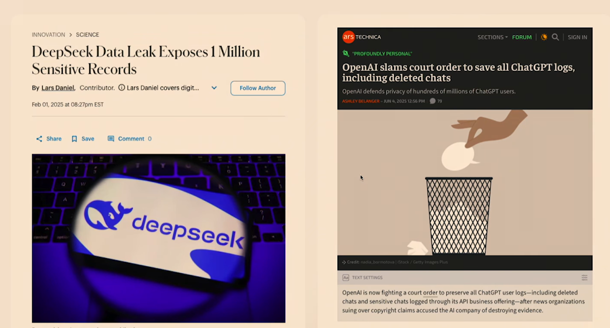
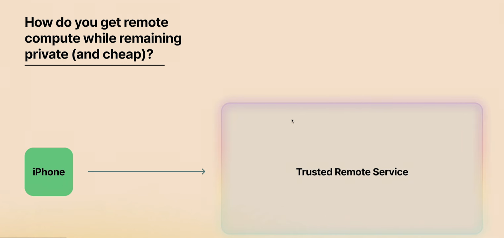
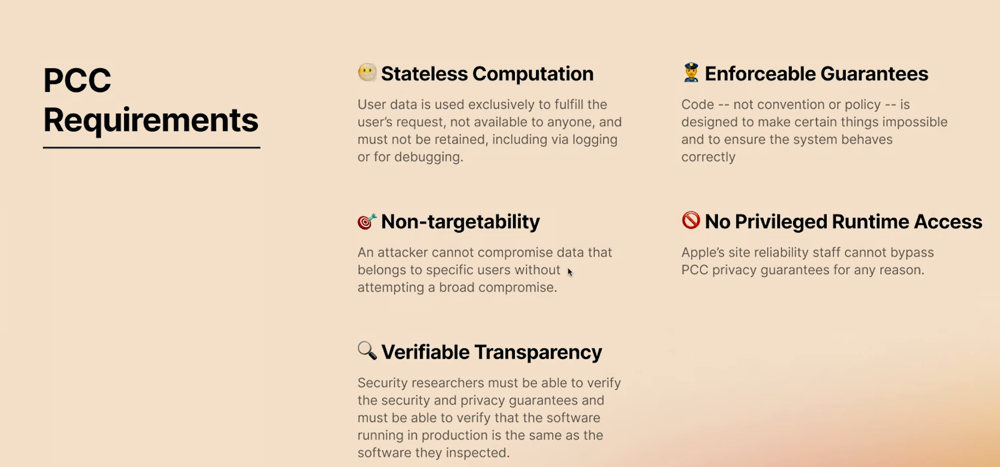
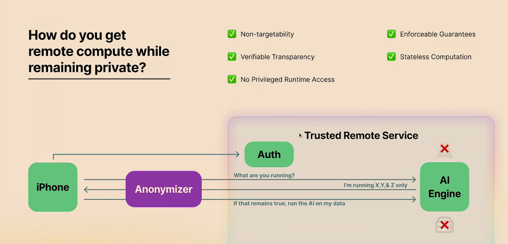
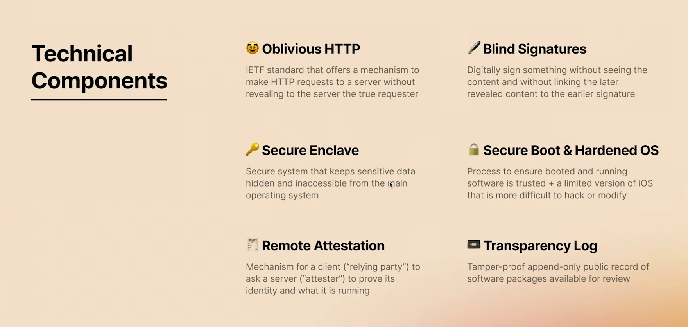
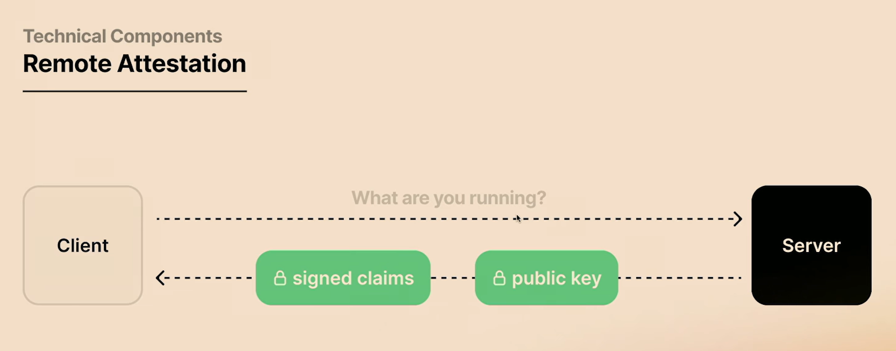
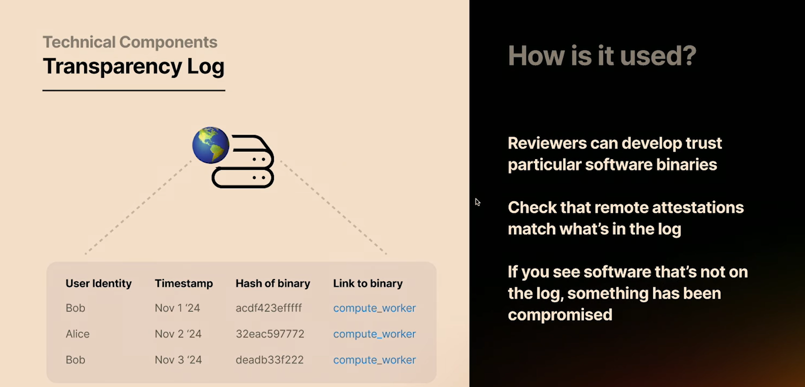
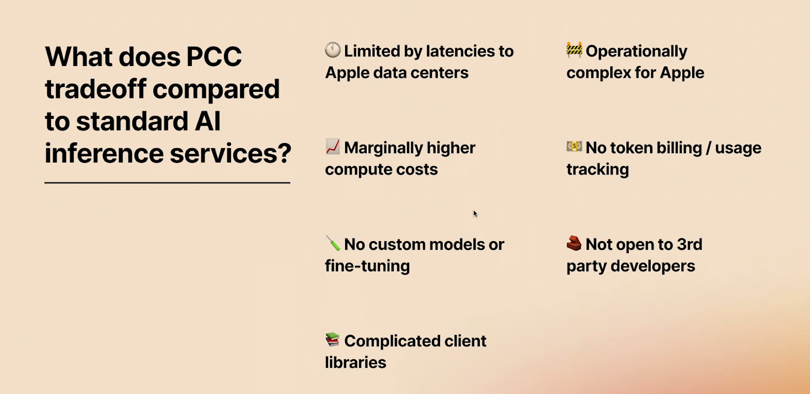
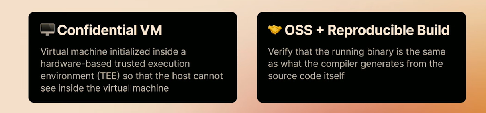

# Apple Private Cloud Compute 技术深读

> 调研对象：Apple Private Cloud Compute（PCC）—— Apple Intelligence 的云端推理基础设施。
> 本文系统拆解 PCC 的设计目标、六大技术组件、端到端请求链路、局限与权衡，并补充 2026/06「Expanding PCC」最新进展。文末附机制速查表、术语表与参考资料。

---

## 0. 摘要

### PCC 是什么、为什么需要它

Apple Intelligence 的很多任务，手机上的算力跑不动，得借云端的服务器来推理。但"把你的私密数据交给一台远端服务器"这件事天然就和隐私冲突——那台服务器你看不见、摸不着，谁知道它会不会把数据存下来、记进日志、拿去训练，甚至被内部人偷看？

PCC（Private Cloud Compute）就是 Apple 为解决这个矛盾造的云端推理系统。一句话概括它的目标：**让一台"不可信的远程服务器"变得可信——而且这种可信不靠 Apple 的承诺，靠技术强制、并且能被外部独立验证。**

### 核心思路：把"别做坏事"从政策变成"物理上做不到"

传统云服务的隐私靠"我们承诺不存你的数据"这类规章。PCC 的思路是：政策能被违反，那就让违规在技术上发生不了——

- 想存数据？机器根本没装持久化硬盘。
- 想 SSH 进去看？系统里压根没有 SSH。
- 想偷偷换一套软件跑？客户端加密的数据就解不开了。
- 然后把"在跑的软件"公开挂在一个谁都能查的日志上，让安全研究员能核对：线上跑的，就是公开审查过的那一版。

### 五条要求

Apple 给自己定了五条不可妥协的要求（括号内是正式术语）：

1. **不留痕** —— 数据只为本次请求而用，用完即弃，不存储、不记日志、不可调试、不训练（无状态计算，stateless computation）。
2. **靠代码不靠承诺** —— 所有隐私保证由技术强制，而不是规章（可强制执行的保证，enforceable guarantees）。
3. **没法盯上特定的人** —— 攻击者要偷某个特定用户的数据，得先把整个 PCC 攻破才行，定向攻击不现实（不可定向攻击，non-targetability）。
4. **没有"超级管理员"后门** —— 没有任何特权账号能绕过上述保证，无论出于什么理由（无特权运行时访问，no privileged runtime access）。
5. **能被外人查证** —— 安全研究员能离线审查系统、运行时确认线上跑的就是审查过的版本（可验证的透明性，verifiable transparency）。

### 怎么做到：六个组件叠在一起

为达成这五条，PCC 把六个技术组件拼成一条端到端链路：让请求**先匿名**（经第三方中转，连 Apple 都不知是谁发的）、再**授权但不关联身份**（盲签名）、然后**远程核对服务器在跑什么代码**（远程证明）、把密钥锁进**专用硬件**（Secure Enclave）、把软件版本挂在**公开防篡改日志**上（透明日志）、最后用**不可篡改的启动链**锁死攻击面（安全启动）。每个组件的细节见第 5 节。

其中最巧妙的一处设计：客户端加密请求数据时，把"服务器刚才自证在跑的软件版本"和"加密"绑在一起。结果是——**服务器一旦偷换在跑的软件，就解不开用户的数据**。这等于把"我保证跑的是这套"从一句承诺，变成"换就解不开"的硬约束，从根上堵死了"问的时候一套、用的时候偷换另一套"的经典攻击窗口（time-of-check vs time-of-use，简称 TOCTOU）。

### 最新进展

2026/06，Apple 把 PCC 扩展到自有数据中心之外，首次跑在 Google Cloud + NVIDIA GPU + Intel TDX + Google Titan 上，引入"双信任根"供应链证明，但**五条核心要求不变**——这是 PCC 自发布以来最大的演进，也是对其"信任全押 Apple 一家"批评的一次正面回应。

> 下面这张数据流图是全文速览，术语较多；看不懂可先跳过，读完第 5–6 节再回头看。

**端到端数据流（总览）：**

```
iPhone ──(1) OAuth 鉴权换盲签名代币──> Apple OAuth 服务
  │ 拿掉 shrink-wrap，代币变形仍有效
  ▼
iPhone ──(2) 经 OHTTP relay 加密转发──> Cloudflare / Fastly（第三方，不可信）
  │ relay 看不到内容，只知来自某 relay
  ▼
PCC 负载均衡器 / 隐私网关（信任域外，无解密密钥）
  │
  ▼
PCC AI 节点 ──(3) remote attestation 回 claims──> iPhone
  │
  ├─(4) iPhone async 核对 claims 是否在透明日志
  │
  ▼
iPhone ──(5) 把 attestation 度量值与请求 co-mingle 加密──> PCC AI 节点
  │ 节点改软件即无法解密
  ▼
Secure Enclave 持私钥代为解密 ── 推理 ── 返回（不持久化，重启即擦除）
```

<!-- 建议截图：完整链路总图。可截 jmo 演讲约 27:51 起"integrate those six pieces"那张拼装图，作为本节的可视化补充（ASCII 已有骨架，截图可替换或并列）。 -->

---

## 1. 背景与动机

消费者嘴上说在乎隐私，但照样把数据交给 ChatGPT 这类服务；企业（医疗、fintech、legal）则**真的**在乎，因为数据泄露有直接的财务后果。近年来的一系列数据泄露事件（如 Deepseek 百万条敏感记录外泄）会持续发生，而在 AI 时代被进一步放大——因为**数据训练、数据归属、谁从中取走价值**成了新焦点。

企业的传统做法是为隐私付费：单租户、on-prem、bring-your-own-cloud。但 **AI 让这条路变难**——没有中型企业或创业公司会去自购一集群 H100 自建推理栈。安全变得更贵了。

这正是 Apple 要解决的：让消费者用上 AI，但手机端算力不够，而**隐私是 Apple 的核心卖点**。Apple Intelligence 于 2024/10 发布，PCC 是其云端那一半。只要你让客户交数据，就在让渡隐私；PCC 的目标是把这种让渡降到技术意义上的零。

---

## 2. 要解决的根本问题

把问题压成一句：

> 我有一台 iPhone，想把数据发给一台远程**不可信**服务器；如何让这台服务器变**可信**，且**难以被黑**？

其中 "client" 是 iPhone 的替身，泛指任意客户端向一个远大于自身的 AI 系统提交数据。PCC 的全部设计都围绕这一句展开。

---

## 3. Apple 的五条要求

Apple 为 PCC 定了五条关键要求：

1. **无状态计算（Stateless computation）** —— 数据只为本次请求而用，**不留存、不记录、不可调试、不用于训练**。请求生命周期内用完即弃。

2. **可强制执行的保证（Enforceable guarantees）** —— 一切由**代码**强制，而非约定或策略。注解：不想让人 SSH 进机器看数据，就别装 SSH；不想数据落盘，就别装盘。

3. **不可定向攻击（Non-targetability）** —— 攻击者无法在不"广泛攻破"的前提下，定向窃取特定用户的数据。换言之，得黑掉整个 Apple，而不是 Apple 上的某一台机器。

4. **无特权运行时访问（No privileged runtime access）** —— 没有任何途径能覆盖已写进系统的隐私保证，无论出于什么理由。

5. **可验证的透明性（Verifiable transparency）** —— 最重要的一条：security researcher 能**离线**验证系统满足上述保证，**运行时**确认线上跑的就是验证过的版本。它是其余四条的可信度根基。

<!-- 建议截图：五条要求那页幻灯片，约 03:38 处。 -->

---

## 4. 概念总览：如何满足五条

在拆具体组件前，先看五条要求在调用栈上如何落地：

- **在调用栈最前端加 anonymizer** —— 请求先经第三方中转，PCC 只看到"来自中转方"，看不到你的 IP。
- 但 anonymizer 单独不够：请求里还带着 OAuth 身份令牌（登录后那串"我是某账号"的东西），光藏 IP 没用，令牌照样暴露你是谁。所以**把"证明身份"这一步从主请求里拆出去**：先单独去 Apple 的 OAuth 服务亮明身份，换一串**不记名的代币**（像游戏厅用身份证换硬币、之后机器只认硬币不认人），再拿代币 + 实际请求经 anonymizer 发出。这样 PCC 收到的请求里只有匿名代币，既不知道你是谁、也不知道你从哪来。
- anonymizer 是**第三方**（Apple 用 Cloudflare / Fastly），不是 Apple 自己跑的——否则 Apple 能合谋还原身份。
- **可验证透明性**的概念流程：iPhone 经 anonymizer 问 Apple "你在跑什么代码"，Apple 回答；iPhone 说"如果你确实跑这些，这是我的数据"。这是个很重的承诺（对方可能撒谎），具体如何证明留到第 5 节。
- **无特权运行时访问**：以前运维能 SSH 进机器，现在不能。
- **enforceable + stateless 的具体体现**：不要存储就别装盘；临时盘的加密密钥在启动时丢弃，重启后**永远恢复不出来**。

PCC 用六个技术组件把上述概念落到实处，逐一拆解如下。

---

## 5. 六个技术组件

### 5.1 Oblivious HTTP（OHTTP）

> **一句话**：在你和服务器之间塞一个"看不懂内容的跑腿的"替你送请求——服务器只看到跑腿的，看不到你；跑腿的只看到加密包，看不到内容。
> **类比**：寄信不直接写给收件人，而是让跑腿的替你送；而且你先把信用只有收件人能拆的锁锁上，跑腿的偷看不到内容。

OHTTP 是一个新规范，可以理解为"**正式版的 Tor**，但是标准 HTTP spec"。

- **旧方式**：客户端 A/B/C 各自直连服务器，服务器清楚看到每个来源。
- **OHTTP**：先把所有数据发给一个第三方 relay，relay 再转发给服务器；服务器只知"来自这个 relay"，不知真实来源。
- 但 relay 必须是**不可信**的——否则 relay 自己就能看到全部数据并还原来源。规范解法：**先用服务器公钥把数据加密，再发给 relay**，relay 看不到内容，只做转发。
- Cloudflare / Fastly 提供这种"laundering"服务。
- **关键设计**：Apple **不能自己跑这个 relay**，否则 Apple 能与 relay 合谋还原用户身份。整个机制的目的是"提高门槛"——把一部分信任押在 Cloudflare/Fastly 的声誉上（它们不向 Apple 交代真实来源），而 Apple 自己也不想知。

<!-- 建议截图：OHTTP 对比图（旧方式 vs relay 转发），约 09:18 处 "Here's the old way"。 -->

### 5.2 盲签名（Blind signatures）

> **一句话**：让 Apple 给你的请求盖个"准许"章，但盖章时它看不清内容、盖完也认不出这是它盖的——于是凭证有效，却没法追溯回你。
> **类比**：把纸条装进带纹理的膜里让 Apple 盖章，撕掉膜后章仍有效但样子变了，Apple 事后看到也认不出是自己盖的。

盲签名是一种**在不看内容的前提下数字签名**，且事后即使看到被签内容，也**无法把签名回溯到领取者**。

用"匿名邮政服务"打比方：

1. 把包裹装箱后，再裹一层 shrink wrap（热缩膜）；
2. 拿着膜裹好的箱子去第一个 UPS，出示信用卡和 ID —— UPS 在膜上**穿透签名**；
3. **撕掉 shrink wrap**，把已签名的箱子交给第二个 UPS；
4. 第二个 UPS 看到的是"已被官方签过、可寄"的箱子，但**无法把它和第一个 UPS 那次出示的 ID 关联**——因为膜被撕掉了，两次出现的"箱子外观"不同。

这背后的数学：能改变签名外观、同时仍可证明 signer 是谁。

在 PCC 里，盲签名用于 **OAuth 授权环节**：让 AI 节点能确认"这是一个合法请求"，但**不知是谁发的**。约束：**必须只公开一个签名证书**——否则给每个用户单独签一套，就能反查。

<!-- 建议截图：匿名邮政 / 盲签名流程图，约 13:00–14:30 处。 -->

### 5.3 远程证明与 TOCTOU（Remote attestation）


> **一句话**：让服务器自证"我在跑什么软件"，证明用密码学签死；客户端只信能对得上公开账本的证明，才肯把数据发过去。
> **类比**：进大楼前保安让你出示"我装的是正版系统"的证明，而且这证明带防伪钢印、能去公开账本核对真伪。

概念上：客户端问服务器"你在跑什么"，服务器回**已签名的 claims + 一个公钥**；客户端若信任这些 claims，就用该公钥加密数据——**只有那台服务器能解密**。

PCC 的实际流程：iPhone 发请求 → 收到 signed claims → 决定信不信 → 用对应公钥加密 AI 请求，使**只有那台特定机器**能解。

**最关键的风险：TOCTOU（time-of-check vs time-of-use）。** attest（问在跑什么）、check（验 claims）、use（实际推理）三步之间有时间差，风险在于——**问的时候、验的时候、用的时候，跑的还是不是同一套软件**。这个时间差是经典安全 bug。

要 attest 的组件远不止"软件版本"，而是一长串：**GPU 真不真、RAM 是否加密、TPM 是否合法、网卡是否合法、盘有没有被改、boot 与 OS**——全部进 signed claims。各硬件厂商发布"真硬件"证书，验证方需验**证书链 + 签名**。

Apple 的对应保证：设备**只在节点度量匹配公开 transparency log 中某条发布时**才发数据——把 attestation 锚定到可外部验证的公开记录上。而要堵住 TOCTOU 本身，需要下一个组件：TPM / Secure Enclave。

<!-- 建议截图：remote attestation 组件清单图（GPU/RAM/TPM/NIC/盘/boot），约 17:43 处。 -->

### 5.4 Secure Enclave / TPM

> **一句话**：把钥匙锁进一块独立的、连主机都进不去的安全小芯片；要用时它替你开门，但绝不把钥匙交出来。
> **类比**：银行保管箱——你把东西存进去，柜员不给你钥匙，要用时他帮你开，你永远碰不到钥匙本身。

**Secure Enclave 是 Apple 独有**：一块专用硬件、独立小芯片、跑独立 OS，**所有私钥都在这里**。核掉 Secure Enclave → 手机永远开不了机。

在 PCC 里，5.3 那个公钥对应的**私钥就住在 Secure Enclave**。一句话总结：**信任在这里集中化**——信了这块硬件，就能信依赖它的上层。

- 专用硬件跑独立安全 OS；密钥**看不见、偷不走**——即便主系统被黑，也拿不到这块芯片上的密钥。
- 验证 boot 是否合法、是否绑定设备；存储/加密密钥都在这；需要解密时**它替你解、不把密钥交出来**。

公开生态里最接近的等价物是 **TPM**（Trusted Platform Module，spec 始于 2009，2.0 在 2015 定稿）。云上没有物理 TPM，云厂商提供 **virtual TPM**——这又多了一层信任：你把密钥放进云厂商写的、你看不到的软件里。TPM 与 Linux 的 IMA、dm-verity、dm-crypto、dm-integrity 等特性配合，提供度量与签名背书；attestation 时向 TPM 取值，TPM 签名背书"值是合法的"。

本质上是**把信任搬来搬去**：最终总要落到某个你选择相信的硬件根上。Apple 官方对 Secure Enclave 的保证是：密钥**不可复制、不可提取**；每次重启随机化数据卷加密密钥且不持久化，等于**重启即密码学擦除**（cryptographic erasure）。

### 5.5 透明日志（Transparency log）

> **一句话**：把"服务器在跑的软件"的指纹公开记在一个谁都能查、谁也改不了的账本上；线上跑的要是和账本对不上，立刻就露馅。
> **类比**：餐厅把今天用的菜谱公开贴墙上，谁都能对照——后厨偷偷换了菜谱，一比对就知道。

透明日志让 security researcher 能**验证节点的 claims**。它是一个**防篡改、append-only、公开**的软件包记录。

机制很简单：开发者发布二进制时，把 hash（可链源码）写进这条公开 log，声明"我是 Bob，发布这个二进制"。用户拿到二进制 → hash 不匹配 log → 知道系统被入侵（不是官方发布的）。

在 PCC 里：Apple 每次 PCC 更新都把**所有二进制的 hash** 发到这条 log；researcher 逐个审查"这二进制确实在做 Apple 声称的事"；iPhone 收到节点 claims 时，因为有 log 背书而信任。这就是 **offline vs online**：离线验证 + 在线核对 attestation 是否匹配公开 log。**只能有一条公开 log**；任何人看到不在 log 里的东西，就知道出事了。

公开生态已有实现：**sigstore、sigsum**（与 SLSA 等供应链安全工作相关）。难点在于**决定把系统的哪些部分放进 log**——整盘 VM hash（每次小改都要新条目、审查负担重）还是每个二进制分开、还是连配置文件一起，需要权衡。

Apple 官方的对应承诺：维护一条 **append-only、tamper-proof transparency log**；每个生产 PCC 软件镜像**公开发布**供独立研究。

### 5.6 安全启动与硬化 OS（Secure boot & hardened OS）

> **一句话**：从开机第一秒起，每一层代码都必须是 Apple 签过名的，一层验一层；没签名的程序根本跑不起来。
> **类比**：大楼门禁——从大门到每层楼道，每道门都刷一次卡、验一次身份，没卡的人一道门都进不去。

目标是**限制攻击面**，让节点**只跑它声称的、别的都不跑**。

- **boot ROM**：制造时烧入的只读硬件，启动整个 boot 流程，**验证后续每一环**。
- 链式累积：boot ROM → 验低层 bootloader（须 Apple 签名）→ 验 iBoot → 层层向上。
- PCC 节点跑**裁剪版 iOS**：无动态代码执行、不能 SSH、无额外驱动/firmware、**所有代码必须签名**。
- 5.3 的 remote attestation 那些 signed claims，就是由这条 secure boot 链签出的。
- 信任传递：信了 Apple boot 链 → 信"只跑这些代码" → 这些代码在 transparency log 上 → 是官方发布。

Apple 官方补充：PCC 节点使用与 iPhone 同源的 **Secure Boot + Code Signing**；推理栈用 **Swift** 写以保证内存安全，独立地址空间 + 沙箱 + **PAC（指针认证码）** 抗利用；无远程 shell、无交互调试、无 Developer Mode、无通用日志。

---

## 6. 六件套如何拼成完整请求链路

把六个组件放回同一条路径上，端到端走一遍：

1. **OAuth + 盲签名**：iPhone → Apple OAuth 服务："我是 Jonathan，要发 AI 请求" → OAuth："合法，给你 blind-signed tokens。" iPhone 拿掉 shrink-wrap，tokens **变形但仍然 official**。
2. **OHTTP 匿名转发**：iPhone 经 Cloudflare/Fastly 发请求 + tokens。到 AI 引擎时，引擎**只知来自 CF/Fastly，不知哪个用户**；tokens 证明"合法请求"但**不知是谁**。
3. **Remote attestation**：iPhone 发 attestation 请求 → AI 引擎回 claims。
4. **透明日志校验（async）**：iPhone 核对 claims 是否在公开 log 上；**不在就完全不信任这台引擎**。
5. **co-mingle attestation 与加密**（全场最关键的密码学衔接）：iPhone 把 attested 度量值（本质是 hashes）**与请求加密揉在一起**。结果是——**AI 引擎一旦改了在跑的软件，就无法解密用户数据**。这直接消解了 5.3 的 TOCTOU：**使用瞬间的值 = 之前 attested 的值**，不匹配则解密失败。
6. **解密推理**：Secure Enclave = 钥匙（持私钥、代为解密、不交出密钥）；secure boot + 整个硬化系统 = 锁。AI 引擎在 PCC 节点上完成推理，返回结果，**不持久化**。

> 这一步的精妙在于：它把"证明"和"使用"在密码学上**绑定到同一瞬间**，而不是靠流程承诺。

<!-- 建议截图：六件套完整链路拼装图，约 27:51 起。这是全场最重要的一张图，建议作为本节主图。 -->

---

## 7. 局限与权衡


### 7.1 局限

- **信任单点**：所有信任押在 Apple 一家。Apple 理论上能把所有私钥设成一个、能在数据中心烧入不安全的东西，**你无法知道**——因为 iPhone 代码和服务器代码**都是它写的**。Apple 有强烈激励做对，系统也确实 impressive，但这仍是一处结构性单点。
- **源码不全公开**：无法保证 Apple 没把源码/私钥分享给第三方。
- **无法复刻**：你做不到这一级安全保证。Apple 或许 eventual 开放给第三方开发者，但**绝不会开放到它的设备/生态之外**。

### 7.2 权衡

- **低延迟 AI workload 拿不到**：必须回路 Apple 数据中心。
- **运维极复杂**：不能 SSH、看不到在干嘛 → 几乎没法 debug。
- **计算成本只高一点**：约 4 层加密（OHTTP + 到机器的加密等），开销可接受。
- **无法用量追踪**：全匿名 → 没法追"花了多少钱、有没有用户滥用"。Apple 有 fraud/abuse 系统，但不等同 full usage tracking。
- **无 fine-tune、无自定义模型、不开放第三方开发者**。
- **客户端库极复杂**：一个简单请求变成 blind sig + remote attestation + transparency log 全套，任一环节失败即坏体验。

---

## 8. 可借鉴性与 confidential computing 的定位

这套体系其实有**八个组件**（前面六个 + 两个）。另两个是：

- **Confidential VM**：云厂商提供的机密虚拟机，带 virtual TPM，保证**云厂商本身看不到**租户数据。
- **Reproducible builds（可复现构建）**：给源码 + 构建脚本，声明"这源码构建出这个二进制，这二进制在 log 上"，比只给二进制更强信任——而 Apple 恰恰**没给全部源码**，所以你只能跑二进制、不知里面是什么。

**最重要的定位判断**：**Apple 的系统并不是经典意义上的 confidential computing。** 经典 confidential computing ≈ "加密 RAM"——在一个 enclave 内做事，外部（含云厂商）看不见。Apple 的做法是"在经典机密计算外围包了一层 wrapper"——因为 Apple 用的是**自己的数据中心**，本就不担心云厂商偷看；它要防的是"Apple 内部人/被攻破的节点"看到用户数据，于是叠了 OHTTP、盲签名、attestation、transparency log 这一套。

如果你（非 Apple）要做类似保证，路径是**用云厂商的 confidential VM**（带 vTPM）。一个行业事实：需要 GPU 的 confidential VM，**AWS 目前还没有**，只有 **Azure 和 GCP** 支持——因为 AWS 用自研机密计算原语，而 Azure/GCP 用 Intel/AMD 方案，与 PCI（GPU 接入）配合更好。

> 这一段直接呼应第 10 节：2026 年 Apple 把 PCC 搬上 Google Cloud 后，开始真正用上 confidential VM / TDX，向"经典 confidential computing"靠拢。

---

## 9. 外部批判与争议

> 以下为基于架构本身的批判性分析，目的是点明 PCC 隐私叙事的边界——这些不是 bug，而是任何类似系统都绕不开的信任假设。

1. **根信任仍是 Apple**。attestation 的最终信任根——boot ROM 与 Secure Enclave——是 Apple 自研、未公开的硬件。技术上无法消除"Apple 在硅里留后门"的可能，只能靠**激励相容 + 透明性 + 研究员审查**来缓解。这是"信任假设"而非"可验证事实"。

2. **transparency log 证明的是"跑的 = 公开的"，不是"公开的无后门"**。log 能保证节点没偷偷跑别的代码，但**公开的代码本身是否有漏洞/后门，靠研究员审查**——这是缓解而非消除。Apple 没给全部源码，进一步限制了审查深度（见 7.1）。

3. **OHTTP 引入新的信任节点**。Cloudflare/Fastly 成为新的信任依赖：它们若与 Apple 合谋，可还原用户身份。解法是"靠声誉提高门槛"——但这把 non-targetability 从"技术保证"降级为"博弈论保证"。

4. **non-targetability 是统计性的，不是绝对的**。单台被攻破的节点只能解密落到它那的小部分请求；"广泛攻破"的检测依赖 Apple 内部监控——而这块**不透明**。

5. **"信任单点"在扩展到第三方云后会更复杂**（见第 10 节）：信任根从"Apple 一家"变成"Apple + Google + NVIDIA + Intel"，Apple 用"双信任根"应对，但根仍是"信 Apple 批准的软件"。

6. **性能/可用性权衡客观存在**（见第 7 节），低延迟、可调试、用量追踪都要让位给隐私——这在企业落地时是真实摩擦。

> 一句话：PCC 把"云 AI 隐私"从**政策承诺**推到了**技术强制 + 可验证**，是实打实的进步；但它没有、也不可能用技术消除"对 Apple 本身的信任"——这是它隐私叙事的天花板。

---

## 10. 最新进展：Expanding PCC（2026/06）

据 Apple 2026/06/08 发布的《Expanding Private Cloud Compute》：PCC **首次扩展到 Apple 自有数据中心之外**，跑在非 Apple 硬件上。

### 10.1 合作伙伴与硬件

- **Google Cloud**：提供云基础设施，并与 Apple 合作共建下一代 Apple Foundation Models（借鉴 Gemini 背后的技术）。
- **NVIDIA**：提供具备 Confidential Computing 能力的 GPU。
- **Intel TDX**：CPU 侧的机密计算。
- **Google Titan**：Google 的硬件信任根芯片。

驱动场景：**agentic tool-use 与复杂推理**——超出端侧能力的下一代 Apple Intelligence 任务。

### 10.2 五条核心要求不变

Apple 明确：**stateless computation、enforceable guarantees、no privileged runtime access、non-targetability、verifiable transparency 全部保持**。变的是实现路径。

### 10.3 关键实现差异

1. **不只靠 confidential VM 隔离**：把 **firmware → host/guest OS → 应用代码**整条链都纳入 trusted computing base（TCB），受 transparency 与 no-privileged-access 约束。
2. **供应链防御**：一条 **cryptographically verifiable append-only ledger** 追踪 PCC 机群里所有 Google Cloud 硬件；凡可能用于数据外泄的组件，**software attestation 至少 root 在两个独立厂商的独立信任根**——即**双信任根（dual root of trust）**，专门防单一厂商供应链被攻破。
3. **沿用 Apple silicon PCC 的架构模式**：初始网络数据解析在**独立进程、独立 namespace**；共享推理软件**短 TTL 回收**；attested keys 住在**与外部输入隔离的独立 confidential VM**。

### 10.4 信任模型

Apple **仍完全控制 PCC 软件**；Apple 设备**只信任 Apple 密码学批准**的 PCC 软件。双信任根是对"信任单点"批评的正面回应，但根信任仍是"信 Apple 的批准"。

### 10.5 透明性承诺

所有二进制公开发布；通过 **Apple Security Bounty** 提供 live PCC 节点的研究模式访问，保持与 Apple-silicon PCC 同等的研究深度。

### 10.6 时间线

- summer preview 期间**逐步**达到完整保护集。
- 2026/06 Confidential Computing Summit 公布更多技术细节。
- 今年晚些更新 **PCC Security Guide** 与研究计划。

### 10.7 对前文的呼应

- **第 7 节"信任单点"**：dual-root-of-trust 是一次结构性缓解（从单根变双根），但仍根于"信 Apple 批准"——缓解而非消除。
- **第 8 节"Apple ≠ 经典 confidential computing"**：扩展后 Apple 开始真正用 confidential VM / TDX / Titan，**向经典 confidential computing 靠拢**；但仍叠加自己的全链路 TCB 治理，没有退回"只靠加密 RAM"。
- **第 9 节外部批判**：信任节点变多（Apple + Google + NVIDIA + Intel），面变大；双信任根是对冲，但 OHTTP relay、transparency log 审查深度等旧问题依旧。

---

## 11. 附录

### 11.1 六组件速查表

| 组件 | 解决的问题 | 关键机制 | 信任根 |
|---|---|---|---|
| Oblivious HTTP | 隐藏源 IP / 身份 | 第三方 relay + 服务器公钥加密 | Cloudflare / Fastly 声誉 |
| 盲签名 | 授权但不关联身份 | RSA 盲签名 + 单一公开证书 | 公开证书 |
| Remote attestation | 证明"在跑什么代码" | signed claims + 节点公钥 | 硬件厂商证书链 |
| Secure Enclave / TPM | 密钥存放 + boot 度量 | 独立硬件 / 芯片 + 独立 OS | Apple 硬件 / vTPM 厂商 |
| Transparency log | 可验证透明性 | append-only 公开 hash log | 公开 log + 研究员审查 |
| Secure boot + 硬化 OS | 限制攻击面 | boot ROM 链式验证 + 全代码签名 | boot ROM（制造时烧入）|

### 11.2 术语表

- **OHTTP（Oblivious HTTP）**：经不可信第三方 relay 转发、用接收方公钥加密的匿名 HTTP 规范。
- **盲签名（Blind signature）**：不看内容即签名、事后不可回溯领取者的签名方案。
- **远程证明（Remote attestation）**：远程向请求方证明本机运行软件度量值的密码学协议。
- **TOCTOU**：time-of-check vs time-of-use，检查时刻与使用时刻不一致带来的攻击窗口。
- **Secure Enclave**：Apple 独立的硬件安全子系统，存放密钥、度量 boot。
- **TPM / vTPM**：Trusted Platform Module；云上的虚拟等价物。
- **Transparency log**：append-only、防篡改、公开的软件发布记录。
- **Secure boot**：从不可变根（boot ROM）开始的链式代码签名验证。
- **Confidential computing**：在硬件隔离的 enclave/VM 内处理数据，宿主不可见。
- **Confidential VM / TDX / Titan**：云厂商机密虚拟机；Intel TDX 是 CPU 机密计算；Google Titan 是 Google 的硬件信任根。
- **Target diffusion / Non-targetability**：使请求无法被定向到特定节点/用户的设计。
- **Stateless computation**：数据仅用于本次请求、不留存。
- **Append-only log**：只能追加、不可改写的日志。
- **Reproducible builds**：任何人能用相同源码+环境构建出相同二进制，从而把"源码↔二进制"绑定。
- **SLSA / sigstore / sigsum**：软件供应链安全框架 / 签名与日志工具。
- **PAC**：指针认证码，ARMv8.3 抗代码复用机制。
- **Dual root of trust**：attestation 锚定两个独立厂商的独立信任根，防单一供应链被攻破。

### 11.3 参考资料

**Apple 官方资料**
- Private Cloud Compute: A new frontier for AI privacy in the cloud（2024/06）：https://security.apple.com/blog/private-cloud-compute/
- Security research on Private Cloud Compute（2024/10，源码/VM/虚拟研究环境）：https://security.apple.com/blog/security-research-on-private-cloud-compute/
- Expanding Private Cloud Compute（2026/06）：https://security.apple.com/blog/expanding-pcc/
- About the security of Private Cloud Compute（Apple Support）：https://support.apple.com/en-us/105017
- Apple platform security – PCC：https://support.apple.com/en-us/108070

**相关生态**
- Oblivious HTTP（IETF RFC 9458）
- Blind signatures（RSA 盲签名，RFC 9474）
- sigstore / sigsum / SLSA（软件供应链安全）
- Intel TDX / Google Titan / NVIDIA Confidential Computing

---

*本报告基于公开资料整理。文末参考资料为撰写时主要参考来源。*
