# RuView：Wi‑Fi CSI 感知与 AI 架构图解

> RuView 用 ESP32 采集 Wi‑Fi CSI，用 DSP、规则和可选 AI，把无线信道变化转换成存在、活动、生命体征或人体姿态。

分析版本：`90b29595fbebf5c7b0356fa260332fcc674760ef`

## 1. 先说结论

- RuView 不是用 Wi‑Fi “拍照”，而是观察人体对无线多径信道造成的扰动。
- ESP32 负责采集 CSI，也可以在边缘执行滤波、存在检测和呼吸等规则。
- Rust 服务负责校准、时间窗口、特征、规则分类、多节点融合和结果发布。
- 当前最完整的 AI 是在线自适应分类器。
- Pose Cog 和完整 DensePose 是两条并行的姿态 AI 分支，不是分类器的后续步骤。

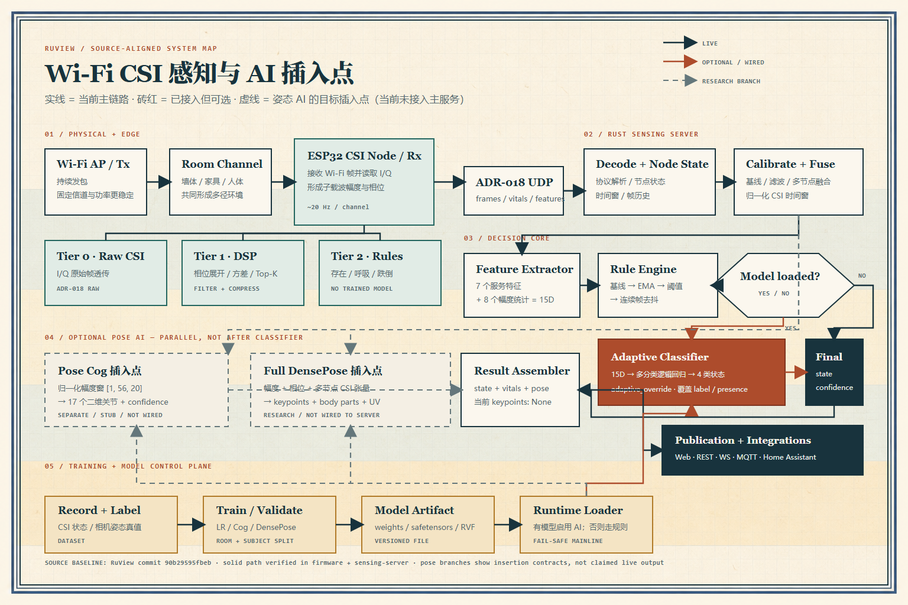

## 2. 数据怎样从 Wi‑Fi 变成结果

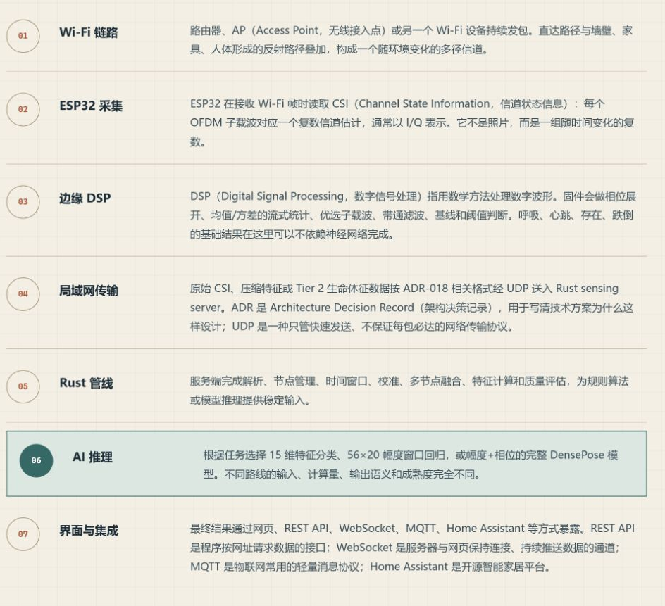

核心过程：

1. AP 或其他 Wi‑Fi 设备持续发送数据包。
2. 人体、墙壁和家具形成多径传播环境。
3. ESP32 从接收到的 Wi‑Fi 帧中读取 CSI。
4. DSP 清洗波形并提取幅度、相位、频谱和方差等特征。
5. Rust 服务执行规则或可选 AI。
6. 结果通过 Web、API、MQTT 或 Home Assistant 输出。

### CSI 是什么

CSI（Channel State Information，信道状态信息）记录多个 OFDM 子载波上的复数信道响应。

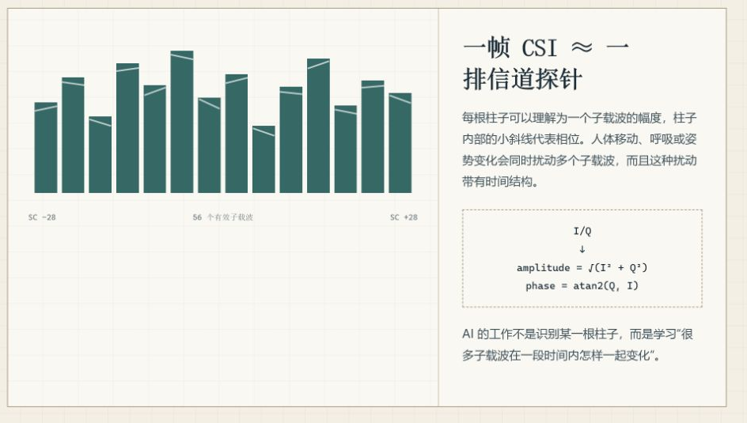

每个子载波通常包含 I/Q 两个数：

```text
幅度 amplitude = √(I² + Q²)
相位 phase     = atan2(Q, I)
```

单帧 CSI 只是瞬时信道状态。动作、呼吸和跌倒都要观察一段连续时间窗口。

## 3. 系统架构与 AI 插入位置

运行时主链路：

```text
Wi‑Fi 多径
    ↓
ESP32 CSI 采集与边缘 DSP
    ↓ UDP
Rust 解析、校准、融合、时间窗口与特征
    ├─ 规则分类
    ├─ 可选：在线自适应分类器
    ├─ 可选：Pose Cog
    └─ 可选：完整 DensePose
    ↓
Web / REST / WebSocket / MQTT / Home Assistant
```

三个 AI 位置的区别：

| 模块 | 输入 | 输出 | 当前状态 |
|---|---|---|---|
| 在线自适应分类器 | 15 维统计特征 | 4 类粗状态 | 已进入实时服务，可选加载 |
| Pose Cog | `[1, 56, 20]` 幅度窗口 | 17 个二维关节 | 有权重，但精度低，主服务未完整接线 |
| 完整 DensePose | 幅度、相位、天线路径和时间窗口 | 关键点、身体部位、UV | 训练/推理框架存在，产品主链路未完成 |

关键关系：

- 规则始终可以工作。
- 分类器与规则解决的是同一个“粗状态分类”问题。
- Cog 和 DensePose 消费 CSI 时间窗口，解决“人体在哪里、姿态怎样”的问题。
- 两条姿态 AI 与粗状态分类器是并行关系。

## 4. 规则与分类器怎样执行

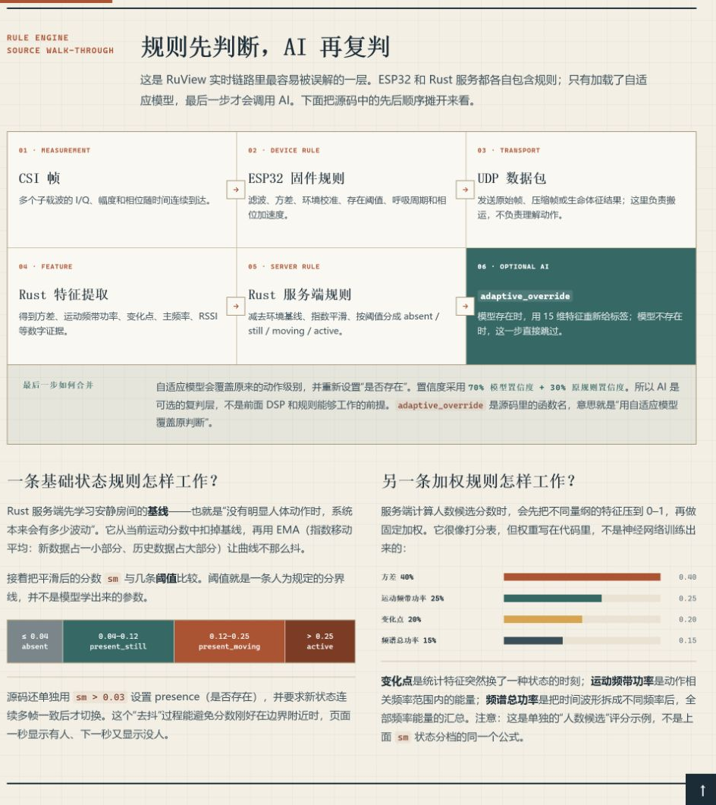

原则：**规则 → 可选分类器覆盖**，不是两个算法同时投票。

执行顺序：

```text
CSI 帧
  → ESP32 DSP/规则
  → UDP
  → Rust 特征提取
  → Rust 规则分类
  → 如果模型已加载，执行 adaptive_override
  → 发布最终结果
```

规则可以直接输出：

- `absent`：无人
- `present_still`：有人静止
- `present_moving`：有人移动
- `active`：剧烈活动

为什么还需要分类器：

- 规则使用人为阈值，在换房间、移动设备或出现风扇等干扰时容易误判。
- 分类器用本地样本重新学习当前环境的类别边界。
- 分类器不会增加“吃饭、走路、挥手”等新类别，只是重新判断四种粗状态。

模型加载后，分类器覆盖规则标签。最终置信度为：

```text
最终置信度 = 70% × 模型置信度 + 30% × 规则置信度
```

## 5. 在线自适应分类器

### 输入


输入不是原始 CSI，而是 15 维特征：

- 7 个服务端特征：方差、运动频带功率、呼吸频带功率、频谱总功率、主频率、变化点、RSSI。
- 8 个幅度统计：均值、标准差、最小值、最大值及分位数。

### 模型与输出

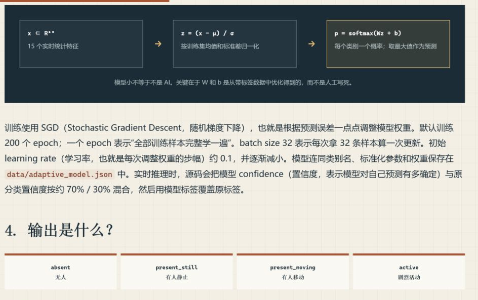

模型是多分类逻辑回归：

```text
15 维特征
  → 标准化
  → 线性打分 Wz + b
  → softmax 概率
  → 选择概率最大的类别
```

它的价值是计算量小、训练快，并且容易针对一个具体房间重新训练。

## 6. 轻量姿态 Pose Cog

### 输入与模型

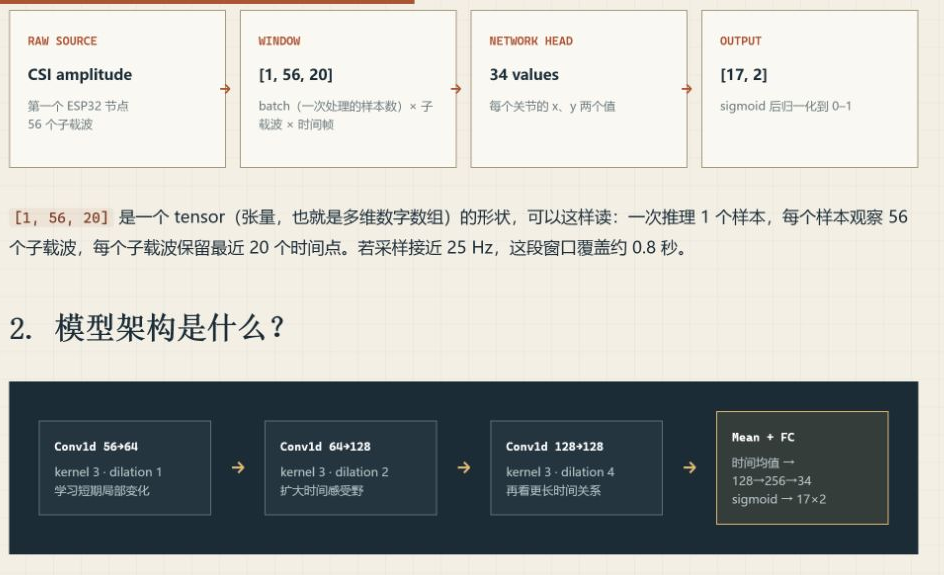

```text
输入：[1, 56, 20]
      1 个样本
      56 个子载波
      20 帧时间窗口

网络：3 层 Conv1d
      → 时间均值
      → 两层全连接
      → sigmoid

输出：[17, 2]
      17 个 COCO 关节的二维坐标
```

### 当前效果

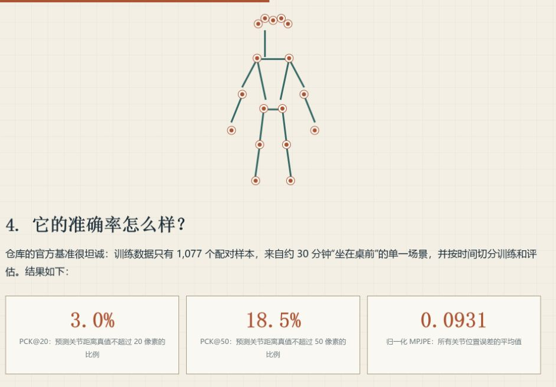

仓库公开基准：

- PCK@20：约 `3.0%`
- PCK@50：约 `18.5%`
- 归一化 MPJPE：`0.0931`

因此它更适合看作“链路已经跑通的姿态原型”，还不能看作高精度产品。

当前组件更像独立 sidecar：读取 sensing server 的最新数据并单独推理。主服务并没有把它作为内置阶段完整接好，运行路径也仍有 stub。

## 7. 完整 DensePose

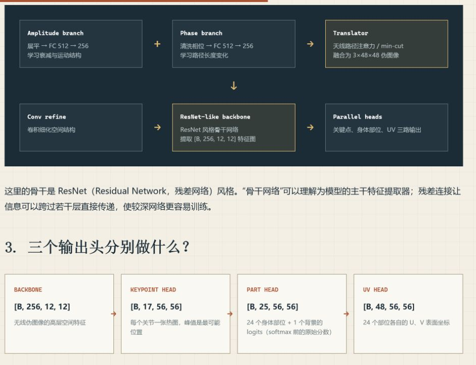

模型流程：

```text
幅度分支 + 相位分支
        ↓
CSI Translator：把无线张量翻译成伪图像
        ↓
ResNet 风格骨干网络
        ├─ 17 个关键点热图
        ├─ 24 个身体部位 + 背景
        └─ 24 个部位对应的 U/V 表面坐标
```

这条路线比 Cog 需要更多信息：幅度、相位、时间窗口、天线路径，最好还有多节点融合。

源码中已经存在模型、训练损失和 ONNX/tch/Candle 等推理后端，但不能据此认为主服务已经实时输出 DensePose：

- sensing server 尚未依赖完整 NN crate。
- 多处实时结果仍是 `pose_keypoints: None`。
- 当前训练主循环没有完整 DensePose Ground Truth，只实际训练关键点分支。

## 8. 姿态 AI 怎样训练

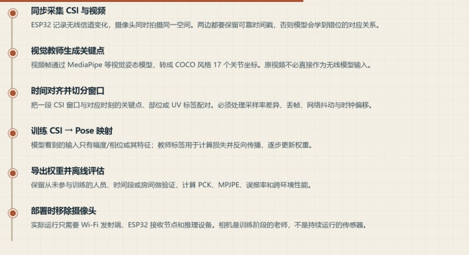

训练阶段需要相机作为“教师”：

1. 同步采集 CSI 和视频。
2. 视觉模型从视频生成正确关键点或人体表面标签。
3. 根据时间戳对齐无线数据与视觉标签。
4. 训练 CSI 到姿态的映射。
5. 导出模型并离线评估。
6. 正式部署时移除摄像头，只保留 Wi‑Fi 感知。

“无摄像头感知”主要指部署推理阶段不需要摄像头，不代表训练数据一定不使用摄像头。

## 9. Wi‑Fi 部署条件

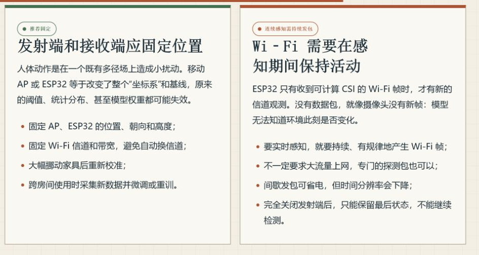

结论：

- AP 和 ESP32 最好固定位置、朝向和高度。
- 信道、带宽与发射功率应尽量稳定。
- 信号强度不可能完全不变，人体扰动本来就会改变它。
- 移动设备或大幅改变家具后，应重新校准或重新训练。
- 感知期间必须持续产生 Wi‑Fi 数据包。
- 不一定需要大量上网流量，专用探测包也可以。
- 间歇发包可以省电，但会降低时间分辨率。
- 完全停止发包后，只能保留最后状态，不能继续感知。

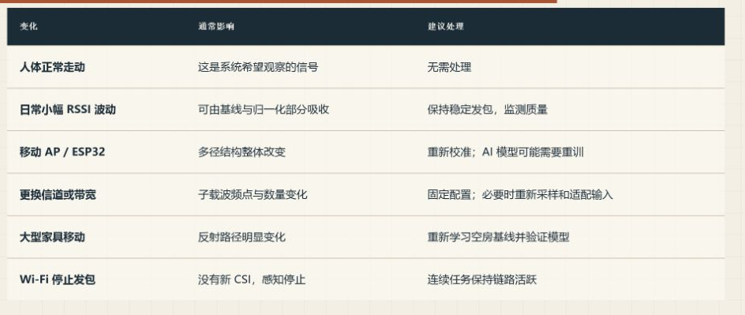

## 10. 当前完成度

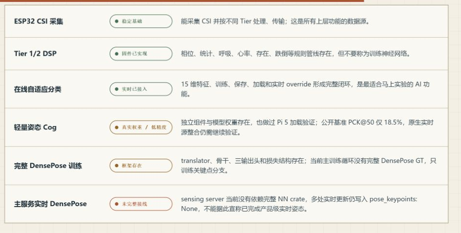

实际使用建议：

- 只做有人/无人、静止/移动：优先使用规则或在线自适应分类器。
- 只做呼吸、心率或粗略存在：先评估 Tier 2 DSP，不一定需要 AI。
- 研究 CSI 到骨架：可以复现 Pose Cog，但不要预期高精度。
- 研究完整无线 DensePose：需要继续完成数据集、Ground Truth、主服务接线和端到端评估。

## 11. 最少术语表

| 术语 | 含义 |
|---|---|
| CSI | 各个 Wi‑Fi 子载波的信道状态信息 |
| OFDM | 把宽信道拆成多个窄子载波并行传输 |
| I/Q | 表示复数信号的实部和虚部，可换算为幅度和相位 |
| DSP | 用滤波、频谱、统计和阈值处理数字波形 |
| RSSI | 接收到的 Wi‑Fi 总体信号强度 |
| BPM | 每分钟发生次数，例如呼吸 15 BPM |
| Conv1d | 沿时间轴滑动的一维卷积 |
| PCK | 落在允许距离内的正确关节比例，越高越好 |
| MPJPE | 平均关节位置误差，通常越低越好 |
| Ground Truth | 训练与评估使用的正确答案 |

## 参考

- [RuView 官方仓库](https://github.com/ruvnet/RuView)
- [ESP32 CSI 固件说明](https://github.com/ruvnet/RuView/blob/90b29595fbebf5c7b0356fa260332fcc674760ef/firmware/esp32-csi-node/README.md)
- [在线自适应分类器源码](https://github.com/ruvnet/RuView/blob/90b29595fbebf5c7b0356fa260332fcc674760ef/v2/crates/wifi-densepose-sensing-server/src/adaptive_classifier.rs)
- [Pose Cog 官方基准](https://github.com/ruvnet/RuView/blob/90b29595fbebf5c7b0356fa260332fcc674760ef/docs/benchmarks/pose-estimation-cog.md)
- [摄像头 Ground Truth 训练方案](https://github.com/ruvnet/RuView/blob/90b29595fbebf5c7b0356fa260332fcc674760ef/docs/adr/ADR-079-camera-ground-truth-training.md)
