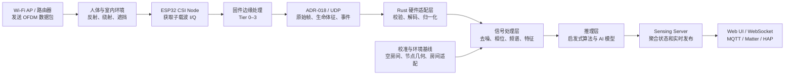
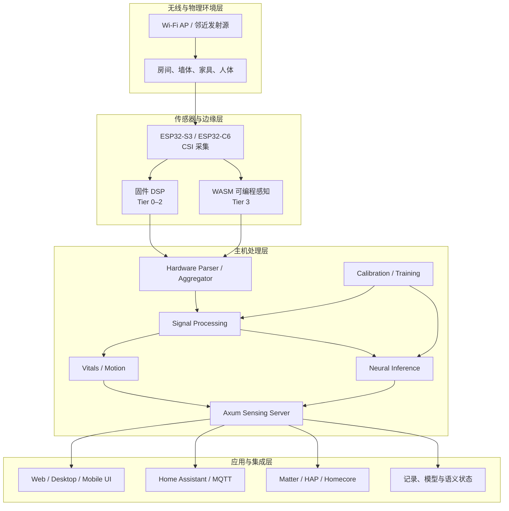
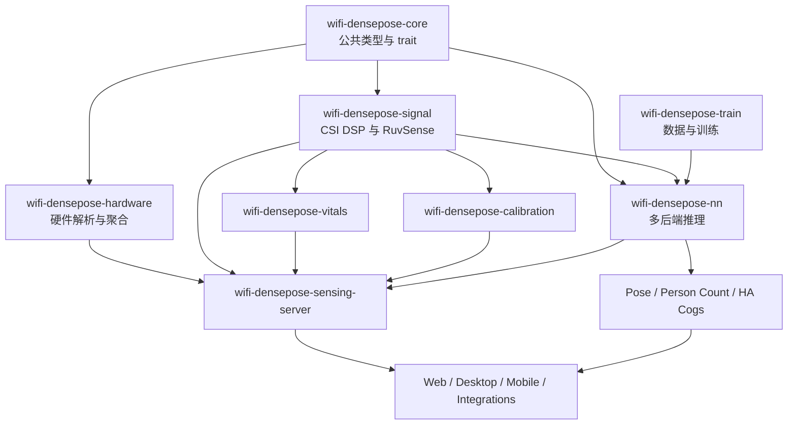

# RuView 项目技术解析：用 Wi‑Fi CSI 构建无摄像头空间感知系统

> **调研对象：** [ruvnet/RuView](https://github.com/ruvnet/RuView)  
> **仓库快照：** `main` 分支，提交 `90b29595fbebf5c7b0356fa260332fcc674760ef`，提交时间 2026-07-29  
> **文档定位：** 面向技术人员的原理与架构解读，不包含安装、刷机和部署命令  
> **资料口径：** 以项目仓库中的 README、代码、Domain Model、ADR、PROOF/Witness 文档和 Espressif 官方 CSI 文档为依据

## 1. 项目概览

RuView 是一个利用 Wi‑Fi 无线信号进行环境与人体感知的平台。它的核心思路不是“从 Wi‑Fi 中生成照片”，而是持续观察无线信道随时间发生的变化，再把这些变化解释为存在、运动、呼吸、心率、跌倒、姿态或空间状态。

项目早期和大量代码仍使用 **WiFi-DensePose** 名称；当前的 **RuView** 已经扩展为一个较大的单体仓库，除 Wi‑Fi CSI 感知外，还包含：

- ESP32-S3 / ESP32-C6 CSI 采集固件；
- Rust 信号处理、校准、推理、训练和服务端；
- Web、桌面端和移动端可视化；
- Home Assistant、MQTT、Matter、Apple Home/HAP 等智能家居接口；
- 可在边缘运行的 WASM/Cog 模块；
- 用于训练、验证和能力证明的模型、基准、ADR 与 Witness 文档。

项目官方给出的核心数据源是 **CSI（Channel State Information，信道状态信息）**。使用 ESP32 等支持 CSI 的硬件时，可以获得每个 OFDM 子载波上的复数信道响应；普通电脑通常只能获取 RSSI，因此只能走较粗粒度的存在或运动感知路径。硬件差异可参考项目的[根 README](https://github.com/ruvnet/RuView/blob/main/README.md)与 [ESP32 固件说明](https://github.com/ruvnet/RuView/blob/main/firmware/esp32-csi-node/README.md)。

## 2. Wi‑Fi 为什么能够感知人体

### 2.1 从数据通信到环境测量

Wi‑Fi 的本职是通信。发送端发出已知的调制符号，接收端需要估计无线信道对这些符号造成的衰减和相位旋转，才能正确恢复数据。对第 \(k\) 个 OFDM 子载波，可以用下面的简化模型表示：

```text
Y_k(t) = H_k(t) · X_k(t) + N_k(t)
```

其中：

- `X_k(t)`：发送端在子载波 \(k\) 上发送的已知符号；
- `Y_k(t)`：接收端实际收到的符号；
- `H_k(t)`：该时刻、该子载波的复数信道响应；
- `N_k(t)`：噪声和未建模干扰。

接收端利用训练字段估算：

```text
H_k(t) ≈ Y_k(t) / X_k(t)
```

这个 \(H_k(t)\) 就是 CSI 的核心。Espressif 的官方说明将其描述为从接收数据包中估算出的各子载波信道频率响应，并以实部和虚部，也就是 I/Q 数据形式提供给应用程序。[Espressif ESP-IDF CSI 文档](https://docs.espressif.com/projects/esp-idf/en/release-v5.5/esp32/api-guides/wifi.html#wi-fi-channel-state-information)

### 2.2 I/Q、振幅和相位

每个子载波的 CSI 可以写成复数：

```text
H_k = I_k + jQ_k = A_k · e^(jφ_k)
```

由此可以得到：

```text
A_k = √(I_k² + Q_k²)
φ_k = atan2(Q_k, I_k)
```

- **振幅 \(A_k\)** 反映信号在该子载波上的衰减；
- **相位 \(φ_k\)** 反映传播距离、时钟偏移和反射路径共同造成的相位旋转；
- 多个子载波、多个天线和连续时间帧共同形成一个“信道随时间变化”的观测张量。

RSSI 通常把整个信道压缩成一个强度数值；CSI 则保留了子载波级的复数信息，因此更适合观察细小的时间变化。

### 2.3 多径传播与人体扰动

室内 Wi‑Fi 不只沿直线传播。信号会被墙壁、家具、地面和人体反射、绕射或遮挡，接收端看到的是多条路径叠加：

```text
H_k(t) = Σ α_i(t) · e^(-j2πf_kτ_i(t))
```

每条路径都有自己的衰减 \(α_i\) 和传播时延 \(τ_i\)。人体进入房间或发生动作时，会改变部分路径的长度和强度：

- 大幅移动会造成明显的振幅、相位和多普勒变化；
- 坐下、起身、走路会形成不同的时频模式；
- 胸腔呼吸会造成周期性微位移；
- 更细微的周期变化可以落入心率相关频段；
- 人和家具的位置变化会改变整个房间的射频指纹。

RuView 的目标，就是把 `H_k(t)` 的时间序列从“通信链路的副产品”变成“环境传感器数据”。

## 3. 一帧 CSI 如何变成感知结果

下面的图按照项目官方架构材料重新整理了主数据流：



完整过程可以分成七步：

1. **产生无线照明。** 路由器或其他 Wi‑Fi 发射端持续发送数据包。
2. **形成环境相关的信道。** 墙壁、家具和人体共同决定多径传播结构。
3. **采集 CSI。** ESP32 在收到数据包时，通过 ESP-IDF CSI callback 获取每个子载波的 I/Q 数据和 RSSI、噪声、时间戳等元数据。
4. **进行边缘处理。** 固件可以只转发原始 CSI，也可以在设备上完成相位展开、统计、生命体征和事件检测。
5. **传输并解析。** 节点将 ADR-018 二进制帧通过 UDP 发给主机，Rust 硬件适配层把字节流转成内部 `CsiFrame`。
6. **提取特征并推理。** 主机执行信号清洗、频谱分析、校准、模型推理和多节点融合。
7. **发布结果。** sensing server 将结果通过 WebSocket、Web UI、MQTT、Matter 或 HAP 暴露给用户和智能家居系统。

## 4. 功能体系

RuView 官方资料中的功能，可以按技术输出分成五组：

| 功能组 | 典型输出 | 主要信号依据 | 对应实现路径 |
|---|---|---|---|
| 存在与占用 | 有人/无人、活动状态、节点或区域占用 | 相位方差、振幅方差、运动频段能量、模型分类头 | ESP32 Tier 2、`wifi-densepose-signal`、adaptive classifier、person-count Cog |
| 生命体征 | 呼吸率、心率、呼吸趋势 | 选定子载波的相位/振幅时间序列和对应频带 | 固件 `edge_processing`、`wifi-densepose-vitals`、sensing server `vital_signs` |
| 活动与安全 | 静止、活动、跌倒、异常运动 | 时频谱、相位加速度、BVP、分类模型 | motion detector、固件 fall detection、WASM/Cog 模块 |
| 姿态与空间 | 17 关键点、位置、多人跟踪、RF 场、点云 | 多节点 CSI、Fresnel 几何、模型推理、传感器融合 | `wifi-densepose-nn`、pose Cog、multistatic、pointcloud、world model |
| 环境与智能家居 | 房间状态、环境指纹、Home Assistant 实体、Matter/HAP 状态 | 射频指纹、语义状态和感知事件 | sensing server、MQTT discovery、`cog-ha-matter`、Homecore |

### 4.1 存在、运动与占用

基础存在检测不一定需要神经网络。项目固件的 Tier 2 路径会在空房间学习相位方差阈值，再用运行时方差判断是否存在扰动。主机端还提供运动频段功率、变化点、平滑和自适应分类器等路径。

对于更复杂的占用或人数场景，仓库提供 person-count、occupancy-zone 等学习型模块和多节点融合模块。项目将启发式计数与学习型计数作为不同实现路径管理。

### 4.2 呼吸与心率

项目在不同层实现生命体征提取：

- 呼吸频段通常设在约 `0.1–0.5 Hz`，对应 `6–30 BPM`；
- 心率频段在固件说明中为约 `0.8–2.0 Hz`，对应 `40–120 BPM`；
- 实现包括带通滤波、过零计数、FFT/Goertzel 频率估计和时间序列平滑。

生命体征处理使用的是连续窗口，因此数据包频率、设备稳定性和窗口完整性都会直接影响输出。

### 4.3 姿态、动作和空间理解

姿态路径把经过处理的 CSI 特征映射到 COCO 风格的人体关键点或 DensePose 表示。项目包含：

- Graph Transformer 与人体关键点图；
- CSI 特征到视觉/姿态特征空间的 modality translator；
- ONNX Runtime、PyTorch/tch 和 Candle 推理后端；
- 面向 MM-Fi 等数据集的训练与评估代码；
- 适合边缘部署的量化模型、Cog 和 RVF 容器；
- 多节点、Fresnel、RF tomography、点云和世界模型等空间模块。

项目官方 README 对不同模型、数据集成绩和实时端侧路径分别给出了状态说明。阅读模型能力时，应对应具体模型、数据集、硬件和运行路径，而不是把所有“Wi‑Fi 到姿态”能力视为同一个实现。参见 README 的 [Model weights: what's real, what's not](https://github.com/ruvnet/RuView/blob/main/README.md#model-weights-whats-real-whats-not)。

## 5. 系统总体架构



### 5.1 无线环境层

发射端提供用于“照明”空间的 OFDM 信号。人体不是主动携带标签，而是作为传播环境的一部分改变无线信道。接收端测量的是发射端、接收端和环境共同决定的链路。

### 5.2 传感器与边缘层

项目推荐的生产 CSI 节点是 ESP32-S3，ESP32-C6 则承担 Wi‑Fi 6、802.15.4、TWT 和低功耗研究路径。节点负责：

- 连接或监听 Wi‑Fi；
- 注册 CSI callback；
- 获取 I/Q、RSSI、信道、MAC、时间戳等信息；
- 在双核架构上分离 Wi‑Fi 采集和 DSP；
- 通过 UDP 发送原始帧、生命体征包或边缘事件；
- 使用 NVS 保存运行配置；
- 提供 OTA 和可选 WASM 模块管理。

### 5.3 主机处理层

Rust 主机端承担硬件无关的解析、信号处理、推理和服务：

- 将不同硬件格式转换成统一 CSI 数据类型；
- 对相位、振幅和子载波进行清洗、选择和特征提取；
- 维护时间窗口、校准基线和节点状态；
- 执行生命体征、运动、姿态与空间模块；
- 聚合多节点数据；
- 将结果转换成统一的 `SensingUpdate` 或事件。

### 5.4 应用与集成层

sensing server 是主要运行入口之一。它使用 Axum 提供静态 UI、REST 和 WebSocket，同时可启用 MQTT/Home Assistant discovery、Matter 或 HAP/Homecore 接口。UI 侧包含信号热图、人体骨架、生命体征、RF 场和 Three.js/点云可视化。

## 6. ESP32 固件与边缘处理

### 6.1 双核与数据通路

ESP32-S3 固件将实时性要求不同的任务分开：

```text
Core 0：Wi‑Fi STA、CSI callback、信道管理、数据包接收
                         ↓ SPSC Ring Buffer
Core 1：相位处理、统计、生命体征、存在、跌倒、WASM 调度
                         ↓
                   UDP / OTA / 事件输出
```

CSI callback 属于 Wi‑Fi 驱动任务，不能在回调内执行重型计算。固件因此先把帧写入单生产者/单消费者环形缓冲区，再由 DSP 任务处理。这与 Espressif 官方建议的“回调只搬运数据，实际处理交给其他任务”一致。

### 6.2 Tier 0–3

| Tier | 官方定位 | 主要工作 | 输出 |
|---|---|---|---|
| Tier 0 | Raw CSI Passthrough | 捕获子载波 I/Q，编码 ADR-018 帧 | 原始 CSI UDP 流 |
| Tier 1 | Basic DSP | 相位展开、Welford 统计、Top-K 子载波、压缩 | 清洗或压缩后的信号 |
| Tier 2 | Full Pipeline | 呼吸、心率、存在、跌倒和基础人数槽位 | 生命体征包与事件 |
| Tier 3 | WASM Programmable Sensing | 加载签名 RVF/WASM 模块，在预算限制下执行 | 自定义感知模块事件 |

Tier 2 的固件路径使用传统 DSP 和启发式检测，不在 ESP32 上运行完整训练神经模型；姿态和更复杂的模型推理主要位于主机端或独立 Cog 路径。具体边界见[固件 README 的 Tier 说明](https://github.com/ruvnet/RuView/blob/main/firmware/esp32-csi-node/README.md)。

### 6.3 配置与功耗

NVS 保存 SSID、目标地址、节点 ID、信道跳频、TDM 时隙、处理 Tier、阈值、窗口和功耗占空比等配置。

默认连续 CSI 模式会关闭 Wi‑Fi modem sleep，以维持稳定帧流。固件也提供 light sleep 和占空比控制，但睡眠期间 CSI 采集暂停，因此适合低功耗周期性观察，不等价于连续生命体征或跌倒监测。

## 7. Rust 主机端架构

### 7.1 核心 crate 职责

| Crate/模块 | 职责 |
|---|---|
| `wifi-densepose-core` | 定义 `CsiFrame`、`ProcessedSignal`、`PoseEstimate`、关键点、错误和核心 trait |
| `wifi-densepose-hardware` | 解析 ESP32、Intel 5300、Atheros 等来源；提供 UDP aggregator 和统一 bridge |
| `wifi-densepose-signal` | CSI 预处理、相位清洗、频谱、Fresnel、BVP、运动与 RuvSense 多节点处理 |
| `wifi-densepose-vitals` | 呼吸、心率和生命体征异常相关提取 |
| `wifi-densepose-calibration` | 空房间基线、引导式 enrollment、房间 specialist 和几何记录 |
| `wifi-densepose-nn` | ONNX、tch/PyTorch、Candle 等模型推理后端 |
| `wifi-densepose-train` | 数据集加载、子载波插值、损失、指标、训练和证明 |
| `wifi-densepose-sensing-server` | UDP ingestion、状态聚合、模型管理、记录、训练 API、WebSocket 和静态 UI |
| `wifi-densepose-wasm` / `wasm-edge` | 浏览器或边缘 WASM 能力 |
| `cog-pose-estimation` / `cog-person-count` | 可独立部署的姿态和人数模型模块 |
| `cog-ha-matter` | Home Assistant 和 Matter 暴露 |
| `wifi-densepose-pointcloud` / `worldgraph` | 空间点云、RF 场和世界模型相关处理 |

### 7.2 crate 关系



### 7.3 sensing server 的内部上下文

项目的 [Sensing Server Domain Model](https://github.com/ruvnet/RuView/blob/main/docs/ddd/sensing-server-domain-model.md) 将单体服务划分为五个 bounded context：

1. **CSI Ingestion**：接收、解码和初步特征提取；
2. **Model Management**：管理 RVF 模型和环境适配；
3. **CSI Recording**：记录带标签或无标签的 CSI 会话；
4. **Training Pipeline**：执行后台训练并发布训练进度；
5. **Visualization**：将统一状态流发送给 Web UI。

服务端以共享应用状态保存最新感知结果、帧历史、节点数据、模型、校准、记录和训练状态，再通过广播通道扇出给 WebSocket 客户端。

## 8. 信号处理、AI、训练与校准

### 8.1 确定性信号处理链

`wifi-densepose-signal` 官方 README 将主要算法整理为以下步骤：

1. **Conjugate Multiplication / CSI Ratio**  
   使用参考天线和目标天线的共轭乘积，降低载波频偏、采样偏移等硬件相位误差。

2. **Phase Sanitization**  
   展开 \(2π\) 跳变，去除离群点并平滑相位。

3. **Hampel Filter**  
   使用滑动中位数和 MAD 抑制脉冲噪声。

4. **Subcarrier Selection**  
   根据静态与运动状态下的方差或图算法，选择对人体变化更敏感的子载波。

5. **Spectrogram / STFT**  
   将时间序列转换为二维时频特征，用于动作、速度和周期成分分析。

6. **Fresnel Geometry**  
   利用发射端—人体—接收端路径差解释周期性相位和振幅变化。

7. **Body Velocity Profile（BVP）**  
   从多普勒特征构造速度—时间表示，用于动作识别和跨环境特征。

8. **Motion / Vitals**  
   对方差、频带功率、相关性和周期频率进行检测与平滑。

这些步骤既可以直接输出存在、运动和生命体征，也可以把结果组织成模型输入。

### 8.2 AI 模型路径

RuView 的 AI 路径主要承担传统阈值难以覆盖的任务：

- **对比学习编码器**：从无标签 CSI 时间片学习 128 维等表示；
- **存在分类头**：基于编码特征输出存在或活动状态；
- **姿态模型**：把 CSI 特征映射到 17 个关键点或 DensePose 表示；
- **Graph Transformer / GCN**：利用人体关键点图结构传播空间信息；
- **Modality Translator**：把 CSI 表示投射到视觉或姿态特征空间；
- **LoRA / SONA 环境适配**：在不完全重训基础模型的情况下适应房间变化；
- **量化与稀疏推理**：把模型压缩到 CPU、Raspberry Pi 或边缘模块可运行的形式。

因此，这个项目并不是“全部由 AI 完成”。更准确的分工是：

```text
原始 CSI
  ├─ DSP / 统计 / 几何 → 存在、运动、生命体征、基础事件
  └─ DSP 特征 → AI 模型 → 姿态、分类、环境适配和更高层语义
```

### 8.3 训练链路

官方训练模块包括：

- MM-Fi 等公开多模态数据集加载；
- 确定性合成数据，用于单元测试和证明；
- 不同硬件子载波数量之间的插值和选择；
- MSE、OKS、PCK 等姿态损失或评估指标；
- checkpoint、学习率、梯度裁剪和可复现训练；
- 自监督对比预训练；
- 相机或公开数据提供的姿态标签；
- 模型导出、量化和 RVF 封装。

训练与实时推理是两个阶段：训练阶段可以使用摄像头或公开数据提供监督标签；部署后的 CSI 推理不要求摄像头持续存在。

### 8.4 校准为什么是架构的一部分

CSI 中同时包含人体变化、硬件偏置和房间固定多径。RuView 的校准流程先记录空房间基线，再进行引导式姿势或活动 enrollment，并把节点几何和基线 ID 与房间模型关联。

空房间基线的作用是：

- 记录每个子载波的均值和方差；
- 抵消硬件增益偏差和固定多径；
- 为存在、运动和异常判断提供相对参考；
- 为房间专属模型提供环境上下文。

校准要求环境在采集窗口内保持一致。恒定运行的风扇或 HVAC 可以成为基线的一部分；中途启停、移动家具、移动路由器或改变无线参数则会改变基线。具体流程和代码边界见[官方校准指南](https://github.com/ruvnet/RuView/blob/main/docs/calibration-guide.md)。

## 9. 数据协议与输出接口

### 9.1 ESP32 到主机

固件和 Rust 硬件 crate 使用 ADR-018 定义的二进制协议：

- 原始 CSI 帧 magic：`0xC5110001`；
- 帧头包含节点、天线、子载波、信道、序列、RSSI、噪声等信息；
- payload 保存每个子载波的 I/Q 数据；
- 默认通过 UDP 发送到 sensing server；
- 固件还定义生命体征包和其他扩展帧；
- 多节点使用 node ID、时间、TDM 和聚合器组织数据。

UDP 适合高频、低延迟的传感器数据，但不提供可靠传输保证，因此上层需要处理乱序、缺帧、节点离线和数据质量。

### 9.2 主机内部数据

解析后，数据转成 `CsiFrame`、`ProcessedSignal`、`PoseEstimate`、`VitalSigns` 等类型。sensing server 再把节点、信号特征、分类、空间场、生命体征和人体结果组合成统一更新消息。

### 9.3 模型容器

项目使用 RVF（RuVector Format）封装模型权重、manifest、配置、LoRA profile 和其他段。容器负责：

- 标识模型和版本；
- 校验段边界和完整性；
- 支持渐进加载；
- 向主机和边缘 WASM/Cog 提供共同的模型交付形式。

### 9.4 对外输出

| 输出方式 | 用途 |
|---|---|
| WebSocket | 实时推送信号、人体、生命体征和训练进度 |
| REST | 查询状态、模型、记录、训练、配置和注册表 |
| 静态 Web UI | 浏览器内显示热图、骨架、RF 场和状态面板 |
| MQTT Discovery | 将节点和语义状态注册为 Home Assistant 实体 |
| Matter | 将适合标准 cluster 的状态暴露给 Matter 生态 |
| HAP / Homecore | Apple Home 配对、Home Assistant 兼容 API 和本地自动化 |

## 10. 系统运行所依赖的稳定条件

### 10.1 发射端和接收端为什么宜固定

CSI 测量的是“发射端—环境—接收端”的完整信道。移动路由器、旋转天线、移动 ESP32 或改变大件家具，都会改变固定多径部分。

因此工程部署通常应固定：

- 发射端和接收端的位置与朝向；
- Wi‑Fi 信道和带宽；
- 天线配置；
- 尽可能稳定的发射功率；
- 节点与房间的几何关系。

不要求接收到的信号强度恒定，因为人体感知正是依靠接收信号的变化；需要稳定的是发射配置和环境基线。固件 README 特别指出，明显的发射功率摆动和强 RF 干扰可能影响基于方差的存在检测。

### 10.2 Wi‑Fi 是否需要持续开启

持续监测需要持续存在可接收的 Wi‑Fi 数据包。CSI 是在接收数据包时估计出来的：

- AP 关闭或链路断开时，不会产生新的真实 CSI；
- 不需要持续高速上网，但需要稳定的数据包节奏；
- 可以使用没有互联网出口的本地 Wi‑Fi 网络；
- 生命体征、跌倒等连续监测需要完整的时间窗口；
- 降低 ESP32 duty cycle 会减少功耗，但会在休眠期间暂停采样。

因此，“Wi‑Fi 一直开启”和“互联网一直在线”不是同一件事。RuView 可以本地、离线运行，但无线链路和本地处理节点必须工作。

### 10.3 什么时候需要重新校准

按照项目校准指南，以下变化可能需要重新建立基线：

- 路由器或 ESP32 被移动或替换；
- 信道、带宽、天线或发射配置发生明显变化；
- 房间大件家具或固定设备发生变化；
- HVAC、风扇等背景状态与校准时显著不同；
- 感知输出相对原基线明显漂移。

重新建立基线后，与旧 baseline ID 绑定的房间 specialist 需要按官方流程重新 enrollment 和训练。

## 11. 代码仓目录地图

| 路径 | 作用 | 推荐阅读入口 |
|---|---|---|
| `README.md` | 项目总览、功能、硬件、模型和官方状态说明 | [根 README](https://github.com/ruvnet/RuView/blob/main/README.md) |
| `firmware/esp32-csi-node/` | ESP32-S3/C6 CSI 固件、Tier 0–3、NVS、OTA/WASM | [Firmware README](https://github.com/ruvnet/RuView/blob/main/firmware/esp32-csi-node/README.md) |
| `v2/crates/wifi-densepose-core/` | 核心数据结构和 trait | [Core README](https://github.com/ruvnet/RuView/blob/main/v2/crates/wifi-densepose-core/README.md) |
| `v2/crates/wifi-densepose-hardware/` | 硬件帧解析与聚合 | [Hardware README](https://github.com/ruvnet/RuView/blob/main/v2/crates/wifi-densepose-hardware/README.md) |
| `v2/crates/wifi-densepose-signal/` | CSI 信号处理和 RuvSense | [Signal README](https://github.com/ruvnet/RuView/blob/main/v2/crates/wifi-densepose-signal/README.md) |
| `v2/crates/wifi-densepose-nn/` | 多后端神经推理 | [NN README](https://github.com/ruvnet/RuView/blob/main/v2/crates/wifi-densepose-nn/README.md) |
| `v2/crates/wifi-densepose-train/` | 数据、训练和指标 | [Train README](https://github.com/ruvnet/RuView/blob/main/v2/crates/wifi-densepose-train/README.md) |
| `v2/crates/wifi-densepose-calibration/` | 房间基线、enrollment、specialist | [Calibration crate](https://github.com/ruvnet/RuView/tree/main/v2/crates/wifi-densepose-calibration) |
| `v2/crates/wifi-densepose-sensing-server/` | 实时服务器、模型、记录、训练、API | [Server README](https://github.com/ruvnet/RuView/blob/main/v2/crates/wifi-densepose-sensing-server/README.md) |
| `v2/crates/cog-*` | 可独立交付的姿态、人数和智能家居模块 | [Rust crates](https://github.com/ruvnet/RuView/tree/main/v2/crates) |
| `ui/` | Web 可视化和演示 | [UI README](https://github.com/ruvnet/RuView/blob/main/ui/README.md) |
| `ui/mobile/` | React Native 移动端 | [Mobile README](https://github.com/ruvnet/RuView/blob/main/ui/mobile/README.md) |
| `docs/ddd/` | 硬件、信号、服务、训练等 Domain Model | [DDD 索引](https://github.com/ruvnet/RuView/blob/main/docs/ddd/README.md) |
| `docs/adr/` | 架构决策记录 | [ADR 索引](https://github.com/ruvnet/RuView/blob/main/docs/adr/README.md) |
| `archive/v1/` | 已归档的 Python 参考实现 | [v1 deprecation](https://github.com/ruvnet/RuView/blob/main/archive/v1/DEPRECATED.md) |
| `harness/ruview/` | 项目操作、验证和文档导航 harness | [Harness README](https://github.com/ruvnet/RuView/blob/main/harness/ruview/README.md) |

## 12. 官方文档和架构图索引

### 12.1 总览与完整架构

1. [RuView 根 README](https://github.com/ruvnet/RuView/blob/main/README.md)  
   项目能力、硬件路径、模型、集成和官方状态说明。

2. [README Details：System Architecture](https://github.com/ruvnet/RuView/blob/main/docs/readme-details.md#system-architecture)  
   包含官方 Mermaid 端到端 pipeline、信号处理细节和部署拓扑图。

3. [User Guide](https://github.com/ruvnet/RuView/blob/main/docs/user-guide.md)  
   用户视角的功能、服务器、硬件、训练、校准和故障说明。

4. [Rust crates overview](https://github.com/ruvnet/RuView/blob/main/v2/crates/README.md)  
   Rust crate 职责、依赖关系和信号处理算法列表。

### 12.2 硬件与固件

1. [ESP32 CSI Node Firmware README](https://github.com/ruvnet/RuView/blob/main/firmware/esp32-csi-node/README.md)  
   包含双核架构、Tier 0–3、协议、内存、源码文件和官方固件架构图。

2. [Hardware Platform Domain Model](https://github.com/ruvnet/RuView/blob/main/docs/ddd/hardware-platform-domain-model.md)  
   将 Sensor Node、Edge Processing、WASM、Aggregation 和 Provisioning 划分为 bounded context。

3. [ADR-018：ESP32 实现与协议](https://github.com/ruvnet/RuView/blob/main/docs/adr/ADR-018-esp32-dev-implementation.md)

4. [ADR-039：ESP32 Edge Intelligence](https://github.com/ruvnet/RuView/blob/main/docs/adr/ADR-039-esp32-edge-intelligence.md)

5. [ADR-040：WASM Programmable Sensing](https://github.com/ruvnet/RuView/blob/main/docs/adr/ADR-040-wasm-programmable-sensing.md)

6. [Espressif ESP-IDF Wi‑Fi CSI](https://docs.espressif.com/projects/esp-idf/en/release-v5.5/esp32/api-guides/wifi.html#wi-fi-channel-state-information)  
   ESP32 CSI 的官方底层机制、子载波和 callback 配置说明。

### 12.3 信号处理、模型与训练

1. [Signal Processing Domain Model](https://github.com/ruvnet/RuView/blob/main/docs/ddd/signal-processing-domain-model.md)
2. [Training Pipeline Domain Model](https://github.com/ruvnet/RuView/blob/main/docs/ddd/training-pipeline-domain-model.md)
3. [ADR-014：SOTA Signal Processing](https://github.com/ruvnet/RuView/blob/main/docs/adr/ADR-014-sota-signal-processing.md)
4. [ADR-021：Vital Sign Detection](https://github.com/ruvnet/RuView/blob/main/docs/adr/ADR-021-vital-sign-detection-rvdna-pipeline.md)
5. [ADR-023：Trained DensePose Model Pipeline](https://github.com/ruvnet/RuView/blob/main/docs/adr/ADR-023-trained-densepose-model-ruvector-pipeline.md)
6. [ADR-024：Contrastive CSI Embedding](https://github.com/ruvnet/RuView/blob/main/docs/adr/ADR-024-contrastive-csi-embedding-model.md)
7. [Calibration Guide](https://github.com/ruvnet/RuView/blob/main/docs/calibration-guide.md)
8. [ADR-135：Empty-room Baseline](https://github.com/ruvnet/RuView/blob/main/docs/adr/ADR-135-empty-room-baseline-calibration.md)
9. [ADR-151：Room Calibration and Specialist Training](https://github.com/ruvnet/RuView/blob/main/docs/adr/ADR-151-room-calibration-specialist-training.md)

### 12.4 服务端与系统边界

1. [Sensing Server README](https://github.com/ruvnet/RuView/blob/main/v2/crates/wifi-densepose-sensing-server/README.md)
2. [Sensing Server Domain Model](https://github.com/ruvnet/RuView/blob/main/docs/ddd/sensing-server-domain-model.md)
3. [ADR-059：Live ESP32 CSI Pipeline](https://github.com/ruvnet/RuView/blob/main/docs/adr/ADR-059-live-esp32-csi-pipeline.md)
4. [ADR-115：Home Assistant Integration](https://github.com/ruvnet/RuView/blob/main/docs/adr/ADR-115-home-assistant-integration.md)
5. [ADR-167：DDD Bounded Contexts](https://github.com/ruvnet/RuView/blob/main/docs/adr/ADR-167-ddd-bounded-contexts.md)

### 12.5 官方证明与能力记录

1. [PROOF.md](https://github.com/ruvnet/RuView/blob/main/PROOF.md)  
   项目使用 `MEASURED`、`CLAIMED`、`DATA-GATED` 和 `HARDWARE-GATED` 标签组织能力证明。

2. [ESP32 Capability Audit / ADR-028](https://github.com/ruvnet/RuView/blob/main/docs/adr/ADR-028-esp32-capability-audit.md)

3. [Witness Log 028](https://github.com/ruvnet/RuView/blob/main/docs/WITNESS-LOG-028.md)

4. [ADR-187：archive/v1 状态与能力标注](https://github.com/ruvnet/RuView/blob/main/docs/adr/ADR-187-archive-v1-deprecation-honest-labeling.md)

这些资料比单独查看演示页面更适合理解“某项能力属于哪条代码路径、使用了什么数据，以及项目官方如何标注其状态”。

## 13. 术语表

| 术语 | 含义 |
|---|---|
| CSI | Channel State Information，子载波级复数信道响应 |
| RSSI | Received Signal Strength Indicator，接收信号总体强度 |
| OFDM | 正交频分复用，将信道分成许多正交子载波 |
| I/Q | 复数信号的同相和正交分量 |
| CFR | Channel Frequency Response，信道频率响应 |
| DSP | Digital Signal Processing，数字信号处理 |
| STFT | Short-Time Fourier Transform，短时傅里叶变换 |
| BVP | Body Velocity Profile，人体速度—时间特征 |
| Fresnel Zone | 发射端和接收端之间影响反射/绕射的椭球区域 |
| RVF | RuVector Format，模型和模块容器格式 |
| ADR | Architecture Decision Record，架构决策记录 |
| LoRA | 低秩适配，用小规模参数适应新环境 |
| SONA | 项目中的在线/持续适配机制 |
| PCK | Percentage of Correct Keypoints，姿态关键点评估指标 |
| HAP | HomeKit Accessory Protocol |
| TDM | Time Division Multiplexing，多节点时分调度 |

## 14. 总结

RuView 的核心不是单一神经网络，而是一条完整的射频感知链：

```text
Wi‑Fi 无线信号
→ ESP32 子载波 CSI
→ 边缘 DSP 与二进制传输
→ Rust 清洗、校准和特征提取
→ 启发式算法或 AI 模型
→ 实时 UI 与智能家居语义
```

其中：

- Wi‑Fi 提供环境照明，不要求云服务或互联网；
- ESP32 把通信芯片变成 CSI 传感器；
- 传统 DSP 负责清洗信号并提供基础存在、运动和生命体征路径；
- AI 模型负责姿态、分类、表示学习和环境适配；
- 校准把特定房间、设备位置和无线配置纳入系统状态；
- sensing server 负责把多个处理模块组合成可实时消费的服务；
- WebSocket、MQTT、Matter 和 HAP 将射频结果转换为应用能够理解的状态。

从架构角度看，RuView 是“硬件采集 + 边缘处理 + Rust 感知平台 + 模型系统 + 智能家居集成”的组合，而不是一个单独的 Wi‑Fi 姿态模型仓库。
